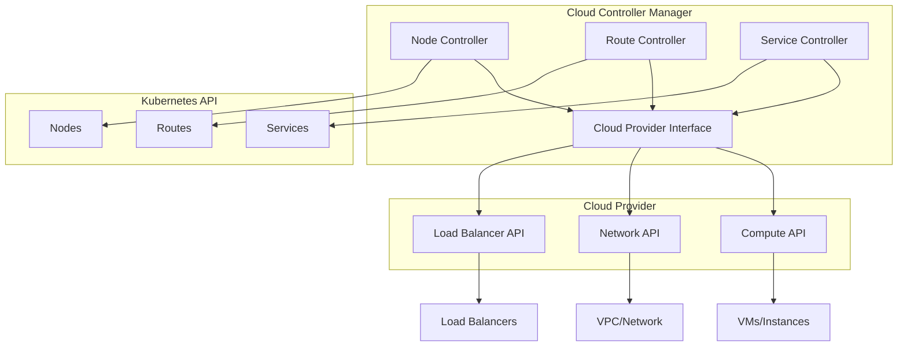
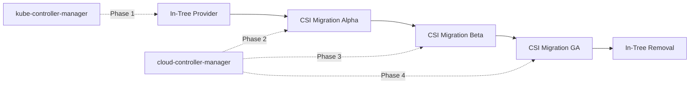

# Kubernetes Cloud Provider Internals: Cloud Controller Manager

## Table of Contents
- [Kubernetes Cloud Provider Internals: Cloud Controller Manager](#kubernetes-cloud-provider-internals-cloud-controller-manager)
  - [Table of Contents](#table-of-contents)
  - [Overview](#overview)
  - [Cloud Controller Manager Architecture](#cloud-controller-manager-architecture)
    - [CCM Initialization](#ccm-initialization)
  - [Cloud Provider Interface](#cloud-provider-interface)
    - [Core Interface](#core-interface)
    - [Instances Interface](#instances-interface)
    - [Load Balancer Interface](#load-balancer-interface)
    - [Routes Interface](#routes-interface)
  - [Node Controller](#node-controller)
    - [Node Controller Implementation](#node-controller-implementation)
  - [Route Controller](#route-controller)
    - [Route Controller Implementation](#route-controller-implementation)
  - [Service Controller](#service-controller)
    - [Service Controller Implementation](#service-controller-implementation)
  - [Cloud Provider Implementations](#cloud-provider-implementations)
    - [Example: AWS Cloud Provider](#example-aws-cloud-provider)
  - [Migration from In-Tree to Out-of-Tree](#migration-from-in-tree-to-out-of-tree)
    - [Migration Process](#migration-process)
    - [Feature Gates](#feature-gates)
  - [Code References](#code-references)
    - [Key Files](#key-files)
    - [Best Practices](#best-practices)
    - [Troubleshooting](#troubleshooting)

## Overview

The Cloud Controller Manager (CCM) integrates Kubernetes with cloud provider APIs, managing cloud-specific control loops.

**Key Responsibilities:**
- Node lifecycle management
- Route management for pod networking
- Load balancer provisioning for Services
- Volume attachment/detachment (legacy)

**Architecture Benefits:**
- Decouples cloud provider code from core Kubernetes
- Enables independent cloud provider releases
- Reduces core Kubernetes binary size
- Allows proprietary cloud provider implementations

**Key Source Files:**
- `cmd/cloud-controller-manager/` - CCM main entry point
- `staging/src/k8s.io/cloud-provider/` - Cloud provider interface
- `pkg/controller/cloud/` - Cloud controllers

## Cloud Controller Manager Architecture



### CCM Initialization

```go
// Cloud controller manager main
func main() {
    // Create command
    command := app.NewCloudControllerManagerCommand()
    
    // Execute
    if err := command.Execute(); err != nil {
        os.Exit(1)
    }
}

// NewCloudControllerManagerCommand creates the CCM command
func NewCloudControllerManagerCommand() *cobra.Command {
    s, err := options.NewCloudControllerManagerOptions()
    if err != nil {
        klog.Fatalf("unable to initialize command options: %v", err)
    }
    
    cmd := &cobra.Command{
        Use: "cloud-controller-manager",
        Long: `The Cloud controller manager is a daemon that embeds
the cloud specific control loops shipped with Kubernetes.`,
        Run: func(cmd *cobra.Command, args []string) {
            if err := Run(s); err != nil {
                fmt.Fprintf(os.Stderr, "%v\n", err)
                os.Exit(1)
            }
        },
    }
    
    return cmd
}

// Run starts the cloud controller manager
func Run(c *config.CompletedConfig, stopCh <-chan struct{}) error {
    // Create cloud provider
    cloud, err := cloudprovider.InitCloudProvider(c.ComponentConfig.KubeCloudShared.CloudProvider.Name, c.ComponentConfig.KubeCloudShared.CloudProvider.CloudConfigFile)
    if err != nil {
        return err
    }
    
    // Start controllers
    if err := startControllers(c, cloud, stopCh); err != nil {
        return err
    }
    
    // Wait for shutdown
    <-stopCh
    return nil
}

func startControllers(c *config.CompletedConfig, cloud cloudprovider.Interface, stopCh <-chan struct{}) error {
    // Start node controller
    if c.ComponentConfig.NodeController.Enabled {
        nodeController, err := nodecontroller.NewCloudNodeController(
            c.SharedInformers.Core().V1().Nodes(),
            c.ClientBuilder.ClientOrDie("cloud-node-controller"),
            cloud,
            c.ComponentConfig.NodeController.NodeMonitorPeriod.Duration,
        )
        if err != nil {
            return err
        }
        go nodeController.Run(stopCh)
    }
    
    // Start route controller
    if c.ComponentConfig.RouteController.Enabled {
        routeController, err := routecontroller.New(
            c.SharedInformers.Core().V1().Nodes(),
            c.ClientBuilder.ClientOrDie("route-controller"),
            cloud,
            c.ComponentConfig.KubeCloudShared.ClusterName,
        )
        if err != nil {
            return err
        }
        go routeController.Run(stopCh, c.ComponentConfig.RouteController.ConcurrentServiceSyncs)
    }
    
    // Start service controller
    if c.ComponentConfig.ServiceController.Enabled {
        serviceController, err := servicecontroller.New(
            cloud,
            c.ClientBuilder.ClientOrDie("service-controller"),
            c.SharedInformers.Core().V1().Services(),
            c.SharedInformers.Core().V1().Nodes(),
            c.ComponentConfig.KubeCloudShared.ClusterName,
        )
        if err != nil {
            return err
        }
        go serviceController.Run(stopCh, c.ComponentConfig.ServiceController.ConcurrentServiceSyncs)
    }
    
    return nil
}
```

## Cloud Provider Interface

### Core Interface

```go
// Interface is an abstract, pluggable interface for cloud providers
type Interface interface {
    // Initialize provides the cloud with a kubernetes client builder and may spawn goroutines
    Initialize(clientBuilder cloudprovider.ControllerClientBuilder, stop <-chan struct{})
    
    // LoadBalancer returns a balancer interface if supported
    LoadBalancer() (LoadBalancer, bool)
    
    // Instances returns an instances interface if supported
    Instances() (Instances, bool)
    
    // InstancesV2 returns an instancesV2 interface if supported
    InstancesV2() (InstancesV2, bool)
    
    // Zones returns a zones interface if supported
    Zones() (Zones, bool)
    
    // Clusters returns a clusters interface if supported
    Clusters() (Clusters, bool)
    
    // Routes returns a routes interface if supported
    Routes() (Routes, bool)
    
    // ProviderName returns the cloud provider ID
    ProviderName() string
    
    // HasClusterID returns true if a ClusterID is required and set
    HasClusterID() bool
}
```

### Instances Interface

```go
// Instances is an abstract interface for managing cloud instances
type Instances interface {
    // NodeAddresses returns the addresses of the specified instance
    NodeAddresses(ctx context.Context, name types.NodeName) ([]v1.NodeAddress, error)
    
    // NodeAddressesByProviderID returns the addresses of the specified instance
    NodeAddressesByProviderID(ctx context.Context, providerID string) ([]v1.NodeAddress, error)
    
    // InstanceID returns the cloud provider ID of the node
    InstanceID(ctx context.Context, nodeName types.NodeName) (string, error)
    
    // InstanceType returns the type of the specified instance
    InstanceType(ctx context.Context, name types.NodeName) (string, error)
    
    // InstanceTypeByProviderID returns the type of the specified instance
    InstanceTypeByProviderID(ctx context.Context, providerID string) (string, error)
    
    // AddSSHKeyToAllInstances adds an SSH public key to all instances
    AddSSHKeyToAllInstances(ctx context.Context, user string, keyData []byte) error
    
    // CurrentNodeName returns the name of the node we are currently running on
    CurrentNodeName(ctx context.Context, hostname string) (types.NodeName, error)
    
    // InstanceExistsByProviderID returns true if the instance exists
    InstanceExistsByProviderID(ctx context.Context, providerID string) (bool, error)
    
    // InstanceShutdownByProviderID returns true if the instance is shutdown
    InstanceShutdownByProviderID(ctx context.Context, providerID string) (bool, error)
}

// InstancesV2 is an abstract interface for managing cloud instances (v2)
type InstancesV2 interface {
    // InstanceExists returns true if the instance exists
    InstanceExists(ctx context.Context, node *v1.Node) (bool, error)
    
    // InstanceShutdown returns true if the instance is shutdown
    InstanceShutdown(ctx context.Context, node *v1.Node) (bool, error)
    
    // InstanceMetadata returns the instance metadata
    InstanceMetadata(ctx context.Context, node *v1.Node) (*InstanceMetadata, error)
}

type InstanceMetadata struct {
    // ProviderID is the cloud provider ID
    ProviderID string
    
    // InstanceType is the instance type
    InstanceType string
    
    // NodeAddresses is the list of node addresses
    NodeAddresses []v1.NodeAddress
    
    // Zone is the availability zone
    Zone string
    
    // Region is the region
    Region string
}
```

### Load Balancer Interface

```go
// LoadBalancer is an abstract interface for managing load balancers
type LoadBalancer interface {
    // GetLoadBalancer returns whether the specified load balancer exists
    GetLoadBalancer(ctx context.Context, clusterName string, service *v1.Service) (status *v1.LoadBalancerStatus, exists bool, err error)
    
    // GetLoadBalancerName returns the name of the load balancer
    GetLoadBalancerName(ctx context.Context, clusterName string, service *v1.Service) string
    
    // EnsureLoadBalancer creates a new load balancer or updates the existing one
    EnsureLoadBalancer(ctx context.Context, clusterName string, service *v1.Service, nodes []*v1.Node) (*v1.LoadBalancerStatus, error)
    
    // UpdateLoadBalancer updates hosts under the specified load balancer
    UpdateLoadBalancer(ctx context.Context, clusterName string, service *v1.Service, nodes []*v1.Node) error
    
    // EnsureLoadBalancerDeleted deletes the specified load balancer
    EnsureLoadBalancerDeleted(ctx context.Context, clusterName string, service *v1.Service) error
}
```

### Routes Interface

```go
// Routes is an abstract interface for managing routes
type Routes interface {
    // ListRoutes lists all managed routes
    ListRoutes(ctx context.Context, clusterName string) ([]*Route, error)
    
    // CreateRoute creates the described route
    CreateRoute(ctx context.Context, clusterName string, nameHint string, route *Route) error
    
    // DeleteRoute deletes the specified route
    DeleteRoute(ctx context.Context, clusterName string, route *Route) error
}

type Route struct {
    // Name is the name of the route
    Name string
    
    // TargetNode is the node that is the target of this route
    TargetNode types.NodeName
    
    // DestinationCIDR is the CIDR format IP range
    DestinationCIDR string
    
    // Blackhole indicates whether this is a blackhole route
    Blackhole bool
}
```

## Node Controller

The Node Controller manages node lifecycle in the cloud.

### Node Controller Implementation

```go
type CloudNodeController struct {
    nodeInformer coreinformers.NodeInformer
    kubeClient   clientset.Interface
    cloud        cloudprovider.Interface
    
    // Node monitor period
    nodeMonitorPeriod time.Duration
    
    // Queue for nodes to process
    nodeQueue workqueue.RateLimitingInterface
}

func (cnc *CloudNodeController) Run(stopCh <-chan struct{}) {
    defer cnc.nodeQueue.ShutDown()
    
    klog.Info("Starting cloud node controller")
    defer klog.Info("Shutting down cloud node controller")
    
    // Wait for cache sync
    if !cache.WaitForCacheSync(stopCh, cnc.nodeInformer.Informer().HasSynced) {
        return
    }
    
    // Start workers
    for i := 0; i < 5; i++ {
        go wait.Until(cnc.worker, time.Second, stopCh)
    }
    
    // Monitor nodes periodically
    go wait.Until(func() {
        if err := cnc.monitorNodes(); err != nil {
            klog.Errorf("Failed to monitor nodes: %v", err)
        }
    }, cnc.nodeMonitorPeriod, stopCh)
    
    <-stopCh
}

func (cnc *CloudNodeController) worker() {
    for cnc.processNextItem() {
    }
}

func (cnc *CloudNodeController) processNextItem() bool {
    key, quit := cnc.nodeQueue.Get()
    if quit {
        return false
    }
    defer cnc.nodeQueue.Done(key)
    
    err := cnc.syncNode(key.(string))
    if err == nil {
        cnc.nodeQueue.Forget(key)
        return true
    }
    
    cnc.nodeQueue.AddRateLimited(key)
    return true
}

func (cnc *CloudNodeController) syncNode(nodeName string) error {
    node, err := cnc.nodeInformer.Lister().Get(nodeName)
    if err != nil {
        if errors.IsNotFound(err) {
            return nil
        }
        return err
    }
    
    // Get instance metadata from cloud provider
    instances, ok := cnc.cloud.InstancesV2()
    if !ok {
        return fmt.Errorf("cloud provider does not support InstancesV2")
    }
    
    metadata, err := instances.InstanceMetadata(context.TODO(), node)
    if err != nil {
        return err
    }
    
    // Update node with cloud provider information
    nodeCopy := node.DeepCopy()
    
    // Set provider ID
    if nodeCopy.Spec.ProviderID == "" {
        nodeCopy.Spec.ProviderID = metadata.ProviderID
    }
    
    // Update addresses
    nodeCopy.Status.Addresses = metadata.NodeAddresses
    
    // Update labels
    if nodeCopy.Labels == nil {
        nodeCopy.Labels = make(map[string]string)
    }
    nodeCopy.Labels[v1.LabelInstanceType] = metadata.InstanceType
    nodeCopy.Labels[v1.LabelTopologyZone] = metadata.Zone
    nodeCopy.Labels[v1.LabelTopologyRegion] = metadata.Region
    
    // Update node
    _, err = cnc.kubeClient.CoreV1().Nodes().Update(context.TODO(), nodeCopy, metav1.UpdateOptions{})
    return err
}

func (cnc *CloudNodeController) monitorNodes() error {
    nodes, err := cnc.nodeInformer.Lister().List(labels.Everything())
    if err != nil {
        return err
    }
    
    instances, ok := cnc.cloud.InstancesV2()
    if !ok {
        return fmt.Errorf("cloud provider does not support InstancesV2")
    }
    
    for _, node := range nodes {
        // Check if instance exists
        exists, err := instances.InstanceExists(context.TODO(), node)
        if err != nil {
            klog.Errorf("Failed to check if instance exists for node %s: %v", node.Name, err)
            continue
        }
        
        if !exists {
            // Instance deleted in cloud, delete node
            klog.Infof("Deleting node %s as instance no longer exists", node.Name)
            err = cnc.kubeClient.CoreV1().Nodes().Delete(context.TODO(), node.Name, metav1.DeleteOptions{})
            if err != nil {
                klog.Errorf("Failed to delete node %s: %v", node.Name, err)
            }
            continue
        }
        
        // Check if instance is shutdown
        shutdown, err := instances.InstanceShutdown(context.TODO(), node)
        if err != nil {
            klog.Errorf("Failed to check if instance is shutdown for node %s: %v", node.Name, err)
            continue
        }
        
        if shutdown {
            // Mark node as not ready
            cnc.markNodeAsNotReady(node)
        }
    }
    
    return nil
}
```

## Route Controller

The Route Controller manages network routes for pod networking.

### Route Controller Implementation

```go
type RouteController struct {
    routes        cloudprovider.Routes
    kubeClient    clientset.Interface
    clusterName   string
    clusterCIDR   *net.IPNet
    nodeInformer  coreinformers.NodeInformer
    
    nodeQueue workqueue.RateLimitingInterface
}

func (rc *RouteController) Run(stopCh <-chan struct{}, syncPeriod time.Duration) {
    defer rc.nodeQueue.ShutDown()
    
    klog.Info("Starting route controller")
    defer klog.Info("Shutting down route controller")
    
    // Wait for cache sync
    if !cache.WaitForCacheSync(stopCh, rc.nodeInformer.Informer().HasSynced) {
        return
    }
    
    // Start workers
    for i := 0; i < 5; i++ {
        go wait.Until(rc.worker, time.Second, stopCh)
    }
    
    // Reconcile routes periodically
    go wait.Until(func() {
        if err := rc.reconcileRoutes(); err != nil {
            klog.Errorf("Failed to reconcile routes: %v", err)
        }
    }, syncPeriod, stopCh)
    
    <-stopCh
}

func (rc *RouteController) reconcileRoutes() error {
    // Get all nodes
    nodes, err := rc.nodeInformer.Lister().List(labels.Everything())
    if err != nil {
        return err
    }
    
    // Get existing routes from cloud provider
    existingRoutes, err := rc.routes.ListRoutes(context.TODO(), rc.clusterName)
    if err != nil {
        return err
    }
    
    // Build map of existing routes
    existingRouteMap := make(map[string]*cloudprovider.Route)
    for _, route := range existingRoutes {
        existingRouteMap[route.TargetNode] = route
    }
    
    // Create routes for nodes that don't have them
    for _, node := range nodes {
        if node.Spec.PodCIDR == "" {
            continue
        }
        
        targetNode := types.NodeName(node.Name)
        
        // Check if route exists
        if _, exists := existingRouteMap[string(targetNode)]; exists {
            delete(existingRouteMap, string(targetNode))
            continue
        }
        
        // Create route
        route := &cloudprovider.Route{
            TargetNode:      targetNode,
            DestinationCIDR: node.Spec.PodCIDR,
        }
        
        nameHint := string(node.UID)
        err = rc.routes.CreateRoute(context.TODO(), rc.clusterName, nameHint, route)
        if err != nil {
            klog.Errorf("Failed to create route for node %s: %v", node.Name, err)
            continue
        }
        
        klog.Infof("Created route for node %s with CIDR %s", node.Name, node.Spec.PodCIDR)
    }
    
    // Delete routes for nodes that no longer exist
    for _, route := range existingRouteMap {
        err = rc.routes.DeleteRoute(context.TODO(), rc.clusterName, route)
        if err != nil {
            klog.Errorf("Failed to delete route %s: %v", route.Name, err)
            continue
        }
        
        klog.Infof("Deleted route %s", route.Name)
    }
    
    return nil
}
```

## Service Controller

The Service Controller manages cloud load balancers for Services.

### Service Controller Implementation

```go
type ServiceController struct {
    cloud          cloudprovider.Interface
    kubeClient     clientset.Interface
    clusterName    string
    balancer       cloudprovider.LoadBalancer
    
    serviceInformer coreinformers.ServiceInformer
    nodeInformer    coreinformers.NodeInformer
    
    serviceQueue workqueue.RateLimitingInterface
}

func (s *ServiceController) Run(stopCh <-chan struct{}, workers int) {
    defer s.serviceQueue.ShutDown()
    
    klog.Info("Starting service controller")
    defer klog.Info("Shutting down service controller")
    
    // Wait for cache sync
    if !cache.WaitForCacheSync(stopCh,
        s.serviceInformer.Informer().HasSynced,
        s.nodeInformer.Informer().HasSynced) {
        return
    }
    
    // Start workers
    for i := 0; i < workers; i++ {
        go wait.Until(s.worker, time.Second, stopCh)
    }
    
    <-stopCh
}

func (s *ServiceController) worker() {
    for s.processNextItem() {
    }
}

func (s *ServiceController) processNextItem() bool {
    key, quit := s.serviceQueue.Get()
    if quit {
        return false
    }
    defer s.serviceQueue.Done(key)
    
    err := s.syncService(key.(string))
    if err == nil {
        s.serviceQueue.Forget(key)
        return true
    }
    
    s.serviceQueue.AddRateLimited(key)
    return true
}

func (s *ServiceController) syncService(key string) error {
    namespace, name, err := cache.SplitMetaNamespaceKey(key)
    if err != nil {
        return err
    }
    
    service, err := s.serviceInformer.Lister().Services(namespace).Get(name)
    if err != nil {
        if errors.IsNotFound(err) {
            // Service deleted, clean up load balancer
            return s.ensureLoadBalancerDeleted(namespace, name)
        }
        return err
    }
    
    // Only handle LoadBalancer type services
    if service.Spec.Type != v1.ServiceTypeLoadBalancer {
        return nil
    }
    
    // Get nodes
    nodes, err := s.nodeInformer.Lister().List(labels.Everything())
    if err != nil {
        return err
    }
    
    // Filter nodes based on service selector
    targetNodes := s.getServiceNodes(service, nodes)
    
    // Ensure load balancer
    return s.ensureLoadBalancer(service, targetNodes)
}

func (s *ServiceController) ensureLoadBalancer(service *v1.Service, nodes []*v1.Node) error {
    // Check if load balancer exists
    status, exists, err := s.balancer.GetLoadBalancer(context.TODO(), s.clusterName, service)
    if err != nil {
        return err
    }
    
    if !exists {
        // Create load balancer
        klog.Infof("Creating load balancer for service %s/%s", service.Namespace, service.Name)
        status, err = s.balancer.EnsureLoadBalancer(context.TODO(), s.clusterName, service, nodes)
        if err != nil {
            return err
        }
    } else {
        // Update load balancer
        klog.V(4).Infof("Updating load balancer for service %s/%s", service.Namespace, service.Name)
        err = s.balancer.UpdateLoadBalancer(context.TODO(), s.clusterName, service, nodes)
        if err != nil {
            return err
        }
    }
    
    // Update service status
    if !reflect.DeepEqual(service.Status.LoadBalancer, *status) {
        serviceCopy := service.DeepCopy()
        serviceCopy.Status.LoadBalancer = *status
        
        _, err = s.kubeClient.CoreV1().Services(service.Namespace).UpdateStatus(
            context.TODO(),
            serviceCopy,
            metav1.UpdateOptions{},
        )
        if err != nil {
            return err
        }
    }
    
    return nil
}

func (s *ServiceController) ensureLoadBalancerDeleted(namespace, name string) error {
    // Create a minimal service object for deletion
    service := &v1.Service{
        ObjectMeta: metav1.ObjectMeta{
            Name:      name,
            Namespace: namespace,
        },
    }
    
    klog.Infof("Deleting load balancer for service %s/%s", namespace, name)
    return s.balancer.EnsureLoadBalancerDeleted(context.TODO(), s.clusterName, service)
}

func (s *ServiceController) getServiceNodes(service *v1.Service, nodes []*v1.Node) []*v1.Node {
    var targetNodes []*v1.Node
    
    for _, node := range nodes {
        // Skip nodes that are not ready
        if !isNodeReady(node) {
            continue
        }
        
        // Skip nodes with taints that prevent scheduling
        if hasExcludeLBTaint(node) {
            continue
        }
        
        targetNodes = append(targetNodes, node)
    }
    
    return targetNodes
}
```

## Cloud Provider Implementations

### Example: AWS Cloud Provider

```go
type AWSCloud struct {
    ec2      *ec2.EC2
    elb      *elb.ELB
    metadata *ec2metadata.EC2Metadata
    
    region string
    vpcID  string
}

func (a *AWSCloud) Instances() (cloudprovider.Instances, bool) {
    return a, true
}

func (a *AWSCloud) NodeAddresses(ctx context.Context, name types.NodeName) ([]v1.NodeAddress, error) {
    instance, err := a.getInstanceByNodeName(name)
    if err != nil {
        return nil, err
    }
    
    var addresses []v1.NodeAddress
    
    // Private IP
    if instance.PrivateIpAddress != nil {
        addresses = append(addresses, v1.NodeAddress{
            Type:    v1.NodeInternalIP,
            Address: *instance.PrivateIpAddress,
        })
    }
    
    // Public IP
    if instance.PublicIpAddress != nil {
        addresses = append(addresses, v1.NodeAddress{
            Type:    v1.NodeExternalIP,
            Address: *instance.PublicIpAddress,
        })
    }
    
    // Hostname
    if instance.PrivateDnsName != nil {
        addresses = append(addresses, v1.NodeAddress{
            Type:    v1.NodeInternalDNS,
            Address: *instance.PrivateDnsName,
        })
    }
    
    return addresses, nil
}

func (a *AWSCloud) LoadBalancer() (cloudprovider.LoadBalancer, bool) {
    return a, true
}

func (a *AWSCloud) EnsureLoadBalancer(ctx context.Context, clusterName string, service *v1.Service, nodes []*v1.Node) (*v1.LoadBalancerStatus, error) {
    loadBalancerName := a.GetLoadBalancerName(ctx, clusterName, service)
    
    // Get instance IDs
    var instanceIDs []*string
    for _, node := range nodes {
        instanceID, err := a.getInstanceIDByNodeName(types.NodeName(node.Name))
        if err != nil {
            continue
        }
        instanceIDs = append(instanceIDs, aws.String(instanceID))
    }
    
    // Create load balancer
    createInput := &elb.CreateLoadBalancerInput{
        LoadBalancerName: aws.String(loadBalancerName),
        Listeners:        a.buildListeners(service),
        Subnets:          a.getSubnets(),
        SecurityGroups:   a.getSecurityGroups(service),
        Scheme:           a.getScheme(service),
        Tags:             a.buildTags(clusterName, service),
    }
    
    createOutput, err := a.elb.CreateLoadBalancer(createInput)
    if err != nil {
        return nil, err
    }
    
    // Register instances
    registerInput := &elb.RegisterInstancesWithLoadBalancerInput{
        LoadBalancerName: aws.String(loadBalancerName),
        Instances:        buildInstances(instanceIDs),
    }
    
    _, err = a.elb.RegisterInstancesWithLoadBalancer(registerInput)
    if err != nil {
        return nil, err
    }
    
    // Configure health check
    healthCheckInput := &elb.ConfigureHealthCheckInput{
        LoadBalancerName: aws.String(loadBalancerName),
        HealthCheck:      a.buildHealthCheck(service),
    }
    
    _, err = a.elb.ConfigureHealthCheck(healthCheckInput)
    if err != nil {
        return nil, err
    }
    
    return &v1.LoadBalancerStatus{
        Ingress: []v1.LoadBalancerIngress{
            {
                Hostname: *createOutput.DNSName,
            },
        },
    }, nil
}
```

## Migration from In-Tree to Out-of-Tree

### Migration Process



### Feature Gates

```go
// Feature gates for cloud provider migration
const (
    // CSIMigration enables shims and translation logic to route volume operations from in-tree plugins to CSI plugins
    CSIMigration featuregate.Feature = "CSIMigration"
    
    // CSIMigrationAWS enables shims and translation logic to route volume operations from AWS in-tree plugin to EBS CSI plugin
    CSIMigrationAWS featuregate.Feature = "CSIMigrationAWS"
    
    // CSIMigrationGCE enables shims and translation logic to route volume operations from GCE in-tree plugin to PD CSI plugin
    CSIMigrationGCE featuregate.Feature = "CSIMigrationGCE"
    
    // DisableCloudProviders disables cloud provider initialization in kube-controller-manager
    DisableCloudProviders featuregate.Feature = "DisableCloudProviders"
)
```

## Code References

### Key Files

| Component                | Location                                     | Purpose                              |
| ------------------------ | -------------------------------------------- | ------------------------------------ |
| CCM Main                 | `cmd/cloud-controller-manager/`              | Cloud controller manager entry point |
| Cloud Provider Interface | `staging/src/k8s.io/cloud-provider/`         | Cloud provider interface definitions |
| Node Controller          | `pkg/controller/cloud/node_controller.go`    | Node lifecycle management            |
| Route Controller         | `pkg/controller/cloud/route_controller.go`   | Route management                     |
| Service Controller       | `pkg/controller/cloud/service_controller.go` | Load balancer management             |

### Best Practices

1. **Use Out-of-Tree Providers**: Migrate to external cloud controller managers
2. **Enable CSI Migration**: Use CSI drivers instead of in-tree volume plugins
3. **Monitor Cloud API Limits**: Implement rate limiting and backoff
4. **Handle Cloud Failures**: Implement retry logic with exponential backoff
5. **Use Instance Metadata**: Leverage cloud instance metadata for node information
6. **Secure Credentials**: Use IAM roles or service accounts for cloud API access

### Troubleshooting

```bash
# Check cloud controller manager logs
kubectl logs -n kube-system cloud-controller-manager-xxx

# Check node cloud provider information
kubectl get nodes -o jsonpath='{.items[*].spec.providerID}'
kubectl get nodes -o jsonpath='{.items[*].status.addresses}'

# Check service load balancer status
kubectl get svc -o wide
kubectl describe svc my-service

# Check routes
kubectl get nodes -o jsonpath='{.items[*].spec.podCIDR}'

# Debug cloud provider issues
kubectl get events --all-namespaces | grep -i cloud
```

---

**Summary**: This completes the comprehensive documentation of Kubernetes internals, covering all major components from the API server and scheduler to networking, storage, autoscaling, observability, and cloud provider integration.

