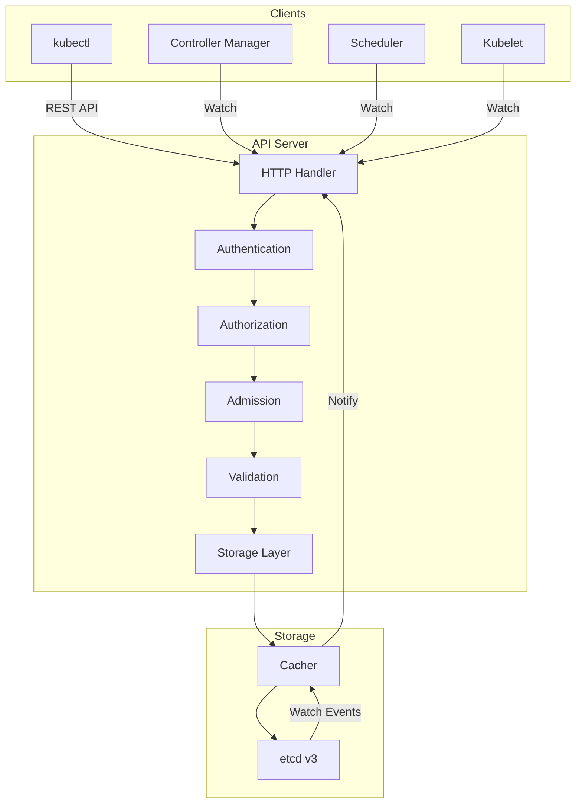
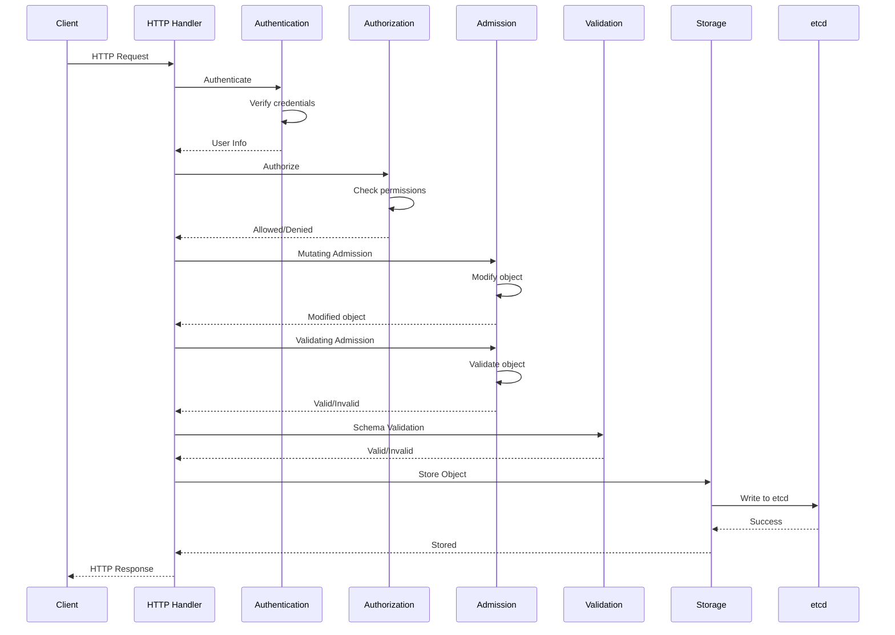
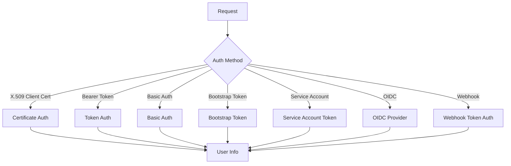
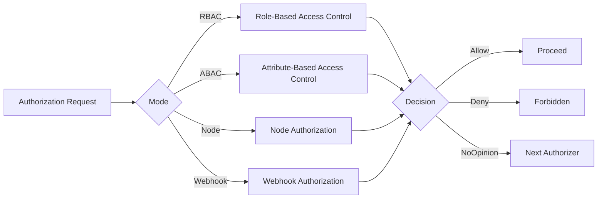
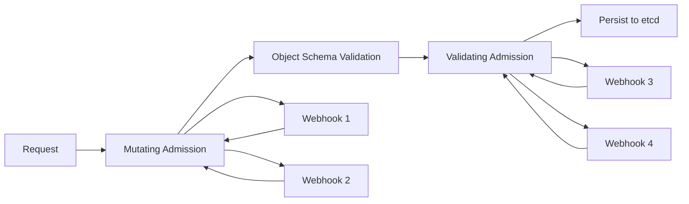
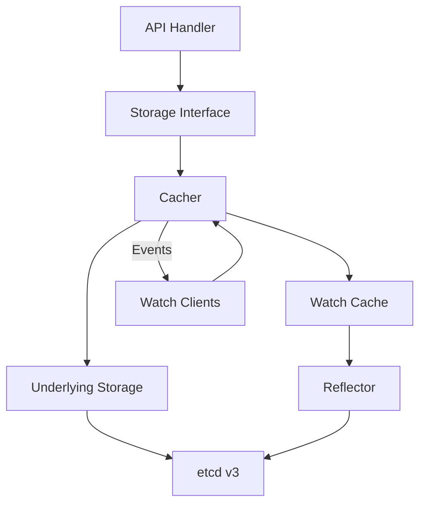
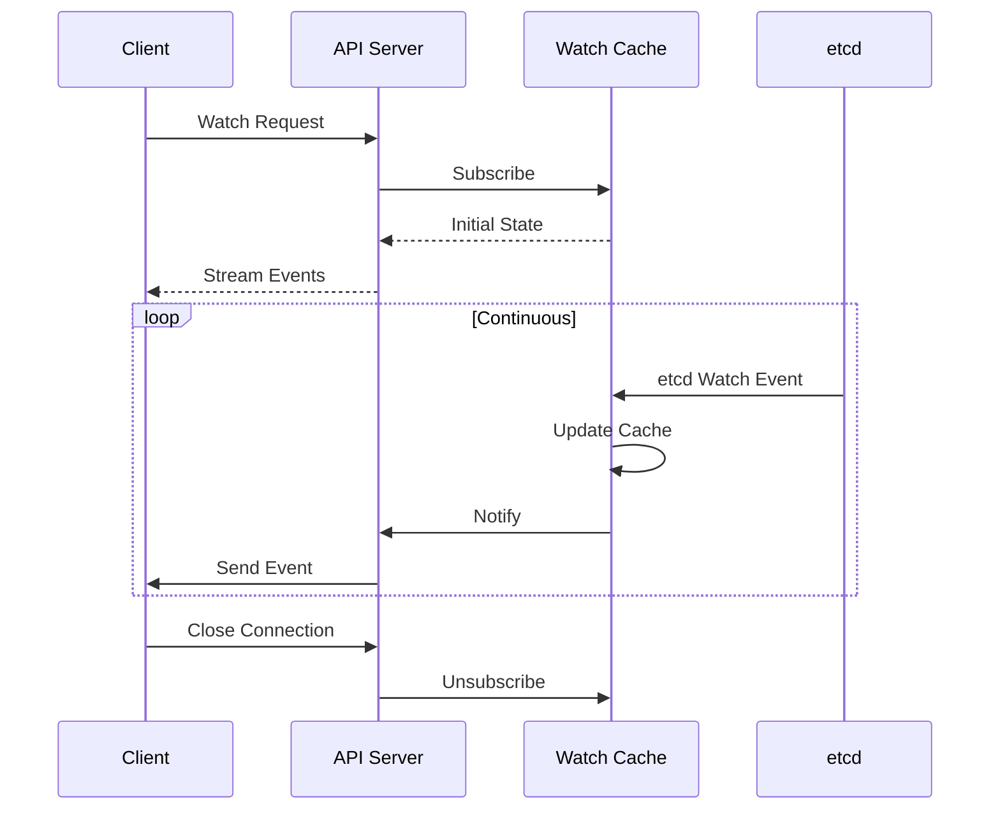
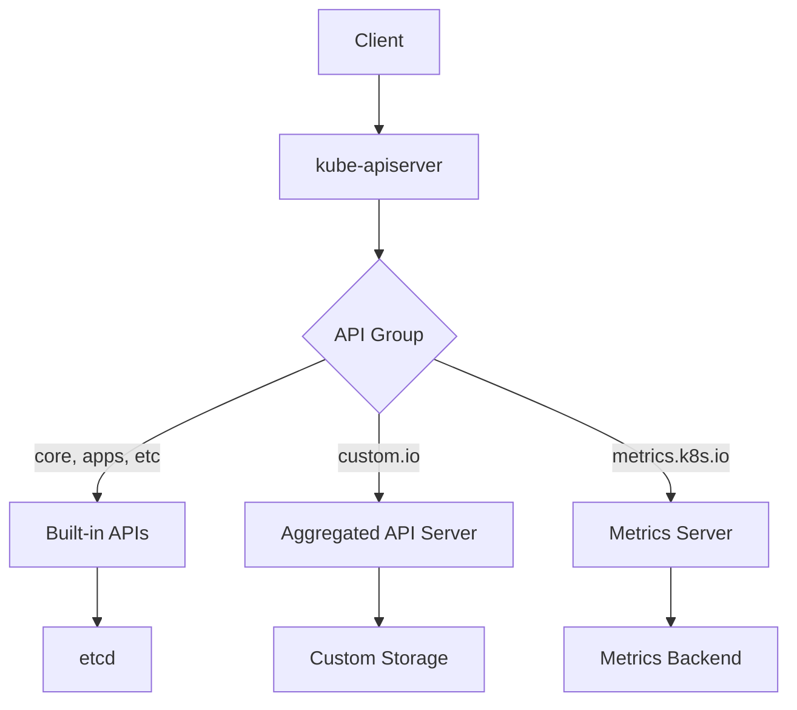

# Kubernetes API Server Internals: Request Pipeline & Storage

## Table of Contents
- [Overview](#overview)
- [API Server Architecture](#api-server-architecture)
- [Request Processing Pipeline](#request-processing-pipeline)
- [Authentication](#authentication)
- [Authorization](#authorization)
- [Admission Control](#admission-control)
- [Storage Layer](#storage-layer)
- [Watch Mechanism](#watch-mechanism)
- [API Aggregation](#api-aggregation)
- [Code References](#code-references)

## Overview

The Kubernetes API server is the central management entity that exposes the Kubernetes API. It processes and validates REST requests, updates the state of API objects in etcd, and serves as the gateway for all cluster operations.

**Core Responsibilities:**
- Serve the Kubernetes API (REST)
- Validate and configure API objects
- Authenticate and authorize requests
- Persist cluster state to etcd
- Coordinate cluster components
- Provide watch mechanism for state changes

**Key Source Files:**
- `cmd/kube-apiserver/app/server.go` - API server initialization
- `staging/src/k8s.io/apiserver/pkg/server/` - Generic API server
- `staging/src/k8s.io/apiserver/pkg/endpoints/` - Request handlers
- `staging/src/k8s.io/apiserver/pkg/storage/` - Storage interface

## API Server Architecture



### API Server Components

```go
type GenericAPIServer struct {
    // Handler for API requests
    Handler *APIServerHandler
    
    // Storage for API objects
    Storage map[string]rest.Storage
    
    // Authentication
    Authenticator authenticator.Request
    
    // Authorization
    Authorizer authorizer.Authorizer
    
    // Admission control
    AdmissionControl admission.Interface
    
    // Serializer for encoding/decoding
    Serializer runtime.NegotiatedSerializer
    
    // OpenAPI spec
    OpenAPIConfig *openapicommon.Config
    
    // Health checks
    HealthzChecks []healthz.HealthChecker
    
    // Lifecycle signals
    ShutdownDelayDuration time.Duration
}
```

## Request Processing Pipeline

### Complete Request Flow



### Request Handler Implementation

```go
func (s *GenericAPIServer) Handler() http.Handler {
    // Build handler chain
    handler := s.UnprotectedHandler()
    
    // Add filters in reverse order (last filter wraps first)
    handler = genericfilters.WithWaitGroup(handler, s.longRunningFunc, s.HandlerChainWaitGroup)
    handler = genericapifilters.WithRequestInfo(handler, s.RequestInfoResolver)
    handler = genericapifilters.WithCacheControl(handler)
    handler = genericfilters.WithPanicRecovery(handler, s.RequestInfoResolver)
    handler = genericfilters.WithTimeoutForNonLongRunningRequests(handler, s.longRunningFunc)
    handler = genericapifilters.WithRequestDeadline(handler, s.AuditBackend, s.AuditPolicyRuleEvaluator, s.longRunningFunc)
    handler = genericfilters.WithMaxInFlightLimit(handler, s.MaxRequestsInFlight, s.MaxMutatingRequestsInFlight, s.longRunningFunc)
    handler = genericapifilters.WithImpersonation(handler, s.Authorizer, s.Serializer)
    handler = genericapifilters.WithAudit(handler, s.AuditBackend, s.AuditPolicyRuleEvaluator, s.longRunningFunc)
    handler = genericapifilters.WithAuthentication(handler, s.Authenticator, failedHandler, s.APIAudiences)
    handler = genericapifilters.WithAuthorization(handler, s.Authorizer, s.Serializer)
    handler = genericapifilters.WithRequestInfo(handler, s.RequestInfoResolver)
    
    return handler
}

func (s *GenericAPIServer) UnprotectedHandler() http.Handler {
    // Create mux
    mux := http.NewServeMux()
    
    // Register API groups
    for _, apiGroupInfo := range s.APIGroupInfos {
        s.installAPIResources(apiGroupInfo, mux)
    }
    
    // Register discovery
    s.installDiscovery(mux)
    
    // Register health checks
    s.installHealthz(mux)
    
    return mux
}
```

### Filter Chain

Each filter in the chain handles a specific aspect:

```go
// 1. Panic Recovery
func WithPanicRecovery(handler http.Handler) http.Handler {
    return http.HandlerFunc(func(w http.ResponseWriter, req *http.Request) {
        defer func() {
            if err := recover(); err != nil {
                http.Error(w, "Internal server error", http.StatusInternalServerError)
                runtime.HandleError(fmt.Errorf("panic: %v", err))
            }
        }()
        handler.ServeHTTP(w, req)
    })
}

// 2. Request Info
func WithRequestInfo(handler http.Handler, resolver RequestInfoResolver) http.Handler {
    return http.HandlerFunc(func(w http.ResponseWriter, req *http.Request) {
        info, err := resolver.NewRequestInfo(req)
        if err != nil {
            http.Error(w, err.Error(), http.StatusBadRequest)
            return
        }
        req = req.WithContext(WithRequestInfo(req.Context(), info))
        handler.ServeHTTP(w, req)
    })
}

// 3. Authentication
func WithAuthentication(handler http.Handler, auth authenticator.Request) http.Handler {
    return http.HandlerFunc(func(w http.ResponseWriter, req *http.Request) {
        resp, ok, err := auth.AuthenticateRequest(req)
        if err != nil || !ok {
            http.Error(w, "Unauthorized", http.StatusUnauthorized)
            return
        }
        req = req.WithContext(WithUser(req.Context(), resp.User))
        handler.ServeHTTP(w, req)
    })
}

// 4. Authorization
func WithAuthorization(handler http.Handler, auth authorizer.Authorizer) http.Handler {
    return http.HandlerFunc(func(w http.ResponseWriter, req *http.Request) {
        attrs := GetAuthorizerAttributes(req.Context())
        decision, reason, err := auth.Authorize(req.Context(), attrs)
        
        if decision != authorizer.DecisionAllow {
            http.Error(w, reason, http.StatusForbidden)
            return
        }
        handler.ServeHTTP(w, req)
    })
}
```

## Authentication

Authentication verifies the identity of the requester.

### Authentication Methods



### Authenticator Interface

```go
type Request interface {
    // AuthenticateRequest authenticates the request
    AuthenticateRequest(req *http.Request) (*Response, bool, error)
}

type Response struct {
    // User is the UserInfo associated with the authentication
    User user.Info
    
    // Audiences is the set of audiences the token was issued for
    Audiences authenticator.Audiences
}

type Info interface {
    // GetName returns the name that uniquely identifies this user
    GetName() string
    
    // GetUID returns a unique value for a particular user
    GetUID() string
    
    // GetGroups returns the names of the groups the user is a member of
    GetGroups() []string
    
    // GetExtra returns additional information about the user
    GetExtra() map[string][]string
}
```

### X.509 Certificate Authentication

```go
type x509Authenticator struct {
    verifyOptions x509.VerifyOptions
    user          UserConversion
}

func (a *x509Authenticator) AuthenticateRequest(req *http.Request) (*Response, bool, error) {
    if req.TLS == nil || len(req.TLS.PeerCertificates) == 0 {
        return nil, false, nil
    }
    
    // Get client certificate
    cert := req.TLS.PeerCertificates[0]
    
    // Verify certificate
    chains, err := cert.Verify(a.verifyOptions)
    if err != nil {
        return nil, false, err
    }
    
    // Extract user info from certificate
    user := &user.DefaultInfo{
        Name:   cert.Subject.CommonName,
        Groups: cert.Subject.Organization,
    }
    
    return &Response{User: user}, true, nil
}
```

### Service Account Token Authentication

```go
type serviceAccountAuthenticator struct {
    validator ServiceAccountTokenValidator
}

func (s *serviceAccountAuthenticator) AuthenticateRequest(req *http.Request) (*Response, bool, error) {
    // Extract token from Authorization header
    token := extractToken(req)
    if token == "" {
        return nil, false, nil
    }
    
    // Validate token
    claims, err := s.validator.Validate(token)
    if err != nil {
        return nil, false, err
    }
    
    // Build user info
    user := &user.DefaultInfo{
        Name: fmt.Sprintf("system:serviceaccount:%s:%s", 
            claims.Namespace, claims.ServiceAccountName),
        UID: string(claims.ServiceAccountUID),
        Groups: []string{
            "system:serviceaccounts",
            fmt.Sprintf("system:serviceaccounts:%s", claims.Namespace),
        },
    }
    
    return &Response{User: user}, true, nil
}
```

## Authorization

Authorization determines what the authenticated user can do.

### Authorization Modes



### Authorizer Interface

```go
type Authorizer interface {
    Authorize(ctx context.Context, a Attributes) (Decision, string, error)
}

type Attributes interface {
    // GetUser returns the user.Info associated with the request
    GetUser() user.Info
    
    // GetVerb returns the verb associated with the request
    GetVerb() string
    
    // IsReadOnly returns true if the request is a read-only request
    IsReadOnly() bool
    
    // GetNamespace returns the namespace associated with the request
    GetNamespace() string
    
    // GetResource returns the resource associated with the request
    GetResource() string
    
    // GetSubresource returns the subresource associated with the request
    GetSubresource() string
    
    // GetName returns the name of the object associated with the request
    GetName() string
    
    // GetAPIGroup returns the API group associated with the request
    GetAPIGroup() string
    
    // GetAPIVersion returns the API version associated with the request
    GetAPIVersion() string
    
    // IsResourceRequest returns true if this is a resource request
    IsResourceRequest() bool
    
    // GetPath returns the path of the request
    GetPath() string
}

type Decision int

const (
    DecisionDeny Decision = iota
    DecisionAllow
    DecisionNoOpinion
)
```

### RBAC Authorization

```go
type RBACAuthorizer struct {
    roleGetter               RoleGetter
    roleBindingLister        RoleBindingLister
    clusterRoleGetter        ClusterRoleGetter
    clusterRoleBindingLister ClusterRoleBindingLister
}

func (r *RBACAuthorizer) Authorize(ctx context.Context, attrs Attributes) (Decision, string, error) {
    // Get user info
    user := attrs.GetUser()
    
    // Check cluster-wide permissions
    clusterRoleBindings, err := r.clusterRoleBindingLister.List()
    if err != nil {
        return DecisionNoOpinion, "", err
    }
    
    for _, binding := range clusterRoleBindings {
        if !appliesTo(user, binding.Subjects) {
            continue
        }
        
        // Get cluster role
        role, err := r.clusterRoleGetter.GetClusterRole(binding.RoleRef.Name)
        if err != nil {
            continue
        }
        
        // Check if role allows the action
        if ruleAllows(attrs, role.Rules) {
            return DecisionAllow, "", nil
        }
    }
    
    // Check namespace-specific permissions
    if attrs.GetNamespace() != "" {
        roleBindings, err := r.roleBindingLister.List(attrs.GetNamespace())
        if err != nil {
            return DecisionNoOpinion, "", err
        }
        
        for _, binding := range roleBindings {
            if !appliesTo(user, binding.Subjects) {
                continue
            }
            
            // Get role
            role, err := r.roleGetter.GetRole(attrs.GetNamespace(), binding.RoleRef.Name)
            if err != nil {
                continue
            }
            
            // Check if role allows the action
            if ruleAllows(attrs, role.Rules) {
                return DecisionAllow, "", nil
            }
        }
    }
    
    return DecisionNoOpinion, "no RBAC policy matched", nil
}

func ruleAllows(attrs Attributes, rules []rbacv1.PolicyRule) bool {
    for _, rule := range rules {
        if ruleMatches(attrs, rule) {
            return true
        }
    }
    return false
}

func ruleMatches(attrs Attributes, rule rbacv1.PolicyRule) bool {
    // Check verb
    if !contains(rule.Verbs, attrs.GetVerb()) && !contains(rule.Verbs, "*") {
        return false
    }
    
    // Check API group
    if !contains(rule.APIGroups, attrs.GetAPIGroup()) && !contains(rule.APIGroups, "*") {
        return false
    }
    
    // Check resource
    if !contains(rule.Resources, attrs.GetResource()) && !contains(rule.Resources, "*") {
        return false
    }
    
    // Check resource name
    if len(rule.ResourceNames) > 0 {
        if !contains(rule.ResourceNames, attrs.GetName()) {
            return false
        }
    }
    
    return true
}
```

## Admission Control

Admission controllers intercept requests after authentication and authorization but before persistence.

### Admission Chain



### Admission Interface

```go
type Interface interface {
    // Handles returns true if this admission controller can handle the given operation
    Handles(operation Operation) bool
    
    // Admit makes an admission decision
    Admit(ctx context.Context, a Attributes, o ObjectInterfaces) error
}

type MutationInterface interface {
    Interface
    
    // Admit may modify the object
    Admit(ctx context.Context, a Attributes, o ObjectInterfaces) error
}

type ValidationInterface interface {
    Interface
    
    // Validate checks the object but does not modify it
    Validate(ctx context.Context, a Attributes, o ObjectInterfaces) error
}

type Attributes interface {
    // GetName returns the name of the object
    GetName() string
    
    // GetNamespace returns the namespace
    GetNamespace() string
    
    // GetResource returns the resource
    GetResource() schema.GroupVersionResource
    
    // GetSubresource returns the subresource
    GetSubresource() string
    
    // GetOperation returns the operation
    GetOperation() Operation
    
    // GetObject returns the object being admitted
    GetObject() runtime.Object
    
    // GetOldObject returns the existing object (for updates)
    GetOldObject() runtime.Object
    
    // GetUserInfo returns the user info
    GetUserInfo() user.Info
}
```

### Built-in Admission Controllers

```go
// NamespaceLifecycle - prevents creation of objects in terminating namespaces
type NamespaceLifecycle struct {
    client clientset.Interface
}

func (l *NamespaceLifecycle) Admit(ctx context.Context, a Attributes, o ObjectInterfaces) error {
    // Skip if not namespaced
    if a.GetNamespace() == "" {
        return nil
    }
    
    // Get namespace
    ns, err := l.client.CoreV1().Namespaces().Get(ctx, a.GetNamespace(), metav1.GetOptions{})
    if err != nil {
        return err
    }
    
    // Check if namespace is terminating
    if ns.Status.Phase == v1.NamespaceTerminating {
        return admission.NewForbidden(a, fmt.Errorf("namespace %s is terminating", a.GetNamespace()))
    }
    
    return nil
}

// ResourceQuota - enforces resource quotas
type ResourceQuota struct {
    client clientset.Interface
    evaluator Evaluator
}

func (q *ResourceQuota) Admit(ctx context.Context, a Attributes, o ObjectInterfaces) error {
    // Get resource quotas for namespace
    quotas, err := q.client.CoreV1().ResourceQuotas(a.GetNamespace()).List(ctx, metav1.ListOptions{})
    if err != nil {
        return err
    }
    
    // Evaluate usage
    for _, quota := range quotas.Items {
        usage := q.evaluator.Usage(a.GetObject())
        
        // Check if quota would be exceeded
        for resource, quantity := range usage {
            limit := quota.Status.Hard[resource]
            used := quota.Status.Used[resource]
            
            if used.Add(quantity).Cmp(limit) > 0 {
                return admission.NewForbidden(a, 
                    fmt.Errorf("exceeded quota: %s", resource))
            }
        }
    }
    
    return nil
}
```

### Admission Webhooks

```go
type Webhook struct {
    clientManager ClientManager
    namespaceMatcher NamespaceMatcher
}

func (w *Webhook) Admit(ctx context.Context, a Attributes, o ObjectInterfaces) error {
    // Get webhook configurations
    hooks, err := w.getWebhooks(a)
    if err != nil {
        return err
    }
    
    for _, hook := range hooks {
        // Build admission review
        review := &admissionv1.AdmissionReview{
            Request: &admissionv1.AdmissionRequest{
                UID: types.UID(uuid.New().String()),
                Kind: metav1.GroupVersionKind{
                    Group:   a.GetResource().Group,
                    Version: a.GetResource().Version,
                    Kind:    a.GetKind().Kind,
                },
                Resource:    a.GetResource(),
                SubResource: a.GetSubresource(),
                Name:        a.GetName(),
                Namespace:   a.GetNamespace(),
                Operation:   admissionv1.Operation(a.GetOperation()),
                Object:      runtime.RawExtension{Object: a.GetObject()},
                OldObject:   runtime.RawExtension{Object: a.GetOldObject()},
                UserInfo:    convertUserInfo(a.GetUserInfo()),
            },
        }
        
        // Call webhook
        client := w.clientManager.HookClient(hook)
        result, err := client.Post().Body(review).Do(ctx).Get()
        if err != nil {
            return err
        }
        
        // Check response
        response := result.(*admissionv1.AdmissionReview).Response
        if !response.Allowed {
            return admission.NewForbidden(a, errors.New(response.Result.Message))
        }
        
        // Apply patches if mutating
        if len(response.Patch) > 0 {
            err = applyPatch(a.GetObject(), response.Patch, response.PatchType)
            if err != nil {
                return err
            }
        }
    }
    
    return nil
}
```

## Storage Layer

The storage layer abstracts etcd operations and provides caching.

### Storage Architecture



### Storage Interface

```go
type Interface interface {
    // Versioner returns the versioner for this storage
    Versioner() Versioner
    
    // Create adds a new object
    Create(ctx context.Context, key string, obj, out runtime.Object, ttl uint64) error
    
    // Delete removes an object
    Delete(ctx context.Context, key string, out runtime.Object, preconditions *Preconditions, validateDeletion ValidateObjectFunc, cachedExistingObject runtime.Object) error
    
    // Watch begins watching the specified key
    Watch(ctx context.Context, key string, opts ListOptions) (watch.Interface, error)
    
    // Get retrieves a single object
    Get(ctx context.Context, key string, opts GetOptions, objPtr runtime.Object) error
    
    // GetList retrieves a list of objects
    GetList(ctx context.Context, key string, opts ListOptions, listObj runtime.Object) error
    
    // GuaranteedUpdate performs an atomic update
    GuaranteedUpdate(ctx context.Context, key string, destination runtime.Object, ignoreNotFound bool, preconditions *Preconditions, tryUpdate UpdateFunc, cachedExistingObject runtime.Object) error
    
    // Count returns the number of objects matching the key prefix
    Count(key string) (int64, error)
}
```

### etcd Storage Implementation

```go
type store struct {
    client *clientv3.Client
    codec  runtime.Codec
    versioner Versioner
    transformer value.Transformer
    pathPrefix string
}

func (s *store) Create(ctx context.Context, key string, obj, out runtime.Object, ttl uint64) error {
    // Encode object
    data, err := runtime.Encode(s.codec, obj)
    if err != nil {
        return err
    }
    
    // Transform (encrypt if needed)
    data, err = s.transformer.TransformToStorage(data, key)
    if err != nil {
        return err
    }
    
    // Set resource version
    newVersion := s.versioner.UpdateObject(obj, 0)
    
    // Create in etcd
    key = path.Join(s.pathPrefix, key)
    opts := []clientv3.OpOption{}
    if ttl > 0 {
        lease, err := s.client.Grant(ctx, int64(ttl))
        if err != nil {
            return err
        }
        opts = append(opts, clientv3.WithLease(lease.ID))
    }
    
    txn := s.client.Txn(ctx)
    txn = txn.If(clientv3.Compare(clientv3.Version(key), "=", 0))
    txn = txn.Then(clientv3.OpPut(key, string(data), opts...))
    
    resp, err := txn.Commit()
    if err != nil {
        return err
    }
    
    if !resp.Succeeded {
        return storage.NewKeyExistsError(key, 0)
    }
    
    // Decode into out
    return runtime.DecodeInto(s.codec, data, out)
}

func (s *store) GuaranteedUpdate(
    ctx context.Context,
    key string,
    destination runtime.Object,
    ignoreNotFound bool,
    preconditions *Preconditions,
    tryUpdate UpdateFunc,
    cachedExistingObject runtime.Object,
) error {
    
    for {
        // Get current object
        current := destination.DeepCopyObject()
        err := s.Get(ctx, key, GetOptions{}, current)
        if err != nil {
            if !errors.IsNotFound(err) || !ignoreNotFound {
                return err
            }
            current = nil
        }
        
        // Check preconditions
        if preconditions != nil {
            if err := preconditions.Check(key, current); err != nil {
                return err
            }
        }
        
        // Try update
        updated, ttl, err := tryUpdate(current, ResponseMeta{})
        if err != nil {
            return err
        }
        
        // Get resource versions
        currentVersion := uint64(0)
        if current != nil {
            currentVersion, err = s.versioner.ObjectResourceVersion(current)
            if err != nil {
                return err
            }
        }
        
        newVersion := s.versioner.UpdateObject(updated, currentVersion+1)
        
        // Encode
        data, err := runtime.Encode(s.codec, updated)
        if err != nil {
            return err
        }
        
        // Transform
        data, err = s.transformer.TransformToStorage(data, key)
        if err != nil {
            return err
        }
        
        // Update in etcd with optimistic concurrency
        key = path.Join(s.pathPrefix, key)
        txn := s.client.Txn(ctx)
        
        if current != nil {
            txn = txn.If(clientv3.Compare(clientv3.ModRevision(key), "=", int64(currentVersion)))
        } else {
            txn = txn.If(clientv3.Compare(clientv3.Version(key), "=", 0))
        }
        
        opts := []clientv3.OpOption{}
        if ttl > 0 {
            lease, err := s.client.Grant(ctx, int64(ttl))
            if err != nil {
                return err
            }
            opts = append(opts, clientv3.WithLease(lease.ID))
        }
        
        txn = txn.Then(clientv3.OpPut(key, string(data), opts...))
        resp, err := txn.Commit()
        
        if err != nil {
            return err
        }
        
        if !resp.Succeeded {
            // Conflict - retry
            continue
        }
        
        // Success
        return runtime.DecodeInto(s.codec, data, destination)
    }
}
```

## Watch Mechanism

The watch mechanism allows clients to receive real-time updates.

### Watch Flow



### Watch Implementation

```go
type Cacher struct {
    // Underlying storage
    storage Interface
    
    // Watch cache
    watchCache *watchCache
    
    // Reflector to sync from etcd
    reflector *cache.Reflector
}

func (c *Cacher) Watch(ctx context.Context, key string, opts ListOptions) (watch.Interface, error) {
    // Create watcher
    watcher := newCacheWatcher(
        c.watchCache,
        key,
        opts.ResourceVersion,
        opts.Predicate,
    )
    
    // Add to watch cache
    c.watchCache.Add(watcher)
    
    // Send initial events if needed
    if opts.ResourceVersion == "0" {
        c.sendInitialEvents(watcher, key, opts)
    }
    
    return watcher, nil
}

type cacheWatcher struct {
    input   chan *watchCacheEvent
    result  chan watch.Event
    done    chan struct{}
    filter  FilterFunc
    stopped bool
    forget  func()
}

func (c *cacheWatcher) ResultChan() <-chan watch.Event {
    return c.result
}

func (c *cacheWatcher) Stop() {
    c.forget()
    close(c.done)
    c.stopped = true
}

func (c *cacheWatcher) process(ctx context.Context) {
    defer close(c.result)
    
    for {
        select {
        case event := <-c.input:
            // Filter event
            if c.filter != nil && !c.filter(event.Object) {
                continue
            }
            
            // Send to client
            select {
            case c.result <- event.ToWatchEvent():
            case <-c.done:
                return
            }
            
        case <-c.done:
            return
        }
    }
}
```

## API Aggregation

API aggregation allows extending the Kubernetes API with custom API servers.

### Aggregation Architecture



### APIService Registration

```go
type APIService struct {
    metav1.TypeMeta
    metav1.ObjectMeta
    
    Spec APIServiceSpec
    Status APIServiceStatus
}

type APIServiceSpec struct {
    // Service is a reference to the service for this API server
    Service *ServiceReference
    
    // Group is the API group name
    Group string
    
    // Version is the API version
    Version string
    
    // InsecureSkipTLSVerify disables TLS certificate verification
    InsecureSkipTLSVerify bool
    
    // CABundle is a PEM encoded CA bundle
    CABundle []byte
    
    // GroupPriorityMinimum is the priority for this group
    GroupPriorityMinimum int32
    
    // VersionPriority is the priority for this version
    VersionPriority int32
}
```

## Code References

### Key Files

| Component      | Location                                           | Purpose                       |
| -------------- | -------------------------------------------------- | ----------------------------- |
| API Server     | `cmd/kube-apiserver/app/server.go`                 | Main server initialization    |
| Generic Server | `staging/src/k8s.io/apiserver/pkg/server/`         | Generic API server framework  |
| Authentication | `staging/src/k8s.io/apiserver/pkg/authentication/` | Authentication mechanisms     |
| Authorization  | `staging/src/k8s.io/apiserver/pkg/authorization/`  | Authorization implementations |
| Admission      | `staging/src/k8s.io/apiserver/pkg/admission/`      | Admission control             |
| Storage        | `staging/src/k8s.io/apiserver/pkg/storage/`        | Storage layer                 |
| etcd           | `staging/src/k8s.io/apiserver/pkg/storage/etcd3/`  | etcd v3 implementation        |

### Performance Considerations

1. **Watch Cache**: Reduces etcd load by caching watch events
2. **Pagination**: Large lists are paginated to reduce memory usage
3. **Priority and Fairness**: Prevents API server overload
4. **Request Timeout**: Prevents long-running requests from blocking
5. **Compression**: Reduces network bandwidth for large responses

### Troubleshooting

```bash
# Check API server logs
kubectl logs -n kube-system kube-apiserver-xxx

# Test authentication
kubectl auth can-i create pods

# Check authorization
kubectl auth can-i create pods --as=user --as-group=group

# View admission webhooks
kubectl get validatingwebhookconfigurations
kubectl get mutatingwebhookconfigurations

# Check API server metrics
kubectl get --raw /metrics | grep apiserver

# Test API aggregation
kubectl get apiservices
```

---

**Next**: See [INTERNALS_SECURITY.md](./INTERNALS_SECURITY.md) for deep dive into security mechanisms including RBAC, Pod Security, and secrets management.

