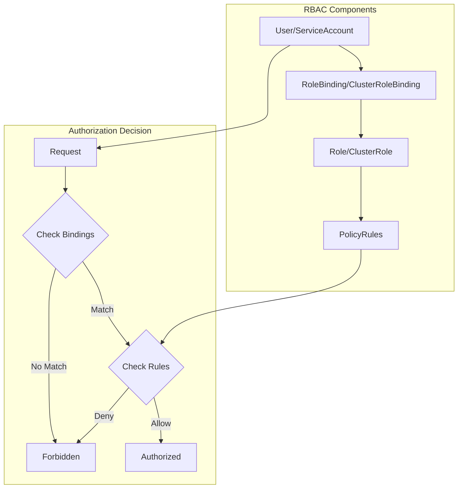
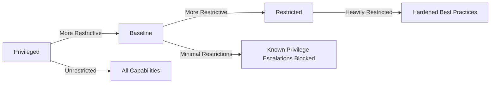

# Kubernetes Security Internals: RBAC, Pod Security & Secrets

## Table of Contents
- [Overview](#overview)
- [RBAC Deep Dive](#rbac-deep-dive)
- [Pod Security Standards](#pod-security-standards)
- [Secrets Management](#secrets-management)
- [Service Accounts](#service-accounts)
- [Certificate Management](#certificate-management)
- [Network Policies](#network-policies)
- [Security Context](#security-context)
- [Code References](#code-references)

## Overview

Kubernetes security is built on multiple layers of defense, from authentication and authorization to runtime security and secrets encryption.

**Security Layers:**
1. **Authentication** - Who are you?
2. **Authorization** - What can you do?
3. **Admission Control** - Is this allowed?
4. **Runtime Security** - Pod Security Standards
5. **Network Security** - Network Policies
6. **Data Security** - Secrets encryption

## RBAC Deep Dive

Role-Based Access Control (RBAC) is the primary authorization mechanism in Kubernetes.

### RBAC Architecture



### RBAC API Objects

```go
// Role defines permissions within a namespace
type Role struct {
    metav1.TypeMeta
    metav1.ObjectMeta
    
    // Rules holds all the PolicyRules for this Role
    Rules []PolicyRule
}

// ClusterRole defines cluster-wide permissions
type ClusterRole struct {
    metav1.TypeMeta
    metav1.ObjectMeta
    
    // Rules holds all the PolicyRules for this ClusterRole
    Rules []PolicyRule
    
    // AggregationRule describes how to build the Rules
    AggregationRule *AggregationRule
}

// PolicyRule holds information about a policy rule
type PolicyRule struct {
    // Verbs is a list of Verbs that apply to ALL the ResourceKinds
    Verbs []string
    
    // APIGroups is the name of the APIGroup that contains the resources
    APIGroups []string
    
    // Resources is a list of resources this rule applies to
    Resources []string
    
    // ResourceNames is an optional white list of names
    ResourceNames []string
    
    // NonResourceURLs is a set of partial urls
    NonResourceURLs []string
}

// RoleBinding references a role and binds it to subjects
type RoleBinding struct {
    metav1.TypeMeta
    metav1.ObjectMeta
    
    // Subjects holds references to the objects the role applies to
    Subjects []Subject
    
    // RoleRef contains information that points to the role being used
    RoleRef RoleRef
}

// Subject contains a reference to the object or user identities
type Subject struct {
    // Kind of object being referenced (User, Group, ServiceAccount)
    Kind string
    
    // APIGroup holds the API group of the referenced subject
    APIGroup string
    
    // Name of the object being referenced
    Name string
    
    // Namespace of the referenced object
    Namespace string
}
```

### RBAC Authorization Implementation

```go
type RBACAuthorizer struct {
    authorizationRuleResolver validation.AuthorizationRuleResolver
}

func (r *RBACAuthorizer) Authorize(ctx context.Context, requestAttributes authorizer.Attributes) (authorizer.Decision, string, error) {
    ruleCheckingVisitor := &authorizingVisitor{requestAttributes: requestAttributes}
    
    // Visit all rules that apply to this user
    r.authorizationRuleResolver.VisitRulesFor(
        requestAttributes.GetUser(),
        requestAttributes.GetNamespace(),
        ruleCheckingVisitor.visit,
    )
    
    if ruleCheckingVisitor.allowed {
        return authorizer.DecisionAllow, ruleCheckingVisitor.reason, nil
    }
    
    return authorizer.DecisionNoOpinion, ruleCheckingVisitor.reason, nil
}

type authorizingVisitor struct {
    requestAttributes authorizer.Attributes
    allowed           bool
    reason            string
    errors            []error
}

func (v *authorizingVisitor) visit(source fmt.Stringer, rule *rbacv1.PolicyRule, err error) bool {
    if err != nil {
        v.errors = append(v.errors, err)
        return true // continue visiting
    }
    
    if RuleAllows(v.requestAttributes, rule) {
        v.allowed = true
        v.reason = fmt.Sprintf("RBAC: allowed by %s", source.String())
        return false // stop visiting
    }
    
    return true // continue visiting
}

func RuleAllows(requestAttributes authorizer.Attributes, rule *rbacv1.PolicyRule) bool {
    if requestAttributes.IsResourceRequest() {
        combinedResource := requestAttributes.GetResource()
        if len(requestAttributes.GetSubresource()) > 0 {
            combinedResource = requestAttributes.GetResource() + "/" + requestAttributes.GetSubresource()
        }
        
        return VerbMatches(rule, requestAttributes.GetVerb()) &&
            APIGroupMatches(rule, requestAttributes.GetAPIGroup()) &&
            ResourceMatches(rule, combinedResource, requestAttributes.GetSubresource()) &&
            ResourceNameMatches(rule, requestAttributes.GetName())
    }
    
    return VerbMatches(rule, requestAttributes.GetVerb()) &&
        NonResourceURLMatches(rule, requestAttributes.GetPath())
}

func VerbMatches(rule *rbacv1.PolicyRule, requestedVerb string) bool {
    for _, ruleVerb := range rule.Verbs {
        if ruleVerb == rbacv1.VerbAll || ruleVerb == requestedVerb {
            return true
        }
    }
    return false
}

func APIGroupMatches(rule *rbacv1.PolicyRule, requestedGroup string) bool {
    for _, ruleGroup := range rule.APIGroups {
        if ruleGroup == rbacv1.APIGroupAll || ruleGroup == requestedGroup {
            return true
        }
    }
    return false
}

func ResourceMatches(rule *rbacv1.PolicyRule, combinedResource string, subresource string) bool {
    for _, ruleResource := range rule.Resources {
        // Exact match
        if ruleResource == rbacv1.ResourceAll || ruleResource == combinedResource {
            return true
        }
        
        // Wildcard match for subresources
        if strings.HasSuffix(ruleResource, "/*") {
            baseResource := strings.TrimSuffix(ruleResource, "/*")
            if baseResource == combinedResource || 
               (len(subresource) > 0 && strings.HasPrefix(combinedResource, baseResource+"/")) {
                return true
            }
        }
    }
    return false
}
```

### Role Aggregation

ClusterRoles can be aggregated from other ClusterRoles:

```go
type AggregationRule struct {
    // ClusterRoleSelectors holds a list of selectors
    ClusterRoleSelectors []metav1.LabelSelector
}

// Example: admin role aggregates from other roles
apiVersion: rbac.authorization.k8s.io/v1
kind: ClusterRole
metadata:
  name: admin
  labels:
    rbac.authorization.k8s.io/aggregate-to-admin: "true"
aggregationRule:
  clusterRoleSelectors:
  - matchLabels:
      rbac.authorization.k8s.io/aggregate-to-admin: "true"
rules: [] # Rules are automatically filled in by the controller

// Controller that handles aggregation
type ClusterRoleAggregationController struct {
    clusterRoleClient rbacv1client.ClusterRolesGetter
    clusterRoleLister rbacv1listers.ClusterRoleLister
    clusterRoleSynced cache.InformerSynced
}

func (c *ClusterRoleAggregationController) syncClusterRole(key string) error {
    _, name, err := cache.SplitMetaNamespaceKey(key)
    if err != nil {
        return err
    }
    
    clusterRole, err := c.clusterRoleLister.Get(name)
    if err != nil {
        return err
    }
    
    // Skip if no aggregation rule
    if clusterRole.AggregationRule == nil {
        return nil
    }
    
    // Find all matching cluster roles
    var rules []rbacv1.PolicyRule
    allClusterRoles, err := c.clusterRoleLister.List(labels.Everything())
    if err != nil {
        return err
    }
    
    for _, role := range allClusterRoles {
        if role.Name == clusterRole.Name {
            continue
        }
        
        for _, selector := range clusterRole.AggregationRule.ClusterRoleSelectors {
            labelSelector, err := metav1.LabelSelectorAsSelector(&selector)
            if err != nil {
                continue
            }
            
            if labelSelector.Matches(labels.Set(role.Labels)) {
                rules = append(rules, role.Rules...)
                break
            }
        }
    }
    
    // Update cluster role with aggregated rules
    clusterRole = clusterRole.DeepCopy()
    clusterRole.Rules = rules
    _, err = c.clusterRoleClient.ClusterRoles().Update(context.TODO(), clusterRole, metav1.UpdateOptions{})
    return err
}
```

### Common RBAC Patterns

```yaml
# 1. Namespace Admin
apiVersion: rbac.authorization.k8s.io/v1
kind: RoleBinding
metadata:
  name: namespace-admin
  namespace: my-namespace
subjects:
- kind: User
  name: alice
  apiGroup: rbac.authorization.k8s.io
roleRef:
  kind: ClusterRole
  name: admin
  apiGroup: rbac.authorization.k8s.io

# 2. Read-only access to pods
apiVersion: rbac.authorization.k8s.io/v1
kind: Role
metadata:
  name: pod-reader
  namespace: my-namespace
rules:
- apiGroups: [""]
  resources: ["pods"]
  verbs: ["get", "list", "watch"]
- apiGroups: [""]
  resources: ["pods/log"]
  verbs: ["get"]

# 3. Service account with specific permissions
apiVersion: v1
kind: ServiceAccount
metadata:
  name: my-app
  namespace: my-namespace
---
apiVersion: rbac.authorization.k8s.io/v1
kind: Role
metadata:
  name: my-app-role
  namespace: my-namespace
rules:
- apiGroups: [""]
  resources: ["configmaps"]
  verbs: ["get", "list"]
- apiGroups: [""]
  resources: ["secrets"]
  resourceNames: ["my-app-secret"]
  verbs: ["get"]
---
apiVersion: rbac.authorization.k8s.io/v1
kind: RoleBinding
metadata:
  name: my-app-binding
  namespace: my-namespace
subjects:
- kind: ServiceAccount
  name: my-app
  namespace: my-namespace
roleRef:
  kind: Role
  name: my-app-role
  apiGroup: rbac.authorization.k8s.io
```

## Pod Security Standards

Pod Security Standards define three levels of security policies.

### Security Levels



### Pod Security Admission

```go
type Evaluator struct {
    // Policy levels
    levels map[api.Level]Policy
}

type Policy interface {
    // Evaluate checks if a pod meets the policy requirements
    Evaluate(pod *corev1.Pod) []CheckResult
}

type CheckResult struct {
    // Allowed indicates if the check passed
    Allowed bool
    
    // ForbiddenReason is the reason for denial
    ForbiddenReason string
    
    // ForbiddenDetail provides additional context
    ForbiddenDetail string
}

// Baseline policy checks
func (p *BaselinePolicy) Evaluate(pod *corev1.Pod) []CheckResult {
    var results []CheckResult
    
    // Check 1: Host namespaces
    if pod.Spec.HostNetwork || pod.Spec.HostPID || pod.Spec.HostIPC {
        results = append(results, CheckResult{
            Allowed:         false,
            ForbiddenReason: "host namespaces",
            ForbiddenDetail: "pod uses host networking, PID, or IPC namespace",
        })
    }
    
    // Check 2: Privileged containers
    for _, container := range pod.Spec.Containers {
        if container.SecurityContext != nil && 
           container.SecurityContext.Privileged != nil && 
           *container.SecurityContext.Privileged {
            results = append(results, CheckResult{
                Allowed:         false,
                ForbiddenReason: "privileged",
                ForbiddenDetail: fmt.Sprintf("container %s is privileged", container.Name),
            })
        }
    }
    
    // Check 3: Capabilities
    for _, container := range pod.Spec.Containers {
        if container.SecurityContext != nil && container.SecurityContext.Capabilities != nil {
            for _, cap := range container.SecurityContext.Capabilities.Add {
                if !isBaselineCapability(cap) {
                    results = append(results, CheckResult{
                        Allowed:         false,
                        ForbiddenReason: "capabilities",
                        ForbiddenDetail: fmt.Sprintf("container %s adds restricted capability %s", container.Name, cap),
                    })
                }
            }
        }
    }
    
    // Check 4: Host ports
    for _, container := range pod.Spec.Containers {
        for _, port := range container.Ports {
            if port.HostPort != 0 {
                results = append(results, CheckResult{
                    Allowed:         false,
                    ForbiddenReason: "hostPort",
                    ForbiddenDetail: fmt.Sprintf("container %s uses hostPort %d", container.Name, port.HostPort),
                })
            }
        }
    }
    
    // Check 5: Host path volumes
    for _, volume := range pod.Spec.Volumes {
        if volume.HostPath != nil {
            results = append(results, CheckResult{
                Allowed:         false,
                ForbiddenReason: "hostPath volumes",
                ForbiddenDetail: fmt.Sprintf("pod uses hostPath volume %s", volume.Name),
            })
        }
    }
    
    return results
}

// Restricted policy checks (includes baseline + additional restrictions)
func (p *RestrictedPolicy) Evaluate(pod *corev1.Pod) []CheckResult {
    // Start with baseline checks
    results := p.baseline.Evaluate(pod)
    
    // Check 1: Volume types
    allowedVolumeTypes := map[string]bool{
        "configMap":                true,
        "downwardAPI":              true,
        "emptyDir":                 true,
        "persistentVolumeClaim":    true,
        "projected":                true,
        "secret":                   true,
    }
    
    for _, volume := range pod.Spec.Volumes {
        volumeType := getVolumeType(volume)
        if !allowedVolumeTypes[volumeType] {
            results = append(results, CheckResult{
                Allowed:         false,
                ForbiddenReason: "restricted volume types",
                ForbiddenDetail: fmt.Sprintf("volume %s uses restricted type %s", volume.Name, volumeType),
            })
        }
    }
    
    // Check 2: Privilege escalation
    for _, container := range pod.Spec.Containers {
        if container.SecurityContext == nil || 
           container.SecurityContext.AllowPrivilegeEscalation == nil || 
           *container.SecurityContext.AllowPrivilegeEscalation {
            results = append(results, CheckResult{
                Allowed:         false,
                ForbiddenReason: "allowPrivilegeEscalation",
                ForbiddenDetail: fmt.Sprintf("container %s must set allowPrivilegeEscalation=false", container.Name),
            })
        }
    }
    
    // Check 3: Running as non-root
    for _, container := range pod.Spec.Containers {
        if container.SecurityContext == nil || 
           container.SecurityContext.RunAsNonRoot == nil || 
           !*container.SecurityContext.RunAsNonRoot {
            results = append(results, CheckResult{
                Allowed:         false,
                ForbiddenReason: "runAsNonRoot",
                ForbiddenDetail: fmt.Sprintf("container %s must set runAsNonRoot=true", container.Name),
            })
        }
    }
    
    // Check 4: Seccomp profile
    if pod.Spec.SecurityContext == nil || 
       pod.Spec.SecurityContext.SeccompProfile == nil || 
       (pod.Spec.SecurityContext.SeccompProfile.Type != corev1.SeccompProfileTypeRuntimeDefault &&
        pod.Spec.SecurityContext.SeccompProfile.Type != corev1.SeccompProfileTypeLocalhost) {
        results = append(results, CheckResult{
            Allowed:         false,
            ForbiddenReason: "seccompProfile",
            ForbiddenDetail: "pod must define seccomp profile (RuntimeDefault or Localhost)",
        })
    }
    
    // Check 5: Capabilities must be dropped
    for _, container := range pod.Spec.Containers {
        if container.SecurityContext == nil || 
           container.SecurityContext.Capabilities == nil ||
           !containsAll(container.SecurityContext.Capabilities.Drop, []corev1.Capability{"ALL"}) {
            results = append(results, CheckResult{
                Allowed:         false,
                ForbiddenReason: "capabilities",
                ForbiddenDetail: fmt.Sprintf("container %s must drop ALL capabilities", container.Name),
            })
        }
    }
    
    return results
}
```

### Pod Security Admission Controller

```go
type Admission struct {
    // Evaluator for checking policies
    evaluator *Evaluator
    
    // Configuration
    config *api.PodSecurityConfiguration
}

func (a *Admission) Validate(ctx context.Context, attrs admission.Attributes, o admission.ObjectInterfaces) error {
    // Only handle pods
    if attrs.GetResource().GroupResource() != corev1.Resource("pods") {
        return nil
    }
    
    pod, ok := attrs.GetObject().(*corev1.Pod)
    if !ok {
        return nil
    }
    
    // Get namespace
    namespace, err := a.getNamespace(ctx, attrs.GetNamespace())
    if err != nil {
        return err
    }
    
    // Determine policy level from namespace labels
    level := a.getPolicyLevel(namespace)
    
    // Evaluate pod against policy
    results := a.evaluator.Evaluate(level, pod)
    
    // Check for violations
    var violations []string
    for _, result := range results {
        if !result.Allowed {
            violations = append(violations, fmt.Sprintf("%s: %s", result.ForbiddenReason, result.ForbiddenDetail))
        }
    }
    
    if len(violations) > 0 {
        return admission.NewForbidden(attrs, fmt.Errorf("pod violates PodSecurity %q: %s", level, strings.Join(violations, "; ")))
    }
    
    return nil
}

func (a *Admission) getPolicyLevel(namespace *corev1.Namespace) api.Level {
    // Check for enforce label
    if level, ok := namespace.Labels["pod-security.kubernetes.io/enforce"]; ok {
        return api.Level(level)
    }
    
    // Use default from configuration
    return a.config.Defaults.Enforce
}
```

## Secrets Management

Kubernetes Secrets store sensitive data like passwords, tokens, and keys.

### Secret Types

```go
const (
    // Opaque is the default secret type
    SecretTypeOpaque SecretType = "Opaque"
    
    // ServiceAccountToken contains a token for a service account
    SecretTypeServiceAccountToken SecretType = "kubernetes.io/service-account-token"
    
    // DockerConfigJson contains a .dockerconfigjson file
    SecretTypeDockerConfigJson SecretType = "kubernetes.io/dockerconfigjson"
    
    // BasicAuth contains username and password
    SecretTypeBasicAuth SecretType = "kubernetes.io/basic-auth"
    
    // SSHAuth contains SSH credentials
    SecretTypeSSHAuth SecretType = "kubernetes.io/ssh-auth"
    
    // TLS contains TLS certificate and key
    SecretTypeTLS SecretType = "kubernetes.io/tls"
    
    // BootstrapToken contains bootstrap token data
    SecretTypeBootstrapToken SecretType = "bootstrap.kubernetes.io/token"
)
```

### Secrets Encryption at Rest

```go
type EncryptionConfiguration struct {
    // Resources is a list of resources to encrypt
    Resources []ResourceConfiguration
}

type ResourceConfiguration struct {
    // Resources is a list of kubernetes resources
    Resources []string
    
    // Providers is a list of transformers
    Providers []ProviderConfiguration
}

type ProviderConfiguration struct {
    // AESGCM uses AES-GCM encryption
    AESGCM *AESConfiguration
    
    // AESCBC uses AES-CBC encryption
    AESCBC *AESConfiguration
    
    // Secretbox uses NaCl secretbox
    Secretbox *SecretboxConfiguration
    
    // Identity is the (empty) provider that does no transformation
    Identity *IdentityConfiguration
    
    // KMS uses external KMS for encryption
    KMS *KMSConfiguration
}

// Example encryption config
apiVersion: apiserver.config.k8s.io/v1
kind: EncryptionConfiguration
resources:
  - resources:
      - secrets
    providers:
      - aescbc:
          keys:
            - name: key1
              secret: <base64-encoded-secret>
      - identity: {}
```

### Encryption Transformer

```go
type Transformer interface {
    // TransformFromStorage decrypts data from storage
    TransformFromStorage(ctx context.Context, data []byte, dataCtx Context) ([]byte, bool, error)
    
    // TransformToStorage encrypts data for storage
    TransformToStorage(ctx context.Context, data []byte, dataCtx Context) ([]byte, error)
}

type envelopeTransformer struct {
    envelope Envelope
    prefix   []byte
}

func (t *envelopeTransformer) TransformToStorage(ctx context.Context, data []byte, dataCtx Context) ([]byte, error) {
    // Generate DEK (Data Encryption Key)
    dek := make([]byte, 32)
    if _, err := rand.Read(dek); err != nil {
        return nil, err
    }
    
    // Encrypt data with DEK
    encryptedData, err := t.encryptWithDEK(data, dek)
    if err != nil {
        return nil, err
    }
    
    // Encrypt DEK with KEK (Key Encryption Key) via KMS
    encryptedDEK, err := t.envelope.Encrypt(ctx, dek)
    if err != nil {
        return nil, err
    }
    
    // Build envelope
    envelope := &kmstypes.EncryptedObject{
        EncryptedData: encryptedData,
        EncryptedDEK:  encryptedDEK,
    }
    
    // Serialize
    serialized, err := proto.Marshal(envelope)
    if err != nil {
        return nil, err
    }
    
    // Add prefix
    return append(t.prefix, serialized...), nil
}

func (t *envelopeTransformer) TransformFromStorage(ctx context.Context, data []byte, dataCtx Context) ([]byte, bool, error) {
    // Check prefix
    if !bytes.HasPrefix(data, t.prefix) {
        return nil, false, nil
    }
    
    // Remove prefix
    data = data[len(t.prefix):]
    
    // Deserialize envelope
    envelope := &kmstypes.EncryptedObject{}
    if err := proto.Unmarshal(data, envelope); err != nil {
        return nil, false, err
    }
    
    // Decrypt DEK with KEK via KMS
    dek, err := t.envelope.Decrypt(ctx, envelope.EncryptedDEK)
    if err != nil {
        return nil, false, err
    }
    
    // Decrypt data with DEK
    decryptedData, err := t.decryptWithDEK(envelope.EncryptedData, dek)
    if err != nil {
        return nil, false, err
    }
    
    return decryptedData, true, nil
}
```

### Secret Injection into Pods

```go
// Kubelet mounts secrets into pods
func (kl *Kubelet) mountSecrets(pod *v1.Pod) error {
    for _, volume := range pod.Spec.Volumes {
        if volume.Secret == nil {
            continue
        }
        
        // Get secret from API server
        secret, err := kl.kubeClient.CoreV1().Secrets(pod.Namespace).Get(
            context.TODO(),
            volume.Secret.SecretName,
            metav1.GetOptions{},
        )
        if err != nil {
            return err
        }
        
        // Create volume directory
        volumePath := kl.getPodVolumeDir(pod.UID, volume.Name)
        if err := os.MkdirAll(volumePath, 0755); err != nil {
            return err
        }
        
        // Write secret data to files
        for key, value := range secret.Data {
            filePath := filepath.Join(volumePath, key)
            if err := ioutil.WriteFile(filePath, value, 0644); err != nil {
                return err
            }
        }
        
        // Set up symlink if needed
        if volume.Secret.Items != nil {
            for _, item := range volume.Secret.Items {
                sourcePath := filepath.Join(volumePath, item.Key)
                targetPath := filepath.Join(volumePath, item.Path)
                
                if err := os.Symlink(sourcePath, targetPath); err != nil {
                    return err
                }
            }
        }
    }
    
    return nil
}
```

## Service Accounts

Service Accounts provide identity for processes running in pods.

### Service Account Token Projection

```go
type ServiceAccountTokenProjection struct {
    // Audience is the intended audience of the token
    Audience string
    
    // ExpirationSeconds is the requested duration of validity
    ExpirationSeconds *int64
    
    // Path is the path relative to the mount point
    Path string
}

// Token request
type TokenRequest struct {
    metav1.TypeMeta
    metav1.ObjectMeta
    
    Spec TokenRequestSpec
    Status TokenRequestStatus
}

type TokenRequestSpec struct {
    // Audiences are the intended audiences of the token
    Audiences []string
    
    // ExpirationSeconds is the requested duration of validity
    ExpirationSeconds *int64
    
    // BoundObjectRef is a reference to an object that the token will be bound to
    BoundObjectRef *BoundObjectReference
}

// Token controller generates tokens
type TokensController struct {
    client clientset.Interface
    token  serviceaccount.TokenGenerator
}

func (e *TokensController) syncServiceAccount(key string) error {
    namespace, name, err := cache.SplitMetaNamespaceKey(key)
    if err != nil {
        return err
    }
    
    sa, err := e.client.CoreV1().ServiceAccounts(namespace).Get(context.TODO(), name, metav1.GetOptions{})
    if err != nil {
        return err
    }
    
    // Check if token secret exists
    secrets, err := e.client.CoreV1().Secrets(namespace).List(context.TODO(), metav1.ListOptions{
        FieldSelector: fmt.Sprintf("type=%s", corev1.SecretTypeServiceAccountToken),
    })
    if err != nil {
        return err
    }
    
    var tokenSecret *corev1.Secret
    for _, secret := range secrets.Items {
        if secret.Annotations[corev1.ServiceAccountNameKey] == sa.Name {
            tokenSecret = &secret
            break
        }
    }
    
    // Create token secret if it doesn't exist
    if tokenSecret == nil {
        token, err := e.token.GenerateToken(sa, nil)
        if err != nil {
            return err
        }
        
        secret := &corev1.Secret{
            ObjectMeta: metav1.ObjectMeta{
                Name:      fmt.Sprintf("%s-token-%s", sa.Name, rand.String(5)),
                Namespace: namespace,
                Annotations: map[string]string{
                    corev1.ServiceAccountNameKey: sa.Name,
                    corev1.ServiceAccountUIDKey:  string(sa.UID),
                },
            },
            Type: corev1.SecretTypeServiceAccountToken,
            Data: map[string][]byte{
                "token": []byte(token),
            },
        }
        
        _, err = e.client.CoreV1().Secrets(namespace).Create(context.TODO(), secret, metav1.CreateOptions{})
        return err
    }
    
    return nil
}
```

## Certificate Management

Kubernetes uses certificates for component authentication and TLS.

### Certificate Signing Requests

```go
type CertificateSigningRequest struct {
    metav1.TypeMeta
    metav1.ObjectMeta
    
    Spec CertificateSigningRequestSpec
    Status CertificateSigningRequestStatus
}

type CertificateSigningRequestSpec struct {
    // Request contains the PEM-encoded PKCS#10 certificate request
    Request []byte
    
    // SignerName indicates the requested signer
    SignerName string
    
    // ExpirationSeconds is the requested duration of validity
    ExpirationSeconds *int32
    
    // Usages specifies the set of key usages
    Usages []KeyUsage
}

// CSR Controller
type CertificateController struct {
    client clientset.Interface
    signer Signer
}

func (c *CertificateController) syncCSR(key string) error {
    _, name, err := cache.SplitMetaNamespaceKey(key)
    if err != nil {
        return err
    }
    
    csr, err := c.client.CertificatesV1().CertificateSigningRequests().Get(context.TODO(), name, metav1.GetOptions{})
    if err != nil {
        return err
    }
    
    // Skip if already approved/denied
    if len(csr.Status.Certificate) > 0 {
        return nil
    }
    
    // Check if approved
    approved := false
    for _, condition := range csr.Status.Conditions {
        if condition.Type == certificatesv1.CertificateApproved {
            approved = true
            break
        }
        if condition.Type == certificatesv1.CertificateDenied {
            return nil
        }
    }
    
    if !approved {
        return nil
    }
    
    // Sign certificate
    cert, err := c.signer.Sign(csr.Spec.Request, csr.Spec.Usages, csr.Spec.ExpirationSeconds)
    if err != nil {
        return err
    }
    
    // Update CSR with certificate
    csr.Status.Certificate = cert
    _, err = c.client.CertificatesV1().CertificateSigningRequests().UpdateStatus(context.TODO(), csr, metav1.UpdateOptions{})
    return err
}
```

## Security Context

Security context defines privilege and access control settings for pods and containers.

### Pod Security Context

```go
type PodSecurityContext struct {
    // SELinuxOptions are the SELinux context to be applied
    SELinuxOptions *SELinuxOptions
    
    // RunAsUser is the UID to run the entrypoint of the container process
    RunAsUser *int64
    
    // RunAsGroup is the GID to run the entrypoint of the container process
    RunAsGroup *int64
    
    // RunAsNonRoot indicates that the container must run as a non-root user
    RunAsNonRoot *bool
    
    // SupplementalGroups is a list of groups applied to the first process
    SupplementalGroups []int64
    
    // FSGroup is a special supplemental group that applies to all containers
    FSGroup *int64
    
    // Sysctls hold a list of namespaced sysctls
    Sysctls []Sysctl
    
    // FSGroupChangePolicy defines behavior of changing ownership
    FSGroupChangePolicy *PodFSGroupChangePolicy
    
    // SeccompProfile defines a seccomp profile
    SeccompProfile *SeccompProfile
}

type SecurityContext struct {
    // Capabilities are the capabilities to add/drop
    Capabilities *Capabilities
    
    // Privileged runs container in privileged mode
    Privileged *bool
    
    // SELinuxOptions are the SELinux context to be applied
    SELinuxOptions *SELinuxOptions
    
    // RunAsUser is the UID to run the entrypoint
    RunAsUser *int64
    
    // RunAsGroup is the GID to run the entrypoint
    RunAsGroup *int64
    
    // RunAsNonRoot indicates that the container must run as a non-root user
    RunAsNonRoot *bool
    
    // ReadOnlyRootFilesystem mounts the container's root filesystem as read-only
    ReadOnlyRootFilesystem *bool
    
    // AllowPrivilegeEscalation controls whether a process can gain more privileges
    AllowPrivilegeEscalation *bool
    
    // ProcMount denotes the type of proc mount to use
    ProcMount *ProcMountType
    
    // SeccompProfile defines a seccomp profile
    SeccompProfile *SeccompProfile
}
```

## Code References

### Key Files

| Component    | Location                                          | Purpose                |
| ------------ | ------------------------------------------------- | ---------------------- |
| RBAC         | `plugin/pkg/auth/authorizer/rbac/`                | RBAC authorization     |
| Pod Security | `staging/src/k8s.io/pod-security-admission/`      | Pod Security Standards |
| Secrets      | `pkg/controller/serviceaccount/`                  | Service account tokens |
| Encryption   | `staging/src/k8s.io/apiserver/pkg/storage/value/` | Encryption at rest     |
| Certificates | `pkg/controller/certificates/`                    | Certificate management |

### Security Best Practices

1. **Principle of Least Privilege**: Grant minimum necessary permissions
2. **Use Service Accounts**: Don't use default service account
3. **Enable Pod Security**: Enforce baseline or restricted policies
4. **Encrypt Secrets**: Enable encryption at rest for secrets
5. **Rotate Credentials**: Regularly rotate certificates and tokens
6. **Network Policies**: Restrict pod-to-pod communication
7. **Audit Logging**: Enable and monitor audit logs
8. **Image Security**: Use trusted registries and scan images

### Troubleshooting

```bash
# Check RBAC permissions
kubectl auth can-i create pods --as=user --as-group=group

# View role bindings
kubectl get rolebindings,clusterrolebindings --all-namespaces

# Check pod security
kubectl label namespace my-namespace pod-security.kubernetes.io/enforce=restricted

# View secrets
kubectl get secrets
kubectl describe secret my-secret

# Check service account
kubectl get serviceaccount
kubectl describe serviceaccount my-sa

# View CSRs
kubectl get csr
kubectl certificate approve my-csr

# Check security context
kubectl get pod my-pod -o jsonpath='{.spec.securityContext}'
```

---

**Next**: See [INTERNALS_STORAGE.md](../../pkg/volume/INTERNALS_STORAGE.md) for deep dive into CSI architecture and persistent volume lifecycle.

