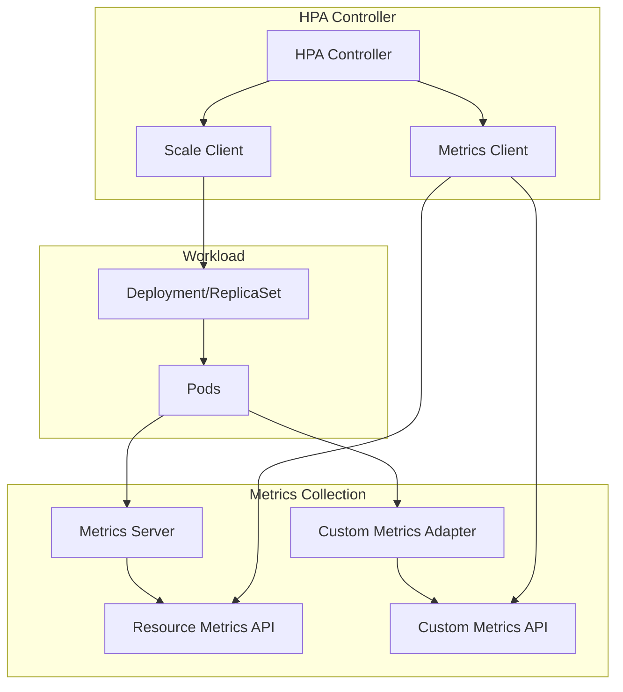
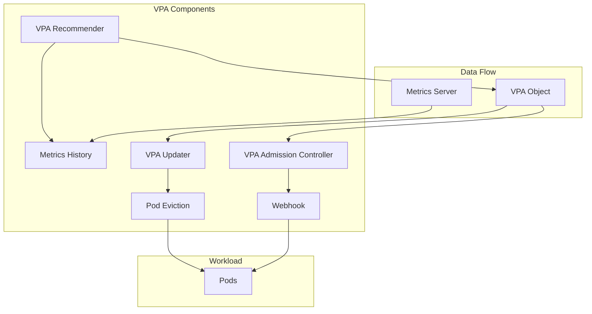
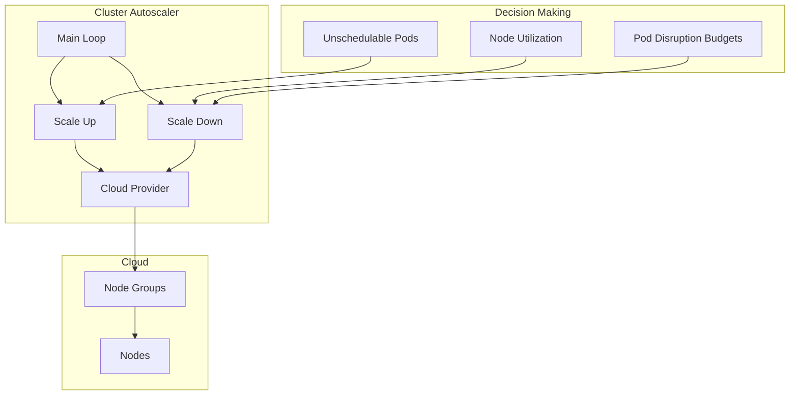

# Kubernetes Autoscaling Internals: HPA, VPA & Cluster Autoscaler

## Table of Contents
- [Kubernetes Autoscaling Internals: HPA, VPA \& Cluster Autoscaler](#kubernetes-autoscaling-internals-hpa-vpa--cluster-autoscaler)
  - [Table of Contents](#table-of-contents)
  - [Overview](#overview)
  - [Horizontal Pod Autoscaler (HPA)](#horizontal-pod-autoscaler-hpa)
    - [HPA Architecture](#hpa-architecture)
    - [HPA API Object](#hpa-api-object)
    - [HPA Controller Implementation](#hpa-controller-implementation)
    - [Replica Calculator](#replica-calculator)
    - [Scaling Behavior](#scaling-behavior)
  - [Vertical Pod Autoscaler (VPA)](#vertical-pod-autoscaler-vpa)
    - [VPA Architecture](#vpa-architecture)
    - [VPA API Object](#vpa-api-object)
    - [VPA Recommender](#vpa-recommender)
    - [VPA Updater](#vpa-updater)
  - [Cluster Autoscaler](#cluster-autoscaler)
    - [Cluster Autoscaler Architecture](#cluster-autoscaler-architecture)
    - [Scale Up Logic](#scale-up-logic)
    - [Scale Down Logic](#scale-down-logic)
  - [Metrics Pipeline](#metrics-pipeline)
    - [Metrics Server](#metrics-server)
  - [Code References](#code-references)
    - [Key Files](#key-files)
    - [Best Practices](#best-practices)
    - [Troubleshooting](#troubleshooting)

## Overview

Kubernetes provides three types of autoscaling to optimize resource utilization and application performance.

**Autoscaling Types:**
1. **Horizontal Pod Autoscaler (HPA)** - Scales number of pod replicas
2. **Vertical Pod Autoscaler (VPA)** - Adjusts pod resource requests/limits
3. **Cluster Autoscaler (CA)** - Scales number of cluster nodes

**Key Components:**
- Metrics Server - Collects resource metrics
- Custom Metrics API - Exposes custom metrics
- HPA Controller - Manages horizontal scaling
- VPA Recommender - Calculates resource recommendations
- Cluster Autoscaler - Manages node scaling

## Horizontal Pod Autoscaler (HPA)

HPA automatically scales the number of pods based on observed metrics.

### HPA Architecture



### HPA API Object

```go
type HorizontalPodAutoscaler struct {
    metav1.TypeMeta
    metav1.ObjectMeta
    
    Spec HorizontalPodAutoscalerSpec
    Status HorizontalPodAutoscalerStatus
}

type HorizontalPodAutoscalerSpec struct {
    // ScaleTargetRef points to the target resource to scale
    ScaleTargetRef CrossVersionObjectReference
    
    // MinReplicas is the lower limit for the number of replicas
    MinReplicas *int32
    
    // MaxReplicas is the upper limit for the number of replicas
    MaxReplicas int32
    
    // Metrics contains the specifications for which to use to calculate the desired replica count
    Metrics []MetricSpec
    
    // Behavior configures the scaling behavior
    Behavior *HorizontalPodAutoscalerBehavior
}

type MetricSpec struct {
    // Type is the type of metric source
    Type MetricSourceType
    
    // Object refers to a metric describing a single kubernetes object
    Object *ObjectMetricSource
    
    // Pods refers to a metric describing each pod
    Pods *PodsMetricSource
    
    // Resource refers to a resource metric
    Resource *ResourceMetricSource
    
    // ContainerResource refers to a resource metric of a container
    ContainerResource *ContainerResourceMetricSource
    
    // External refers to a global metric
    External *ExternalMetricSource
}

// Example HPA
apiVersion: autoscaling/v2
kind: HorizontalPodAutoscaler
metadata:
  name: php-apache
spec:
  scaleTargetRef:
    apiVersion: apps/v1
    kind: Deployment
    name: php-apache
  minReplicas: 1
  maxReplicas: 10
  metrics:
  - type: Resource
    resource:
      name: cpu
      target:
        type: Utilization
        averageUtilization: 50
  - type: Pods
    pods:
      metric:
        name: packets-per-second
      target:
        type: AverageValue
        averageValue: 1k
  behavior:
    scaleDown:
      stabilizationWindowSeconds: 300
      policies:
      - type: Percent
        value: 50
        periodSeconds: 15
      - type: Pods
        value: 4
        periodSeconds: 15
      selectPolicy: Min
    scaleUp:
      stabilizationWindowSeconds: 0
      policies:
      - type: Percent
        value: 100
        periodSeconds: 15
      - type: Pods
        value: 4
        periodSeconds: 15
      selectPolicy: Max
```

### HPA Controller Implementation

```go
type HorizontalController struct {
    scaleNamespacer scaleclient.ScalesGetter
    hpaNamespacer   autoscalingclient.HorizontalPodAutoscalersGetter
    mapper          apimeta.RESTMapper
    
    replicaCalc   *ReplicaCalculator
    eventRecorder record.EventRecorder
    
    // Metrics clients
    metricsClient metricsclient.MetricsClient
    
    // Queue for HPAs to sync
    queue workqueue.RateLimitingInterface
}

func (a *HorizontalController) reconcileAutoscaler(ctx context.Context, key string) error {
    namespace, name, err := cache.SplitMetaNamespaceKey(key)
    if err != nil {
        return err
    }
    
    // Get HPA
    hpa, err := a.hpaNamespacer.HorizontalPodAutoscalers(namespace).Get(ctx, name, metav1.GetOptions{})
    if err != nil {
        return err
    }
    
    // Get scale subresource
    scale, targetGR, err := a.getScaleForResourceMappings(ctx, hpa.Namespace, hpa.Spec.ScaleTargetRef)
    if err != nil {
        return err
    }
    
    currentReplicas := scale.Spec.Replicas
    
    // Calculate desired replicas
    desiredReplicas, metricStatuses, err := a.computeReplicasForMetrics(ctx, hpa, scale, hpa.Spec.Metrics)
    if err != nil {
        return err
    }
    
    // Apply min/max constraints
    desiredReplicas = a.normalizeDesiredReplicas(hpa, currentReplicas, desiredReplicas)
    
    // Check if scaling is needed
    rescale := desiredReplicas != currentReplicas
    
    if rescale {
        // Apply scaling behavior
        desiredReplicas = a.applyScalingBehavior(hpa, currentReplicas, desiredReplicas)
        
        // Update scale
        scale.Spec.Replicas = desiredReplicas
        _, err = a.scaleNamespacer.Scales(namespace).Update(ctx, targetGR, scale, metav1.UpdateOptions{})
        if err != nil {
            return err
        }
        
        a.eventRecorder.Eventf(hpa, v1.EventTypeNormal, "SuccessfulRescale",
            "New size: %d; reason: %s", desiredReplicas, "metrics changed")
    }
    
    // Update HPA status
    return a.updateStatus(ctx, hpa, currentReplicas, desiredReplicas, metricStatuses, rescale)
}

func (a *HorizontalController) computeReplicasForMetrics(
    ctx context.Context,
    hpa *autoscalingv2.HorizontalPodAutoscaler,
    scale *autoscalingv1.Scale,
    metricSpecs []autoscalingv2.MetricSpec,
) (int32, []autoscalingv2.MetricStatus, error) {
    
    currentReplicas := scale.Spec.Replicas
    
    var (
        statuses         []autoscalingv2.MetricStatus
        invalidMetrics   int
        invalidMetricsSum int32
    )
    
    // Calculate desired replicas for each metric
    for i, metricSpec := range metricSpecs {
        replicaCount, metricStatus, err := a.computeReplicasForMetric(ctx, hpa, metricSpec, currentReplicas)
        
        if err != nil {
            if invalidMetrics+1 < len(metricSpecs) {
                invalidMetrics++
                invalidMetricsSum += replicaCount
                continue
            }
            return 0, nil, err
        }
        
        statuses = append(statuses, metricStatus)
        
        if i == 0 || replicaCount > invalidMetricsSum {
            invalidMetricsSum = replicaCount
        }
    }
    
    return invalidMetricsSum, statuses, nil
}

func (a *HorizontalController) computeReplicasForMetric(
    ctx context.Context,
    hpa *autoscalingv2.HorizontalPodAutoscaler,
    spec autoscalingv2.MetricSpec,
    currentReplicas int32,
) (int32, autoscalingv2.MetricStatus, error) {
    
    switch spec.Type {
    case autoscalingv2.ResourceMetricSourceType:
        return a.computeReplicasForResourceMetric(ctx, hpa, spec.Resource, currentReplicas)
        
    case autoscalingv2.PodsMetricSourceType:
        return a.computeReplicasForPodsMetric(ctx, hpa, spec.Pods, currentReplicas)
        
    case autoscalingv2.ObjectMetricSourceType:
        return a.computeReplicasForObjectMetric(ctx, hpa, spec.Object, currentReplicas)
        
    case autoscalingv2.ExternalMetricSourceType:
        return a.computeReplicasForExternalMetric(ctx, hpa, spec.External, currentReplicas)
        
    case autoscalingv2.ContainerResourceMetricSourceType:
        return a.computeReplicasForContainerResourceMetric(ctx, hpa, spec.ContainerResource, currentReplicas)
        
    default:
        return 0, autoscalingv2.MetricStatus{}, fmt.Errorf("unknown metric source type %q", spec.Type)
    }
}
```

### Replica Calculator

```go
type ReplicaCalculator struct {
    metricsClient metricsclient.MetricsClient
    podLister     corelisters.PodLister
}

func (c *ReplicaCalculator) GetResourceReplicas(
    ctx context.Context,
    currentReplicas int32,
    targetUtilization int32,
    resource v1.ResourceName,
    namespace string,
    selector labels.Selector,
) (int32, int64, error) {
    
    // Get metrics for all pods
    metrics, err := c.metricsClient.GetResourceMetric(ctx, resource, namespace, selector)
    if err != nil {
        return 0, 0, err
    }
    
    // Get pod list
    podList, err := c.podLister.Pods(namespace).List(selector)
    if err != nil {
        return 0, 0, err
    }
    
    // Filter ready pods
    readyPods := filterReadyPods(podList)
    
    // Calculate total requests
    requests := make(map[string]int64)
    for _, pod := range readyPods {
        podRequest := calculatePodResourceRequest(pod, resource)
        requests[pod.Name] = podRequest
    }
    
    // Calculate utilization
    usageRatio, currentUtilization := c.calculateUsageRatio(metrics, requests)
    
    // Calculate desired replicas
    // desiredReplicas = ceil(currentReplicas * (currentUtilization / targetUtilization))
    desiredReplicas := int32(math.Ceil(float64(currentReplicas) * usageRatio / float64(targetUtilization) * 100))
    
    return desiredReplicas, currentUtilization, nil
}

func (c *ReplicaCalculator) calculateUsageRatio(
    metrics metricsclient.PodMetricsInfo,
    requests map[string]int64,
) (float64, int64) {
    
    var sum int64
    var count int
    
    for podName, metric := range metrics {
        request, ok := requests[podName]
        if !ok || request == 0 {
            continue
        }
        
        sum += (metric.Value * 100) / request
        count++
    }
    
    if count == 0 {
        return 0, 0
    }
    
    currentUtilization := sum / int64(count)
    return float64(currentUtilization), currentUtilization
}
```

### Scaling Behavior

```go
type HorizontalPodAutoscalerBehavior struct {
    // ScaleUp is scaling policy for scaling up
    ScaleUp *HPAScalingRules
    
    // ScaleDown is scaling policy for scaling down
    ScaleDown *HPAScalingRules
}

type HPAScalingRules struct {
    // StabilizationWindowSeconds is the number of seconds for which past recommendations should be considered
    StabilizationWindowSeconds *int32
    
    // SelectPolicy is used to specify which policy should be used
    SelectPolicy *ScalingPolicySelect
    
    // Policies is a list of potential scaling polices
    Policies []HPAScalingPolicy
}

type HPAScalingPolicy struct {
    // Type is used to specify the scaling policy
    Type HPAScalingPolicyType
    
    // Value contains the amount of change which is permitted by the policy
    Value int32
    
    // PeriodSeconds specifies the window of time for which the policy should hold true
    PeriodSeconds int32
}

func (a *HorizontalController) applyScalingBehavior(
    hpa *autoscalingv2.HorizontalPodAutoscaler,
    currentReplicas int32,
    desiredReplicas int32,
) int32 {
    
    var behavior *autoscalingv2.HPAScalingRules
    
    if desiredReplicas > currentReplicas {
        behavior = hpa.Spec.Behavior.ScaleUp
    } else {
        behavior = hpa.Spec.Behavior.ScaleDown
    }
    
    if behavior == nil {
        return desiredReplicas
    }
    
    // Apply stabilization window
    if behavior.StabilizationWindowSeconds != nil {
        stabilizedReplicas := a.getStabilizedRecommendation(hpa, desiredReplicas, *behavior.StabilizationWindowSeconds)
        if desiredReplicas > currentReplicas {
            desiredReplicas = max(desiredReplicas, stabilizedReplicas)
        } else {
            desiredReplicas = min(desiredReplicas, stabilizedReplicas)
        }
    }
    
    // Apply scaling policies
    if len(behavior.Policies) > 0 {
        desiredReplicas = a.applyScalingPolicies(behavior, currentReplicas, desiredReplicas)
    }
    
    return desiredReplicas
}

func (a *HorizontalController) applyScalingPolicies(
    rules *autoscalingv2.HPAScalingRules,
    currentReplicas int32,
    desiredReplicas int32,
) int32 {
    
    var candidates []int32
    
    for _, policy := range rules.Policies {
        var candidate int32
        
        switch policy.Type {
        case autoscalingv2.PodsScalingPolicy:
            if desiredReplicas > currentReplicas {
                candidate = currentReplicas + policy.Value
            } else {
                candidate = currentReplicas - policy.Value
            }
            
        case autoscalingv2.PercentScalingPolicy:
            change := int32(float64(currentReplicas) * float64(policy.Value) / 100.0)
            if desiredReplicas > currentReplicas {
                candidate = currentReplicas + change
            } else {
                candidate = currentReplicas - change
            }
        }
        
        candidates = append(candidates, candidate)
    }
    
    // Select based on policy
    if rules.SelectPolicy != nil && *rules.SelectPolicy == autoscalingv2.MaxPolicySelect {
        return maxInt32(candidates...)
    }
    return minInt32(candidates...)
}
```

## Vertical Pod Autoscaler (VPA)

VPA automatically adjusts CPU and memory requests/limits for containers.

### VPA Architecture



### VPA API Object

```go
type VerticalPodAutoscaler struct {
    metav1.TypeMeta
    metav1.ObjectMeta
    
    Spec VerticalPodAutoscalerSpec
    Status VerticalPodAutoscalerStatus
}

type VerticalPodAutoscalerSpec struct {
    // TargetRef points to the controller managing the set of pods
    TargetRef *autoscalingv1.CrossVersionObjectReference
    
    // UpdatePolicy describes how to apply recommendations
    UpdatePolicy *PodUpdatePolicy
    
    // ResourcePolicy controls how the autoscaler computes recommended resources
    ResourcePolicy *PodResourcePolicy
    
    // Recommenders is a list of recommenders to use
    Recommenders []*VerticalPodAutoscalerRecommenderSelector
}

type PodUpdatePolicy struct {
    // UpdateMode controls when autoscaler applies changes
    UpdateMode *UpdateMode
    
    // MinReplicas is the minimum number of replicas
    MinReplicas *int32
}

type UpdateMode string

const (
    // UpdateModeOff means VPA only provides recommendations
    UpdateModeOff UpdateMode = "Off"
    
    // UpdateModeInitial means VPA only assigns resources on pod creation
    UpdateModeInitial UpdateMode = "Initial"
    
    // UpdateModeRecreate means VPA assigns resources on pod creation and updates by evicting pods
    UpdateModeRecreate UpdateMode = "Recreate"
    
    // UpdateModeAuto means VPA assigns resources on pod creation and updates by evicting pods when safe
    UpdateModeAuto UpdateMode = "Auto"
)

// Example VPA
apiVersion: autoscaling.k8s.io/v1
kind: VerticalPodAutoscaler
metadata:
  name: my-app-vpa
spec:
  targetRef:
    apiVersion: "apps/v1"
    kind: Deployment
    name: my-app
  updatePolicy:
    updateMode: "Auto"
  resourcePolicy:
    containerPolicies:
    - containerName: '*'
      minAllowed:
        cpu: 100m
        memory: 50Mi
      maxAllowed:
        cpu: 1
        memory: 500Mi
      controlledResources: ["cpu", "memory"]
```

### VPA Recommender

```go
type Recommender struct {
    clusterState *model.ClusterState
    checkpointWriter CheckpointWriter
    useCheckpoints bool
}

func (r *Recommender) RunOnce() {
    // Update cluster state from metrics
    r.clusterState.Update()
    
    // Get all VPAs
    vpas := r.clusterState.GetVPAs()
    
    for _, vpa := range vpas {
        // Get pods for VPA target
        pods := r.clusterState.GetPodsForVPA(vpa)
        
        // Calculate recommendations
        recommendation := r.calculateRecommendation(vpa, pods)
        
        // Update VPA with recommendation
        r.updateVPARecommendation(vpa, recommendation)
        
        // Save checkpoint
        if r.useCheckpoints {
            r.checkpointWriter.StoreCheckpoint(vpa, r.clusterState)
        }
    }
}

func (r *Recommender) calculateRecommendation(
    vpa *model.Vpa,
    pods []*model.PodState,
) *vpa_types.RecommendedPodResources {
    
    var containerRecommendations []vpa_types.RecommendedContainerResources
    
    // Group samples by container
    containerSamples := r.groupSamplesByContainer(pods)
    
    for containerName, samples := range containerSamples {
        // Get resource policy for container
        policy := vpa.GetContainerPolicy(containerName)
        
        // Calculate recommendations for each resource
        cpuRecommendation := r.calculateResourceRecommendation(samples.CPU, policy.CPU)
        memoryRecommendation := r.calculateResourceRecommendation(samples.Memory, policy.Memory)
        
        containerRecommendations = append(containerRecommendations, vpa_types.RecommendedContainerResources{
            ContainerName: containerName,
            Target: v1.ResourceList{
                v1.ResourceCPU:    cpuRecommendation.Target,
                v1.ResourceMemory: memoryRecommendation.Target,
            },
            LowerBound: v1.ResourceList{
                v1.ResourceCPU:    cpuRecommendation.LowerBound,
                v1.ResourceMemory: memoryRecommendation.LowerBound,
            },
            UpperBound: v1.ResourceList{
                v1.ResourceCPU:    cpuRecommendation.UpperBound,
                v1.ResourceMemory: memoryRecommendation.UpperBound,
            },
            UncappedTarget: v1.ResourceList{
                v1.ResourceCPU:    cpuRecommendation.UncappedTarget,
                v1.ResourceMemory: memoryRecommendation.UncappedTarget,
            },
        })
    }
    
    return &vpa_types.RecommendedPodResources{
        ContainerRecommendations: containerRecommendations,
    }
}

func (r *Recommender) calculateResourceRecommendation(
    samples []ResourceSample,
    policy *ResourcePolicy,
) ResourceRecommendation {
    
    if len(samples) == 0 {
        return ResourceRecommendation{}
    }
    
    // Calculate percentiles
    p50 := percentile(samples, 0.50)
    p90 := percentile(samples, 0.90)
    p95 := percentile(samples, 0.95)
    p99 := percentile(samples, 0.99)
    
    // Target is based on 90th percentile with safety margin
    target := p90 * 1.15
    
    // Lower bound is 50th percentile
    lowerBound := p50
    
    // Upper bound is 95th percentile with margin
    upperBound := p95 * 1.2
    
    // Apply policy constraints
    if policy != nil {
        if policy.MinAllowed != nil {
            target = max(target, *policy.MinAllowed)
            lowerBound = max(lowerBound, *policy.MinAllowed)
        }
        if policy.MaxAllowed != nil {
            target = min(target, *policy.MaxAllowed)
            upperBound = min(upperBound, *policy.MaxAllowed)
        }
    }
    
    return ResourceRecommendation{
        Target:         target,
        LowerBound:     lowerBound,
        UpperBound:     upperBound,
        UncappedTarget: p90 * 1.15,
    }
}
```

### VPA Updater

```go
type Updater struct {
    vpaLister       vpalisters.VerticalPodAutoscalerLister
    podLister       corelisters.PodLister
    evictionFactory EvictionFactory
}

func (u *Updater) RunOnce() {
    // Get all VPAs
    vpas, err := u.vpaLister.List(labels.Everything())
    if err != nil {
        return
    }
    
    for _, vpa := range vpas {
        // Skip if update mode is Off or Initial
        if vpa.Spec.UpdatePolicy == nil ||
           *vpa.Spec.UpdatePolicy.UpdateMode == vpa_types.UpdateModeOff ||
           *vpa.Spec.UpdatePolicy.UpdateMode == vpa_types.UpdateModeInitial {
            continue
        }
        
        // Get pods for VPA
        pods := u.getPodsForVPA(vpa)
        
        // Find pods that need updates
        podsToUpdate := u.findPodsToUpdate(vpa, pods)
        
        // Evict pods
        for _, pod := range podsToUpdate {
            if u.canEvictPod(pod, vpa) {
                u.evictPod(pod)
            }
        }
    }
}

func (u *Updater) findPodsToUpdate(
    vpa *vpa_types.VerticalPodAutoscaler,
    pods []*v1.Pod,
) []*v1.Pod {
    
    var podsToUpdate []*v1.Pod
    
    for _, pod := range pods {
        if u.podNeedsUpdate(vpa, pod) {
            podsToUpdate = append(podsToUpdate, pod)
        }
    }
    
    return podsToUpdate
}

func (u *Updater) podNeedsUpdate(
    vpa *vpa_types.VerticalPodAutoscaler,
    pod *v1.Pod,
) bool {
    
    if vpa.Status.Recommendation == nil {
        return false
    }
    
    for _, container := range pod.Spec.Containers {
        recommendation := u.getContainerRecommendation(vpa, container.Name)
        if recommendation == nil {
            continue
        }
        
        // Check if current resources are outside bounds
        currentCPU := container.Resources.Requests[v1.ResourceCPU]
        currentMemory := container.Resources.Requests[v1.ResourceMemory]
        
        targetCPU := recommendation.Target[v1.ResourceCPU]
        targetMemory := recommendation.Target[v1.ResourceMemory]
        
        lowerBoundCPU := recommendation.LowerBound[v1.ResourceCPU]
        lowerBoundMemory := recommendation.LowerBound[v1.ResourceMemory]
        
        upperBoundCPU := recommendation.UpperBound[v1.ResourceCPU]
        upperBoundMemory := recommendation.UpperBound[v1.ResourceMemory]
        
        // Check if outside bounds
        if currentCPU.Cmp(lowerBoundCPU) < 0 || currentCPU.Cmp(upperBoundCPU) > 0 ||
           currentMemory.Cmp(lowerBoundMemory) < 0 || currentMemory.Cmp(upperBoundMemory) > 0 {
            return true
        }
        
        // Check if significantly different from target
        cpuDiff := float64(currentCPU.MilliValue()-targetCPU.MilliValue()) / float64(targetCPU.MilliValue())
        memoryDiff := float64(currentMemory.Value()-targetMemory.Value()) / float64(targetMemory.Value())
        
        if math.Abs(cpuDiff) > 0.1 || math.Abs(memoryDiff) > 0.1 {
            return true
        }
    }
    
    return false
}
```

## Cluster Autoscaler

Cluster Autoscaler adjusts the number of nodes in the cluster.

### Cluster Autoscaler Architecture



### Scale Up Logic

```go
type ScaleUp struct {
    context              *context.AutoscalingContext
    processors           *processors.AutoscalingProcessors
    clusterStateRegistry *clusterstate.ClusterStateRegistry
    estimator            Estimator
}

func (s *ScaleUp) ScaleUp(
    unschedulablePods []*apiv1.Pod,
    nodes []*apiv1.Node,
    daemonSets []*appsv1.DaemonSet,
) (*status.ScaleUpStatus, errors.AutoscalerError) {
    
    // Group unschedulable pods by reason
    podGroups := s.groupPodsBySchedulingConstraints(unschedulablePods)
    
    // Find best node groups for each pod group
    var expansionOptions []expander.Option
    
    for _, podGroup := range podGroups {
        // Get node groups that can accommodate pods
        nodeGroups := s.findNodeGroupsForPods(podGroup.Pods)
        
        for _, nodeGroup := range nodeGroups {
            // Estimate how many nodes needed
            estimatedNodes := s.estimator.Estimate(podGroup.Pods, nodeGroup)
            
            expansionOptions = append(expansionOptions, expander.Option{
                NodeGroup: nodeGroup,
                NodeCount: estimatedNodes,
                Pods:      podGroup.Pods,
            })
        }
    }
    
    if len(expansionOptions) == 0 {
        return &status.ScaleUpStatus{}, nil
    }
    
    // Select best option using expander strategy
    bestOption := s.processors.NodeGroupListProcessor.SelectOption(expansionOptions)
    
    // Increase node group size
    err := bestOption.NodeGroup.IncreaseSize(bestOption.NodeCount)
    if err != nil {
        return nil, errors.ToAutoscalerError(errors.CloudProviderError, err)
    }
    
    return &status.ScaleUpStatus{
        ScaledUp:         true,
        ScaleUpInfos:     []status.ScaleUpInfo{{NodeGroup: bestOption.NodeGroup, NewSize: bestOption.NodeCount}},
        PodsTriggeredScaleUp: bestOption.Pods,
    }, nil
}

func (s *ScaleUp) findNodeGroupsForPods(pods []*apiv1.Pod) []cloudprovider.NodeGroup {
    var nodeGroups []cloudprovider.NodeGroup
    
    allNodeGroups := s.context.CloudProvider.NodeGroups()
    
    for _, nodeGroup := range allNodeGroups {
        // Check if node group can be scaled up
        if nodeGroup.MaxSize() <= nodeGroup.TargetSize() {
            continue
        }
        
        // Create template node
        templateNode := s.getNodeTemplate(nodeGroup)
        
        // Check if pods can be scheduled on this node type
        canSchedule := true
        for _, pod := range pods {
            if !s.canSchedulePod(pod, templateNode) {
                canSchedule = false
                break
            }
        }
        
        if canSchedule {
            nodeGroups = append(nodeGroups, nodeGroup)
        }
    }
    
    return nodeGroups
}
```

### Scale Down Logic

```go
type ScaleDown struct {
    context              *context.AutoscalingContext
    processors           *processors.AutoscalingProcessors
    clusterStateRegistry *clusterstate.ClusterStateRegistry
    unneededNodes        map[string]time.Time
}

func (s *ScaleDown) ScaleDown(
    nodes []*apiv1.Node,
    pods []*apiv1.Pod,
) (*status.ScaleDownStatus, errors.AutoscalerError) {
    
    // Find candidates for scale down
    candidates := s.findScaleDownCandidates(nodes, pods)
    
    if len(candidates) == 0 {
        return &status.ScaleDownStatus{}, nil
    }
    
    // Check if nodes have been unneeded long enough
    now := time.Now()
    var nodesToRemove []*apiv1.Node
    
    for _, node := range candidates {
        unneededSince, found := s.unneededNodes[node.Name]
        if !found {
            s.unneededNodes[node.Name] = now
            continue
        }
        
        if now.Sub(unneededSince) > s.context.ScaleDownUnneededTime {
            nodesToRemove = append(nodesToRemove, node)
        }
    }
    
    if len(nodesToRemove) == 0 {
        return &status.ScaleDownStatus{}, nil
    }
    
    // Remove nodes
    for _, node := range nodesToRemove {
        // Drain node
        err := s.drainNode(node, pods)
        if err != nil {
            continue
        }
        
        // Delete node from cloud provider
        nodeGroup, err := s.context.CloudProvider.NodeGroupForNode(node)
        if err != nil {
            continue
        }
        
        err = nodeGroup.DeleteNodes([]*apiv1.Node{node})
        if err != nil {
            continue
        }
        
        delete(s.unneededNodes, node.Name)
    }
    
    return &status.ScaleDownStatus{
        ScaledDown: true,
        RemovedNodes: nodesToRemove,
    }, nil
}

func (s *ScaleDown) findScaleDownCandidates(
    nodes []*apiv1.Node,
    pods []*apiv1.Pod,
) []*apiv1.Node {
    
    var candidates []*apiv1.Node
    
    for _, node := range nodes {
        // Skip master nodes
        if s.isMasterNode(node) {
            continue
        }
        
        // Check node utilization
        utilization := s.calculateNodeUtilization(node, pods)
        if utilization > s.context.ScaleDownUtilizationThreshold {
            continue
        }
        
        // Check if pods can be moved
        podsOnNode := s.getPodsOnNode(node, pods)
        if !s.canMovePods(podsOnNode, nodes) {
            continue
        }
        
        // Check PDB constraints
        if !s.checkPodDisruptionBudgets(podsOnNode) {
            continue
        }
        
        candidates = append(candidates, node)
    }
    
    return candidates
}
```

## Metrics Pipeline

### Metrics Server

```go
type MetricsServer struct {
    kubeletClient KubeletInterface
    nodeLister    corelisters.NodeLister
    podLister     corelisters.PodLister
}

func (s *MetricsServer) CollectMetrics() {
    // Get all nodes
    nodes, err := s.nodeLister.List(labels.Everything())
    if err != nil {
        return
    }
    
    for _, node := range nodes {
        // Collect node metrics
        nodeMetrics, err := s.kubeletClient.GetNodeMetrics(node.Name)
        if err != nil {
            continue
        }
        
        s.storeNodeMetrics(node.Name, nodeMetrics)
        
        // Collect pod metrics
        podMetrics, err := s.kubeletClient.GetPodMetrics(node.Name)
        if err != nil {
            continue
        }
        
        for _, podMetric := range podMetrics {
            s.storePodMetrics(podMetric)
        }
    }
}
```

## Code References

### Key Files

| Component          | Location                                | Purpose                    |
| ------------------ | --------------------------------------- | -------------------------- |
| HPA Controller     | `pkg/controller/podautoscaler/`         | Horizontal pod autoscaling |
| Metrics Client     | `pkg/controller/podautoscaler/metrics/` | Metrics collection         |
| VPA                | External repo: `kubernetes/autoscaler`  | Vertical pod autoscaling   |
| Cluster Autoscaler | External repo: `kubernetes/autoscaler`  | Node autoscaling           |

### Best Practices

1. **HPA**: Set appropriate CPU/memory targets (50-80%)
2. **VPA**: Use with stateless applications, test in non-production first
3. **Cluster Autoscaler**: Configure PDBs to prevent disruption
4. **Metrics**: Ensure metrics-server is running and healthy
5. **Limits**: Set resource limits to prevent runaway scaling
6. **Monitoring**: Monitor autoscaling decisions and adjust policies

### Troubleshooting

```bash
# Check HPA status
kubectl get hpa
kubectl describe hpa my-hpa

# Check metrics
kubectl top nodes
kubectl top pods

# Check VPA recommendations
kubectl get vpa
kubectl describe vpa my-vpa

# Check cluster autoscaler logs
kubectl logs -n kube-system deployment/cluster-autoscaler

# Debug metrics server
kubectl get apiservice v1beta1.metrics.k8s.io
kubectl logs -n kube-system deployment/metrics-server
```

---

**Next**: See [INTERNALS_OBSERVABILITY.md](./INTERNALS_OBSERVABILITY.md) for deep dive into metrics, logging, and distributed tracing.

