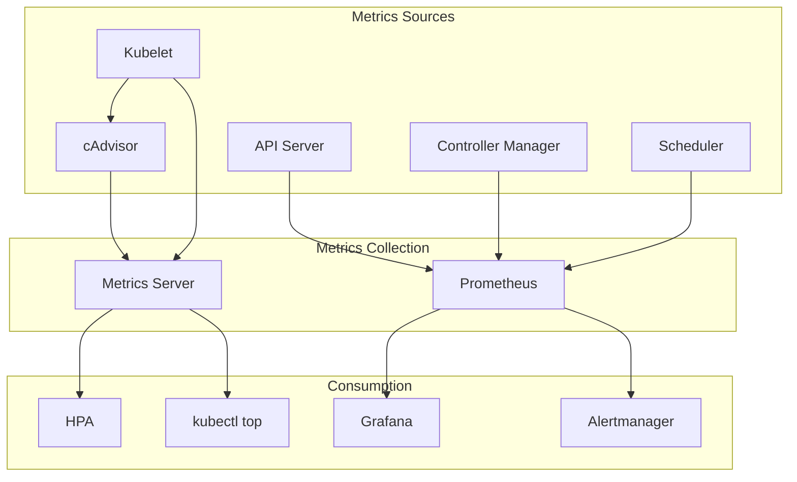

# Kubernetes Observability Internals: Metrics, Logging & Tracing

## Table of Contents

- [Overview](#overview)
- [Metrics Architecture](#metrics-architecture)
- [Logging System](#logging-system)
- [Distributed Tracing](#distributed-tracing)
- [Health Checks](#health-checks)
- [Audit Logging](#audit-logging)
- [Events System](#events-system)
- [Monitoring Best Practices](#monitoring-best-practices)
- [Code References](#code-references)

## Overview

Kubernetes observability provides visibility into cluster operations through metrics, logs, and traces.

**Observability Pillars:**

1. **Metrics** - Quantitative measurements over time
2. **Logs** - Discrete event records
3. **Traces** - Request flow through distributed system
4. **Events** - Kubernetes object state changes

**Key Components:**

- Metrics Server - Resource metrics
- Prometheus - Metrics collection and alerting
- Component Logs - Structured logging
- OpenTelemetry - Distributed tracing
- Event Recorder - Kubernetes events

## Metrics Architecture

### Metrics Pipeline



### Metrics Server

```go
type MetricsServer struct {
    // Kubelet client for collecting metrics
    kubeletClient KubeletMetricsGetter

    // Node lister
    nodeLister corelisters.NodeLister

    // Pod lister
    podLister corelisters.PodLister

    // Storage for metrics
    storage *storage.Storage
}

func (s *MetricsServer) CollectNodeMetrics(ctx context.Context) error {
    nodes, err := s.nodeLister.List(labels.Everything())
    if err != nil {
        return err
    }

    var nodeMetrics []metricsapi.NodeMetrics

    for _, node := range nodes {
        // Get summary from kubelet
        summary, err := s.kubeletClient.GetSummary(ctx, node.Name)
        if err != nil {
            klog.Errorf("Failed to get summary for node %s: %v", node.Name, err)
            continue
        }

        // Convert to node metrics
        metrics := metricsapi.NodeMetrics{
            ObjectMeta: metav1.ObjectMeta{
                Name: node.Name,
                Labels: node.Labels,
            },
            Timestamp: metav1.Time{Time: summary.Node.StartTime.Time},
            Window:    metav1.Duration{Duration: time.Minute},
            Usage: v1.ResourceList{
                v1.ResourceCPU: *resource.NewMilliQuantity(
                    int64(*summary.Node.CPU.UsageNanoCores)/1000000,
                    resource.DecimalSI,
                ),
                v1.ResourceMemory: *resource.NewQuantity(
                    int64(*summary.Node.Memory.WorkingSetBytes),
                    resource.BinarySI,
                ),
            },
        }

        nodeMetrics = append(nodeMetrics, metrics)
    }

    // Store metrics
    return s.storage.StoreNodeMetrics(nodeMetrics)
}

func (s *MetricsServer) CollectPodMetrics(ctx context.Context) error {
    nodes, err := s.nodeLister.List(labels.Everything())
    if err != nil {
        return err
    }

    var podMetrics []metricsapi.PodMetrics

    for _, node := range nodes {
        // Get summary from kubelet
        summary, err := s.kubeletClient.GetSummary(ctx, node.Name)
        if err != nil {
            continue
        }

        // Process each pod
        for _, podStats := range summary.Pods {
            var containerMetrics []metricsapi.ContainerMetrics

            for _, containerStats := range podStats.Containers {
                if containerStats.CPU == nil || containerStats.Memory == nil {
                    continue
                }

                metrics := metricsapi.ContainerMetrics{
                    Name: containerStats.Name,
                    Usage: v1.ResourceList{
                        v1.ResourceCPU: *resource.NewMilliQuantity(
                            int64(*containerStats.CPU.UsageNanoCores)/1000000,
                            resource.DecimalSI,
                        ),
                        v1.ResourceMemory: *resource.NewQuantity(
                            int64(*containerStats.Memory.WorkingSetBytes),
                            resource.BinarySI,
                        ),
                    },
                }

                containerMetrics = append(containerMetrics, metrics)
            }

            podMetrics = append(podMetrics, metricsapi.PodMetrics{
                ObjectMeta: metav1.ObjectMeta{
                    Name:      podStats.PodRef.Name,
                    Namespace: podStats.PodRef.Namespace,
                },
                Timestamp:  metav1.Time{Time: podStats.StartTime.Time},
                Window:     metav1.Duration{Duration: time.Minute},
                Containers: containerMetrics,
            })
        }
    }

    // Store metrics
    return s.storage.StorePodMetrics(podMetrics)
}
```

### Prometheus Metrics

```go
// Component metrics registration
func RegisterMetrics() {
    // API Server metrics
    prometheus.MustRegister(apiserver.RequestCounter)
    prometheus.MustRegister(apiserver.RequestLatencies)
    prometheus.MustRegister(apiserver.RequestDuration)

    // Controller metrics
    prometheus.MustRegister(controller.WorkQueueDepth)
    prometheus.MustRegister(controller.WorkQueueLatency)
    prometheus.MustRegister(controller.ReconcileCount)

    // Scheduler metrics
    prometheus.MustRegister(scheduler.SchedulingLatency)
    prometheus.MustRegister(scheduler.SchedulingAttempts)
    prometheus.MustRegister(scheduler.PodSchedulingDuration)
}

// Example: API Server request metrics
var (
    RequestCounter = prometheus.NewCounterVec(
        prometheus.CounterOpts{
            Name: "apiserver_request_total",
            Help: "Counter of apiserver requests broken out for each verb, API resource, client, and HTTP response code.",
        },
        []string{"verb", "resource", "subresource", "scope", "component", "code"},
    )

    RequestLatencies = prometheus.NewHistogramVec(
        prometheus.HistogramOpts{
            Name: "apiserver_request_duration_seconds",
            Help: "Response latency distribution in seconds for each verb, resource and subresource.",
            Buckets: prometheus.DefBuckets,
        },
        []string{"verb", "resource", "subresource", "scope", "component"},
    )
)

// Instrumenting code
func (h *Handler) ServeHTTP(w http.ResponseWriter, req *http.Request) {
    start := time.Now()

    // Process request
    h.handler.ServeHTTP(w, req)

    // Record metrics
    duration := time.Since(start)

    RequestCounter.WithLabelValues(
        req.Method,
        h.resource,
        h.subresource,
        h.scope,
        h.component,
        strconv.Itoa(w.StatusCode),
    ).Inc()

    RequestLatencies.WithLabelValues(
        req.Method,
        h.resource,
        h.subresource,
        h.scope,
        h.component,
    ).Observe(duration.Seconds())
}
```

### Custom Metrics API

```go
// Custom metrics provider interface
type CustomMetricsProvider interface {
    // GetMetricByName fetches a particular metric for a particular object
    GetMetricByName(ctx context.Context, name types.NamespacedName, info provider.CustomMetricInfo, metricSelector labels.Selector) (*custom_metrics.MetricValue, error)

    // GetMetricBySelector fetches a particular metric for a set of objects matching the given label selector
    GetMetricBySelector(ctx context.Context, namespace string, selector labels.Selector, info provider.CustomMetricInfo, metricSelector labels.Selector) (*custom_metrics.MetricValueList, error)

    // ListAllMetrics provides a list of all available metrics
    ListAllMetrics() []provider.CustomMetricInfo
}

// Example implementation
type customMetricsProvider struct {
    client dynamic.Interface
    mapper apimeta.RESTMapper
}

func (p *customMetricsProvider) GetMetricByName(
    ctx context.Context,
    name types.NamespacedName,
    info provider.CustomMetricInfo,
    metricSelector labels.Selector,
) (*custom_metrics.MetricValue, error) {

    // Get the object
    gvr, err := p.mapper.ResourceFor(info.GroupResource.WithVersion(""))
    if err != nil {
        return nil, err
    }

    obj, err := p.client.Resource(gvr).Namespace(name.Namespace).Get(ctx, name.Name, metav1.GetOptions{})
    if err != nil {
        return nil, err
    }

    // Extract metric value from annotations or external source
    metricValue := p.extractMetricValue(obj, info.Metric)

    return &custom_metrics.MetricValue{
        DescribedObject: custom_metrics.ObjectReference{
            APIVersion: obj.GetAPIVersion(),
            Kind:       obj.GetKind(),
            Name:       obj.GetName(),
            Namespace:  obj.GetNamespace(),
        },
        Metric: custom_metrics.MetricIdentifier{
            Name: info.Metric,
        },
        Timestamp: metav1.Now(),
        Value:     *resource.NewQuantity(metricValue, resource.DecimalSI),
    }, nil
}
```

## Logging System

### Structured Logging

```go
// Kubernetes uses structured logging with klog
import "k8s.io/klog/v2"

// Basic logging
klog.Info("Starting controller")
klog.Infof("Processing pod %s/%s", namespace, name)
klog.Warning("Retrying operation")
klog.Error(err, "Failed to update resource")

// Structured logging with key-value pairs
klog.InfoS("Pod scheduled",
    "pod", klog.KObj(pod),
    "node", nodeName,
    "duration", duration,
)

klog.ErrorS(err, "Failed to sync pod",
    "pod", klog.KObj(pod),
    "retries", retryCount,
)

// Verbosity levels
klog.V(2).Info("Detailed information")
klog.V(4).Info("Debug information")
klog.V(6).Info("Trace information")

// Example: Controller logging
type Controller struct {
    logger klog.Logger
}

func (c *Controller) syncPod(ctx context.Context, key string) error {
    logger := klog.FromContext(ctx)

    namespace, name, err := cache.SplitMetaNamespaceKey(key)
    if err != nil {
        logger.Error(err, "Invalid key", "key", key)
        return err
    }

    logger.V(4).Info("Syncing pod", "namespace", namespace, "name", name)

    pod, err := c.podLister.Pods(namespace).Get(name)
    if err != nil {
        if errors.IsNotFound(err) {
            logger.V(2).Info("Pod not found, may have been deleted", "namespace", namespace, "name", name)
            return nil
        }
        logger.Error(err, "Failed to get pod", "namespace", namespace, "name", name)
        return err
    }

    // Process pod
    if err := c.processPod(ctx, pod); err != nil {
        logger.Error(err, "Failed to process pod", "pod", klog.KObj(pod))
        return err
    }

    logger.Info("Successfully synced pod", "pod", klog.KObj(pod))
    return nil
}
```

### Log Aggregation

```go
// Fluentd/Fluent Bit configuration for log collection
apiVersion: v1
kind: ConfigMap
metadata:
  name: fluentd-config
  namespace: kube-system
data:
  fluent.conf: |
    # Input: Kubernetes container logs
    <source>
      @type tail
      path /var/log/containers/*.log
      pos_file /var/log/fluentd-containers.log.pos
      tag kubernetes.*
      read_from_head true
      <parse>
        @type json
        time_format %Y-%m-%dT%H:%M:%S.%NZ
      </parse>
    </source>

    # Filter: Add Kubernetes metadata
    <filter kubernetes.**>
      @type kubernetes_metadata
      @id filter_kube_metadata
    </filter>

    # Filter: Parse structured logs
    <filter kubernetes.**>
      @type parser
      key_name log
      reserve_data true
      <parse>
        @type json
      </parse>
    </filter>

    # Output: Send to Elasticsearch
    <match kubernetes.**>
      @type elasticsearch
      host elasticsearch.logging.svc.cluster.local
      port 9200
      logstash_format true
      logstash_prefix kubernetes
      <buffer>
        @type file
        path /var/log/fluentd-buffers/kubernetes.system.buffer
        flush_mode interval
        retry_type exponential_backoff
        flush_interval 5s
        retry_forever false
        retry_max_interval 30
        chunk_limit_size 2M
        queue_limit_length 8
        overflow_action block
      </buffer>
    </match>
```

## Distributed Tracing

### OpenTelemetry Integration

```go
import (
    "go.opentelemetry.io/otel"
    "go.opentelemetry.io/otel/trace"
    "go.opentelemetry.io/otel/attribute"
)

// Initialize tracer
func InitTracer() (trace.TracerProvider, error) {
    exporter, err := jaeger.New(jaeger.WithCollectorEndpoint(
        jaeger.WithEndpoint("http://jaeger-collector:14268/api/traces"),
    ))
    if err != nil {
        return nil, err
    }

    tp := tracesdk.NewTracerProvider(
        tracesdk.WithBatcher(exporter),
        tracesdk.WithResource(resource.NewWithAttributes(
            semconv.SchemaURL,
            semconv.ServiceNameKey.String("kube-apiserver"),
        )),
    )

    otel.SetTracerProvider(tp)
    return tp, nil
}

// Instrument API request
func (h *Handler) ServeHTTP(w http.ResponseWriter, req *http.Request) {
    ctx := req.Context()
    tracer := otel.Tracer("apiserver")

    // Start span
    ctx, span := tracer.Start(ctx, "ServeHTTP",
        trace.WithAttributes(
            attribute.String("http.method", req.Method),
            attribute.String("http.url", req.URL.String()),
            attribute.String("http.user_agent", req.UserAgent()),
        ),
    )
    defer span.End()

    // Add user info
    if user, ok := request.UserFrom(ctx); ok {
        span.SetAttributes(
            attribute.String("user.name", user.GetName()),
            attribute.StringSlice("user.groups", user.GetGroups()),
        )
    }

    // Process request
    h.handler.ServeHTTP(w, req.WithContext(ctx))

    // Record response
    span.SetAttributes(
        attribute.Int("http.status_code", w.StatusCode),
    )
}

// Instrument controller reconciliation
func (c *Controller) Reconcile(ctx context.Context, req reconcile.Request) (reconcile.Result, error) {
    tracer := otel.Tracer("controller")

    ctx, span := tracer.Start(ctx, "Reconcile",
        trace.WithAttributes(
            attribute.String("namespace", req.Namespace),
            attribute.String("name", req.Name),
        ),
    )
    defer span.End()

    // Get object
    ctx, getSpan := tracer.Start(ctx, "Get")
    obj, err := c.client.Get(ctx, req.NamespacedName, &v1.Pod{})
    getSpan.End()

    if err != nil {
        span.RecordError(err)
        span.SetStatus(codes.Error, err.Error())
        return reconcile.Result{}, err
    }

    // Process object
    ctx, processSpan := tracer.Start(ctx, "Process")
    err = c.process(ctx, obj)
    processSpan.End()

    if err != nil {
        span.RecordError(err)
        span.SetStatus(codes.Error, err.Error())
        return reconcile.Result{}, err
    }

    span.SetStatus(codes.Ok, "Reconciliation successful")
    return reconcile.Result{}, nil
}
```

### Trace Context Propagation

```go
// Propagate trace context in API calls
func (c *Client) Get(ctx context.Context, key client.ObjectKey, obj client.Object) error {
    // Extract trace context
    carrier := propagation.HeaderCarrier{}
    otel.GetTextMapPropagator().Inject(ctx, carrier)

    // Create request with trace headers
    req, err := http.NewRequestWithContext(ctx, "GET", c.buildURL(key), nil)
    if err != nil {
        return err
    }

    // Add trace headers
    for k, v := range carrier {
        req.Header.Set(k, v[0])
    }

    // Execute request
    resp, err := c.httpClient.Do(req)
    if err != nil {
        return err
    }
    defer resp.Body.Close()

    // Decode response
    return json.NewDecoder(resp.Body).Decode(obj)
}
```

## Health Checks

### Liveness and Readiness Probes

```go
// Health check handler
type HealthChecker struct {
    checks []healthz.HealthChecker
}

func (h *HealthChecker) ServeHTTP(w http.ResponseWriter, r *http.Request) {
    var failed []string

    for _, check := range h.checks {
        if err := check.Check(r); err != nil {
            failed = append(failed, fmt.Sprintf("%s: %v", check.Name(), err))
        }
    }

    if len(failed) > 0 {
        w.WriteHeader(http.StatusServiceUnavailable)
        fmt.Fprintf(w, "Health check failed:\n%s", strings.Join(failed, "\n"))
        return
    }

    w.WriteHeader(http.StatusOK)
    fmt.Fprint(w, "ok")
}

// Example health checks
type PingHealthz struct{}

func (PingHealthz) Name() string { return "ping" }

func (PingHealthz) Check(r *http.Request) error {
    return nil
}

type EtcdHealthz struct {
    client *clientv3.Client
}

func (e EtcdHealthz) Name() string { return "etcd" }

func (e EtcdHealthz) Check(r *http.Request) error {
    ctx, cancel := context.WithTimeout(r.Context(), 2*time.Second)
    defer cancel()

    _, err := e.client.Get(ctx, "health")
    return err
}

type InformerSyncHealthz struct {
    informers []cache.SharedIndexInformer
}

func (i InformerSyncHealthz) Name() string { return "informer-sync" }

func (i InformerSyncHealthz) Check(r *http.Request) error {
    for _, informer := range i.informers {
        if !informer.HasSynced() {
            return fmt.Errorf("informer not synced")
        }
    }
    return nil
}
```

## Audit Logging

### Audit Policy

```go
type Policy struct {
    // Rules specify the audit Level a request should be recorded at
    Rules []PolicyRule

    // OmitStages is a list of stages for which no events are created
    OmitStages []Stage
}

type PolicyRule struct {
    // Level specifies the audit level
    Level Level

    // Users is a list of users this rule applies to
    Users []string

    // UserGroups is a list of user groups this rule applies to
    UserGroups []string

    // Verbs is a list of verbs this rule applies to
    Verbs []string

    // Resources is a list of resources this rule applies to
    Resources []GroupResources

    // Namespaces is a list of namespaces this rule applies to
    Namespaces []string

    // NonResourceURLs is a list of non-resource URLs this rule applies to
    NonResourceURLs []string

    // OmitStages is a list of stages for which no events are created
    OmitStages []Stage
}

// Example audit policy
apiVersion: audit.k8s.io/v1
kind: Policy
rules:
  # Log all requests at Metadata level
  - level: Metadata
    omitStages:
      - RequestReceived

  # Don't log read requests for events
  - level: None
    resources:
      - group: ""
        resources: ["events"]
    verbs: ["get", "list", "watch"]

  # Log pod changes at Request level
  - level: Request
    resources:
      - group: ""
        resources: ["pods"]
    verbs: ["create", "update", "patch", "delete"]

  # Log secrets at Metadata level (don't log secret data)
  - level: Metadata
    resources:
      - group: ""
        resources: ["secrets"]
```

### Audit Backend

```go
type Backend interface {
    // ProcessEvents handles a batch of audit events
    ProcessEvents(events ...*auditinternal.Event) bool

    // Run starts the backend
    Run(stopCh <-chan struct{}) error

    // Shutdown performs cleanup
    Shutdown()
}

// Log backend implementation
type logBackend struct {
    out    io.Writer
    format string
}

func (b *logBackend) ProcessEvents(events ...*auditinternal.Event) bool {
    for _, event := range events {
        // Serialize event
        var data []byte
        var err error

        switch b.format {
        case "json":
            data, err = json.Marshal(event)
        case "yaml":
            data, err = yaml.Marshal(event)
        }

        if err != nil {
            klog.Errorf("Failed to marshal audit event: %v", err)
            continue
        }

        // Write to output
        if _, err := b.out.Write(append(data, '\n')); err != nil {
            klog.Errorf("Failed to write audit event: %v", err)
            return false
        }
    }

    return true
}

// Webhook backend implementation
type webhookBackend struct {
    client *http.Client
    url    string
}

func (b *webhookBackend) ProcessEvents(events ...*auditinternal.Event) bool {
    // Create event list
    eventList := &auditv1.EventList{
        Items: make([]auditv1.Event, len(events)),
    }

    for i, event := range events {
        eventList.Items[i] = *convertToV1Event(event)
    }

    // Serialize
    data, err := json.Marshal(eventList)
    if err != nil {
        klog.Errorf("Failed to marshal audit events: %v", err)
        return false
    }

    // Send to webhook
    resp, err := b.client.Post(b.url, "application/json", bytes.NewReader(data))
    if err != nil {
        klog.Errorf("Failed to send audit events: %v", err)
        return false
    }
    defer resp.Body.Close()

    return resp.StatusCode == http.StatusOK
}
```

## Events System

### Event Recorder

```go
type EventRecorder interface {
    // Event constructs an event and sends it to the event sink
    Event(object runtime.Object, eventtype, reason, message string)

    // Eventf is like Event, but with formatting
    Eventf(object runtime.Object, eventtype, reason, messageFmt string, args ...interface{})

    // AnnotatedEventf is like Eventf, but with annotations
    AnnotatedEventf(object runtime.Object, annotations map[string]string, eventtype, reason, messageFmt string, args ...interface{})
}

// Example usage
type Controller struct {
    recorder record.EventRecorder
}

func (c *Controller) syncPod(pod *v1.Pod) error {
    // Record normal event
    c.recorder.Event(pod, v1.EventTypeNormal, "Synced", "Pod synced successfully")

    // Record warning event
    if err := c.validatePod(pod); err != nil {
        c.recorder.Eventf(pod, v1.EventTypeWarning, "ValidationFailed", "Pod validation failed: %v", err)
        return err
    }

    // Record event with annotations
    c.recorder.AnnotatedEventf(pod,
        map[string]string{"controller": "pod-controller"},
        v1.EventTypeNormal,
        "Updated",
        "Pod %s/%s updated",
        pod.Namespace,
        pod.Name,
    )

    return nil
}

// Event broadcaster
type EventBroadcaster interface {
    // StartRecordingToSink starts sending events to the given sink
    StartRecordingToSink(sink EventSink) watch.Interface

    // NewRecorder creates a new event recorder
    NewRecorder(scheme *runtime.Scheme, source v1.EventSource) EventRecorder

    // Shutdown shuts down the broadcaster
    Shutdown()
}
```

## Monitoring Best Practices

### Key Metrics to Monitor

```yaml
# API Server
- apiserver_request_duration_seconds
- apiserver_request_total
- apiserver_current_inflight_requests
- etcd_request_duration_seconds

# Controller Manager
- workqueue_depth
- workqueue_adds_total
- workqueue_retries_total
- controller_runtime_reconcile_total
- controller_runtime_reconcile_errors_total

# Scheduler
- scheduler_scheduling_duration_seconds
- scheduler_pending_pods
- scheduler_schedule_attempts_total
- scheduler_preemption_attempts_total

# Kubelet
- kubelet_running_pods
- kubelet_running_containers
- kubelet_pod_start_duration_seconds
- kubelet_cgroup_manager_duration_seconds

# Node
- node_cpu_usage_seconds_total
- node_memory_working_set_bytes
- node_network_receive_bytes_total
- node_disk_io_time_seconds_total
```

### Alerting Rules

```yaml
groups:
  - name: kubernetes
    rules:
      # API Server alerts
      - alert: APIServerDown
        expr: up{job="apiserver"} == 0
        for: 5m
        annotations:
          summary: "API Server is down"

      - alert: APIServerHighLatency
        expr: histogram_quantile(0.99, apiserver_request_duration_seconds_bucket) > 1
        for: 10m
        annotations:
          summary: "API Server high latency"

      # etcd alerts
      - alert: EtcdHighLatency
        expr: histogram_quantile(0.99, etcd_disk_wal_fsync_duration_seconds_bucket) > 0.5
        for: 10m
        annotations:
          summary: "etcd high fsync latency"

      # Node alerts
      - alert: NodeNotReady
        expr: kube_node_status_condition{condition="Ready",status="true"} == 0
        for: 5m
        annotations:
          summary: "Node {{ $labels.node }} not ready"

      # Pod alerts
      - alert: PodCrashLooping
        expr: rate(kube_pod_container_status_restarts_total[15m]) > 0
        for: 5m
        annotations:
          summary: "Pod {{ $labels.namespace }}/{{ $labels.pod }} crash looping"
```

## Code References

### Key Files

| Component      | Location                                           | Purpose                |
| -------------- | -------------------------------------------------- | ---------------------- |
| Metrics Server | `staging/src/k8s.io/metrics/`                      | Resource metrics API   |
| Logging        | `staging/src/k8s.io/component-base/logs/`          | Structured logging     |
| Health Checks  | `staging/src/k8s.io/apiserver/pkg/server/healthz/` | Health check framework |
| Audit          | `staging/src/k8s.io/apiserver/pkg/audit/`          | Audit logging          |
| Events         | `staging/src/k8s.io/client-go/tools/record/`       | Event recording        |

### Troubleshooting

```bash
# Check metrics server
kubectl get apiservice v1beta1.metrics.k8s.io
kubectl top nodes
kubectl top pods

# View component logs
kubectl logs -n kube-system kube-apiserver-xxx
kubectl logs -n kube-system kube-controller-manager-xxx
kubectl logs -n kube-system kube-scheduler-xxx

# Check events
kubectl get events --all-namespaces --sort-by='.lastTimestamp'
kubectl describe pod my-pod

# Query Prometheus
curl http://prometheus:9090/api/v1/query?query=up

# View traces in Jaeger
# Access Jaeger UI at http://jaeger-ui:16686
```

---

**Next**: See [INTERNALS_CLOUD_PROVIDER.md](./INTERNALS_CLOUD_PROVIDER.md) for deep dive into cloud provider integration and cloud controller manager.
