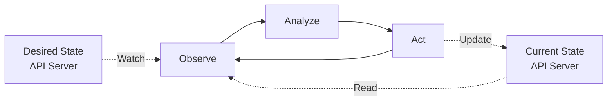
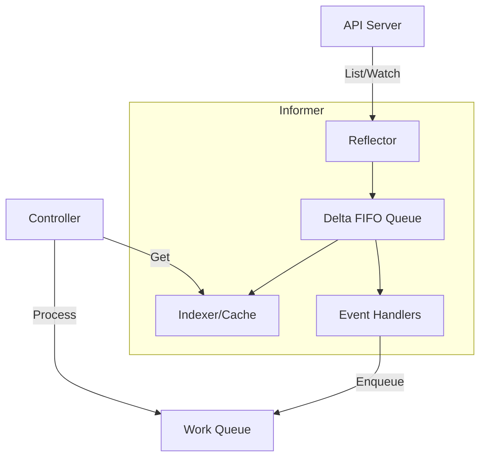
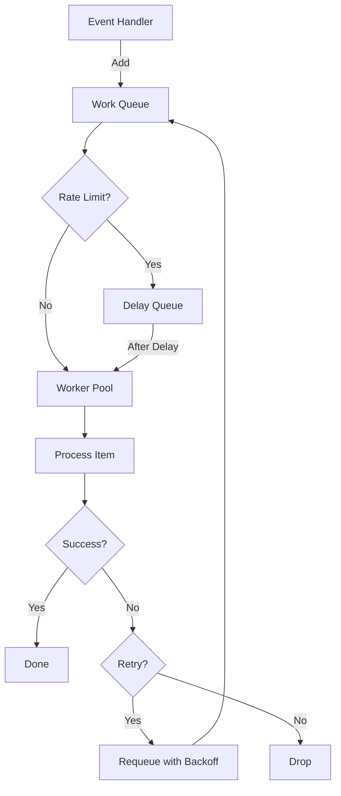
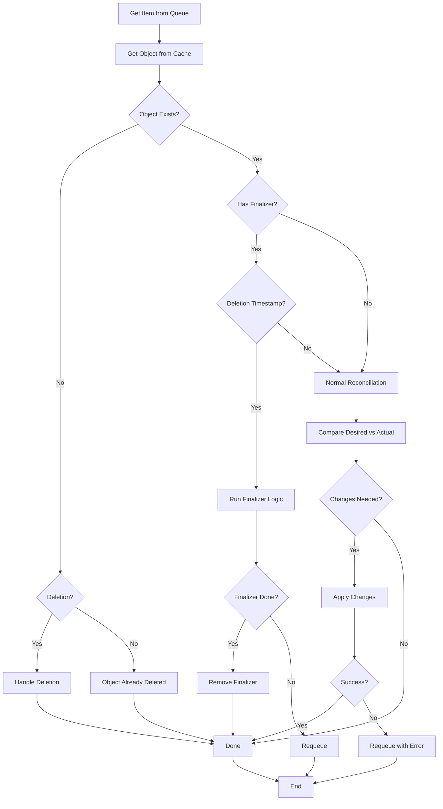
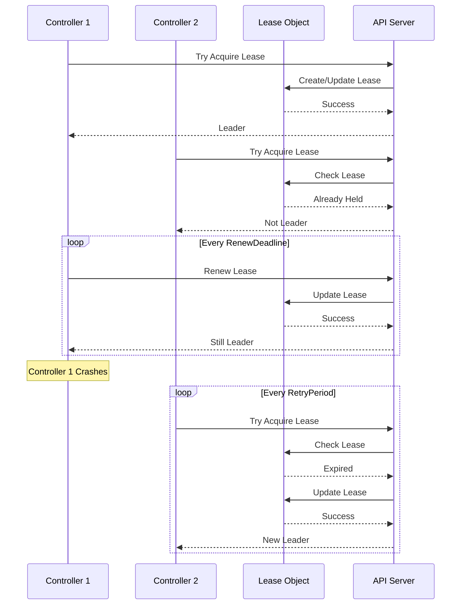

# Kubernetes Controller Manager Internals: Patterns & Reconciliation

## Table of Contents
- [Overview](#overview)
- [Controller Pattern](#controller-pattern)
- [Informer Architecture](#informer-architecture)
- [Work Queue Pattern](#work-queue-pattern)
- [Reconciliation Loop](#reconciliation-loop)
- [Leader Election](#leader-election)
- [Error Handling](#error-handling)
- [Code References](#code-references)

## Overview

The Kubernetes controller manager runs multiple controllers that regulate the state of the cluster. Each controller watches the shared state of the cluster through the API server and makes changes attempting to move the current state toward the desired state.

**Core Principles:**
- **Level-triggered**: Controllers react to the current state, not just changes
- **Idempotent**: Operations can be safely repeated
- **Eventually consistent**: System converges to desired state over time
- **Autonomous**: Controllers operate independently

**Key Source Files:**
- `pkg/controller/` - Base controller utilities
- `cmd/kube-controller-manager/app/` - Controller manager initialization
- `staging/src/k8s.io/client-go/tools/cache/` - Informer framework
- `staging/src/k8s.io/client-go/util/workqueue/` - Work queue implementation

## Controller Pattern

The controller pattern is the fundamental building block of Kubernetes' control plane.

### Control Loop



### Basic Controller Structure

```go
type Controller struct {
    // Client for API server
    kubeClient clientset.Interface
    
    // Informers for watching resources
    podInformer    coreinformers.PodInformer
    nodeInformer   coreinformers.NodeInformer
    
    // Listers for reading cached data
    podLister      corelisters.PodLister
    nodeLister     corelisters.NodeLister
    
    // Work queue for processing items
    queue          workqueue.RateLimitingInterface
    
    // Sync handler
    syncHandler    func(key string) error
    
    // Informer synced functions
    podsSynced     cache.InformerSynced
    nodesSynced    cache.InformerSynced
}

func NewController(
    kubeClient clientset.Interface,
    podInformer coreinformers.PodInformer,
    nodeInformer coreinformers.NodeInformer,
) *Controller {
    
    c := &Controller{
        kubeClient:   kubeClient,
        podInformer:  podInformer,
        nodeInformer: nodeInformer,
        podLister:    podInformer.Lister(),
        nodeLister:   nodeInformer.Lister(),
        queue:        workqueue.NewNamedRateLimitingQueue(
            workqueue.DefaultControllerRateLimiter(), "controller"),
    }
    
    // Set up event handlers
    podInformer.Informer().AddEventHandler(cache.ResourceEventHandlerFuncs{
        AddFunc:    c.addPod,
        UpdateFunc: c.updatePod,
        DeleteFunc: c.deletePod,
    })
    
    nodeInformer.Informer().AddEventHandler(cache.ResourceEventHandlerFuncs{
        AddFunc:    c.addNode,
        UpdateFunc: c.updateNode,
        DeleteFunc: c.deleteNode,
    })
    
    c.syncHandler = c.syncPod
    c.podsSynced = podInformer.Informer().HasSynced
    c.nodesSynced = nodeInformer.Informer().HasSynced
    
    return c
}
```

### Controller Run Loop

```go
func (c *Controller) Run(
    ctx context.Context,
    workers int,
) error {
    defer utilruntime.HandleCrash()
    defer c.queue.ShutDown()
    
    logger := klog.FromContext(ctx)
    logger.Info("Starting controller")
    
    // Wait for caches to sync
    logger.Info("Waiting for informer caches to sync")
    if !cache.WaitForCacheSync(ctx.Done(), 
        c.podsSynced, c.nodesSynced) {
        return fmt.Errorf("failed to wait for caches to sync")
    }
    
    // Start workers
    logger.Info("Starting workers", "count", workers)
    for i := 0; i < workers; i++ {
        go wait.UntilWithContext(ctx, c.runWorker, time.Second)
    }
    
    logger.Info("Started workers")
    <-ctx.Done()
    logger.Info("Shutting down workers")
    
    return nil
}

func (c *Controller) runWorker(ctx context.Context) {
    for c.processNextWorkItem(ctx) {
    }
}

func (c *Controller) processNextWorkItem(ctx context.Context) bool {
    // Get next item from queue
    key, shutdown := c.queue.Get()
    if shutdown {
        return false
    }
    defer c.queue.Done(key)
    
    // Process the item
    err := c.syncHandler(key.(string))
    c.handleErr(err, key)
    
    return true
}
```

## Informer Architecture

Informers provide a reliable, efficient way to watch and cache Kubernetes resources.

### Informer Components



### Informer Implementation

The informer framework (`staging/src/k8s.io/client-go/tools/cache/`):

```go
type SharedInformer interface {
    // AddEventHandler adds an event handler
    AddEventHandler(handler ResourceEventHandler)
    
    // AddEventHandlerWithResyncPeriod adds handler with custom resync
    AddEventHandlerWithResyncPeriod(
        handler ResourceEventHandler, 
        resyncPeriod time.Duration,
    )
    
    // GetStore returns the informer's local cache
    GetStore() Store
    
    // GetController returns the controller
    GetController() Controller
    
    // Run starts the informer
    Run(stopCh <-chan struct{})
    
    // HasSynced returns true if the informer's store has synced
    HasSynced() bool
    
    // LastSyncResourceVersion returns the last synced resource version
    LastSyncResourceVersion() string
}

type sharedIndexInformer struct {
    indexer    Indexer
    controller Controller
    processor  *sharedProcessor
    
    // Watched resource type
    listerWatcher ListerWatcher
    
    // Transform function
    transform TransformFunc
    
    // Resync period
    resyncCheckPeriod time.Duration
    defaultEventHandlerResyncPeriod time.Duration
    
    // Synchronization
    started     bool
    startedLock sync.Mutex
    stopped     bool
    stopCh      <-chan struct{}
}
```

### Reflector

The reflector watches the API server and updates the local cache:

```go
type Reflector struct {
    // Name for logging
    name string
    
    // Expected type of objects
    expectedType reflect.Type
    
    // Destination to sync to
    store Store
    
    // Source to watch
    listerWatcher ListerWatcher
    
    // Resync period
    resyncPeriod time.Duration
    
    // Last sync resource version
    lastSyncResourceVersion string
}

func (r *Reflector) Run(stopCh <-chan struct{}) {
    wait.BackoffUntil(func() {
        if err := r.ListAndWatch(stopCh); err != nil {
            r.watchErrorHandler(r, err)
        }
    }, r.backoffManager, true, stopCh)
}

func (r *Reflector) ListAndWatch(stopCh <-chan struct{}) error {
    // 1. List all objects
    list, err := r.listerWatcher.List(metav1.ListOptions{
        ResourceVersion: r.relistResourceVersion(),
    })
    if err != nil {
        return err
    }
    
    // 2. Extract resource version
    listMetaInterface, err := meta.ListAccessor(list)
    if err != nil {
        return err
    }
    resourceVersion := listMetaInterface.GetResourceVersion()
    
    // 3. Sync to store
    items, err := meta.ExtractList(list)
    if err != nil {
        return err
    }
    if err := r.syncWith(items, resourceVersion); err != nil {
        return err
    }
    
    // 4. Start watch from resource version
    for {
        select {
        case <-stopCh:
            return nil
        default:
        }
        
        w, err := r.listerWatcher.Watch(metav1.ListOptions{
            ResourceVersion: resourceVersion,
        })
        if err != nil {
            return err
        }
        
        if err := r.watchHandler(w, &resourceVersion, stopCh); err != nil {
            return err
        }
    }
}

func (r *Reflector) watchHandler(
    w watch.Interface,
    resourceVersion *string,
    stopCh <-chan struct{},
) error {
    
    defer w.Stop()
    
    for {
        select {
        case <-stopCh:
            return nil
        case event, ok := <-w.ResultChan():
            if !ok {
                return nil
            }
            
            // Update resource version
            meta, err := meta.Accessor(event.Object)
            if err != nil {
                return err
            }
            *resourceVersion = meta.GetResourceVersion()
            
            // Handle event
            switch event.Type {
            case watch.Added:
                err := r.store.Add(event.Object)
                if err != nil {
                    return err
                }
            case watch.Modified:
                err := r.store.Update(event.Object)
                if err != nil {
                    return err
                }
            case watch.Deleted:
                err := r.store.Delete(event.Object)
                if err != nil {
                    return err
                }
            }
        }
    }
}
```

### Delta FIFO Queue

The Delta FIFO queue buffers changes before processing:

```go
type DeltaFIFO struct {
    // Lock for synchronization
    lock sync.RWMutex
    cond sync.Cond
    
    // Map of object key to Deltas
    items map[string]Deltas
    
    // Queue of keys
    queue []string
    
    // Populated flag
    populated bool
    initialPopulationCount int
    
    // Key function
    keyFunc KeyFunc
    
    // Known objects
    knownObjects KeyListerGetter
}

type Delta struct {
    Type   DeltaType
    Object interface{}
}

type DeltaType string

const (
    Added   DeltaType = "Added"
    Updated DeltaType = "Updated"
    Deleted DeltaType = "Deleted"
    Replaced DeltaType = "Replaced"
    Sync    DeltaType = "Sync"
)

func (f *DeltaFIFO) Add(obj interface{}) error {
    f.lock.Lock()
    defer f.lock.Unlock()
    
    return f.queueActionLocked(Added, obj)
}

func (f *DeltaFIFO) queueActionLocked(
    actionType DeltaType,
    obj interface{},
) error {
    
    // Get object key
    key, err := f.keyFunc(obj)
    if err != nil {
        return err
    }
    
    // Append delta
    newDeltas := append(f.items[key], Delta{
        Type:   actionType,
        Object: obj,
    })
    
    // Deduplicate deltas
    newDeltas = dedupDeltas(newDeltas)
    
    // Update items
    if len(newDeltas) > 0 {
        if _, exists := f.items[key]; !exists {
            f.queue = append(f.queue, key)
        }
        f.items[key] = newDeltas
        f.cond.Broadcast()
    }
    
    return nil
}

func (f *DeltaFIFO) Pop(
    process PopProcessFunc,
) (interface{}, error) {
    
    f.lock.Lock()
    defer f.lock.Unlock()
    
    for {
        // Wait for items
        for len(f.queue) == 0 {
            f.cond.Wait()
        }
        
        // Get first item
        key := f.queue[0]
        f.queue = f.queue[1:]
        item := f.items[key]
        delete(f.items, key)
        
        // Process item
        err := process(item)
        if err != nil {
            // Re-queue on error
            f.addIfNotPresent(key, item)
            return item, err
        }
        
        return item, nil
    }
}
```

## Work Queue Pattern

Work queues provide rate limiting, deduplication, and retry logic.

### Work Queue Architecture



### Rate Limiting Queue

```go
type RateLimitingInterface interface {
    workqueue.Interface
    
    // AddRateLimited adds an item with rate limiting
    AddRateLimited(item interface{})
    
    // Forget indicates successful processing
    Forget(item interface{})
    
    // NumRequeues returns the number of times item has been requeued
    NumRequeues(item interface{}) int
}

type rateLimitingType struct {
    workqueue.Interface
    
    rateLimiter RateLimiter
}

func (q *rateLimitingType) AddRateLimited(item interface{}) {
    // Get delay from rate limiter
    delay := q.rateLimiter.When(item)
    
    if delay <= 0 {
        // Add immediately
        q.Add(item)
        return
    }
    
    // Add after delay
    q.AddAfter(item, delay)
}

func (q *rateLimitingType) Forget(item interface{}) {
    q.rateLimiter.Forget(item)
}

func (q *rateLimitingType) NumRequeues(item interface{}) int {
    return q.rateLimiter.NumRequeues(item)
}
```

### Rate Limiters

Different rate limiting strategies:

```go
// Exponential backoff rate limiter
type ItemExponentialFailureRateLimiter struct {
    failuresLock sync.Mutex
    failures     map[interface{}]int
    
    baseDelay time.Duration
    maxDelay  time.Duration
}

func (r *ItemExponentialFailureRateLimiter) When(
    item interface{},
) time.Duration {
    r.failuresLock.Lock()
    defer r.failuresLock.Unlock()
    
    exp := r.failures[item]
    r.failures[item]++
    
    // Calculate backoff: baseDelay * 2^exp
    backoff := float64(r.baseDelay.Nanoseconds()) * math.Pow(2, float64(exp))
    
    // Cap at maxDelay
    if backoff > float64(r.maxDelay.Nanoseconds()) {
        return r.maxDelay
    }
    
    return time.Duration(backoff)
}

// Token bucket rate limiter
type BucketRateLimiter struct {
    limiter *rate.Limiter
}

func (r *BucketRateLimiter) When(item interface{}) time.Duration {
    return r.limiter.Reserve().Delay()
}

// Max of multiple rate limiters
type MaxOfRateLimiter struct {
    limiters []RateLimiter
}

func (r *MaxOfRateLimiter) When(item interface{}) time.Duration {
    var max time.Duration
    for _, limiter := range r.limiters {
        delay := limiter.When(item)
        if delay > max {
            max = delay
        }
    }
    return max
}
```

## Reconciliation Loop

The reconciliation loop is the core of controller logic.

### Reconciliation Flow



### Reconciliation Implementation

```go
func (c *Controller) syncHandler(key string) error {
    // 1. Parse key to get namespace and name
    namespace, name, err := cache.SplitMetaNamespaceKey(key)
    if err != nil {
        return err
    }
    
    // 2. Get object from cache
    obj, err := c.lister.Get(namespace, name)
    if err != nil {
        if errors.IsNotFound(err) {
            // Object was deleted
            return c.handleDeletion(namespace, name)
        }
        return err
    }
    
    // 3. Check if object is being deleted
    if !obj.DeletionTimestamp.IsZero() {
        return c.handleFinalizer(obj)
    }
    
    // 4. Ensure finalizer is present
    if !controllerutil.ContainsFinalizer(obj, myFinalizer) {
        obj = obj.DeepCopy()
        controllerutil.AddFinalizer(obj, myFinalizer)
        _, err = c.client.Update(context.TODO(), obj)
        return err
    }
    
    // 5. Reconcile the object
    return c.reconcile(obj)
}

func (c *Controller) reconcile(obj *v1.MyResource) error {
    // Get desired state
    desiredState := c.computeDesiredState(obj)
    
    // Get current state
    currentState, err := c.getCurrentState(obj)
    if err != nil {
        return err
    }
    
    // Compare and update
    if !reflect.DeepEqual(desiredState, currentState) {
        if err := c.updateState(obj, desiredState); err != nil {
            return err
        }
    }
    
    // Update status
    return c.updateStatus(obj, desiredState)
}
```

### Finalizer Pattern

Finalizers ensure cleanup before object deletion:

```go
const myFinalizer = "mycontroller.k8s.io/finalizer"

func (c *Controller) handleFinalizer(obj *v1.MyResource) error {
    // Check if our finalizer is present
    if !controllerutil.ContainsFinalizer(obj, myFinalizer) {
        return nil
    }
    
    // Perform cleanup
    if err := c.cleanup(obj); err != nil {
        // Requeue if cleanup fails
        return err
    }
    
    // Remove finalizer
    obj = obj.DeepCopy()
    controllerutil.RemoveFinalizer(obj, myFinalizer)
    _, err := c.client.Update(context.TODO(), obj)
    return err
}

func (c *Controller) cleanup(obj *v1.MyResource) error {
    // Delete external resources
    if err := c.deleteExternalResources(obj); err != nil {
        return err
    }
    
    // Clean up any state
    return c.cleanupState(obj)
}
```

## Leader Election

Controllers use leader election to ensure only one instance is active.

### Leader Election Flow



### Leader Election Implementation

```go
import (
    "k8s.io/client-go/tools/leaderelection"
    "k8s.io/client-go/tools/leaderelection/resourcelock"
)

func (c *Controller) Run(ctx context.Context) error {
    // Create resource lock
    lock := &resourcelock.LeaseLock{
        LeaseMeta: metav1.ObjectMeta{
            Name:      "my-controller",
            Namespace: "kube-system",
        },
        Client: c.kubeClient.CoordinationV1(),
        LockConfig: resourcelock.ResourceLockConfig{
            Identity: c.identity,
        },
    }
    
    // Configure leader election
    leaderElectionConfig := leaderelection.LeaderElectionConfig{
        Lock:            lock,
        ReleaseOnCancel: true,
        LeaseDuration:   15 * time.Second,
        RenewDeadline:   10 * time.Second,
        RetryPeriod:     2 * time.Second,
        Callbacks: leaderelection.LeaderCallbacks{
            OnStartedLeading: func(ctx context.Context) {
                // Start controller
                c.runController(ctx)
            },
            OnStoppedLeading: func() {
                // Lost leadership
                logger.Info("Lost leadership")
            },
            OnNewLeader: func(identity string) {
                if identity == c.identity {
                    return
                }
                logger.Info("New leader elected", "leader", identity)
            },
        },
    }
    
    // Run leader election
    leaderelection.RunOrDie(ctx, leaderElectionConfig)
    return nil
}
```

## Error Handling

Proper error handling ensures controllers are resilient and debuggable.

### Error Handling Strategy

```go
func (c *Controller) handleErr(err error, key interface{}) {
    if err == nil {
        // Success - forget rate limiting
        c.queue.Forget(key)
        return
    }
    
    // Check retry count
    if c.queue.NumRequeues(key) < maxRetries {
        logger.Error(err, "Error syncing", "key", key, 
            "retries", c.queue.NumRequeues(key))
        
        // Requeue with rate limiting
        c.queue.AddRateLimited(key)
        return
    }
    
    // Max retries exceeded
    c.queue.Forget(key)
    utilruntime.HandleError(err)
    logger.Error(err, "Dropping object out of queue", "key", key)
}
```

### Retry Strategies

```go
// Exponential backoff with jitter
func DefaultControllerRateLimiter() RateLimiter {
    return NewMaxOfRateLimiter(
        // Exponential backoff: 5ms, 10ms, 20ms, ..., up to 1000s
        NewItemExponentialFailureRateLimiter(5*time.Millisecond, 1000*time.Second),
        // Token bucket: 10 QPS, 100 burst
        &BucketRateLimiter{Limiter: rate.NewLimiter(rate.Limit(10), 100)},
    )
}

// Custom retry logic
func (c *Controller) shouldRetry(err error) bool {
    // Don't retry on validation errors
    if errors.IsInvalid(err) {
        return false
    }
    
    // Don't retry on not found errors
    if errors.IsNotFound(err) {
        return false
    }
    
    // Retry on conflicts
    if errors.IsConflict(err) {
        return true
    }
    
    // Retry on server errors
    if errors.IsServerTimeout(err) || errors.IsServiceUnavailable(err) {
        return true
    }
    
    return true
}
```

### Status Updates

```go
func (c *Controller) updateStatus(
    obj *v1.MyResource,
    newStatus v1.MyResourceStatus,
) error {
    
    // Only update if status changed
    if reflect.DeepEqual(obj.Status, newStatus) {
        return nil
    }
    
    // Use retry on conflict
    return retry.RetryOnConflict(retry.DefaultRetry, func() error {
        // Get latest version
        latest, err := c.client.Get(
            context.TODO(), 
            client.ObjectKeyFromObject(obj),
        )
        if err != nil {
            return err
        }
        
        // Update status
        latest.Status = newStatus
        return c.client.Status().Update(context.TODO(), latest)
    })
}
```

## Code References

### Key Files

| File                                                          | Purpose                        |
| ------------------------------------------------------------- | ------------------------------ |
| `pkg/controller/controller_utils.go`                          | Common controller utilities    |
| `pkg/controller/controller_ref_manager.go`                    | Owner reference management     |
| `staging/src/k8s.io/client-go/tools/cache/shared_informer.go` | Shared informer implementation |
| `staging/src/k8s.io/client-go/tools/cache/reflector.go`       | Reflector implementation       |
| `staging/src/k8s.io/client-go/tools/cache/delta_fifo.go`      | Delta FIFO queue               |
| `staging/src/k8s.io/client-go/util/workqueue/`                | Work queue implementations     |
| `staging/src/k8s.io/client-go/tools/leaderelection/`          | Leader election                |

### Important Patterns

| Pattern            | Purpose                                   | Example              |
| ------------------ | ----------------------------------------- | -------------------- |
| Informer + Lister  | Efficient resource watching and caching   | All controllers      |
| Work Queue         | Decoupling event handling from processing | All controllers      |
| Rate Limiting      | Preventing API server overload            | Exponential backoff  |
| Leader Election    | High availability                         | Controller manager   |
| Finalizers         | Cleanup before deletion                   | Namespace controller |
| Owner References   | Garbage collection                        | ReplicaSet → Pods    |
| Status Subresource | Separate status updates                   | Most CRDs            |

### Best Practices

1. **Use Informers**: Never poll the API server directly
2. **Cache Reads**: Use listers for reading, not direct API calls
3. **Idempotent Operations**: Reconciliation should be repeatable
4. **Level-Triggered**: React to current state, not just events
5. **Rate Limiting**: Protect API server from overload
6. **Proper Error Handling**: Distinguish retriable from permanent errors
7. **Status Updates**: Use status subresource for status changes
8. **Owner References**: Enable garbage collection
9. **Finalizers**: Clean up external resources
10. **Leader Election**: Ensure single active controller

### Common Pitfalls

1. **Polling API Server**: Use informers instead
2. **Ignoring Conflicts**: Always handle update conflicts
3. **Missing Finalizers**: External resources leak
4. **Infinite Requeues**: Set max retries
5. **Blocking Workers**: Keep sync functions fast
6. **Missing Owner References**: Orphaned resources
7. **Race Conditions**: Use optimistic concurrency
8. **Memory Leaks**: Clean up informer caches

---

**Next**: See [INTERNALS_WORKLOAD_CONTROLLERS.md](./INTERNALS_WORKLOAD_CONTROLLERS.md) for deep dives into specific workload controllers like ReplicaSet, Deployment, and StatefulSet.

