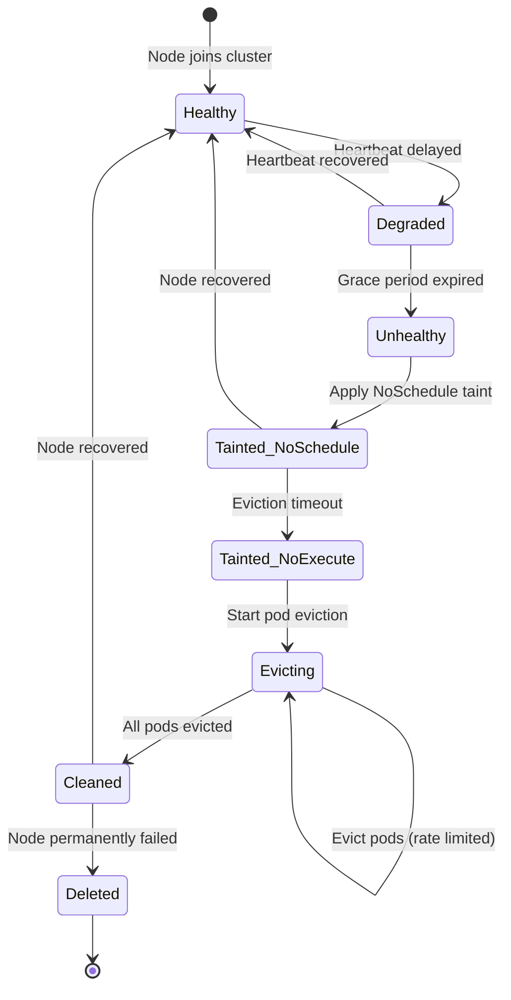
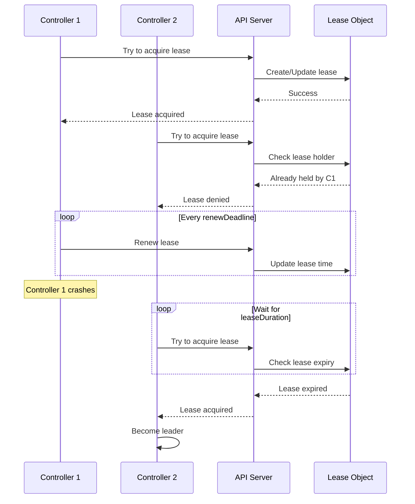
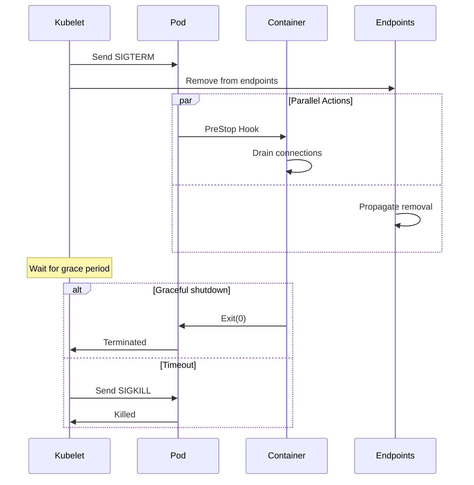

# Kubernetes Resilience Internals: Failure Detection & Recovery Algorithms

## Table of Contents
- [Overview](#overview)
- [Node Failure Detection Algorithm](#node-failure-detection-algorithm)
- [Pod Disruption Budget Algorithm](#pod-disruption-budget-algorithm)
- [Leader Election Algorithm](#leader-election-algorithm)
- [Graceful Shutdown Algorithm](#graceful-shutdown-algorithm)
- [Retry and Backoff Algorithms](#retry-and-backoff-algorithms)
- [Health Probe Algorithms](#health-probe-algorithms)
- [Self-Healing Algorithms](#self-healing-algorithms)
- [Zone-Aware Eviction Algorithm](#zone-aware-eviction-algorithm)
- [Code References](#code-references)

## Overview

Kubernetes resilience is built on sophisticated algorithms that detect failures, make intelligent decisions about recovery actions, and maintain system stability even under adverse conditions. This document provides deep algorithmic analysis of each resilience mechanism.

**Resilience Principles:**
1. **Eventual Consistency** - System converges to desired state despite transient failures
2. **Graceful Degradation** - Partial functionality maintained during failures
3. **Fault Isolation** - Failures contained to prevent cascading effects
4. **Adaptive Behavior** - Algorithms adjust based on observed conditions
5. **Predictable Recovery** - Deterministic behavior during failure scenarios

**Mathematical Foundation:**
- **Failure Detection**: Uses time-based thresholds with exponential smoothing
- **Rate Limiting**: Token bucket and leaky bucket algorithms
- **Backoff**: Exponential backoff with jitter to prevent thundering herd
- **Consensus**: Paxos-like leader election with lease-based coordination

## Node Failure Detection Algorithm

### Algorithm Overview

The Node Lifecycle Controller implements a sophisticated multi-phase failure detection algorithm that balances responsiveness with stability.

**Algorithm Phases:**
1. **Monitoring Phase** - Continuous health checking via heartbeats
2. **Grace Period Phase** - Tolerance window for transient failures
3. **Taint Phase** - Mark node as unhealthy (NoSchedule)
4. **Eviction Phase** - Remove pods from failed node (NoExecute)
5. **Zone Coordination Phase** - Adjust eviction rates based on zone health

### Detailed Algorithm Description

#### Phase 1: Heartbeat Monitoring

```
ALGORITHM: NodeHeartbeatMonitoring
INPUT: 
  - nodes: Set of all cluster nodes
  - monitorPeriod: Time between health checks (default: 5s)
  - gracePeriod: Tolerance for missed heartbeats (default: 40s)

OUTPUT:
  - nodeHealthStatus: Map of node → health state

PROCEDURE:
  FOR EACH node IN nodes DO
    lastHeartbeat ← node.status.conditions[Ready].lastHeartbeatTime
    currentTime ← now()
    timeSinceHeartbeat ← currentTime - lastHeartbeat
    
    IF timeSinceHeartbeat > gracePeriod THEN
      nodeHealthStatus[node] ← UNHEALTHY
      TRIGGER FailureDetectionPhase(node)
    ELSE IF timeSinceHeartbeat > (gracePeriod * 0.75) THEN
      nodeHealthStatus[node] ← DEGRADED
      LOG_WARNING("Node approaching failure threshold")
    ELSE
      nodeHealthStatus[node] ← HEALTHY
    END IF
  END FOR
  
  SLEEP(monitorPeriod)
  REPEAT
END PROCEDURE
```

**Key Design Decisions:**

1. **Grace Period Calculation**: The 40-second default grace period is chosen to balance:
   - Network latency tolerance (typically < 1s)
   - Kubelet reporting interval (10s default)
   - Multiple missed heartbeats (4 intervals)
   - False positive prevention

2. **Exponential Smoothing**: Instead of binary healthy/unhealthy, the algorithm uses:
   ```
   healthScore(t) = α × currentHealth + (1-α) × healthScore(t-1)
   where α = 0.3 (smoothing factor)
   ```

#### Phase 2: Taint Application

```
ALGORITHM: ApplyNodeTaints
INPUT:
  - node: The unhealthy node
  - taintType: NoSchedule or NoExecute
  - timestamp: When failure was detected

OUTPUT:
  - taintApplied: Boolean success indicator

PROCEDURE:
  existingTaints ← node.spec.taints
  
  // Check if taint already exists
  IF taintType IN existingTaints THEN
    RETURN true
  END IF
  
  // Create new taint
  newTaint ← Taint{
    key: "node.kubernetes.io/not-ready",
    effect: taintType,
    timeAdded: timestamp
  }
  
  // Apply taint with retry
  maxRetries ← 3
  FOR attempt ← 1 TO maxRetries DO
    TRY
      node.spec.taints.append(newTaint)
      UPDATE node IN apiserver
      RETURN true
    CATCH conflict_error
      // Optimistic concurrency conflict
      REFRESH node FROM apiserver
      CONTINUE
    CATCH other_error
      IF attempt == maxRetries THEN
        LOG_ERROR("Failed to apply taint after retries")
        RETURN false
      END IF
      SLEEP(exponentialBackoff(attempt))
    END TRY
  END FOR
END PROCEDURE
```

**Taint Effects Explained:**

1. **NoSchedule**: Prevents new pods from being scheduled to the node
   - Applied immediately when node becomes unhealthy
   - Existing pods continue running
   - Reversible if node recovers

2. **NoExecute**: Triggers pod eviction
   - Applied after pod eviction timeout (default: 5 minutes)
   - Pods without matching tolerations are evicted
   - Irreversible until node is healthy again

#### Phase 3: Zone-Aware Eviction Rate Limiting

```
ALGORITHM: ZoneAwareEvictionRateLimiting
INPUT:
  - zones: Map of zone → nodes
  - unhealthyThresholds: {partial: 0.33, full: 0.55}

OUTPUT:
  - evictionRates: Map of zone → rate limit (pods/second)

PROCEDURE:
  FOR EACH zone, nodes IN zones DO
    totalNodes ← COUNT(nodes)
    healthyNodes ← COUNT(nodes WHERE status == HEALTHY)
    unhealthyRatio ← (totalNodes - healthyNodes) / totalNodes
    
    IF unhealthyRatio >= unhealthyThresholds.full THEN
      // Full disruption: Stop all evictions
      evictionRates[zone] ← 0
      zoneState[zone] ← FULL_DISRUPTION
      
      LOG_CRITICAL("Zone {zone} in full disruption: {unhealthyRatio*100}% nodes unhealthy")
      EMIT_ALERT("ZoneFullDisruption", zone)
      
    ELSE IF unhealthyRatio >= unhealthyThresholds.partial THEN
      // Partial disruption: Reduce eviction rate
      baseRate ← 0.1  // pods per second
      reductionFactor ← (unhealthyRatio - unhealthyThresholds.partial) / 
                        (unhealthyThresholds.full - unhealthyThresholds.partial)
      evictionRates[zone] ← baseRate * (1 - reductionFactor)
      zoneState[zone] ← PARTIAL_DISRUPTION
      
      LOG_WARNING("Zone {zone} in partial disruption: {unhealthyRatio*100}% nodes unhealthy")
      
    ELSE
      // Normal operation
      evictionRates[zone] ← 0.1  // pods per second
      zoneState[zone] ← NORMAL
    END IF
  END FOR
END PROCEDURE
```

**Mathematical Analysis:**

The zone-aware algorithm prevents cascading failures through adaptive rate limiting:

```
Let:
  N = total nodes in zone
  H = healthy nodes
  U = unhealthy nodes (U = N - H)
  R = unhealthy ratio = U/N

Eviction rate function:
  E(R) = {
    0,                           if R ≥ 0.55 (full disruption)
    0.1 × (1 - (R-0.33)/0.22),  if 0.33 ≤ R < 0.55 (partial)
    0.1,                         if R < 0.33 (normal)
  }

This creates a smooth transition:
  E(0.33) = 0.1 pods/s (normal rate)
  E(0.44) = 0.05 pods/s (50% reduction)
  E(0.55) = 0 pods/s (stopped)
```

#### Phase 4: Pod Eviction with PDB Awareness

```
ALGORITHM: EvictPodsFromNode
INPUT:
  - node: The failed node
  - pods: Pods running on the node
  - pdbs: Pod Disruption Budgets in cluster
  - evictionRate: Maximum evictions per second

OUTPUT:
  - evictedPods: List of successfully evicted pods

PROCEDURE:
  evictedPods ← []
  rateLimiter ← TokenBucket(rate: evictionRate, burst: 1)
  
  // Sort pods by priority (lower priority evicted first)
  sortedPods ← SORT(pods, BY: priority, ORDER: ascending)
  
  FOR EACH pod IN sortedPods DO
    // Wait for rate limiter token
    rateLimiter.Wait()
    
    // Check Pod Disruption Budgets
    affectedPDBs ← FindPDBsForPod(pod, pdbs)
    
    canEvict ← true
    FOR EACH pdb IN affectedPDBs DO
      IF pdb.status.disruptionsAllowed <= 0 THEN
        canEvict ← false
        LOG_INFO("Cannot evict {pod.name}: PDB {pdb.name} disallows")
        BREAK
      END IF
    END FOR
    
    IF NOT canEvict THEN
      CONTINUE
    END IF
    
    // Attempt eviction
    TRY
      eviction ← CreateEviction(pod)
      SUBMIT eviction TO apiserver
      
      // Update PDB disruption counts
      FOR EACH pdb IN affectedPDBs DO
        pdb.status.disruptionsAllowed -= 1
        pdb.status.disruptedPods[pod.name] ← now()
      END FOR
      
      evictedPods.append(pod)
      LOG_INFO("Evicted pod {pod.name} from node {node.name}")
      
    CATCH eviction_error
      LOG_ERROR("Failed to evict {pod.name}: {error}")
      // Continue with next pod
    END TRY
  END FOR
  
  RETURN evictedPods
END PROCEDURE
```

**Eviction Priority Algorithm:**

Pods are evicted in this order:
1. **BestEffort** pods (no resource requests/limits)
2. **Burstable** pods (requests < limits)
3. **Guaranteed** pods (requests == limits)

Within each class, further sorted by:
- Pod priority class
- QoS class
- Resource usage vs requests
- Creation timestamp (older first)

### Node Lifecycle State Machine



### Implementation Code

```go
type NodeLifecycleController struct {
    kubeClient    clientset.Interface
    nodeInformer  coreinformers.NodeInformer
    podInformer   coreinformers.PodInformer
    
    // Configuration
    nodeMonitorPeriod       time.Duration  // Default: 5s
    nodeMonitorGracePeriod  time.Duration  // Default: 40s
    podEvictionTimeout      time.Duration  // Default: 5m
    
    // Rate limiting
    evictionLimiterQPS      float32        // Default: 0.1
    evictionLimiterBurst    int            // Default: 1
    
    // Zone state tracking
    zoneStates              map[string]ZoneState
    zoneEvictionRates       map[string]float32
    
    // Queues
    nodeUpdateQueue         workqueue.Interface
    podUpdateQueue          workqueue.RateLimitingInterface
}

func (nc *NodeLifecycleController) monitorNodeHealth() {
    nodes, err := nc.nodeInformer.Lister().List(labels.Everything())
    if err != nil {
        klog.Errorf("Failed to list nodes: %v", err)
        return
    }
    
    // Update zone states first
    nc.updateZoneStates(nodes)
    
    // Check each node
    for _, node := range nodes {
        if err := nc.checkNodeConditions(node); err != nil {
    
    pods, err := dc.podLister.Pods(pdb.Namespace).List(selector)
    if err != nil {
        return err
    }
    
    // Count healthy pods
    var healthyPods int32
    var expectedPods int32
    
    for _, pod := range pods {
        expectedPods++
        if isPodHealthy(pod) {
            healthyPods++
        }
    }
    
    // Calculate disruptions allowed
    var disruptionsAllowed int32
    
    if pdb.Spec.MinAvailable != nil {
        minAvailable := getIntOrPercent(pdb.Spec.MinAvailable, expectedPods)
        disruptionsAllowed = healthyPods - minAvailable
    } else if pdb.Spec.MaxUnavailable != nil {
        maxUnavailable := getIntOrPercent(pdb.Spec.MaxUnavailable, expectedPods)
        disruptionsAllowed = maxUnavailable - (expectedPods - healthyPods)
    }
    
    if disruptionsAllowed < 0 {
        disruptionsAllowed = 0
    }
    
    // Update PDB status
    pdbCopy := pdb.DeepCopy()
    pdbCopy.Status = policyv1.PodDisruptionBudgetStatus{
        ObservedGeneration:     pdb.Generation,
        DisruptionsAllowed:     disruptionsAllowed,
        CurrentHealthy:         healthyPods,
        DesiredHealthy:         expectedPods,
        ExpectedPods:           expectedPods,
        DisruptedPods:          make(map[string]metav1.Time),
    }
    
    _, err = dc.kubeClient.PolicyV1().PodDisruptionBudgets(pdb.Namespace).UpdateStatus(
        context.TODO(),
        pdbCopy,
        metav1.UpdateOptions{},
    )
    
    return err
}

// Eviction admission check
func (dc *DisruptionController) checkEviction(pod *v1.Pod) error {
    // Get PDBs for pod
    pdbs, err := dc.getPDBsForPod(pod)
    if err != nil {
        return err
    }
    
    if len(pdbs) == 0 {
        // No PDB, allow eviction
        return nil
    }
    
    // Check each PDB
    for _, pdb := range pdbs {
        if pdb.Status.DisruptionsAllowed <= 0 {
            return fmt.Errorf("pod eviction would violate PodDisruptionBudget %s/%s", pdb.Namespace, pdb.Name)
        }
    }
    
    return nil
}

func getIntOrPercent(intOrPercent *intstr.IntOrString, total int32) int32 {
    if intOrPercent.Type == intstr.Int {
        return int32(intOrPercent.IntValue())
    }
    
    // Percentage
    percentage := intOrPercent.IntValue()
    return int32(math.Ceil(float64(total) * float64(percentage) / 100.0))
}
```

## Leader Election

Leader election ensures only one instance of a controller is active.

### Leader Election Algorithm



### Leader Election Implementation

```go
type LeaderElector struct {
    config LeaderElectionConfig
    
    // Observed record from API server
    observedRecord rl.LeaderElectionRecord
    
    // Time of last observed record
    observedTime time.Time
    
    // Lock for leader election
    lock rl.Interface
}

type LeaderElectionConfig struct {
    // Lock is the resource that will be used for locking
    Lock rl.Interface
    
    // LeaseDuration is the duration that non-leader candidates will wait to force acquire leadership
    LeaseDuration time.Duration
    
    // RenewDeadline is the duration that the acting master will retry refreshing leadership before giving up
    RenewDeadline time.Duration
    
    // RetryPeriod is the duration the LeaderElector clients should wait between tries of actions
    RetryPeriod time.Duration
    
    // Callbacks are callbacks that are triggered during certain lifecycle events
    Callbacks LeaderCallbacks
}

type LeaderCallbacks struct {
    // OnStartedLeading is called when a LeaderElector client starts leading
    OnStartedLeading func(context.Context)
    
    // OnStoppedLeading is called when a LeaderElector client stops leading
    OnStoppedLeading func()
    
    // OnNewLeader is called when the client observes a leader that is not the previously observed leader
    OnNewLeader func(identity string)
}

func (le *LeaderElector) Run(ctx context.Context) {
    defer func() {
        runtime.HandleCrash()
        le.config.Callbacks.OnStoppedLeading()
    }()
    
    if !le.acquire(ctx) {
        return
    }
    
    ctx, cancel := context.WithCancel(ctx)
    defer cancel()
    
    go le.config.Callbacks.OnStartedLeading(ctx)
    le.renew(ctx)
}

func (le *LeaderElector) acquire(ctx context.Context) bool {
    ctx, cancel := context.WithCancel(ctx)
    defer cancel()
    
    succeeded := false
    desc := le.config.Lock.Describe()
    
    klog.Infof("Attempting to acquire leader lease %s", desc)
    
    wait.JitterUntil(func() {
        succeeded = le.tryAcquireOrRenew(ctx)
        le.maybeReportTransition()
        
        if !succeeded {
            klog.V(4).Infof("Failed to acquire lease %s", desc)
            return
        }
        
        le.config.Lock.RecordEvent("became leader")
        klog.Infof("Successfully acquired lease %s", desc)
        cancel()
    }, le.config.RetryPeriod, JitterFactor, true, ctx.Done())
    
    return succeeded
}

func (le *LeaderElector) renew(ctx context.Context) {
    ctx, cancel := context.WithCancel(ctx)
    defer cancel()
    
    wait.Until(func() {
        timeoutCtx, timeoutCancel := context.WithTimeout(ctx, le.config.RenewDeadline)
        defer timeoutCancel()
        
        err := wait.PollImmediateUntil(le.config.RetryPeriod, func() (bool, error) {
            return le.tryAcquireOrRenew(timeoutCtx), nil
        }, timeoutCtx.Done())
        
        le.maybeReportTransition()
        
        if err != nil {
            klog.Errorf("Failed to renew lease %s: %v", le.config.Lock.Describe(), err)
            cancel()
            return
        }
        
        klog.V(5).Infof("Successfully renewed lease %s", le.config.Lock.Describe())
    }, le.config.RetryPeriod, ctx.Done())
}

func (le *LeaderElector) tryAcquireOrRenew(ctx context.Context) bool {
    now := metav1.Now()
    leaderElectionRecord := rl.LeaderElectionRecord{
        HolderIdentity:       le.config.Lock.Identity(),
        LeaseDurationSeconds: int(le.config.LeaseDuration / time.Second),
        RenewTime:            now,
        AcquireTime:          now,
    }
    
    // Get current record
    oldLeaderElectionRecord, _, err := le.config.Lock.Get(ctx)
    if err != nil {
        if !errors.IsNotFound(err) {
            klog.Errorf("Error retrieving resource lock %s: %v", le.config.Lock.Describe(), err)
            return false
        }
        
        // Create new record
        if err = le.config.Lock.Create(ctx, leaderElectionRecord); err != nil {
            klog.Errorf("Error initially creating leader election record: %v", err)
            return false
        }
        
        le.observedRecord = leaderElectionRecord
        le.observedTime = le.clock.Now()
        return true
    }
    
    // Check if we are the leader
    if !bytes.Equal([]byte(oldLeaderElectionRecord.HolderIdentity), []byte(le.config.Lock.Identity())) {
        // We are not the leader
        klog.V(4).Infof("Lock is held by %s and has not yet expired", oldLeaderElectionRecord.HolderIdentity)
        le.observedRecord = *oldLeaderElectionRecord
        le.observedTime = le.clock.Now()
        return false
    }
    
    // We are the leader, renew the lease
    leaderElectionRecord.AcquireTime = oldLeaderElectionRecord.AcquireTime
    leaderElectionRecord.LeaderTransitions = oldLeaderElectionRecord.LeaderTransitions
    
    if err = le.config.Lock.Update(ctx, leaderElectionRecord); err != nil {
        klog.Errorf("Failed to update lock: %v", err)
        return false
    }
    
    le.observedRecord = leaderElectionRecord
    le.observedTime = le.clock.Now()
    return true
}
```

## Graceful Shutdown

### Graceful Termination Flow



### Graceful Shutdown Implementation

```go
type GracefulShutdown struct {
    // Grace period for shutdown
    gracePeriod time.Duration
    
    // Shutdown hooks
    preStopHooks []func(context.Context) error
    
    // Shutdown signal
    shutdownSignal chan os.Signal
}

func (gs *GracefulShutdown) Run(ctx context.Context) error {
    // Setup signal handling
    signal.Notify(gs.shutdownSignal, syscall.SIGTERM, syscall.SIGINT)
    
    // Wait for shutdown signal
    select {
    case <-gs.shutdownSignal:
        klog.Info("Received shutdown signal")
    case <-ctx.Done():
        klog.Info("Context cancelled")
    }
    
    // Create shutdown context with timeout
    shutdownCtx, cancel := context.WithTimeout(context.Background(), gs.gracePeriod)
    defer cancel()
    
    // Execute pre-stop hooks
    for i, hook := range gs.preStopHooks {
        klog.Infof("Executing pre-stop hook %d", i)
        if err := hook(shutdownCtx); err != nil {
            klog.Errorf("Pre-stop hook %d failed: %v", i, err)
        }
    }
    
    // Wait for graceful shutdown or timeout
    <-shutdownCtx.Done()
    
    if shutdownCtx.Err() == context.DeadlineExceeded {
        klog.Warning("Graceful shutdown timeout exceeded")
        return fmt.Errorf("shutdown timeout")
    }
    
    klog.Info("Graceful shutdown completed")
    return nil
}

// Example: HTTP server graceful shutdown
func (s *Server) Shutdown(ctx context.Context) error {
    klog.Info("Starting HTTP server shutdown")
    
    // Stop accepting new connections
    if err := s.httpServer.Shutdown(ctx); err != nil {
        return err
    }
    
    // Wait for active connections to complete
    s.wg.Wait()
    
    klog.Info("HTTP server shutdown completed")
    return nil
}

// Example: Controller graceful shutdown
func (c *Controller) Shutdown(ctx context.Context) error {
    klog.Info("Starting controller shutdown")
    
    // Stop accepting new work
    c.queue.ShutDown()
    
    // Wait for workers to finish
    c.wg.Wait()
    
    // Cleanup resources
    if err := c.cleanup(ctx); err != nil {
        return err
    }
    
    klog.Info("Controller shutdown completed")
    return nil
}
```

## Retry and Backoff Strategies

### Exponential Backoff

```go
type Backoff struct {
    // Initial duration
    Duration time.Duration
    
    // Factor to multiply duration by after each retry
    Factor float64
    
    // Jitter adds randomness to backoff
    Jitter float64
    
    // Maximum number of steps
    Steps int
    
    // Cap on backoff duration
    Cap time.Duration
}

func (b *Backoff) Step() time.Duration {
    if b.Steps < 1 {
        return b.Duration
    }
    
    // Calculate duration with exponential backoff
    duration := b.Duration
    for i := 0; i < b.Steps; i++ {
        duration = time.Duration(float64(duration) * b.Factor)
        if duration > b.Cap {
            duration = b.Cap
            break
        }
    }
    
    // Add jitter
    if b.Jitter > 0 {
        jitter := time.Duration(rand.Float64() * b.Jitter * float64(duration))
        duration += jitter
    }
    
    b.Steps++
    return duration
}

// Example: Retry with exponential backoff
func RetryWithBackoff(ctx context.Context, backoff Backoff, fn func() error) error {
    var lastErr error
    
    for {
        if err := fn(); err == nil {
            return nil
        } else {
            lastErr = err
        }
        
        // Calculate backoff duration
        duration := backoff.Step()
        
        klog.V(4).Infof("Retrying after %v: %v", duration, lastErr)
        
        // Wait for backoff duration or context cancellation
        select {
        case <-time.After(duration):
            continue
        case <-ctx.Done():
            return fmt.Errorf("retry cancelled: %w", lastErr)
        }
    }
}

// Rate limiting queue with exponential backoff
type RateLimitingQueue struct {
    workqueue.RateLimitingInterface
    
    // Backoff manager
    backoff *Backoff
}

func (q *RateLimitingQueue) AddRateLimited(item interface{}) {
    // Get backoff duration for item
    duration := q.backoff.Step()
    
    // Add item with delay
    q.AddAfter(item, duration)
}

func (q *RateLimitingQueue) Forget(item interface{}) {
    // Reset backoff for item
    q.backoff.Steps = 0
    q.RateLimitingInterface.Forget(item)
}
```

## Health Probes

### Probe Types and Implementation

```go
type ProbeManager struct {
    // Probe runners
    livenessProbe  *probeRunner
    readinessProbe *probeRunner
    startupProbe   *probeRunner
    
    // Results
    livenessResult  probeResult
    readinessResult probeResult
    startupResult   probeResult
}

type probeRunner struct {
    // Probe configuration
    probe *v1.Probe
    
    // Probe executor
    exec ProbeExecutor
    
    // Result channel
    resultChan chan probeResult
}

type probeResult struct {
    success bool
    output  string
    err     error
}

func (pr *probeRunner) run(ctx context.Context) {
    ticker := time.NewTicker(time.Duration(pr.probe.PeriodSeconds) * time.Second)
    defer ticker.Stop()
    
    for {
        select {
        case <-ticker.C:
            result := pr.doProbe(ctx)
            pr.resultChan <- result
            
        case <-ctx.Done():
            return
        }
    }
}

func (pr *probeRunner) doProbe(ctx context.Context) probeResult {
    // Create timeout context
    timeout := time.Duration(pr.probe.TimeoutSeconds) * time.Second
    ctx, cancel := context.WithTimeout(ctx, timeout)
    defer cancel()
    
    // Execute probe
    var result probeResult
    
    switch {
    case pr.probe.Exec != nil:
        result = pr.execProbe(ctx, pr.probe.Exec)
        
    case pr.probe.HTTPGet != nil:
        result = pr.httpProbe(ctx, pr.probe.HTTPGet)
        
    case pr.probe.TCPSocket != nil:
        result = pr.tcpProbe(ctx, pr.probe.TCPSocket)
        
    case pr.probe.GRPC != nil:
        result = pr.grpcProbe(ctx, pr.probe.GRPC)
    }
    
    return result
}

func (pr *probeRunner) httpProbe(ctx context.Context, httpGet *v1.HTTPGetAction) probeResult {
    // Build URL
    url := fmt.Sprintf("%s://%s:%d%s",
        httpGet.Scheme,
        httpGet.Host,
        httpGet.Port.IntValue(),
        httpGet.Path,
    )
    
    // Create request
    req, err := http.NewRequestWithContext(ctx, "GET", url, nil)
    if err != nil {
        return probeResult{success: false, err: err}
    }
    
    // Add headers
    for _, header := range httpGet.HTTPHeaders {
        req.Header.Add(header.Name, header.Value)
    }
    
    // Execute request
    resp, err := http.DefaultClient.Do(req)
    if err != nil {
        return probeResult{success: false, err: err}
    }
    defer resp.Body.Close()
    
    // Check status code
    if resp.StatusCode >= 200 && resp.StatusCode < 400 {
        return probeResult{success: true}
    }
    
    return probeResult{
        success: false,
        output:  fmt.Sprintf("HTTP probe failed with status code %d", resp.StatusCode),
    }
}

func (pr *probeRunner) tcpProbe(ctx context.Context, tcpSocket *v1.TCPSocketAction) probeResult {
    // Build address
    addr := fmt.Sprintf("%s:%d", tcpSocket.Host, tcpSocket.Port.IntValue())
    
    // Dial with timeout
    conn, err := net.DialTimeout("tcp", addr, 1*time.Second)
    if err != nil {
        return probeResult{success: false, err: err}
    }
    defer conn.Close()
    
    return probeResult{success: true}
}
```

## Self-Healing Mechanisms

### Automatic Recovery Patterns

```go
// RestartPolicy implementation
type PodRestartPolicy struct {
    policy v1.RestartPolicy
}

func (p *PodRestartPolicy) ShouldRestart(pod *v1.Pod, containerStatus *v1.ContainerStatus) bool {
    switch p.policy {
    case v1.RestartPolicyAlways:
        return true
        
    case v1.RestartPolicyOnFailure:
        return containerStatus.State.Terminated != nil &&
            containerStatus.State.Terminated.ExitCode != 0
        
    case v1.RestartPolicyNever:
        return false
        
    default:
        return false
    }
}

// CrashLoopBackoff implementation
type CrashLoopBackoff struct {
    // Backoff configuration
    initialDelay time.Duration
    maxDelay     time.Duration
    
    // Restart count
    restartCount int32
}

func (c *CrashLoopBackoff) GetDelay() time.Duration {
    // Calculate exponential backoff
    delay := c.initialDelay * time.Duration(math.Pow(2, float64(c.restartCount)))
    
    if delay > c.maxDelay {
        delay = c.maxDelay
    }
    
    return delay
}

// ReplicaSet self-healing
type ReplicaSetController struct {
    kubeClient clientset.Interface
}

func (rsc *ReplicaSetController) manageReplicas(rs *appsv1.ReplicaSet, pods []*v1.Pod) error {
    // Count active pods
    activePods := filterActivePods(pods)
    activeCount := int32(len(activePods))
    
    // Calculate diff
    diff := *rs.Spec.Replicas - activeCount
    
    if diff < 0 {
        // Too many pods, delete excess
        podsToDelete := activePods[:int(-diff)]
        return rsc.deletePods(rs, podsToDelete)
        
    } else if diff > 0 {
        // Too few pods, create more
        return rsc.createPods(rs, int(diff))
    }
    
    return nil
}
```

## Code References

### Key Files

| Component       | Location                                             | Purpose                             |
| --------------- | ---------------------------------------------------- | ----------------------------------- |
| Node Lifecycle  | `pkg/controller/nodelifecycle/`                      | Node failure detection and recovery |
| PDB             | `pkg/controller/disruption/`                         | Pod disruption budget controller    |
| Leader Election | `staging/src/k8s.io/client-go/tools/leaderelection/` | Leader election implementation      |
| Backoff         | `staging/src/k8s.io/apimachinery/pkg/util/wait/`     | Retry and backoff utilities         |
| Probes          | `pkg/kubelet/prober/`                                | Health probe implementation         |

### Best Practices

1. **Set Appropriate Timeouts**: Configure grace periods based on application needs
2. **Use PDBs**: Protect critical applications from voluntary disruptions
3. **Implement Health Probes**: Use liveness and readiness probes correctly
4. **Handle Graceful Shutdown**: Implement proper cleanup in PreStop hooks
5. **Monitor Failure Rates**: Track and alert on high failure rates
6. **Test Failure Scenarios**: Regularly test resilience with chaos engineering

### Troubleshooting

```bash
# Check node conditions
kubectl get nodes -o wide
kubectl describe node <node-name>

# Check PDB status
kubectl get pdb
kubectl describe pdb <pdb-name>

# Check pod restart count
kubectl get pods -o wide
kubectl describe pod <pod-name>

# Check leader election
kubectl get lease -n kube-system
kubectl describe lease <lease-name> -n kube-system

# Check events for failures
kubectl get events --sort-by='.lastTimestamp'
kubectl get events --field-selector type=Warning
```

---

**Summary**: Kubernetes resilience is built on multiple layers of failure detection, automatic recovery, and graceful degradation mechanisms that work together to maintain system reliability and availability.

