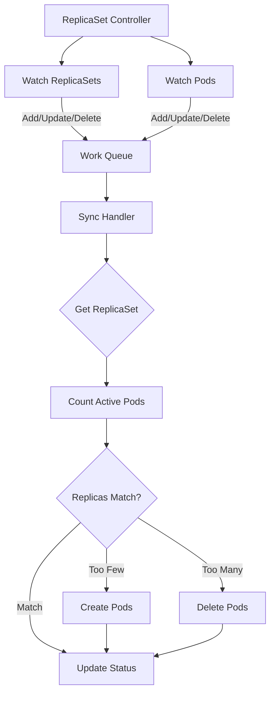
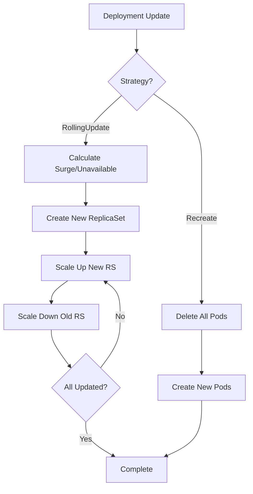
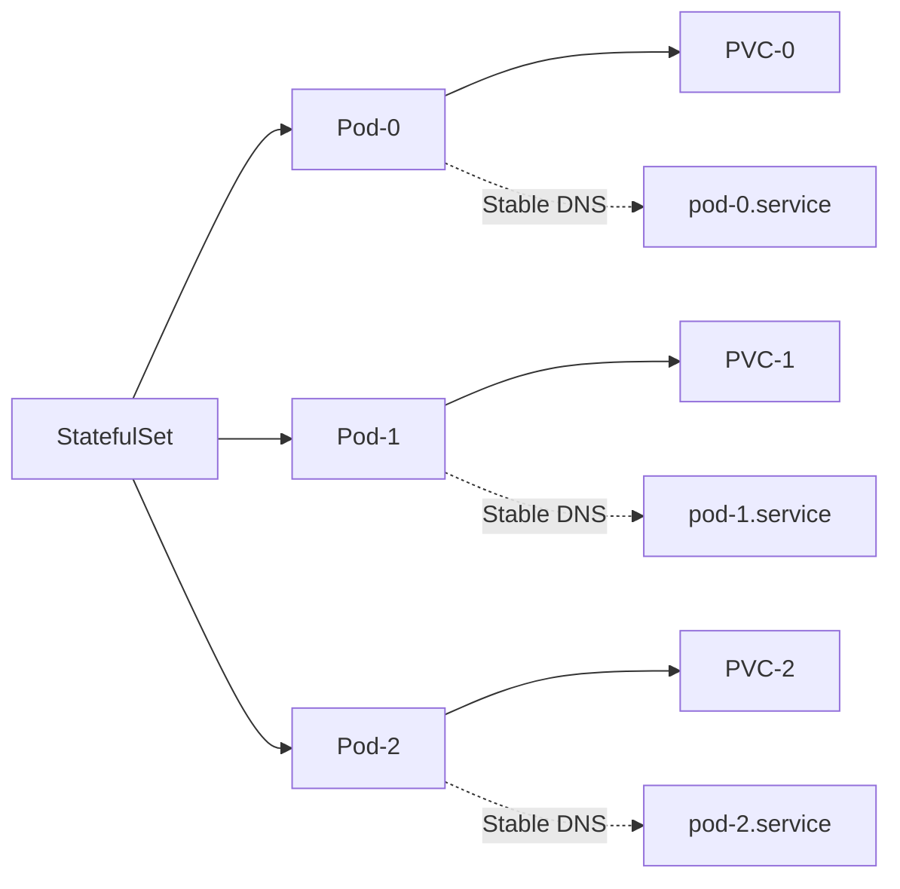
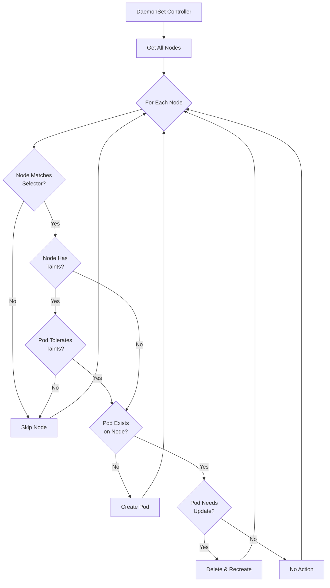
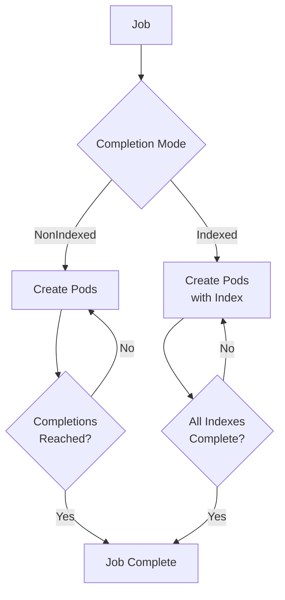

# Kubernetes Controller Manager Internals: Workload Controllers

## Table of Contents
- [Overview](#overview)
- [ReplicaSet Controller](#replicaset-controller)
- [Deployment Controller](#deployment-controller)
- [StatefulSet Controller](#statefulset-controller)
- [DaemonSet Controller](#daemonset-controller)
- [Job Controller](#job-controller)
- [CronJob Controller](#cronjob-controller)
- [Code References](#code-references)

## Overview

Workload controllers manage the lifecycle of pods and ensure the desired number of replicas are running. Each controller implements specific semantics for different workload types.

**Key Controllers:**
- **ReplicaSet**: Maintains a stable set of replica pods
- **Deployment**: Provides declarative updates for pods and ReplicaSets
- **StatefulSet**: Manages stateful applications with stable identities
- **DaemonSet**: Ensures pods run on all (or selected) nodes
- **Job**: Runs pods to completion
- **CronJob**: Schedules jobs on a time-based schedule

**Key Source Files:**
- `pkg/controller/replicaset/` - ReplicaSet controller
- `pkg/controller/deployment/` - Deployment controller
- `pkg/controller/statefulset/` - StatefulSet controller
- `pkg/controller/daemon/` - DaemonSet controller
- `pkg/controller/job/` - Job controller
- `pkg/controller/cronjob/` - CronJob controller

## ReplicaSet Controller

The ReplicaSet controller ensures a specified number of pod replicas are running at any given time.

### ReplicaSet Architecture



### ReplicaSet Controller Implementation

```go
type ReplicaSetController struct {
    // Kubernetes client
    kubeClient clientset.Interface
    
    // Pod control for creating/deleting pods
    podControl controller.PodControlInterface
    
    // Informers and listers
    rsLister  appslisters.ReplicaSetLister
    podLister corelisters.PodLister
    
    // Work queue
    queue workqueue.RateLimitingInterface
    
    // Expectations for pod creates/deletes
    expectations controller.ControllerExpectationsInterface
}

func (rsc *ReplicaSetController) syncReplicaSet(
    ctx context.Context,
    key string,
) error {
    
    namespace, name, err := cache.SplitMetaNamespaceKey(key)
    if err != nil {
        return err
    }
    
    // 1. Get ReplicaSet
    rs, err := rsc.rsLister.ReplicaSets(namespace).Get(name)
    if errors.IsNotFound(err) {
        return nil
    }
    if err != nil {
        return err
    }
    
    // 2. Check expectations
    rsKey, err := controller.KeyFunc(rs)
    if err != nil {
        return err
    }
    
    if !rsc.expectations.SatisfiedExpectations(rsKey) {
        // Wait for expectations to be met
        return nil
    }
    
    // 3. Get all pods
    allPods, err := rsc.podLister.Pods(rs.Namespace).List(labels.Everything())
    if err != nil {
        return err
    }
    
    // 4. Filter pods owned by this ReplicaSet
    filteredPods := controller.FilterActivePods(allPods)
    filteredPods = rsc.claimPods(rs, filteredPods)
    
    // 5. Calculate diff
    diff := len(filteredPods) - int(*rs.Spec.Replicas)
    
    if diff < 0 {
        // Need to create pods
        diff *= -1
        if diff > rsc.burstReplicas {
            diff = rsc.burstReplicas
        }
        
        // Set expectations
        rsc.expectations.ExpectCreations(rsKey, diff)
        
        // Create pods in parallel
        successfulCreations, err := rsc.podControl.CreatePodsWithControllerRef(
            rs.Namespace, &rs.Spec.Template, rs, 
            metav1.NewControllerRef(rs, rsKind), diff)
        
        if err != nil {
            // Adjust expectations for failed creates
            rsc.expectations.CreationObserved(rsKey)
            return err
        }
        
    } else if diff > 0 {
        // Need to delete pods
        if diff > rsc.burstReplicas {
            diff = rsc.burstReplicas
        }
        
        // Set expectations
        rsc.expectations.ExpectDeletions(rsKey, diff)
        
        // Select pods to delete
        podsToDelete := getPodsToDelete(filteredPods, diff)
        
        // Delete pods in parallel
        errCh := make(chan error, diff)
        var wg sync.WaitGroup
        wg.Add(diff)
        
        for _, pod := range podsToDelete {
            go func(targetPod *v1.Pod) {
                defer wg.Done()
                if err := rsc.podControl.DeletePod(
                    rs.Namespace, targetPod.Name, rs); err != nil {
                    errCh <- err
                }
            }(pod)
        }
        wg.Wait()
        
        select {
        case err := <-errCh:
            return err
        default:
        }
    }
    
    // 6. Update status
    return rsc.updateReplicaSetStatus(rs, filteredPods)
}
```

### Pod Selection for Deletion

```go
func getPodsToDelete(pods []*v1.Pod, diff int) []*v1.Pod {
    // Sort pods by priority for deletion
    sort.Sort(controller.ActivePods(pods))
    
    return pods[:diff]
}

// ActivePods implements sort.Interface for sorting pods
type ActivePods []*v1.Pod

func (s ActivePods) Len() int      { return len(s) }
func (s ActivePods) Swap(i, j int) { s[i], s[j] = s[j], s[i] }

func (s ActivePods) Less(i, j int) bool {
    // 1. Unassigned < assigned
    if s[i].Spec.NodeName != s[j].Spec.NodeName {
        return s[i].Spec.NodeName == ""
    }
    
    // 2. PodPending < PodUnknown < PodRunning
    if podPhaseToOrdinal[s[i].Status.Phase] != 
       podPhaseToOrdinal[s[j].Status.Phase] {
        return podPhaseToOrdinal[s[i].Status.Phase] < 
               podPhaseToOrdinal[s[j].Status.Phase]
    }
    
    // 3. Not ready < ready
    if podutil.IsPodReady(s[i]) != podutil.IsPodReady(s[j]) {
        return !podutil.IsPodReady(s[i])
    }
    
    // 4. Lower restart count < higher restart count
    if restartCount(s[i]) != restartCount(s[j]) {
        return restartCount(s[i]) < restartCount(s[j])
    }
    
    // 5. Newer creation time < older creation time
    return s[i].CreationTimestamp.After(s[j].CreationTimestamp.Time)
}
```

## Deployment Controller

The Deployment controller provides declarative updates for pods and ReplicaSets.

### Deployment Update Strategies



### Deployment Controller Implementation

```go
type DeploymentController struct {
    client        clientset.Interface
    
    // Listers
    dLister       appslisters.DeploymentLister
    rsLister      appslisters.ReplicaSetLister
    podLister     corelisters.PodLister
    
    // Work queue
    queue         workqueue.RateLimitingInterface
    
    // Sync handler
    syncHandler   func(ctx context.Context, dKey string) error
}

func (dc *DeploymentController) syncDeployment(
    ctx context.Context,
    key string,
) error {
    
    namespace, name, err := cache.SplitMetaNamespaceKey(key)
    if err != nil {
        return err
    }
    
    // 1. Get Deployment
    deployment, err := dc.dLister.Deployments(namespace).Get(name)
    if errors.IsNotFound(err) {
        return nil
    }
    if err != nil {
        return err
    }
    
    // 2. Get all ReplicaSets
    rsList, err := dc.getReplicaSetsForDeployment(deployment)
    if err != nil {
        return err
    }
    
    // 3. Get all pods
    podMap, err := dc.getPodMapForDeployment(deployment, rsList)
    if err != nil {
        return err
    }
    
    // 4. Check if deployment is paused
    if deployment.Spec.Paused {
        return dc.sync(deployment, rsList)
    }
    
    // 5. Handle different strategies
    switch deployment.Spec.Strategy.Type {
    case apps.RecreateDeploymentStrategyType:
        return dc.rolloutRecreate(deployment, rsList, podMap)
    case apps.RollingUpdateDeploymentStrategyType:
        return dc.rolloutRolling(deployment, rsList)
    }
    
    return fmt.Errorf("unknown strategy type: %s", 
        deployment.Spec.Strategy.Type)
}

func (dc *DeploymentController) rolloutRolling(
    deployment *apps.Deployment,
    rsList []*apps.ReplicaSet,
) error {
    
    // 1. Find new and old ReplicaSets
    newRS, oldRSs, err := dc.getAllReplicaSetsAndSyncRevision(
        deployment, rsList, true)
    if err != nil {
        return err
    }
    
    // 2. Scale up new ReplicaSet
    scaledUp, err := dc.reconcileNewReplicaSet(deployment, newRS)
    if err != nil {
        return err
    }
    if scaledUp {
        // Wait for new pods to be ready
        return nil
    }
    
    // 3. Scale down old ReplicaSets
    scaledDown, err := dc.reconcileOldReplicaSets(
        deployment, oldRSs, newRS)
    if err != nil {
        return err
    }
    if scaledDown {
        return nil
    }
    
    // 4. Clean up old ReplicaSets
    if err := dc.cleanupDeployment(oldRSs, deployment); err != nil {
        return err
    }
    
    // 5. Update status
    return dc.syncDeploymentStatus(deployment, newRS, oldRSs)
}

func (dc *DeploymentController) reconcileNewReplicaSet(
    deployment *apps.Deployment,
    newRS *apps.ReplicaSet,
) (bool, error) {
    
    // Calculate max surge
    maxSurge := deploymentutil.MaxSurge(*deployment)
    
    // Calculate desired replicas for new RS
    newReplicasCount, err := deploymentutil.NewRSNewReplicas(
        deployment, []*apps.ReplicaSet{newRS}, newRS)
    if err != nil {
        return false, err
    }
    
    // Scale new RS if needed
    if *(newRS.Spec.Replicas) != newReplicasCount {
        scaled, _, err := dc.scaleReplicaSet(
            newRS, newReplicasCount, deployment)
        return scaled, err
    }
    
    return false, nil
}
```

### Rolling Update Algorithm

```go
func NewRSNewReplicas(
    deployment *apps.Deployment,
    allRSs []*apps.ReplicaSet,
    newRS *apps.ReplicaSet,
) (int32, error) {
    
    // Get deployment replicas
    deploymentReplicas := *(deployment.Spec.Replicas)
    
    // Calculate max surge and max unavailable
    maxSurge := MaxSurge(*deployment)
    maxUnavailable := MaxUnavailable(*deployment)
    
    // Count current replicas
    currentPodCount := GetReplicaCountForReplicaSets(allRSs)
    
    // Calculate available pods
    availablePodCount := GetAvailableReplicaCountForReplicaSets(allRSs)
    
    // Max total pods = desired + maxSurge
    maxTotalPods := deploymentReplicas + maxSurge
    
    // If current > max, scale down
    if currentPodCount >= maxTotalPods {
        return *(newRS.Spec.Replicas), nil
    }
    
    // Calculate how many more pods we can create
    scaleUpCount := maxTotalPods - currentPodCount
    
    // Don't scale up if we're below minAvailable
    minAvailable := deploymentReplicas - maxUnavailable
    if availablePodCount < minAvailable {
        // Wait for more pods to become available
        return *(newRS.Spec.Replicas), nil
    }
    
    // Scale up new RS
    return *(newRS.Spec.Replicas) + scaleUpCount, nil
}
```

## StatefulSet Controller

The StatefulSet controller manages stateful applications with stable network identities and persistent storage.

### StatefulSet Characteristics



### StatefulSet Controller Implementation

```go
type StatefulSetController struct {
    client        clientset.Interface
    
    // Listers
    setLister     appslisters.StatefulSetLister
    podLister     corelisters.PodLister
    pvcLister     corelisters.PersistentVolumeClaimLister
    
    // Control
    control       StatefulSetControlInterface
    
    // Work queue
    queue         workqueue.RateLimitingInterface
}

func (ssc *StatefulSetController) sync(
    ctx context.Context,
    key string,
) error {
    
    namespace, name, err := cache.SplitMetaNamespaceKey(key)
    if err != nil {
        return err
    }
    
    // 1. Get StatefulSet
    set, err := ssc.setLister.StatefulSets(namespace).Get(name)
    if errors.IsNotFound(err) {
        return nil
    }
    if err != nil {
        return err
    }
    
    // 2. Get pods
    pods, err := ssc.getPodsForStatefulSet(set)
    if err != nil {
        return err
    }
    
    // 3. Update StatefulSet
    return ssc.control.UpdateStatefulSet(ctx, set, pods)
}

func (ssc *defaultStatefulSetControl) UpdateStatefulSet(
    ctx context.Context,
    set *apps.StatefulSet,
    pods []*v1.Pod,
) error {
    
    // 1. Get current and update revisions
    currentRevision, updateRevision, err := 
        ssc.getStatefulSetRevisions(set)
    if err != nil {
        return err
    }
    
    // 2. Perform update based on strategy
    status, err := ssc.updateStatefulSet(
        ctx, set, currentRevision, updateRevision, pods)
    if err != nil {
        return err
    }
    
    // 3. Update status
    return ssc.updateStatefulSetStatus(set, status)
}

func (ssc *defaultStatefulSetControl) updateStatefulSet(
    ctx context.Context,
    set *apps.StatefulSet,
    currentRevision *apps.ControllerRevision,
    updateRevision *apps.ControllerRevision,
    pods []*v1.Pod,
) (*apps.StatefulSetStatus, error) {
    
    // Sort pods by ordinal
    sort.Sort(ascendingOrdinal(pods))
    
    // Get replicas
    replicas := int(*set.Spec.Replicas)
    
    // Examine each pod
    for i := range pods {
        // Check if pod needs update
        if !isRunningAndReady(pods[i]) {
            continue
        }
        
        // Check revision
        if getPodRevision(pods[i]) != updateRevision.Name {
            // Pod needs update
            if set.Spec.UpdateStrategy.Type == 
               apps.RollingUpdateStatefulSetStrategyType {
                // Delete pod for rolling update
                if err := ssc.podControl.DeleteStatefulPod(
                    set, pods[i]); err != nil {
                    return nil, err
                }
            }
        }
    }
    
    // Create missing pods
    for i := len(pods); i < replicas; i++ {
        pod := newStatefulSetPod(set, i, updateRevision)
        if err := ssc.podControl.CreateStatefulPod(
            ctx, set, pod); err != nil {
            return nil, err
        }
    }
    
    // Delete extra pods (scale down)
    for i := replicas; i < len(pods); i++ {
        if err := ssc.podControl.DeleteStatefulPod(
            set, pods[i]); err != nil {
            return nil, err
        }
    }
    
    return &apps.StatefulSetStatus{
        Replicas:        int32(len(pods)),
        ReadyReplicas:   int32(countReadyPods(pods)),
        CurrentRevision: currentRevision.Name,
        UpdateRevision:  updateRevision.Name,
    }, nil
}
```

### StatefulSet Ordering Guarantees

```go
// Pods are created in order: 0, 1, 2, ...
func (ssc *defaultStatefulSetControl) createPods(
    set *apps.StatefulSet,
    pods []*v1.Pod,
    replicas int,
) error {
    
    for i := len(pods); i < replicas; i++ {
        // Wait for previous pod to be running and ready
        if i > 0 && !isRunningAndReady(pods[i-1]) {
            return nil
        }
        
        // Create pod
        pod := newStatefulSetPod(set, i, updateRevision)
        if err := ssc.podControl.CreateStatefulPod(
            ctx, set, pod); err != nil {
            return err
        }
    }
    
    return nil
}

// Pods are deleted in reverse order: ..., 2, 1, 0
func (ssc *defaultStatefulSetControl) deletePods(
    set *apps.StatefulSet,
    pods []*v1.Pod,
    replicas int,
) error {
    
    for i := len(pods) - 1; i >= replicas; i-- {
        // Wait for next pod to be deleted
        if i < len(pods)-1 && pods[i+1] != nil {
            return nil
        }
        
        // Delete pod
        if err := ssc.podControl.DeleteStatefulPod(
            set, pods[i]); err != nil {
            return err
        }
    }
    
    return nil
}
```

## DaemonSet Controller

The DaemonSet controller ensures that all (or some) nodes run a copy of a pod.

### DaemonSet Node Selection



### DaemonSet Controller Implementation

```go
type DaemonSetsController struct {
    kubeClient    clientset.Interface
    
    // Listers
    dsLister      appslisters.DaemonSetLister
    podLister     corelisters.PodLister
    nodeLister    corelisters.NodeLister
    
    // Work queue
    queue         workqueue.RateLimitingInterface
}

func (dsc *DaemonSetsController) syncDaemonSet(
    ctx context.Context,
    key string,
) error {
    
    namespace, name, err := cache.SplitMetaNamespaceKey(key)
    if err != nil {
        return err
    }
    
    // 1. Get DaemonSet
    ds, err := dsc.dsLister.DaemonSets(namespace).Get(name)
    if errors.IsNotFound(err) {
        return nil
    }
    if err != nil {
        return err
    }
    
    // 2. Get all nodes
    nodeList, err := dsc.nodeLister.List(labels.Everything())
    if err != nil {
        return err
    }
    
    // 3. Get all pods
    pods, err := dsc.getPodsForDaemonSet(ds)
    if err != nil {
        return err
    }
    
    // 4. Manage DaemonSet
    return dsc.manage(ds, nodeList, pods)
}

func (dsc *DaemonSetsController) manage(
    ds *apps.DaemonSet,
    nodeList []*v1.Node,
    pods []*v1.Pod,
) error {
    
    // Build node to daemon pods map
    nodeToDaemonPods := make(map[string][]*v1.Pod)
    for _, pod := range pods {
        nodeName := pod.Spec.NodeName
        nodeToDaemonPods[nodeName] = append(
            nodeToDaemonPods[nodeName], pod)
    }
    
    // Determine which nodes should run daemon pods
    var nodesNeedingDaemonPods []string
    var podsToDelete []string
    
    for _, node := range nodeList {
        // Check if node should run daemon pod
        shouldRun, shouldContinueRunning := 
            dsc.nodeShouldRunDaemonPod(node, ds)
        
        daemonPods := nodeToDaemonPods[node.Name]
        
        switch {
        case shouldRun && len(daemonPods) == 0:
            // Need to create pod
            nodesNeedingDaemonPods = append(
                nodesNeedingDaemonPods, node.Name)
            
        case shouldContinueRunning:
            // Pod should continue running
            continue
            
        case !shouldContinueRunning && len(daemonPods) > 0:
            // Need to delete pods
            for _, pod := range daemonPods {
                podsToDelete = append(podsToDelete, pod.Name)
            }
        }
    }
    
    // Create pods
    for _, nodeName := range nodesNeedingDaemonPods {
        if err := dsc.podControl.CreatePodsOnNode(
            nodeName, ds.Namespace, &ds.Spec.Template, 
            ds, metav1.NewControllerRef(ds, dsKind)); err != nil {
            return err
        }
    }
    
    // Delete pods
    for _, podName := range podsToDelete {
        if err := dsc.podControl.DeletePod(
            ds.Namespace, podName, ds); err != nil {
            return err
        }
    }
    
    return nil
}
```

## Job Controller

The Job controller manages pods that run to completion.

### Job Completion Modes



### Job Controller Implementation

```go
type Controller struct {
    kubeClient    clientset.Interface
    
    // Listers
    jobLister     batchlisters.JobLister
    podLister     corelisters.PodLister
    
    // Work queue
    queue         workqueue.RateLimitingInterface
    
    // Expectations
    expectations  controller.ControllerExpectationsInterface
}

func (jm *Controller) syncJob(
    ctx context.Context,
    key string,
) error {
    
    namespace, name, err := cache.SplitMetaNamespaceKey(key)
    if err != nil {
        return err
    }
    
    // 1. Get Job
    job, err := jm.jobLister.Jobs(namespace).Get(name)
    if errors.IsNotFound(err) {
        return nil
    }
    if err != nil {
        return err
    }
    
    // 2. Get pods
    pods, err := jm.getPodsForJob(job)
    if err != nil {
        return err
    }
    
    // 3. Count pod states
    active := 0
    succeeded := 0
    failed := 0
    
    for _, pod := range pods {
        switch pod.Status.Phase {
        case v1.PodRunning, v1.PodPending:
            active++
        case v1.PodSucceeded:
            succeeded++
        case v1.PodFailed:
            failed++
        }
    }
    
    // 4. Check if job is complete
    if job.Spec.Completions != nil && 
       succeeded >= int(*job.Spec.Completions) {
        return jm.markJobComplete(job)
    }
    
    // 5. Check if job has failed
    if job.Spec.BackoffLimit != nil && 
       failed > int(*job.Spec.BackoffLimit) {
        return jm.markJobFailed(job, "BackoffLimitExceeded")
    }
    
    // 6. Calculate pods to create
    parallelism := int(*job.Spec.Parallelism)
    completions := int(*job.Spec.Completions)
    
    wantActive := 0
    if completions > 0 {
        wantActive = min(parallelism, completions-succeeded)
    } else {
        wantActive = parallelism
    }
    
    diff := wantActive - active
    
    // 7. Create or delete pods
    if diff > 0 {
        // Create pods
        for i := 0; i < diff; i++ {
            if err := jm.podControl.CreatePods(
                job.Namespace, &job.Spec.Template, job); err != nil {
                return err
            }
        }
    } else if diff < 0 {
        // Delete pods
        podsToDelete := getPodsToDelete(pods, -diff)
        for _, pod := range podsToDelete {
            if err := jm.podControl.DeletePod(
                job.Namespace, pod.Name, job); err != nil {
                return err
            }
        }
    }
    
    return nil
}
```

## CronJob Controller

The CronJob controller creates Jobs on a time-based schedule.

### CronJob Scheduling

```go
type Controller struct {
    kubeClient    clientset.Interface
    
    // Listers
    cjLister      batchlisters.CronJobLister
    jobLister     batchlisters.JobLister
    
    // Work queue
    queue         workqueue.RateLimitingInterface
}

func (jm *Controller) syncCronJob(
    ctx context.Context,
    key string,
) error {
    
    namespace, name, err := cache.SplitMetaNamespaceKey(key)
    if err != nil {
        return err
    }
    
    // 1. Get CronJob
    cronJob, err := jm.cjLister.CronJobs(namespace).Get(name)
    if errors.IsNotFound(err) {
        return nil
    }
    if err != nil {
        return err
    }
    
    // 2. Get jobs owned by this CronJob
    jobs, err := jm.getJobsForCronJob(cronJob)
    if err != nil {
        return err
    }
    
    // 3. Clean up old jobs
    if err := jm.cleanupFinishedJobs(cronJob, jobs); err != nil {
        return err
    }
    
    // 4. Check if suspended
    if cronJob.Spec.Suspend != nil && *cronJob.Spec.Suspend {
        return nil
    }
    
    // 5. Get schedule
    schedule, err := cron.ParseStandard(cronJob.Spec.Schedule)
    if err != nil {
        return err
    }
    
    // 6. Calculate next schedule time
    now := time.Now()
    scheduledTime := getNextScheduleTime(
        cronJob, now, schedule)
    
    if scheduledTime == nil {
        // No schedule time yet
        return nil
    }
    
    // 7. Check if it's time to create a job
    if now.Before(*scheduledTime) {
        // Not time yet, requeue
        jm.queue.AddAfter(key, 
            scheduledTime.Sub(now))
        return nil
    }
    
    // 8. Create job
    jobReq, err := getJobFromTemplate(cronJob, *scheduledTime)
    if err != nil {
        return err
    }
    
    _, err = jm.kubeClient.BatchV1().Jobs(
        cronJob.Namespace).Create(ctx, jobReq, metav1.CreateOptions{})
    
    return err
}
```

## Code References

### Key Files

| Controller  | Location                      | Purpose                 |
| ----------- | ----------------------------- | ----------------------- |
| ReplicaSet  | `pkg/controller/replicaset/`  | Maintains replica count |
| Deployment  | `pkg/controller/deployment/`  | Declarative updates     |
| StatefulSet | `pkg/controller/statefulset/` | Stateful workloads      |
| DaemonSet   | `pkg/controller/daemon/`      | Node-level pods         |
| Job         | `pkg/controller/job/`         | Run-to-completion       |
| CronJob     | `pkg/controller/cronjob/`     | Scheduled jobs          |

### Controller Comparison

| Feature      | ReplicaSet | Deployment       | StatefulSet      | DaemonSet | Job         |
| ------------ | ---------- | ---------------- | ---------------- | --------- | ----------- |
| Pod Identity | Random     | Random           | Stable           | Random    | Random      |
| Scaling      | Yes        | Yes              | Yes              | Per-node  | Parallelism |
| Updates      | Replace    | Rolling/Recreate | Rolling/OnDelete | Rolling   | N/A         |
| Storage      | Ephemeral  | Ephemeral        | Persistent       | Ephemeral | Ephemeral   |
| Ordering     | No         | No               | Yes              | No        | No          |

---

**Related Documentation:**
- [INTERNALS_PATTERNS.md](./INTERNALS_PATTERNS.md) - Controller patterns and reconciliation
- [Kubernetes Controllers](https://kubernetes.io/docs/concepts/architecture/controller/) - Official documentation

