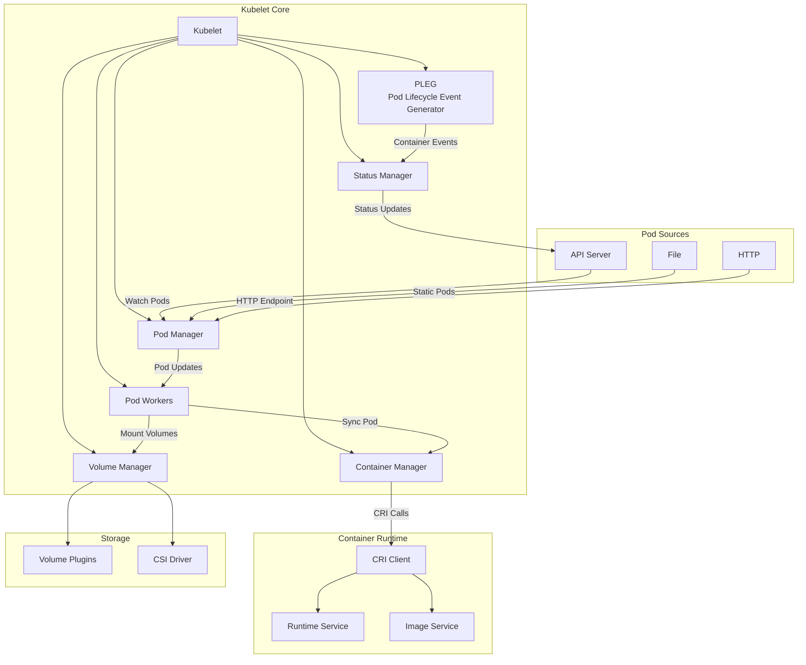
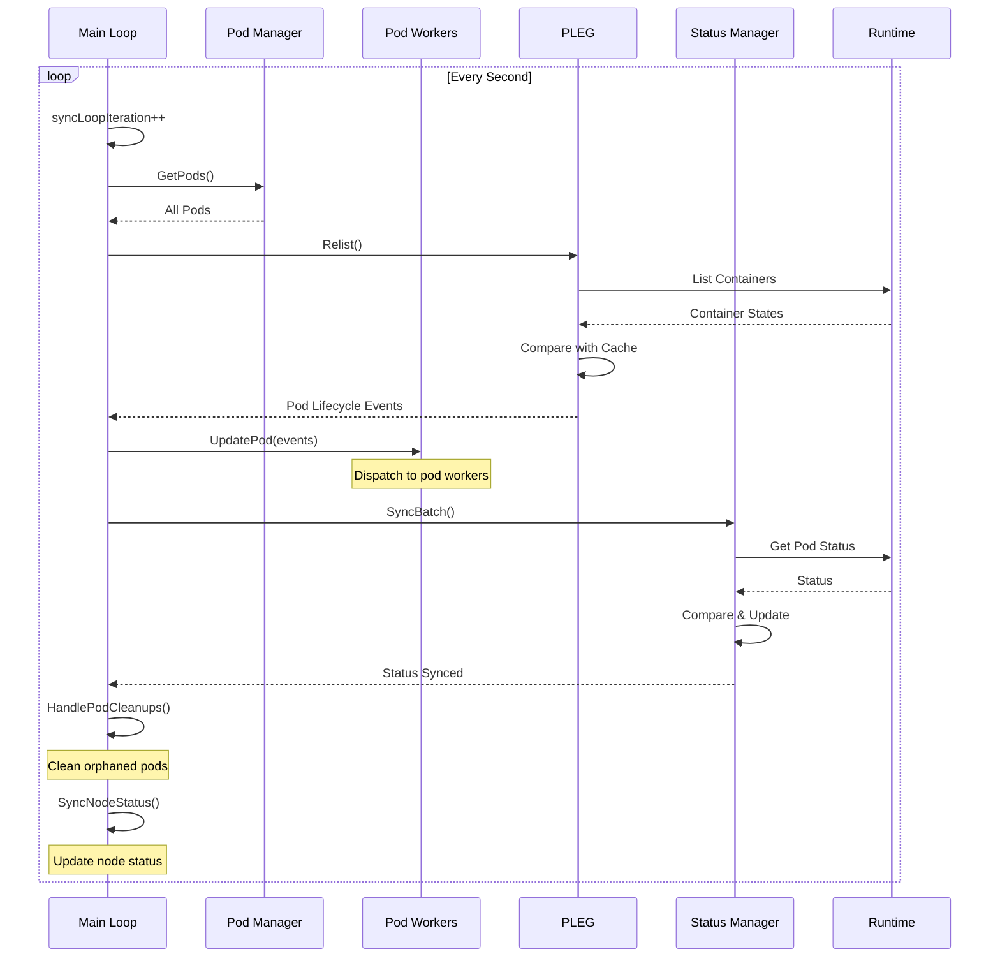
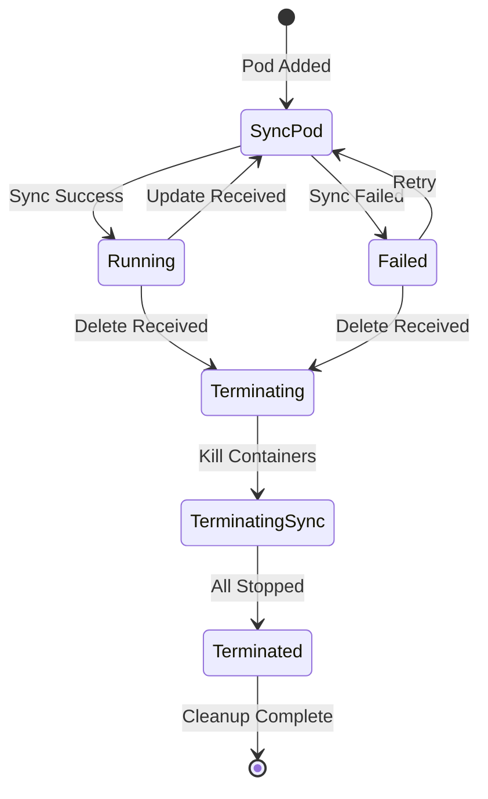
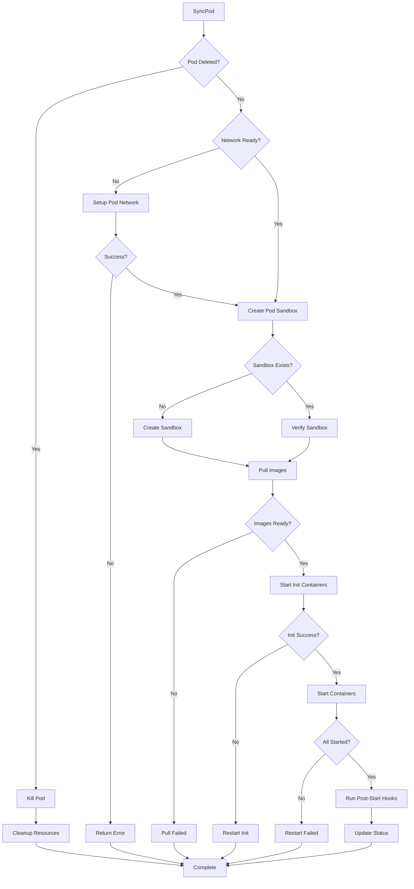
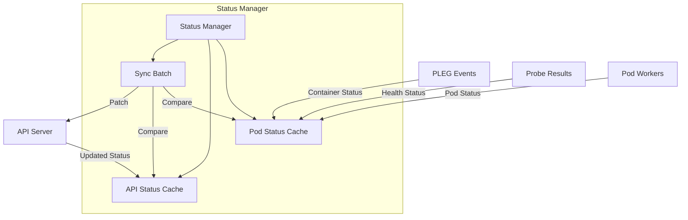
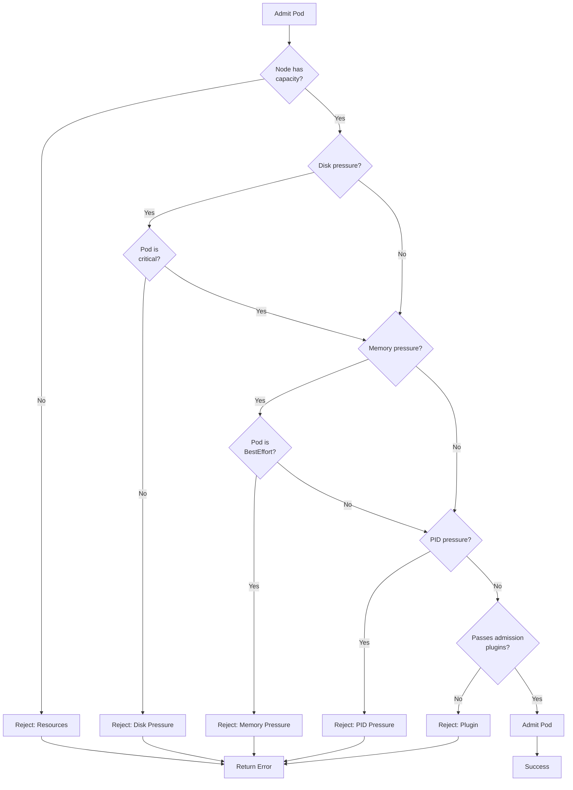

# Kubelet Internals: Pod Lifecycle Management

## Table of Contents
- [Overview](#overview)
- [Kubelet Architecture](#kubelet-architecture)
- [Main Sync Loop](#main-sync-loop)
- [Pod Workers](#pod-workers)
- [Pod Lifecycle States](#pod-lifecycle-states)
- [Status Synchronization](#status-synchronization)
- [Pod Admission](#pod-admission)
- [Pod Eviction](#pod-eviction)
- [Code References](#code-references)

## Overview

The kubelet is the primary node agent that runs on each node in a Kubernetes cluster. It manages the lifecycle of pods and containers, ensuring that containers are running and healthy according to the PodSpec.

**Key Responsibilities:**
- Watch for pod assignments from the API server
- Ensure containers are running in pods
- Report pod and node status back to the API server
- Execute container probes (liveness, readiness, startup)
- Manage volumes and secrets
- Execute pod lifecycle hooks

**Key Source Files:**
- `pkg/kubelet/kubelet.go` - Main kubelet struct and initialization
- `pkg/kubelet/kubelet_pods.go` - Pod management functions
- `pkg/kubelet/pod_workers.go` - Pod worker implementation
- `pkg/kubelet/status/status_manager.go` - Status synchronization

## Kubelet Architecture



### Kubelet Struct

The main kubelet struct (`pkg/kubelet/kubelet.go:446-1130`):

```go
type Kubelet struct {
    // Core components
    hostname              string
    nodeName              types.NodeName
    kubeClient            clientset.Interface
    
    // Pod management
    podManager            kubepod.Manager
    podWorkers            PodWorkers
    workQueue             queue.WorkQueue
    
    // Status management
    statusManager         status.Manager
    probeManager          prober.Manager
    
    // Container runtime
    containerRuntime      kubecontainer.Runtime
    runtimeService        internalapi.RuntimeService
    imageService          internalapi.ImageManagerService
    
    // Volume management
    volumeManager         volumemanager.VolumeManager
    volumePluginMgr       *volume.VolumePluginMgr
    
    // Resource management
    containerManager      cm.ContainerManager
    
    // Pod lifecycle event generator
    pleg                  pleg.PodLifecycleEventGenerator
    
    // Configuration
    kubeletConfiguration  kubeletconfiginternal.KubeletConfiguration
    
    // Sync state
    syncLoopIteration     int32
    lastSyncLoopStart     time.Time
}
```

## Main Sync Loop

The kubelet's main sync loop is the heart of pod lifecycle management.

### Sync Loop Flow



### Sync Loop Implementation

The main sync loop (`pkg/kubelet/kubelet.go:2505-2546`):

```go
func (kl *Kubelet) syncLoop(
    ctx context.Context,
    updates <-chan kubetypes.PodUpdate,
    handler SyncHandler,
) {
    logger := klog.FromContext(ctx)
    
    // Sync loop ticker
    syncTicker := time.NewTicker(time.Second)
    defer syncTicker.Stop()
    
    // Housekeeping ticker
    housekeepingTicker := time.NewTicker(
        housekeepingPeriod)
    defer housekeepingTicker.Stop()
    
    // PLEG channel
    plegCh := kl.pleg.Watch()
    
    for {
        select {
        case <-ctx.Done():
            return
            
        case update := <-updates:
            // Handle pod updates from sources
            switch update.Op {
            case kubetypes.ADD:
                handler.HandlePodAdditions(ctx, update.Pods)
            case kubetypes.UPDATE:
                handler.HandlePodUpdates(ctx, update.Pods)
            case kubetypes.REMOVE:
                handler.HandlePodRemoves(ctx, update.Pods)
            case kubetypes.RECONCILE:
                handler.HandlePodReconcile(ctx, update.Pods)
            case kubetypes.DELETE:
                handler.HandlePodDeletes(ctx, update.Pods)
            }
            
        case event := <-plegCh:
            // Handle container lifecycle events
            if event.Type == pleg.ContainerStarted {
                kl.handleContainerStarted(event)
            }
            kl.podWorkers.UpdatePod(UpdatePodOptions{
                Pod:        event.Pod,
                UpdateType: kubetypes.SyncPodUpdate,
            })
            
        case <-syncTicker.C:
            // Periodic sync
            kl.syncLoopIteration++
            
        case <-housekeepingTicker.C:
            // Housekeeping tasks
            if err := handler.HandlePodCleanups(ctx); err != nil {
                logger.Error(err, "Failed cleaning pods")
            }
        }
    }
}
```

### Pod Update Handling

When pods are added or updated (`pkg/kubelet/kubelet.go:2717-2793`):

```go
func (kl *Kubelet) HandlePodAdditions(
    ctx context.Context, 
    pods []*v1.Pod,
) {
    // Sort pods by creation timestamp
    sort.Sort(sliceutils.PodsByCreationTime(pods))
    
    for _, pod := range pods {
        // Get existing pod from pod manager
        existingPods := kl.podManager.GetPods()
        
        // Add pod to pod manager
        kl.podManager.AddPod(pod)
        
        // Check if pod is already running
        if kl.podWorkers.IsPodTerminationRequested(pod.UID) {
            continue
        }
        
        // Validate pod admission
        if !kl.canAdmitPod(existingPods, pod) {
            kl.rejectPod(pod)
            continue
        }
        
        // Create mirror pod for static pods
        if kubetypes.IsStaticPod(pod) {
            if err := kl.podManager.CreateMirrorPod(pod); err != nil {
                logger.Error(err, "Failed creating mirror pod")
            }
        }
        
        // Dispatch to pod worker
        kl.podWorkers.UpdatePod(UpdatePodOptions{
            Pod:        pod,
            UpdateType: kubetypes.SyncPodCreate,
        })
    }
}
```

## Pod Workers

Pod workers manage the lifecycle of individual pods in separate goroutines.

### Pod Worker Architecture



### Pod Worker Implementation

The pod worker struct (`pkg/kubelet/pod_workers.go:755-997`):

```go
type podWorkers struct {
    // Map of pod UID to pod worker state
    podLock sync.Mutex
    podSyncStatuses map[types.UID]*podSyncStatus
    
    // Work queue for pod updates
    podUpdates map[types.UID]chan struct{}
    
    // Callbacks
    syncPodFn            syncPodFnType
    syncTerminatingPodFn syncTerminatingPodFnType
    
    // Metrics
    workQueue queue.WorkQueue
}

type podSyncStatus struct {
    // Current pod state
    syncedAt time.Time
    working  bool
    
    // Termination state
    terminatingAt       time.Time
    terminatedAt        time.Time
    gracePeriod         *int64
    
    // Pod and status
    activeUpdate *UpdatePodOptions
    pendingUpdate *UpdatePodOptions
}

func (p *podWorkers) UpdatePod(options UpdatePodOptions) {
    pod := options.Pod
    uid := pod.UID
    
    p.podLock.Lock()
    defer p.podLock.Unlock()
    
    // Get or create pod sync status
    status, exists := p.podSyncStatuses[uid]
    if !exists {
        status = &podSyncStatus{}
        p.podSyncStatuses[uid] = status
        
        // Create update channel
        podUpdates := make(chan struct{}, 1)
        p.podUpdates[uid] = podUpdates
        
        // Start pod worker goroutine
        go p.podWorkerLoop(uid, podUpdates)
    }
    
    // Queue update
    status.pendingUpdate = &options
    select {
    case p.podUpdates[uid] <- struct{}{}:
    default:
        // Already queued
    }
}
```

### Pod Worker Loop

The worker loop for each pod (`pkg/kubelet/pod_workers.go:1237-1363`):

```go
func (p *podWorkers) podWorkerLoop(
    podUID types.UID,
    podUpdates <-chan struct{},
) {
    defer runtime.HandleCrash()
    
    for range podUpdates {
        p.podLock.Lock()
        status := p.podSyncStatuses[podUID]
        
        // Get pending update
        update := status.pendingUpdate
        if update == nil {
            p.podLock.Unlock()
            continue
        }
        
        // Mark as working
        status.working = true
        status.activeUpdate = update
        status.pendingUpdate = nil
        p.podLock.Unlock()
        
        // Execute sync based on pod state
        err := func() error {
            pod := update.Pod
            
            // Check if pod is being terminated
            if status.terminatingAt.IsZero() {
                // Normal sync
                return p.syncPodFn(
                    update.UpdateType,
                    pod,
                    update.MirrorPod,
                    status,
                )
            } else {
                // Terminating sync
                return p.syncTerminatingPodFn(
                    pod,
                    status,
                )
            }
        }()
        
        // Update status
        p.podLock.Lock()
        status.working = false
        status.syncedAt = time.Now()
        
        if err != nil {
            // Retry on error
            status.pendingUpdate = update
            select {
            case p.podUpdates[podUID] <- struct{}{}:
            default:
            }
        }
        p.podLock.Unlock()
    }
}
```

## Pod Lifecycle States

### Pod Sync Process



### SyncPod Implementation

The main pod sync function (`pkg/kubelet/kubelet.go:1947-2175`):

```go
func (kl *Kubelet) SyncPod(
    ctx context.Context,
    updateType kubetypes.SyncPodType,
    pod *v1.Pod,
    mirrorPod *v1.Pod,
    podStatus *kubecontainer.PodStatus,
) (isTerminal bool, err error) {
    
    logger := klog.FromContext(ctx)
    
    // 1. Check if pod is being deleted
    if pod.DeletionTimestamp != nil {
        return true, kl.syncTerminatingPod(
            ctx, pod, podStatus, nil)
    }
    
    // 2. Verify pod can run on this node
    if err := kl.canRunPod(pod); err != nil {
        kl.rejectPod(pod)
        return false, err
    }
    
    // 3. Create pod directories
    if err := kl.makePodDataDirs(pod); err != nil {
        return false, err
    }
    
    // 4. Wait for volumes to be attached and mounted
    if err := kl.volumeManager.WaitForAttachAndMount(
        ctx, pod); err != nil {
        return false, err
    }
    
    // 5. Fetch pod secrets and configmaps
    pullSecrets, err := kl.getPullSecretsForPod(pod)
    if err != nil {
        return false, err
    }
    
    // 6. Call container runtime to sync pod
    result := kl.containerRuntime.SyncPod(
        ctx,
        pod,
        podStatus,
        pullSecrets,
        kl.backOff,
    )
    
    return false, result.Error()
}
```

### Container Lifecycle

The container runtime sync (`pkg/kubelet/kuberuntime/kuberuntime_manager.go`):

```go
func (m *kubeGenericRuntimeManager) SyncPod(
    ctx context.Context,
    pod *v1.Pod,
    podStatus *kubecontainer.PodStatus,
    pullSecrets []v1.Secret,
    backOff *flowcontrol.Backoff,
) (result kubecontainer.PodSyncResult) {
    
    // 1. Compute pod sandbox and container changes
    podContainerChanges := m.computePodActions(pod, podStatus)
    
    // 2. Kill pod sandbox if needed
    if podContainerChanges.KillPod {
        if err := m.killPodWithSyncResult(
            ctx, pod, podStatus, &result); err != nil {
            return result
        }
    }
    
    // 3. Create pod sandbox if needed
    if podContainerChanges.CreateSandbox {
        podSandboxID, err := m.createPodSandbox(
            ctx, pod, podContainerChanges.Attempt)
        if err != nil {
            result.Fail(err)
            return result
        }
        podStatus.SandboxStatuses[0].Id = podSandboxID
    }
    
    // 4. Start init containers
    if len(pod.Spec.InitContainers) > 0 {
        if err := m.startInitContainers(
            ctx, pod, podStatus, pullSecrets); err != nil {
            result.Fail(err)
            return result
        }
    }
    
    // 5. Start regular containers
    for idx := range pod.Spec.Containers {
        container := &pod.Spec.Containers[idx]
        
        // Check if container needs to be started
        if !podContainerChanges.ContainersToStart[idx] {
            continue
        }
        
        // Start container
        if err := m.startContainer(
            ctx, pod, container, podStatus, 
            pullSecrets, idx); err != nil {
            result.Fail(err)
            continue
        }
    }
    
    return result
}
```

## Status Synchronization

The status manager synchronizes pod status with the API server.

### Status Manager Architecture



### Status Manager Implementation

```go
type manager struct {
    kubeClient clientset.Interface
    podManager kubepod.Manager
    
    // Status cache
    podStatuses      map[types.UID]*versionedPodStatus
    podStatusesLock  sync.RWMutex
    
    // API status cache
    apiStatusVersions map[types.UID]uint64
    
    // Channels
    podStatusChannel chan podStatusSyncRequest
}

func (m *manager) SetPodStatus(
    pod *v1.Pod, 
    status v1.PodStatus,
) {
    m.podStatusesLock.Lock()
    defer m.podStatusesLock.Unlock()
    
    // Get or create versioned status
    oldStatus, exists := m.podStatuses[pod.UID]
    if !exists {
        oldStatus = &versionedPodStatus{
            status:  status,
            version: 0,
        }
        m.podStatuses[pod.UID] = oldStatus
    }
    
    // Check if status changed
    if !isPodStatusEqual(&oldStatus.status, &status) {
        // Increment version
        oldStatus.version++
        oldStatus.status = status
        
        // Queue for sync
        m.podStatusChannel <- podStatusSyncRequest{
            podUID: pod.UID,
            status: status,
        }
    }
}
```

### Status Sync Batch

```go
func (m *manager) syncBatch(ctx context.Context) {
    // Get all pods
    pods := m.podManager.GetPods()
    
    for _, pod := range pods {
        m.podStatusesLock.RLock()
        status, exists := m.podStatuses[pod.UID]
        m.podStatusesLock.RUnlock()
        
        if !exists {
            continue
        }
        
        // Check if needs sync
        apiVersion := m.apiStatusVersions[pod.UID]
        if status.version <= apiVersion {
            continue
        }
        
        // Sync to API server
        if err := m.syncPodStatus(ctx, pod, status); err != nil {
            logger.Error(err, "Failed syncing pod status")
            continue
        }
        
        // Update API version
        m.apiStatusVersions[pod.UID] = status.version
    }
}

func (m *manager) syncPodStatus(
    ctx context.Context,
    pod *v1.Pod,
    status *versionedPodStatus,
) error {
    // Create patch
    patch := map[string]interface{}{
        "status": status.status,
    }
    
    patchBytes, err := json.Marshal(patch)
    if err != nil {
        return err
    }
    
    // Patch pod status
    _, err = m.kubeClient.CoreV1().Pods(pod.Namespace).
        Patch(ctx, pod.Name, types.StrategicMergePatchType,
              patchBytes, metav1.PatchOptions{},
              "status")
    
    return err
}
```

## Pod Admission

Pod admission determines if a pod can run on the node.

### Admission Checks



### Admission Implementation

```go
func (kl *Kubelet) canAdmitPod(
    pods []*v1.Pod, 
    pod *v1.Pod,
) bool {
    // Check node allocatable resources
    if !kl.hasEnoughResources(pods, pod) {
        return false
    }
    
    // Check node conditions
    nodeConditions := kl.getNodeConditions()
    
    // Disk pressure
    if nodeConditions.DiskPressure {
        if !kubetypes.IsCriticalPod(pod) {
            return false
        }
    }
    
    // Memory pressure
    if nodeConditions.MemoryPressure {
        if v1qos.GetPodQOS(pod) == v1.PodQOSBestEffort {
            return false
        }
    }
    
    // PID pressure
    if nodeConditions.PIDPressure {
        return false
    }
    
    // Run admission plugins
    attrs := &lifecycle.PodAdmitAttributes{
        Pod:          pod,
        OtherPods:    pods,
    }
    
    if !kl.admitHandlers.Admit(attrs) {
        return false
    }
    
    return true
}
```

## Pod Eviction

The kubelet evicts pods when node resources are critically low.

### Eviction Signals

```go
type Signal string

const (
    // Memory signals
    SignalMemoryAvailable Signal = "memory.available"
    SignalAllocatableMemoryAvailable Signal = "allocatableMemory.available"
    
    // Node filesystem signals
    SignalNodeFsAvailable Signal = "nodefs.available"
    SignalNodeFsInodesFree Signal = "nodefs.inodesFree"
    
    // Image filesystem signals
    SignalImageFsAvailable Signal = "imagefs.available"
    SignalImageFsInodesFree Signal = "imagefs.inodesFree"
    
    // PID signal
    SignalPIDAvailable Signal = "pid.available"
)
```

### Eviction Manager

```go
func (m *managerImpl) synchronize(
    ctx context.Context,
) {
    // Get current observations
    observations := m.signalObservations()
    
    // Check thresholds
    thresholds := m.thresholdsMet(observations)
    if len(thresholds) == 0 {
        return
    }
    
    // Sort thresholds by severity
    sort.Sort(byEvictionPriority(thresholds))
    
    // Get pods to evict
    pods := m.podsToEvict(thresholds[0])
    
    // Evict pods
    for _, pod := range pods {
        if err := m.evictPod(ctx, pod, thresholds[0]); err != nil {
            logger.Error(err, "Failed evicting pod")
        }
    }
}
```

## Code References

### Key Files

| File                                       | Purpose                       |
| ------------------------------------------ | ----------------------------- |
| `pkg/kubelet/kubelet.go`                   | Main kubelet implementation   |
| `pkg/kubelet/kubelet_pods.go`              | Pod management functions      |
| `pkg/kubelet/pod_workers.go`               | Pod worker goroutines         |
| `pkg/kubelet/status/status_manager.go`     | Status synchronization        |
| `pkg/kubelet/pleg/generic.go`              | Pod lifecycle event generator |
| `pkg/kubelet/eviction/eviction_manager.go` | Pod eviction logic            |
| `pkg/kubelet/lifecycle/predicate.go`       | Pod admission checks          |

### Important Functions

| Function               | Location             | Purpose             |
| ---------------------- | -------------------- | ------------------- |
| `syncLoop()`           | `kubelet.go:2505`    | Main sync loop      |
| `SyncPod()`            | `kubelet.go:1947`    | Sync single pod     |
| `HandlePodAdditions()` | `kubelet.go:2717`    | Handle new pods     |
| `UpdatePod()`          | `pod_workers.go:755` | Update pod worker   |
| `SetPodStatus()`       | `status_manager.go`  | Update pod status   |
| `canAdmitPod()`        | `kubelet_pods.go`    | Check pod admission |

---

**Next**: See [INTERNALS_RUNTIME_VOLUMES.md](./INTERNALS_RUNTIME_VOLUMES.md) for details on container runtime integration and volume management.

