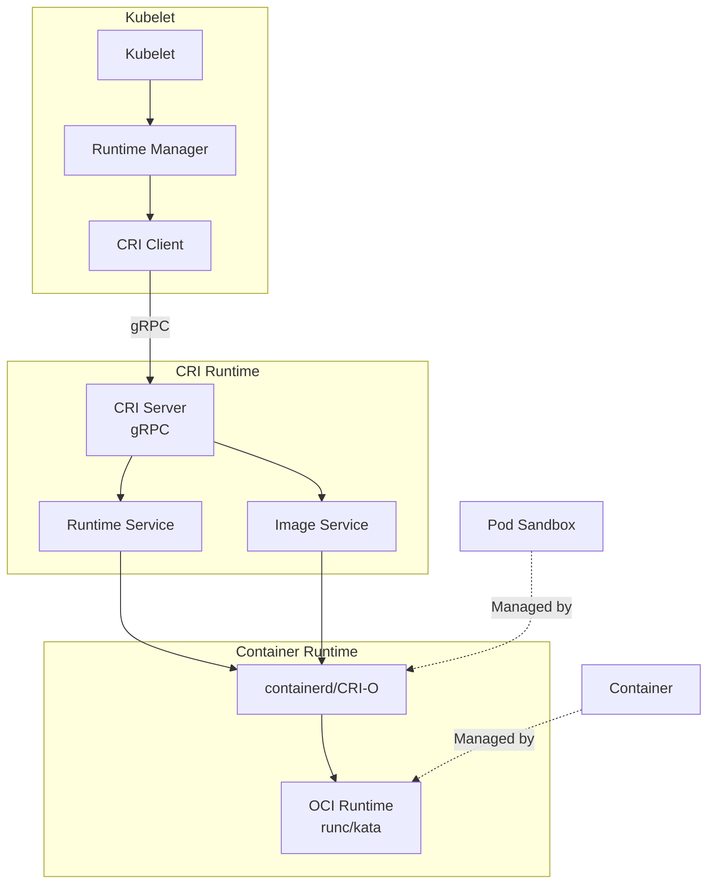
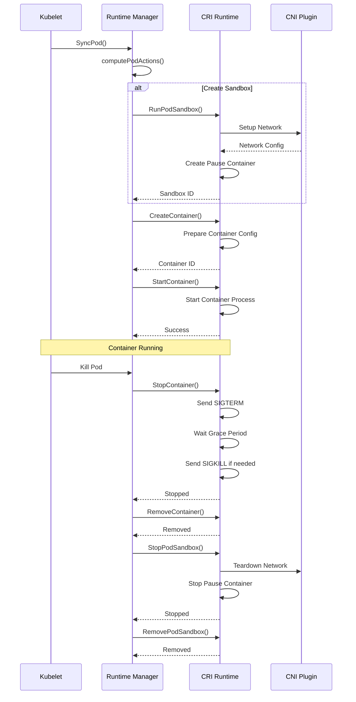
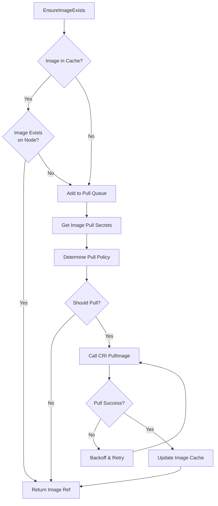
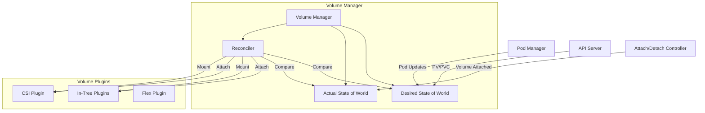
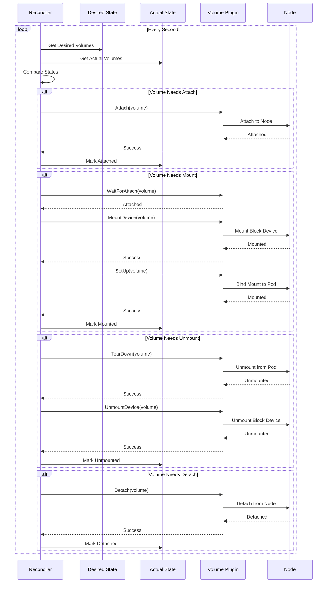
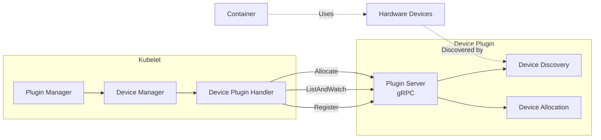
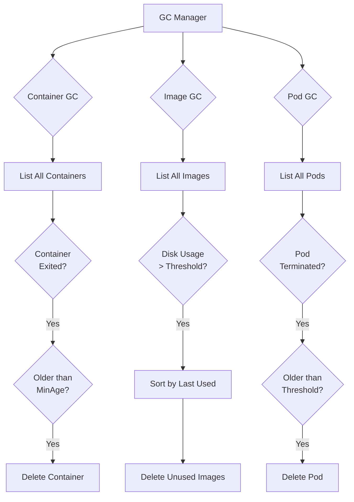

# Kubelet Internals: Container Runtime & Volume Management

## Table of Contents
- [Overview](#overview)
- [Container Runtime Interface (CRI)](#container-runtime-interface-cri)
- [Image Management](#image-management)
- [Volume Management](#volume-management)
- [Device Plugins](#device-plugins)
- [Resource Management](#resource-management)
- [Garbage Collection](#garbage-collection)
- [Code References](#code-references)

## Overview

This document covers the kubelet's integration with container runtimes via CRI, volume management, device plugins, and resource management. These subsystems enable the kubelet to manage containers, storage, and hardware resources.

**Key Source Files:**
- `pkg/kubelet/kuberuntime/` - CRI runtime manager
- `pkg/kubelet/volumemanager/` - Volume management
- `pkg/kubelet/cm/` - Container manager and cgroups
- `pkg/kubelet/pluginmanager/` - Device plugin management

## Container Runtime Interface (CRI)

CRI is a plugin interface that enables kubelet to use different container runtimes without recompilation.

### CRI Architecture



### CRI Service Interfaces

The CRI defines two main service interfaces:

```go
// RuntimeService interface for container lifecycle management
type RuntimeService interface {
    // Sandbox operations
    RunPodSandbox(ctx context.Context, config *runtimeapi.PodSandboxConfig) (string, error)
    StopPodSandbox(ctx context.Context, podSandboxID string) error
    RemovePodSandbox(ctx context.Context, podSandboxID string) error
    PodSandboxStatus(ctx context.Context, podSandboxID string) (*runtimeapi.PodSandboxStatus, error)
    ListPodSandbox(ctx context.Context, filter *runtimeapi.PodSandboxFilter) ([]*runtimeapi.PodSandbox, error)
    
    // Container operations
    CreateContainer(ctx context.Context, podSandboxID string, config *runtimeapi.ContainerConfig, sandboxConfig *runtimeapi.PodSandboxConfig) (string, error)
    StartContainer(ctx context.Context, containerID string) error
    StopContainer(ctx context.Context, containerID string, timeout int64) error
    RemoveContainer(ctx context.Context, containerID string) error
    ListContainers(ctx context.Context, filter *runtimeapi.ContainerFilter) ([]*runtimeapi.Container, error)
    ContainerStatus(ctx context.Context, containerID string) (*runtimeapi.ContainerStatus, error)
    
    // Exec operations
    ExecSync(ctx context.Context, containerID string, cmd []string, timeout time.Duration) (stdout []byte, stderr []byte, err error)
    Exec(ctx context.Context, req *runtimeapi.ExecRequest) (*runtimeapi.ExecResponse, error)
    Attach(ctx context.Context, req *runtimeapi.AttachRequest) (*runtimeapi.AttachResponse, error)
    
    // Stats operations
    ContainerStats(ctx context.Context, containerID string) (*runtimeapi.ContainerStats, error)
    ListContainerStats(ctx context.Context, filter *runtimeapi.ContainerStatsFilter) ([]*runtimeapi.ContainerStats, error)
}

// ImageService interface for image management
type ImageService interface {
    // List images
    ListImages(ctx context.Context, filter *runtimeapi.ImageFilter) ([]*runtimeapi.Image, error)
    
    // Pull image
    PullImage(ctx context.Context, image *runtimeapi.ImageSpec, auth *runtimeapi.AuthConfig, podSandboxConfig *runtimeapi.PodSandboxConfig) (string, error)
    
    // Remove image
    RemoveImage(ctx context.Context, image *runtimeapi.ImageSpec) error
    
    // Image status
    ImageStatus(ctx context.Context, image *runtimeapi.ImageSpec) (*runtimeapi.Image, error)
    
    // Image filesystem info
    ImageFsInfo(ctx context.Context) ([]*runtimeapi.FilesystemUsage, error)
}
```

### Pod Sandbox Lifecycle



### Runtime Manager Implementation

The runtime manager (`pkg/kubelet/kuberuntime/kuberuntime_manager.go`):

```go
type kubeGenericRuntimeManager struct {
    runtimeName string
    
    // CRI services
    runtimeService internalapi.RuntimeService
    imageService   internalapi.ImageManagerService
    
    // Managers
    containerRefManager *kubecontainer.RefManager
    machineInfo         *cadvisorapi.MachineInfo
    
    // Lifecycle handlers
    runner kubecontainer.HandlerRunner
    
    // Configuration
    cpuCFSQuota                  bool
    cpuCFSQuotaPeriod            metav1.Duration
    runtimeClassManager          *runtimeclass.Manager
    seccompProfileRoot           string
}

func (m *kubeGenericRuntimeManager) SyncPod(
    ctx context.Context,
    pod *v1.Pod,
    podStatus *kubecontainer.PodStatus,
    pullSecrets []v1.Secret,
    backOff *flowcontrol.Backoff,
) (result kubecontainer.PodSyncResult) {
    
    // 1. Compute what needs to be done
    podContainerChanges := m.computePodActions(pod, podStatus)
    
    // 2. Kill pod if needed
    if podContainerChanges.KillPod {
        if err := m.killPodWithSyncResult(ctx, pod, 
            kubecontainer.ConvertPodStatusToRunningPod(
                m.runtimeName, podStatus), &result); err != nil {
            return result
        }
    }
    
    // 3. Kill any containers that need to be killed
    for containerID, containerInfo := range podContainerChanges.ContainersToKill {
        if err := m.killContainer(ctx, pod, containerID, 
            containerInfo.name, containerInfo.message, 
            containerInfo.reason, nil); err != nil {
            result.Fail(err)
        }
    }
    
    // 4. Create pod sandbox if needed
    podSandboxID := podStatus.SandboxStatuses[0].Id
    if podContainerChanges.CreateSandbox {
        var msg string
        podSandboxID, msg, err = m.createPodSandbox(ctx, pod, 
            podContainerChanges.Attempt)
        if err != nil {
            result.Fail(err)
            return result
        }
    }
    
    // 5. Start init containers
    if container := podContainerChanges.NextInitContainerToStart; container != nil {
        if err := m.startContainer(ctx, podSandboxID, pod, 
            container, podStatus, pullSecrets, 
            podContainerChanges.Attempt); err != nil {
            result.Fail(err)
            return result
        }
    }
    
    // 6. Start regular containers
    for _, idx := range podContainerChanges.ContainersToStart {
        container := &pod.Spec.Containers[idx]
        if err := m.startContainer(ctx, podSandboxID, pod, 
            container, podStatus, pullSecrets, 
            podContainerChanges.Attempt); err != nil {
            result.Fail(err)
            continue
        }
    }
    
    return result
}
```

### Container Creation

```go
func (m *kubeGenericRuntimeManager) startContainer(
    ctx context.Context,
    podSandboxID string,
    pod *v1.Pod,
    container *v1.Container,
    podStatus *kubecontainer.PodStatus,
    pullSecrets []v1.Secret,
    podSandboxAttempt uint32,
) error {
    
    // 1. Pull image if needed
    imageRef, msg, err := m.imagePuller.EnsureImageExists(
        ctx, pod, container, pullSecrets, podSandboxAttempt)
    if err != nil {
        return err
    }
    
    // 2. Create container config
    containerConfig, err := m.generateContainerConfig(
        ctx, container, pod, podStatus, imageRef)
    if err != nil {
        return err
    }
    
    // 3. Create container
    containerID, err := m.runtimeService.CreateContainer(
        ctx, podSandboxID, containerConfig, 
        m.generatePodSandboxConfig(pod))
    if err != nil {
        return err
    }
    
    // 4. PreStart hook
    if container.Lifecycle != nil && 
       container.Lifecycle.PostStart != nil {
        msg, handlerErr := m.runner.Run(ctx, containerID, 
            pod, container, container.Lifecycle.PostStart)
        if handlerErr != nil {
            m.recordContainerEvent(pod, container, containerID, 
                v1.EventTypeWarning, events.FailedPostStartHook, msg)
            if err := m.killContainer(ctx, pod, containerID, 
                container.Name, msg, reasonFailedPostStartHook, 
                nil); err != nil {
                return err
            }
            return handlerErr
        }
    }
    
    // 5. Start container
    err = m.runtimeService.StartContainer(ctx, containerID)
    if err != nil {
        return err
    }
    
    return nil
}
```

## Image Management

### Image Pull Flow



### Image Puller Implementation

```go
type imagePuller struct {
    imageService   internalapi.ImageManagerService
    backOff        *flowcontrol.Backoff
    
    // Image pull QPS limiter
    pullQPS        float32
    pullBurst      int
    
    // Serial vs parallel pulling
    serializeImagePulls bool
}

func (m *imagePuller) EnsureImageExists(
    ctx context.Context,
    pod *v1.Pod,
    container *v1.Container,
    pullSecrets []v1.Secret,
    podSandboxAttempt uint32,
) (string, string, error) {
    
    spec := kubecontainer.ImageSpec{Image: container.Image}
    
    // 1. Check if image exists
    imageRef, err := m.imageService.ImageStatus(ctx, &spec)
    if err == nil && imageRef != nil {
        return imageRef.Id, "", nil
    }
    
    // 2. Determine pull policy
    policy := container.ImagePullPolicy
    if policy == "" {
        policy = v1.PullIfNotPresent
    }
    
    // 3. Check if should pull
    if policy == v1.PullNever {
        return "", "", fmt.Errorf("image pull policy is Never")
    }
    
    if policy == v1.PullIfNotPresent && imageRef != nil {
        return imageRef.Id, "", nil
    }
    
    // 4. Pull image
    if m.serializeImagePulls {
        // Serial pulling (one at a time)
        return m.pullImage(ctx, spec, pullSecrets, pod)
    } else {
        // Parallel pulling (with QPS limit)
        return m.pullImageWithQPS(ctx, spec, pullSecrets, pod)
    }
}

func (m *imagePuller) pullImage(
    ctx context.Context,
    spec kubecontainer.ImageSpec,
    pullSecrets []v1.Secret,
    pod *v1.Pod,
) (string, string, error) {
    
    // Get auth config from secrets
    keyring, err := credentialprovider.MakeDockerKeyring(
        pullSecrets, m.keyring)
    if err != nil {
        return "", "", err
    }
    
    creds, withCredentials := keyring.Lookup(spec.Image)
    if !withCredentials {
        creds = []credentialprovider.LazyAuthConfiguration{
            {AuthConfig: credentialprovider.AuthConfig{}},
        }
    }
    
    // Try each credential
    var lastErr error
    for _, cred := range creds {
        auth := &runtimeapi.AuthConfig{
            Username:      cred.Username,
            Password:      cred.Password,
            Auth:          cred.Auth,
            ServerAddress: cred.ServerAddress,
            IdentityToken: cred.IdentityToken,
            RegistryToken: cred.RegistryToken,
        }
        
        // Pull image via CRI
        imageRef, err := m.imageService.PullImage(
            ctx, &spec, auth, m.generatePodSandboxConfig(pod))
        
        if err == nil {
            return imageRef, "", nil
        }
        lastErr = err
    }
    
    return "", "", lastErr
}
```

## Volume Management

The volume manager handles attaching, mounting, and unmounting volumes for pods.

### Volume Manager Architecture



### Volume Manager Implementation

```go
type volumeManager struct {
    // Desired state of world
    desiredStateOfWorld cache.DesiredStateOfWorld
    
    // Actual state of world
    actualStateOfWorld cache.ActualStateOfWorld
    
    // Reconciler
    reconciler reconciler.Reconciler
    
    // Volume plugin manager
    volumePluginMgr *volume.VolumePluginMgr
    
    // Pod manager
    podManager kubepod.Manager
}

func (vm *volumeManager) Run(
    ctx context.Context,
    sourcesReady config.SourcesReady,
    stopCh <-chan struct{},
) {
    // Start desired state of world populator
    go vm.desiredStateOfWorldPopulator.Run(sourcesReady, stopCh)
    
    // Start reconciler
    go vm.reconciler.Run(stopCh)
    
    <-stopCh
}
```

### Volume Reconciliation Loop



### Volume Plugin Interface

```go
type VolumePlugin interface {
    // Init initializes the plugin
    Init(host VolumeHost) error
    
    // GetPluginName returns the plugin name
    GetPluginName() string
    
    // CanSupport tests if the plugin supports a given volume spec
    CanSupport(spec *Spec) bool
    
    // NewMounter creates a new Mounter
    NewMounter(spec *Spec, podRef *v1.Pod) (Mounter, error)
    
    // NewUnmounter creates a new Unmounter
    NewUnmounter(name string, podUID types.UID) (Unmounter, error)
}

type Mounter interface {
    // SetUp prepares and mounts the volume
    SetUp(mounterArgs MounterArgs) error
    
    // SetUpAt prepares and mounts the volume to a specific directory
    SetUpAt(dir string, mounterArgs MounterArgs) error
    
    // GetAttributes returns volume attributes
    GetAttributes() Attributes
}

type Unmounter interface {
    // TearDown unmounts the volume
    TearDown() error
    
    // TearDownAt unmounts the volume from a specific directory
    TearDownAt(dir string) error
}
```

### CSI Volume Plugin

CSI (Container Storage Interface) is the standard for storage plugins:

```go
type csiPlugin struct {
    host volume.VolumeHost
    
    // CSI client
    csiClient csi.Client
}

func (p *csiPlugin) NewMounter(
    spec *volume.Spec,
    pod *v1.Pod,
) (volume.Mounter, error) {
    
    return &csiMounter{
        plugin:       p,
        driverName:   spec.PersistentVolume.Spec.CSI.Driver,
        volumeID:     spec.PersistentVolume.Spec.CSI.VolumeHandle,
        readOnly:     spec.ReadOnly,
        spec:         spec,
        pod:          pod,
    }, nil
}

func (m *csiMounter) SetUpAt(
    dir string,
    mounterArgs volume.MounterArgs,
) error {
    
    // 1. Wait for volume to be attached
    if err := m.plugin.waitForVolumeAttachment(
        m.volumeID, m.driverName); err != nil {
        return err
    }
    
    // 2. Stage volume (mount block device)
    stagingPath := m.getStagingPath()
    if err := m.plugin.csiClient.NodeStageVolume(
        m.volumeID, stagingPath, m.spec); err != nil {
        return err
    }
    
    // 3. Publish volume (bind mount to pod)
    if err := m.plugin.csiClient.NodePublishVolume(
        m.volumeID, stagingPath, dir, m.spec); err != nil {
        return err
    }
    
    return nil
}
```

## Device Plugins

Device plugins enable kubelet to advertise and allocate node resources like GPUs, FPGAs, and other devices.

### Device Plugin Architecture



### Device Plugin Protocol

```go
// Device plugin registration
type Registration interface {
    Register(ctx context.Context, 
             request *RegisterRequest) (*Empty, error)
}

// Device plugin service
type DevicePlugin interface {
    // GetDevicePluginOptions returns options for the device plugin
    GetDevicePluginOptions(ctx context.Context, 
                          empty *Empty) (*DevicePluginOptions, error)
    
    // ListAndWatch returns a stream of device list
    ListAndWatch(empty *Empty, 
                stream DevicePlugin_ListAndWatchServer) error
    
    // Allocate is called during container creation
    Allocate(ctx context.Context, 
            request *AllocateRequest) (*AllocateResponse, error)
    
    // PreStartContainer is called before container start
    PreStartContainer(ctx context.Context, 
                     request *PreStartContainerRequest) (*PreStartContainerResponse, error)
}
```

### Device Manager Implementation

```go
type ManagerImpl struct {
    // Socket directory for device plugins
    socketDir string
    
    // Registered device plugins
    endpoints map[string]endpointInfo
    
    // Allocated devices per pod/container
    allocatedDevices map[string]map[string]deviceAllocateInfo
    
    // Healthy devices
    healthyDevices map[string]sets.String
}

func (m *ManagerImpl) Allocate(
    pod *v1.Pod,
    container *v1.Container,
) error {
    
    // Get device requests from container
    for resourceName, quantity := range container.Resources.Limits {
        if !m.isDevicePluginResource(resourceName) {
            continue
        }
        
        // Get device plugin endpoint
        endpoint, exists := m.endpoints[string(resourceName)]
        if !exists {
            return fmt.Errorf("unknown device plugin: %s", resourceName)
        }
        
        // Get available devices
        available := m.healthyDevices[string(resourceName)]
        if len(available) < int(quantity.Value()) {
            return fmt.Errorf("insufficient devices")
        }
        
        // Select devices to allocate
        devicesToAllocate := m.selectDevices(available, int(quantity.Value()))
        
        // Call device plugin Allocate
        resp, err := endpoint.client.Allocate(context.Background(), 
            &pluginapi.AllocateRequest{
                ContainerRequests: []*pluginapi.ContainerAllocateRequest{{
                    DevicesIDs: devicesToAllocate,
                }},
            })
        if err != nil {
            return err
        }
        
        // Store allocation
        m.allocatedDevices[string(pod.UID)][container.Name] = deviceAllocateInfo{
            resourceName: resourceName,
            deviceIDs:    devicesToAllocate,
            envs:         resp.ContainerResponses[0].Envs,
            mounts:       resp.ContainerResponses[0].Mounts,
            devices:      resp.ContainerResponses[0].Devices,
        }
    }
    
    return nil
}
```

## Resource Management

The container manager handles cgroup configuration and resource limits.

### Container Manager

```go
type containerManagerImpl struct {
    // Cgroup manager
    cgroupManager CgroupManager
    
    // QoS container manager
    qosContainerManager QOSContainerManager
    
    // Device manager
    deviceManager devicemanager.Manager
    
    // CPU manager
    cpuManager cpumanager.Manager
    
    // Memory manager
    memoryManager memorymanager.Manager
    
    // Topology manager
    topologyManager topologymanager.Manager
}

func (cm *containerManagerImpl) Start(
    node *v1.Node,
    activePods ActivePodsFunc,
    sourcesReady config.SourcesReady,
    podStatusProvider status.PodStatusProvider,
    runtimeService internalapi.RuntimeService,
) error {
    
    // 1. Setup node allocatable cgroups
    if err := cm.setupNode(node); err != nil {
        return err
    }
    
    // 2. Start QoS container manager
    if err := cm.qosContainerManager.Start(
        cm.GetNodeAllocatableAbsolute, activePods); err != nil {
        return err
    }
    
    // 3. Start device manager
    if err := cm.deviceManager.Start(
        devicemanager.ActivePodsFunc(activePods), 
        sourcesReady); err != nil {
        return err
    }
    
    // 4. Start CPU manager
    if err := cm.cpuManager.Start(
        cpumanager.ActivePodsFunc(activePods),
        sourcesReady, podStatusProvider, 
        runtimeService); err != nil {
        return err
    }
    
    // 5. Start memory manager
    if err := cm.memoryManager.Start(
        memorymanager.ActivePodsFunc(activePods),
        sourcesReady, podStatusProvider, 
        runtimeService); err != nil {
        return err
    }
    
    return nil
}
```

### CPU Manager

The CPU manager implements CPU pinning for Guaranteed pods:

```go
type manager struct {
    policy Policy
    
    // CPU assignments
    assignments state.ContainerCPUAssignments
    
    // Available CPUs
    topology *topology.CPUTopology
}

func (m *manager) Allocate(
    pod *v1.Pod,
    container *v1.Container,
) error {
    
    // Only for Guaranteed QoS with integer CPU requests
    if v1qos.GetPodQOS(pod) != v1.PodQOSGuaranteed {
        return nil
    }
    
    cpuQuantity := container.Resources.Requests[v1.ResourceCPU]
    if cpuQuantity.Value()*1000 != cpuQuantity.MilliValue() {
        return nil
    }
    
    numCPUs := int(cpuQuantity.Value())
    
    // Get available CPUs
    availableCPUs := m.policy.GetAvailableCPUs(m.assignments)
    
    if availableCPUs.Size() < numCPUs {
        return fmt.Errorf("not enough CPUs available")
    }
    
    // Allocate CPUs using policy (e.g., static, none)
    cpus := m.policy.Allocate(m.topology, availableCPUs, numCPUs)
    
    // Store assignment
    m.assignments[string(pod.UID)][container.Name] = cpus
    
    return nil
}
```

## Garbage Collection

The kubelet performs garbage collection on containers, images, and pods.

### Garbage Collection Flow



### Container Garbage Collection

```go
type containerGC struct {
    client           internalapi.RuntimeService
    manager          *kubeGenericRuntimeManager
    
    // GC policy
    minAge           time.Duration
    maxPerPodContainer int
    maxContainers    int
}

func (cgc *containerGC) GarbageCollect(
    ctx context.Context,
) error {
    
    // 1. Get all containers
    containers, err := cgc.client.ListContainers(ctx, nil)
    if err != nil {
        return err
    }
    
    // 2. Group by pod
    containersByPod := make(map[types.UID][]*runtimeapi.Container)
    for _, container := range containers {
        podUID := types.UID(container.Labels[types.KubernetesPodUIDLabel])
        containersByPod[podUID] = append(containersByPod[podUID], container)
    }
    
    // 3. Evict containers per pod
    for podUID, containers := range containersByPod {
        // Sort by creation time (newest first)
        sort.Slice(containers, func(i, j int) bool {
            return containers[i].CreatedAt > containers[j].CreatedAt
        })
        
        // Keep maxPerPodContainer, delete rest
        for i, container := range containers {
            if i < cgc.maxPerPodContainer {
                continue
            }
            
            // Check min age
            age := time.Since(time.Unix(0, container.CreatedAt))
            if age < cgc.minAge {
                continue
            }
            
            // Delete container
            if err := cgc.client.RemoveContainer(
                ctx, container.Id); err != nil {
                logger.Error(err, "Failed removing container")
            }
        }
    }
    
    return nil
}
```

## Code References

### Key Files

| File                                               | Purpose               |
| -------------------------------------------------- | --------------------- |
| `pkg/kubelet/kuberuntime/kuberuntime_manager.go`   | CRI runtime manager   |
| `pkg/kubelet/kuberuntime/kuberuntime_container.go` | Container operations  |
| `pkg/kubelet/kuberuntime/kuberuntime_sandbox.go`   | Sandbox operations    |
| `pkg/kubelet/images/image_manager.go`              | Image management      |
| `pkg/kubelet/volumemanager/volume_manager.go`      | Volume management     |
| `pkg/kubelet/cm/container_manager_linux.go`        | Container manager     |
| `pkg/kubelet/cm/devicemanager/manager.go`          | Device plugin manager |
| `pkg/kubelet/eviction/eviction_manager.go`         | Resource eviction     |

### Important Interfaces

| Interface          | Location                                          | Purpose                 |
| ------------------ | ------------------------------------------------- | ----------------------- |
| `RuntimeService`   | `pkg/kubelet/cri/remote/remote_runtime.go`        | CRI runtime operations  |
| `ImageService`     | `pkg/kubelet/cri/remote/remote_image.go`          | CRI image operations    |
| `VolumePlugin`     | `pkg/volume/plugins.go`                           | Volume plugin interface |
| `DevicePlugin`     | `pkg/kubelet/apis/deviceplugin/v1beta1/api.proto` | Device plugin protocol  |
| `ContainerManager` | `pkg/kubelet/cm/container_manager.go`             | Resource management     |

---

**Related Documentation:**
- [INTERNALS_POD_LIFECYCLE.md](./INTERNALS_POD_LIFECYCLE.md) - Pod lifecycle management
- [CRI Specification](https://github.com/kubernetes/cri-api) - Container Runtime Interface
- [CSI Specification](https://github.com/container-storage-interface/spec) - Container Storage Interface
- [Device Plugin Documentation](https://kubernetes.io/docs/concepts/extend-kubernetes/compute-storage-net/device-plugins/)

