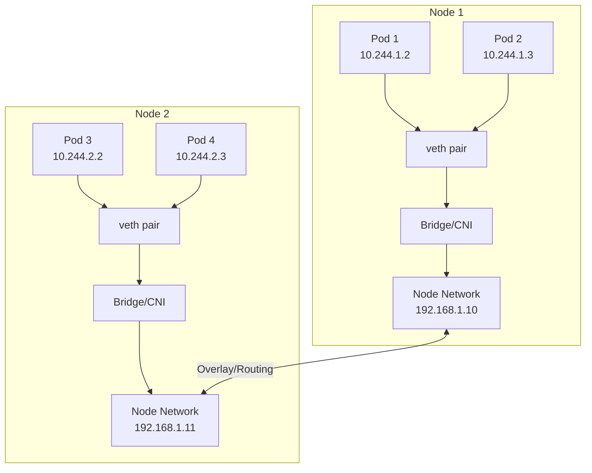
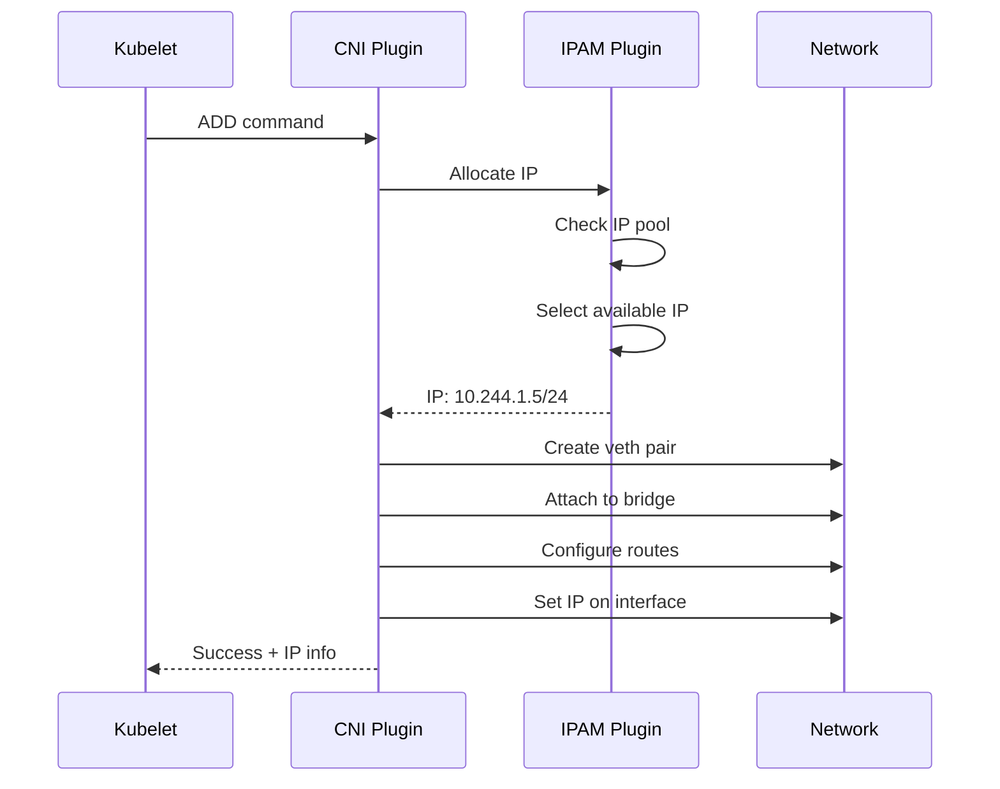
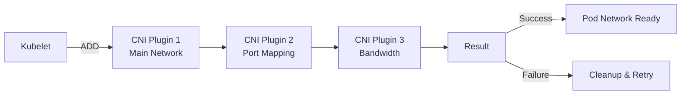
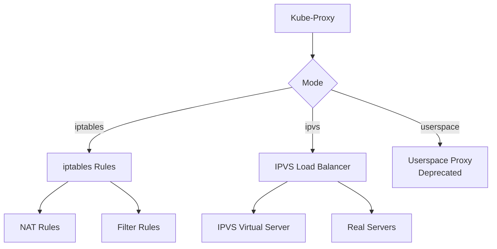
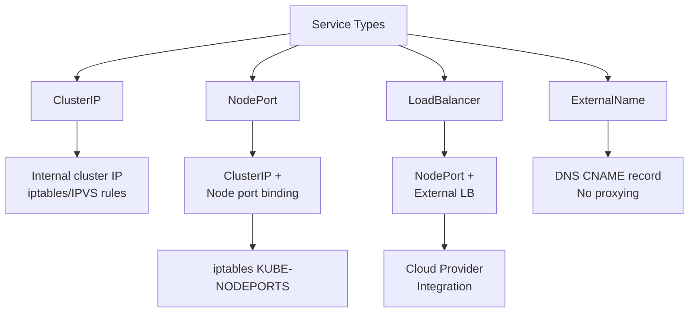
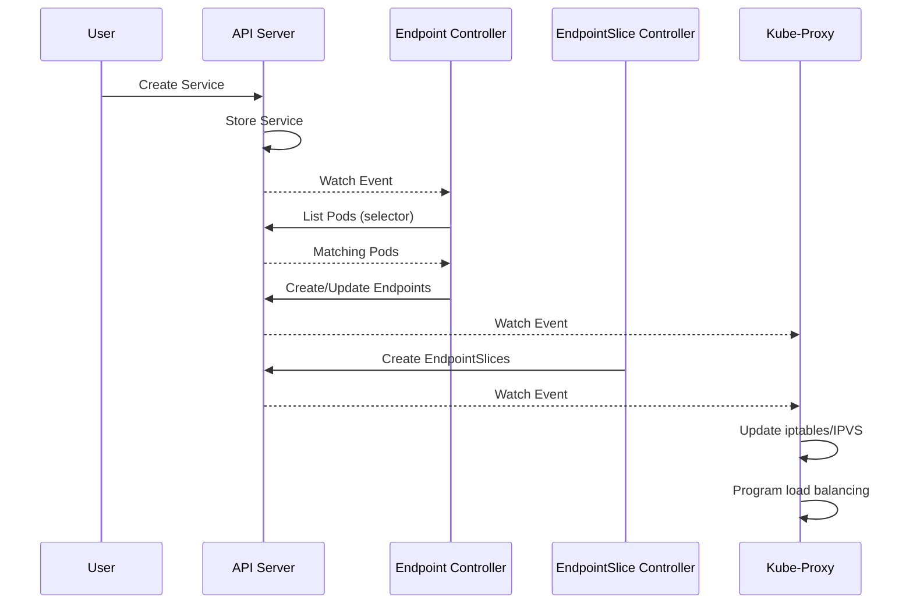
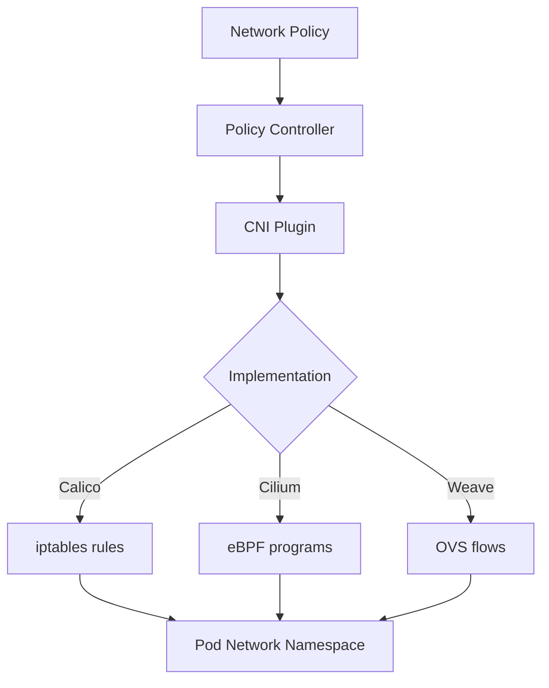
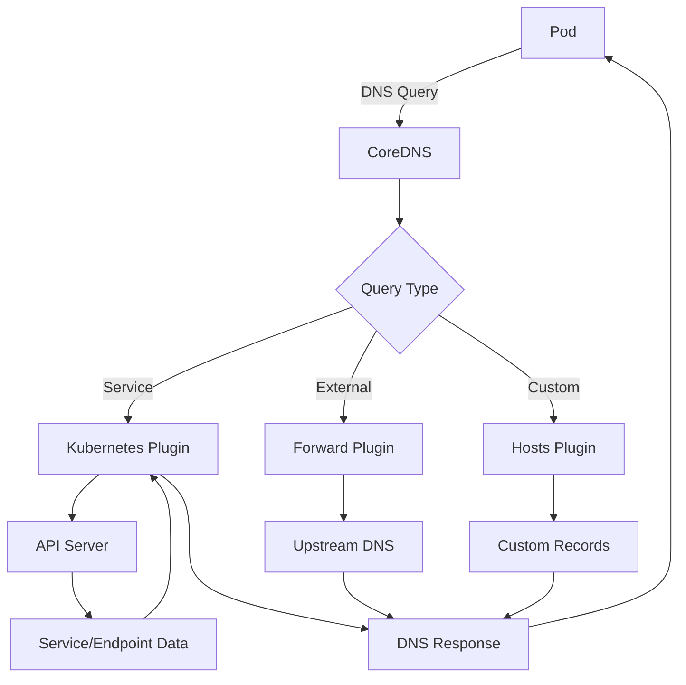
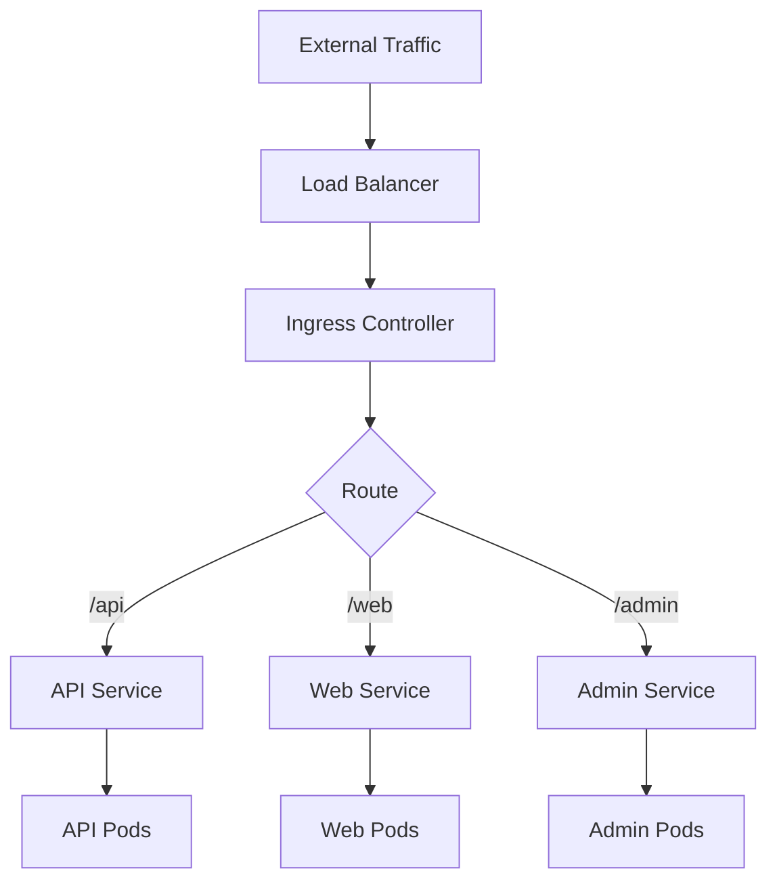

# Kubernetes Networking Internals: Deep Dive

## Table of Contents
- [Overview](#overview)
- [Networking Model](#networking-model)
- [Container Network Interface (CNI)](#container-network-interface-cni)
- [Kube-Proxy](#kube-proxy)
- [Service Implementation](#service-implementation)
- [Network Policies](#network-policies)
- [DNS and Service Discovery](#dns-and-service-discovery)
- [Ingress and Load Balancing](#ingress-and-load-balancing)
- [Code References](#code-references)

## Overview

Kubernetes networking is built on several fundamental principles that enable pod-to-pod communication, service discovery, and external access. Understanding these internals is crucial for troubleshooting, performance optimization, and extending Kubernetes networking capabilities.

**Core Networking Requirements:**
1. All pods can communicate with all other pods without NAT
2. All nodes can communicate with all pods without NAT
3. The IP a pod sees itself as is the same IP others see it as

**Key Components:**
- **CNI (Container Network Interface)**: Plugin-based pod networking
- **kube-proxy**: Service implementation and load balancing
- **CoreDNS**: Service discovery and DNS
- **Network Policies**: Pod-level firewall rules
- **Ingress Controllers**: HTTP/HTTPS routing

**Key Source Files:**
- `pkg/proxy/` - kube-proxy implementation
- `pkg/kubelet/network/` - CNI integration
- `pkg/controller/endpoint/` - Endpoint controller
- `pkg/controller/endpointslice/` - EndpointSlice controller

## Networking Model

### Pod Networking Architecture



### Network Namespaces

Each pod gets its own network namespace:

```go
// Pod network namespace setup
func (plugin *cniNetworkPlugin) SetUpPod(
    namespace string,
    name string,
    id kubecontainer.ContainerID,
) error {
    
    // 1. Create network namespace
    netns, err := ns.NewNS()
    if err != nil {
        return err
    }
    defer netns.Close()
    
    // 2. Build CNI configuration
    rt := &libcni.RuntimeConf{
        ContainerID: id.ID,
        NetNS:       netns.Path(),
        IfName:      "eth0",
        Args: [][2]string{
            {"K8S_POD_NAMESPACE", namespace},
            {"K8S_POD_NAME", name},
            {"K8S_POD_INFRA_CONTAINER_ID", id.ID},
        },
    }
    
    // 3. Call CNI plugin
    result, err := plugin.cniConfig.AddNetworkList(
        context.Background(),
        plugin.netConfig,
        rt,
    )
    if err != nil {
        return err
    }
    
    // 4. Store result
    return plugin.storeNetworkResult(id, result)
}
```

### IP Address Management (IPAM)



## Container Network Interface (CNI)

CNI is a specification and set of libraries for configuring network interfaces in Linux containers.

### CNI Plugin Chain



### CNI Configuration

```json
{
  "cniVersion": "0.4.0",
  "name": "k8s-pod-network",
  "plugins": [
    {
      "type": "bridge",
      "bridge": "cni0",
      "isGateway": true,
      "ipMasq": true,
      "ipam": {
        "type": "host-local",
        "subnet": "10.244.0.0/16",
        "routes": [
          { "dst": "0.0.0.0/0" }
        ]
      }
    },
    {
      "type": "portmap",
      "capabilities": {"portMappings": true}
    },
    {
      "type": "bandwidth",
      "capabilities": {"bandwidth": true}
    }
  ]
}
```

### CNI Plugin Implementation

```go
// CNI plugin interface
type CNI interface {
    AddNetworkList(ctx context.Context, net *NetworkConfigList, rt *RuntimeConf) (types.Result, error)
    DelNetworkList(ctx context.Context, net *NetworkConfigList, rt *RuntimeConf) error
    GetNetworkList(ctx context.Context, net *NetworkConfigList, rt *RuntimeConf) (types.Result, error)
}

// Example: Bridge CNI plugin
func cmdAdd(args *skel.CmdArgs) error {
    // 1. Parse network configuration
    conf, err := parseConfig(args.StdinData)
    if err != nil {
        return err
    }
    
    // 2. Create bridge if it doesn't exist
    br, err := setupBridge(conf)
    if err != nil {
        return err
    }
    
    // 3. Create veth pair
    hostVeth, containerVeth, err := setupVeth(args.Netns, br, args.IfName)
    if err != nil {
        return err
    }
    
    // 4. Call IPAM plugin to get IP
    ipamResult, err := ipam.ExecAdd(conf.IPAM.Type, args.StdinData)
    if err != nil {
        return err
    }
    
    // 5. Configure IP on container interface
    err = netns.Do(func(_ ns.NetNS) error {
        return configureInterface(args.IfName, ipamResult)
    })
    if err != nil {
        return err
    }
    
    // 6. Setup routes
    err = setupRoutes(conf, ipamResult)
    if err != nil {
        return err
    }
    
    // 7. Enable IP masquerade if needed
    if conf.IPMasq {
        err = setupIPMasq(conf, ipamResult)
        if err != nil {
            return err
        }
    }
    
    return types.PrintResult(ipamResult, conf.CNIVersion)
}
```

### Popular CNI Plugins

| Plugin          | Type        | Features                                  |
| --------------- | ----------- | ----------------------------------------- |
| **Calico**      | Overlay/BGP | Network policies, BGP routing, encryption |
| **Flannel**     | Overlay     | Simple VXLAN overlay, easy setup          |
| **Cilium**      | eBPF        | eBPF-based, L7 policies, observability    |
| **Weave**       | Overlay     | Mesh networking, encryption               |
| **Canal**       | Hybrid      | Flannel + Calico policies                 |
| **AWS VPC CNI** | Native      | Uses AWS ENIs, native VPC networking      |

## Kube-Proxy

Kube-proxy implements Kubernetes Services by programming network rules on each node.

### Kube-Proxy Modes



### Kube-Proxy Architecture

```go
type ProxyServer struct {
    // Client for API server
    Client clientset.Interface
    
    // Informers
    ServiceInformer  cache.SharedIndexInformer
    EndpointsInformer cache.SharedIndexInformer
    
    // Proxier implementation (iptables/ipvs)
    Proxier proxy.Provider
    
    // Configuration
    Config *kubeproxyconfig.KubeProxyConfiguration
    
    // Hostname
    Hostname string
    
    // Node IP
    NodeIP net.IP
}

func (s *ProxyServer) Run() error {
    // 1. Start informers
    go s.ServiceInformer.Run(s.stopCh)
    go s.EndpointsInformer.Run(s.stopCh)
    
    // 2. Wait for cache sync
    cache.WaitForCacheSync(s.stopCh,
        s.ServiceInformer.HasSynced,
        s.EndpointsInformer.HasSynced)
    
    // 3. Start proxier sync loop
    go s.Proxier.SyncLoop()
    
    <-s.stopCh
    return nil
}
```

### IPTables Mode

The iptables mode uses Linux iptables for service implementation:

```go
type Proxier struct {
    // iptables interface
    iptables utiliptables.Interface
    
    // Service/Endpoint maps
    serviceMap proxy.ServiceMap
    endpointsMap proxy.EndpointsMap
    
    // Sync period
    syncPeriod time.Duration
    
    // NAT table
    natChains utiliptables.LineBuffer
    natRules utiliptables.LineBuffer
    
    // Filter table
    filterChains utiliptables.LineBuffer
    filterRules utiliptables.LineBuffer
}

func (proxier *Proxier) syncProxyRules() {
    // 1. Get current services and endpoints
    serviceUpdateResult := proxier.serviceMap.Update(
        proxier.serviceChanges)
    endpointUpdateResult := proxier.endpointsMap.Update(
        proxier.endpointsChanges)
    
    // 2. Build iptables rules
    proxier.natChains.Reset()
    proxier.natRules.Reset()
    proxier.filterChains.Reset()
    proxier.filterRules.Reset()
    
    // Create KUBE-SERVICES chain
    proxier.natChains.Write(
        "-N", string(kubeServicesChain))
    
    // Create KUBE-NODEPORTS chain
    proxier.natChains.Write(
        "-N", string(kubeNodePortsChain))
    
    // 3. For each service
    for svcName, svc := range proxier.serviceMap {
        // Create service chain
        svcChain := servicePortChainName(svcName, protocol)
        proxier.natChains.Write(
            "-N", string(svcChain))
        
        // Add rule to KUBE-SERVICES
        proxier.natRules.Write(
            "-A", string(kubeServicesChain),
            "-d", svc.ClusterIP().String(),
            "-p", protocol,
            "--dport", strconv.Itoa(svc.Port()),
            "-j", string(svcChain))
        
        // 4. For each endpoint
        endpoints := proxier.endpointsMap[svcName]
        for i, ep := range endpoints {
            // Create endpoint chain
            epChain := servicePortEndpointChainName(
                svcName, protocol, ep.String())
            proxier.natChains.Write(
                "-N", string(epChain))
            
            // Add load balancing rule
            probability := 1.0 / float64(len(endpoints)-i)
            proxier.natRules.Write(
                "-A", string(svcChain),
                "-m", "statistic",
                "--mode", "random",
                "--probability", fmt.Sprintf("%.5f", probability),
                "-j", string(epChain))
            
            // Add DNAT rule
            proxier.natRules.Write(
                "-A", string(epChain),
                "-p", protocol,
                "-j", "DNAT",
                "--to-destination", ep.String())
        }
    }
    
    // 5. Apply iptables rules
    proxier.iptablesData.Reset()
    proxier.iptablesData.Write("*nat")
    proxier.natChains.Write(proxier.iptablesData)
    proxier.natRules.Write(proxier.iptablesData)
    proxier.iptablesData.Write("COMMIT")
    
    err := proxier.iptables.RestoreAll(
        proxier.iptablesData.Bytes(),
        utiliptables.NoFlushTables,
        utiliptables.RestoreCounters)
}
```

### IPVS Mode

IPVS mode uses Linux IPVS for better performance:

```go
type Proxier struct {
    // IPVS interface
    ipvs utilipvs.Interface
    
    // IPVS scheduler
    scheduler string // rr, lc, dh, sh, sed, nq
    
    // Service/Endpoint maps
    serviceMap proxy.ServiceMap
    endpointsMap proxy.EndpointsMap
}

func (proxier *Proxier) syncProxyRules() {
    // 1. Get current services and endpoints
    serviceUpdateResult := proxier.serviceMap.Update(
        proxier.serviceChanges)
    endpointUpdateResult := proxier.endpointsMap.Update(
        proxier.endpointsChanges)
    
    // 2. For each service
    for svcName, svc := range proxier.serviceMap {
        // Create IPVS virtual server
        vs := &utilipvs.VirtualServer{
            Address:   net.ParseIP(svc.ClusterIP()),
            Port:      uint16(svc.Port()),
            Protocol:  string(svc.Protocol()),
            Scheduler: proxier.scheduler,
        }
        
        err := proxier.ipvs.AddVirtualServer(vs)
        if err != nil {
            continue
        }
        
        // 3. For each endpoint
        endpoints := proxier.endpointsMap[svcName]
        for _, ep := range endpoints {
            // Add real server
            rs := &utilipvs.RealServer{
                Address: ep.IP(),
                Port:    uint16(ep.Port()),
                Weight:  1,
            }
            
            err := proxier.ipvs.AddRealServer(vs, rs)
            if err != nil {
                continue
            }
        }
    }
    
    // 4. Bind service IPs to dummy interface
    for _, svc := range proxier.serviceMap {
        err := proxier.netlinkHandle.EnsureAddressBind(
            svc.ClusterIP(), kubeIPVSInterface)
        if err != nil {
            continue
        }
    }
}
```

### Service Types Implementation



## Service Implementation

### Service to Endpoints Flow



### Endpoint Controller

```go
type EndpointController struct {
    client clientset.Interface
    
    // Informers
    podInformer cache.SharedIndexInformer
    serviceInformer cache.SharedIndexInformer
    
    // Work queue
    queue workqueue.RateLimitingInterface
}

func (e *EndpointController) syncService(
    ctx context.Context,
    key string,
) error {
    
    namespace, name, err := cache.SplitMetaNamespaceKey(key)
    if err != nil {
        return err
    }
    
    // 1. Get service
    service, err := e.serviceLister.Services(namespace).Get(name)
    if errors.IsNotFound(err) {
        return nil
    }
    if err != nil {
        return err
    }
    
    // 2. Get pods matching selector
    pods, err := e.podLister.Pods(namespace).List(
        labels.Set(service.Spec.Selector).AsSelector())
    if err != nil {
        return err
    }
    
    // 3. Build endpoint subsets
    subsets := []v1.EndpointSubset{}
    for _, pod := range pods {
        if !podutil.IsPodReady(pod) {
            continue
        }
        
        // Add pod IP to endpoints
        subset := v1.EndpointSubset{
            Addresses: []v1.EndpointAddress{{
                IP:       pod.Status.PodIP,
                NodeName: &pod.Spec.NodeName,
                TargetRef: &v1.ObjectReference{
                    Kind:      "Pod",
                    Namespace: pod.Namespace,
                    Name:      pod.Name,
                    UID:       pod.UID,
                },
            }},
            Ports: []v1.EndpointPort{},
        }
        
        // Add ports
        for _, port := range service.Spec.Ports {
            subset.Ports = append(subset.Ports, v1.EndpointPort{
                Name:     port.Name,
                Port:     port.TargetPort.IntVal,
                Protocol: port.Protocol,
            })
        }
        
        subsets = append(subsets, subset)
    }
    
    // 4. Create or update endpoints
    endpoints := &v1.Endpoints{
        ObjectMeta: metav1.ObjectMeta{
            Name:      service.Name,
            Namespace: service.Namespace,
        },
        Subsets: subsets,
    }
    
    _, err = e.client.CoreV1().Endpoints(namespace).Update(
        ctx, endpoints, metav1.UpdateOptions{})
    
    return err
}
```

### EndpointSlice

EndpointSlices provide a scalable alternative to Endpoints:

```go
type EndpointSlice struct {
    metav1.TypeMeta
    metav1.ObjectMeta
    
    // AddressType specifies the type of addresses (IPv4, IPv6, FQDN)
    AddressType AddressType
    
    // Endpoints is a list of unique endpoints
    Endpoints []Endpoint
    
    // Ports specifies the list of ports
    Ports []EndpointPort
}

type Endpoint struct {
    // Addresses of this endpoint
    Addresses []string
    
    // Conditions contains information about the endpoint
    Conditions EndpointConditions
    
    // Hostname of this endpoint
    Hostname *string
    
    // TargetRef is a reference to a Kubernetes object
    TargetRef *v1.ObjectReference
    
    // NodeName represents the name of the Node hosting this endpoint
    NodeName *string
    
    // Zone is the name of the Zone this endpoint exists in
    Zone *string
}
```

## Network Policies

Network policies provide pod-level firewall rules.

### Network Policy Architecture



### Network Policy Example

```yaml
apiVersion: networking.k8s.io/v1
kind: NetworkPolicy
metadata:
  name: api-allow
  namespace: default
spec:
  podSelector:
    matchLabels:
      app: api
  policyTypes:
  - Ingress
  - Egress
  ingress:
  - from:
    - podSelector:
        matchLabels:
          app: frontend
    ports:
    - protocol: TCP
      port: 8080
  egress:
  - to:
    - podSelector:
        matchLabels:
          app: database
    ports:
    - protocol: TCP
      port: 5432
```

### Network Policy Implementation

```go
type NetworkPolicyController struct {
    client clientset.Interface
    
    // Informers
    policyInformer cache.SharedIndexInformer
    podInformer cache.SharedIndexInformer
    
    // Policy enforcer (CNI-specific)
    enforcer PolicyEnforcer
}

type PolicyEnforcer interface {
    // Add policy
    AddPolicy(policy *networkingv1.NetworkPolicy) error
    
    // Update policy
    UpdatePolicy(oldPolicy, newPolicy *networkingv1.NetworkPolicy) error
    
    // Delete policy
    DeletePolicy(policy *networkingv1.NetworkPolicy) error
}

// Example: iptables-based enforcer
type IPTablesEnforcer struct {
    iptables utiliptables.Interface
}

func (e *IPTablesEnforcer) AddPolicy(
    policy *networkingv1.NetworkPolicy,
) error {
    
    // 1. Create chain for policy
    chainName := policyChainName(policy)
    e.iptables.NewChain(utiliptables.TableFilter, chainName)
    
    // 2. Add ingress rules
    for _, rule := range policy.Spec.Ingress {
        for _, from := range rule.From {
            // Get pod IPs matching selector
            podIPs := e.getPodsMatchingSelector(
                from.PodSelector, policy.Namespace)
            
            for _, ip := range podIPs {
                // Add allow rule
                e.iptables.AppendUnique(
                    utiliptables.TableFilter,
                    chainName,
                    "-s", ip,
                    "-j", "ACCEPT")
            }
        }
    }
    
    // 3. Add egress rules
    for _, rule := range policy.Spec.Egress {
        for _, to := range rule.To {
            podIPs := e.getPodsMatchingSelector(
                to.PodSelector, policy.Namespace)
            
            for _, ip := range podIPs {
                e.iptables.AppendUnique(
                    utiliptables.TableFilter,
                    chainName,
                    "-d", ip,
                    "-j", "ACCEPT")
            }
        }
    }
    
    // 4. Add default deny
    e.iptables.AppendUnique(
        utiliptables.TableFilter,
        chainName,
        "-j", "DROP")
    
    return nil
}
```

## DNS and Service Discovery

### CoreDNS Architecture



### CoreDNS Configuration

```corefile
.:53 {
    errors
    health {
        lameduck 5s
    }
    ready
    kubernetes cluster.local in-addr.arpa ip6.arpa {
        pods insecure
        fallthrough in-addr.arpa ip6.arpa
        ttl 30
    }
    prometheus :9153
    forward . /etc/resolv.conf {
        max_concurrent 1000
    }
    cache 30
    loop
    reload
    loadbalance
}
```

### Service DNS Records

| Record Type      | Format                                                        | Example                                      |
| ---------------- | ------------------------------------------------------------- | -------------------------------------------- |
| Service A        | `<service>.<namespace>.svc.cluster.local`                     | `nginx.default.svc.cluster.local`            |
| Headless Service | `<pod-ip>.<service>.<namespace>.svc.cluster.local`            | `10-244-1-5.nginx.default.svc.cluster.local` |
| Pod A            | `<pod-ip>.<namespace>.pod.cluster.local`                      | `10-244-1-5.default.pod.cluster.local`       |
| SRV              | `_<port>._<protocol>.<service>.<namespace>.svc.cluster.local` | `_http._tcp.nginx.default.svc.cluster.local` |

## Ingress and Load Balancing

### Ingress Architecture



### Ingress Controller Implementation

```go
type IngressController struct {
    client clientset.Interface
    
    // Informers
    ingressInformer cache.SharedIndexInformer
    serviceInformer cache.SharedIndexInformer
    endpointInformer cache.SharedIndexInformer
    
    // Load balancer (nginx, haproxy, etc.)
    loadBalancer LoadBalancer
}

type LoadBalancer interface {
    // Update configuration
    UpdateConfig(config *Config) error
    
    // Reload
    Reload() error
}

func (ic *IngressController) syncIngress(
    ctx context.Context,
    key string,
) error {
    
    namespace, name, err := cache.SplitMetaNamespaceKey(key)
    if err != nil {
        return err
    }
    
    // 1. Get ingress
    ingress, err := ic.ingressLister.Ingresses(namespace).Get(name)
    if errors.IsNotFound(err) {
        return nil
    }
    if err != nil {
        return err
    }
    
    // 2. Build load balancer configuration
    config := &Config{}
    
    for _, rule := range ingress.Spec.Rules {
        for _, path := range rule.HTTP.Paths {
            // Get service
            service, err := ic.serviceLister.Services(namespace).Get(
                path.Backend.Service.Name)
            if err != nil {
                continue
            }
            
            // Get endpoints
            endpoints, err := ic.endpointLister.Endpoints(namespace).Get(
                service.Name)
            if err != nil {
                continue
            }
            
            // Add backend
            backend := &Backend{
                Host: rule.Host,
                Path: path.Path,
                Servers: []Server{},
            }
            
            for _, subset := range endpoints.Subsets {
                for _, addr := range subset.Addresses {
                    backend.Servers = append(backend.Servers, Server{
                        IP:   addr.IP,
                        Port: subset.Ports[0].Port,
                    })
                }
            }
            
            config.Backends = append(config.Backends, backend)
        }
    }
    
    // 3. Update load balancer
    if err := ic.loadBalancer.UpdateConfig(config); err != nil {
        return err
    }
    
    // 4. Reload
    return ic.loadBalancer.Reload()
}
```

## Code References

### Key Files

| Component                | Location                        | Purpose                   |
| ------------------------ | ------------------------------- | ------------------------- |
| kube-proxy               | `pkg/proxy/`                    | Service implementation    |
| CNI                      | `pkg/kubelet/network/`          | CNI plugin integration    |
| Endpoint Controller      | `pkg/controller/endpoint/`      | Endpoints management      |
| EndpointSlice Controller | `pkg/controller/endpointslice/` | EndpointSlices management |
| Network Policy           | `pkg/controller/networkpolicy/` | Network policy controller |

### Performance Considerations

1. **IPVS vs iptables**: IPVS provides better performance for large clusters
2. **EndpointSlices**: More scalable than Endpoints for services with many backends
3. **Connection Tracking**: Conntrack table size limits concurrent connections
4. **DNS Caching**: CoreDNS cache reduces API server load
5. **Network Plugin**: Choice affects latency and throughput

### Troubleshooting

```bash
# Check kube-proxy mode
kubectl logs -n kube-system kube-proxy-xxx | grep "Using"

# View iptables rules
iptables-save | grep KUBE

# View IPVS rules
ipvsadm -Ln

# Check CNI configuration
cat /etc/cni/net.d/*.conf

# Test DNS resolution
nslookup kubernetes.default.svc.cluster.local

# Check network policies
kubectl get networkpolicies
kubectl describe networkpolicy <name>

# View service endpoints
kubectl get endpoints <service-name>
kubectl get endpointslices
```

---

**Related Documentation:**
- [CNI Specification](https://github.com/containernetworking/cni) - Container Network Interface
- [Kubernetes Network Model](https://kubernetes.io/docs/concepts/cluster-administration/networking/) - Official networking docs
- [CoreDNS](https://coredns.io/) - DNS and service discovery

