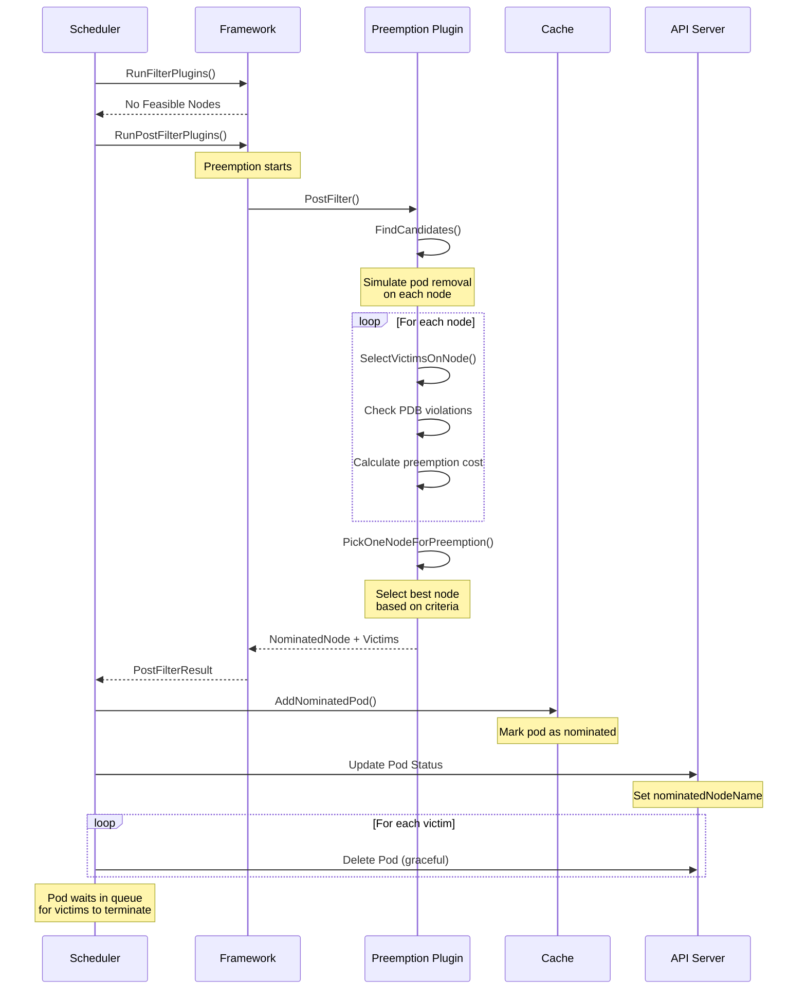
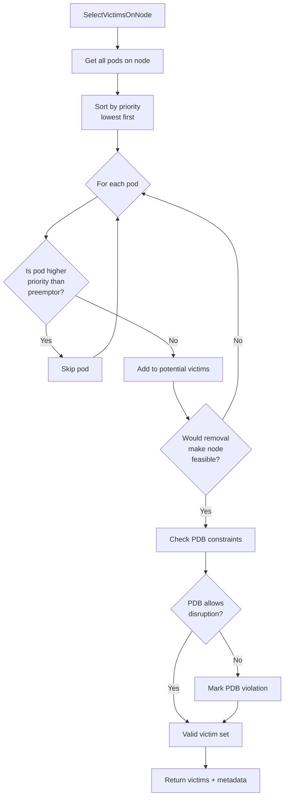
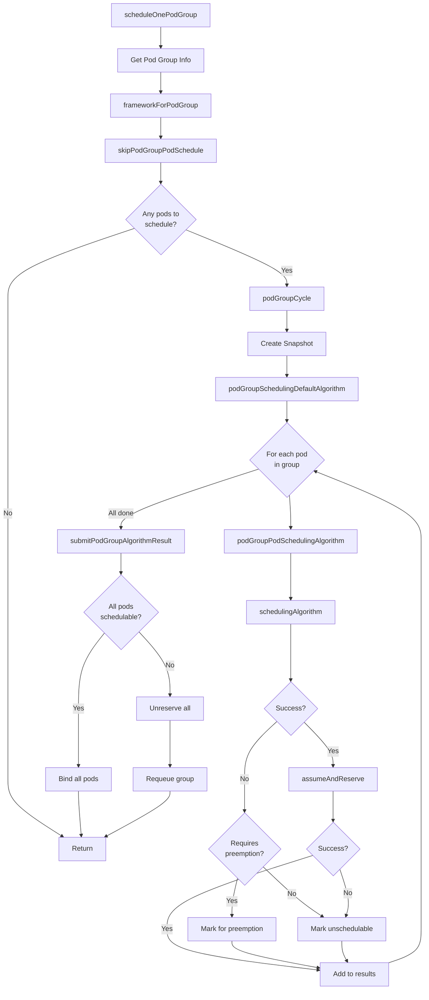
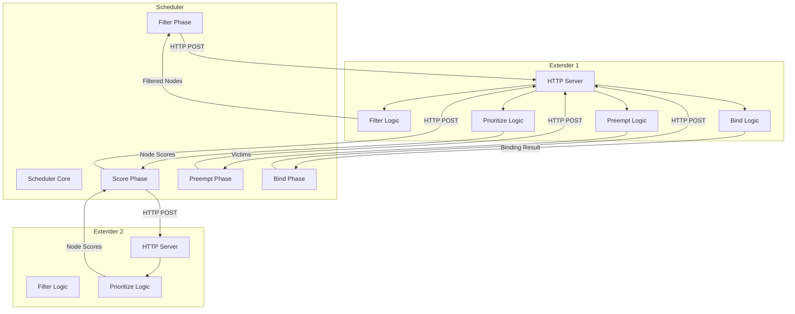
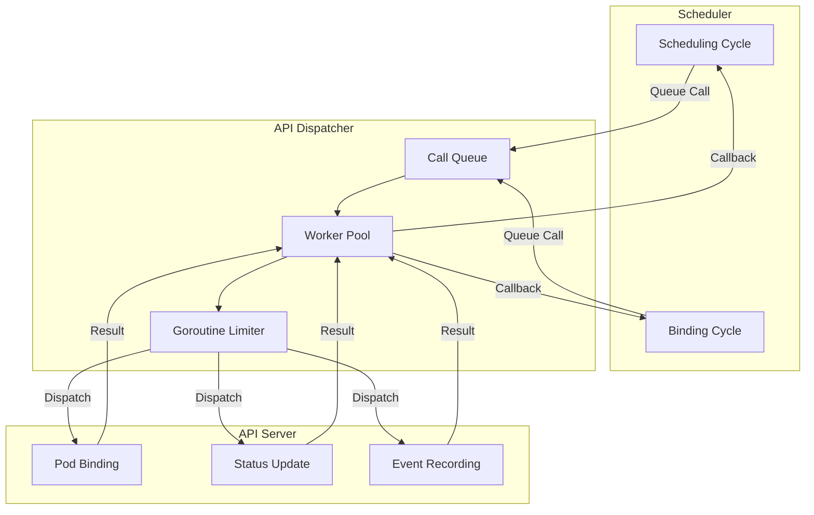

# Kubernetes Scheduler Internals: Advanced Features

## Table of Contents
- [Overview](#overview)
- [Preemption Mechanism](#preemption-mechanism)
- [Pod Group Scheduling](#pod-group-scheduling)
- [Scheduler Extenders](#scheduler-extenders)
- [Performance Optimizations](#performance-optimizations)
- [Async API Calls](#async-api-calls)
- [Troubleshooting](#troubleshooting)

## Overview

This document covers advanced scheduler features including preemption, pod group scheduling, extenders, and performance optimizations. These features enable sophisticated scheduling scenarios beyond basic pod placement.

**Key Source Files:**
- `pkg/scheduler/framework/preemption/preemption.go` - Preemption algorithm
- `pkg/scheduler/schedule_one_podgroup.go` - Pod group scheduling
- `pkg/scheduler/extender.go` - Extender implementation
- `pkg/scheduler/backend/api_dispatcher/` - Async API dispatcher

## Preemption Mechanism

Preemption allows higher-priority pods to evict lower-priority pods when no nodes have sufficient resources.

### Preemption Flow



### Preemption Algorithm

The preemption evaluator (`pkg/scheduler/framework/preemption/preemption.go:63-149`):

```go
type Evaluator struct {
    PluginName string
    Handler    framework.Handle
    PodLister  corelisters.PodLister
    PdbLister  policylisters.PodDisruptionBudgetLister
    State      fwk.CycleState
    Interface  Interface
}

func (ev *Evaluator) Preempt(
    ctx context.Context,
    pod *v1.Pod,
    nodeToStatus fwk.NodeToStatusReader,
) (*fwk.PostFilterResult, *fwk.Status) {
    
    // 1. Find candidate nodes for preemption
    candidates, nodeToStatusMap, err := ev.findCandidates(
        ctx, pod, nodeToStatus)
    
    if err != nil || len(candidates) == 0 {
        return nil, fwk.NewStatus(fwk.Unschedulable, 
            "no nodes available for preemption")
    }
    
    // 2. Filter candidates through extenders
    candidates, status := ev.callExtenders(logger, pod, candidates)
    if !status.IsSuccess() {
        return nil, status
    }
    
    // 3. Select best node for preemption
    bestCandidate := ev.SelectCandidate(ctx, candidates)
    if bestCandidate == nil {
        return nil, fwk.NewStatus(fwk.Unschedulable)
    }
    
    // 4. Return result with nominated node and victims
    return &fwk.PostFilterResult{
        NominatingInfo: &fwk.NominatingInfo{
            NominatedNodeName: bestCandidate.Name(),
            NominatingMode:    fwk.ModeOverride,
        },
    }, fwk.NewStatus(fwk.Success)
}
```

### Victim Selection

The algorithm for selecting victims on a node:



**Key Selection Criteria:**

```go
func (ev *Evaluator) selectVictimsOnNode(
    ctx context.Context,
    pod *v1.Pod,
    nodeInfo fwk.NodeInfo,
    pdbs []*policy.PodDisruptionBudget,
) ([]*v1.Pod, int, *fwk.Status) {
    
    var victims []*v1.Pod
    numPDBViolations := 0
    
    // Get all pods on node, sorted by priority (ascending)
    pods := nodeInfo.Pods
    sort.Slice(pods, func(i, j int) bool {
        return corev1helpers.PodPriority(pods[i].Pod) < 
               corev1helpers.PodPriority(pods[j].Pod)
    })
    
    // Try removing pods until node becomes feasible
    for _, podInfo := range pods {
        // Skip if pod has higher or equal priority
        if corev1helpers.PodPriority(podInfo.Pod) >= 
           corev1helpers.PodPriority(pod) {
            continue
        }
        
        // Add to victims
        victims = append(victims, podInfo.Pod)
        
        // Check if node is now feasible
        if ev.PodEligibleToPreemptOthers(pod, nodeInfo, victims) {
            // Check PDB violations
            for _, victim := range victims {
                if !ev.PDBAllowsPreemption(victim, pdbs) {
                    numPDBViolations++
                }
            }
            return victims, numPDBViolations, nil
        }
    }
    
    return nil, 0, fwk.NewStatus(fwk.Unschedulable)
}
```

### Node Selection for Preemption

The `pickOneNodeForPreemption` function (`pkg/scheduler/framework/preemption/preemption.go:315-403`) selects the best node using multiple scoring functions:

```go
func pickOneNodeForPreemption(
    logger klog.Logger,
    nodesToVictims map[string]*extenderv1.Victims,
    scoreFuncs []func(node string) int64,
) string {
    
    if len(scoreFuncs) == 0 {
        // Default scoring functions (in order of precedence)
        scoreFuncs = []func(string) int64{
            // 1. Minimize PDB violations
            func(node string) int64 {
                return -nodesToVictims[node].NumPDBViolations
            },
            
            // 2. Minimize highest victim priority
            func(node string) int64 {
                highestPriority := corev1helpers.PodPriority(
                    nodesToVictims[node].Pods[0])
                return -int64(highestPriority)
            },
            
            // 3. Minimize sum of victim priorities
            func(node string) int64 {
                var sum int64
                for _, pod := range nodesToVictims[node].Pods {
                    sum += int64(corev1helpers.PodPriority(pod))
                }
                return -sum
            },
            
            // 4. Minimize number of victims
            func(node string) int64 {
                return -int64(len(nodesToVictims[node].Pods))
            },
            
            // 5. Maximize earliest start time
            func(node string) int64 {
                earliest := time.Now()
                for _, pod := range nodesToVictims[node].Pods {
                    if pod.Status.StartTime.Before(&earliest) {
                        earliest = *pod.Status.StartTime
                    }
                }
                return earliest.UnixNano()
            },
        }
    }
    
    // Apply scoring functions in order
    candidates := make([]string, 0, len(nodesToVictims))
    for node := range nodesToVictims {
        candidates = append(candidates, node)
    }
    
    for _, scoreFunc := range scoreFuncs {
        if len(candidates) == 1 {
            return candidates[0]
        }
        
        // Find nodes with highest score
        maxScore := int64(math.MinInt64)
        var bestNodes []string
        
        for _, node := range candidates {
            score := scoreFunc(node)
            if score > maxScore {
                maxScore = score
                bestNodes = []string{node}
            } else if score == maxScore {
                bestNodes = append(bestNodes, node)
            }
        }
        
        candidates = bestNodes
    }
    
    // If still tied, pick randomly
    return candidates[rand.Intn(len(candidates))]
}
```

### Preemption Execution

The preemption executor (`pkg/scheduler/framework/preemption/executor.go:49-200`) handles the actual eviction:

```go
type Executor struct {
    mu              sync.RWMutex
    pendingVictims  map[string]*pendingVictim
    client          clientset.Interface
    podLister       corelisters.PodLister
}

func (e *Executor) Preempt(
    ctx context.Context,
    pod *v1.Pod,
    victims []*v1.Pod,
) error {
    
    // Delete victims with grace period
    for _, victim := range victims {
        // Track pending deletion
        e.trackPendingVictim(victim)
        
        // Delete pod
        err := e.client.CoreV1().Pods(victim.Namespace).Delete(
            ctx, victim.Name, metav1.DeleteOptions{
                GracePeriodSeconds: ptr.To[int64](0),
            })
        
        if err != nil && !apierrors.IsNotFound(err) {
            return err
        }
    }
    
    return nil
}
```

## Pod Group Scheduling

Pod group scheduling allows scheduling multiple related pods together, ensuring they all fit or none are scheduled.

### Pod Group Flow



### Pod Group Algorithm

The default pod group scheduling algorithm (`pkg/scheduler/schedule_one_podgroup.go:273-308`):

```go
func (sched *Scheduler) podGroupSchedulingDefaultAlgorithm(
    ctx context.Context,
    schedFwk framework.Framework,
    podGroupInfo *framework.QueuedPodGroupInfo,
) podGroupAlgorithmResult {
    
    result := podGroupAlgorithmResult{
        podResults: make([]algorithmResult, 0, len(podGroupInfo.QueuedPodInfos)),
        status:     podGroupUnschedulable,
    }
    
    // Schedule each pod in the group
    for _, podInfo := range podGroupInfo.QueuedPodInfos {
        // Initialize pod scheduling context
        podCtx := sched.initPodSchedulingContext(ctx, podInfo.Pod)
        
        // Schedule the pod
        algResult, revertFn := sched.podGroupPodSchedulingAlgorithm(
            ctx, schedFwk, podGroupInfo, podInfo)
        
        algResult.podCtx = podCtx
        result.podResults = append(result.podResults, algResult)
        
        // Defer unreserve if needed
        if revertFn != nil {
            defer revertFn()
        }
        
        // Update group status based on pod result
        if algResult.requiresPreemption {
            result.status = podGroupWaitingOnPreemption
        } else if algResult.status.IsSuccess() && 
                  result.status != podGroupWaitingOnPreemption {
            result.status = podGroupFeasible
        }
    }
    
    return result
}
```

### Pod Group Result Handling

```go
type podGroupAlgorithmStatus string

const (
    // All pods in group are schedulable
    podGroupFeasible podGroupAlgorithmStatus = "Feasible"
    
    // At least one pod requires preemption
    podGroupWaitingOnPreemption podGroupAlgorithmStatus = "WaitingOnPreemption"
    
    // At least one pod is unschedulable
    podGroupUnschedulable podGroupAlgorithmStatus = "Unschedulable"
)

func (sched *Scheduler) submitPodGroupAlgorithmResult(
    ctx context.Context,
    schedFwk framework.Framework,
    podGroupInfo *framework.QueuedPodGroupInfo,
    result podGroupAlgorithmResult,
    start time.Time,
) {
    
    switch result.status {
    case podGroupFeasible:
        // All pods schedulable - proceed to binding
        for _, podResult := range result.podResults {
            if podResult.status.IsSuccess() {
                go sched.bindingCycle(
                    ctx, schedFwk, podResult.podCtx.assumedPodInfo,
                    podResult.scheduleResult.SuggestedHost,
                    podResult.podCtx.state)
            }
        }
        
    case podGroupWaitingOnPreemption:
        // Some pods need preemption - initiate preemption
        for _, podResult := range result.podResults {
            if podResult.requiresPreemption {
                sched.initiatePreemption(ctx, podResult)
            }
        }
        // Requeue the group
        sched.SchedulingQueue.AddUnschedulableIfNotPresent(
            podGroupInfo, sched.SchedulingQueue.SchedulingCycle())
        
    case podGroupUnschedulable:
        // Cannot schedule - requeue all
        sched.SchedulingQueue.AddUnschedulableIfNotPresent(
            podGroupInfo, sched.SchedulingQueue.SchedulingCycle())
    }
}
```

## Scheduler Extenders

Extenders allow external processes to participate in scheduling decisions via HTTP callbacks.

### Extender Architecture



### Extender Configuration

```go
type Extender struct {
    // URL of the extender
    URLPrefix string
    
    // Filter nodes
    FilterVerb string
    
    // Prioritize nodes
    PrioritizeVerb string
    
    // Preempt pods
    PreemptVerb string
    
    // Bind pod
    BindVerb string
    
    // Weight for prioritization
    Weight int64
    
    // Whether extender is required
    Ignorable bool
    
    // Node cache capability
    NodeCacheCapable bool
    
    // Managed resources
    ManagedResources []ExtenderManagedResource
}
```

### Extender Implementation

The HTTP extender (`pkg/scheduler/extender.go:141-177`):

```go
type HTTPExtender struct {
    extenderURL      string
    filterVerb       string
    prioritizeVerb   string
    preemptVerb      string
    bindVerb         string
    weight           int64
    client           *http.Client
    nodeCacheCapable bool
    managedResources sets.Set[string]
    ignorable        bool
}

func (h *HTTPExtender) Filter(
    pod *v1.Pod,
    nodes []fwk.NodeInfo,
) ([]fwk.NodeInfo, extenderv1.FailedNodesMap, 
    extenderv1.FailedNodesMap, error) {
    
    // Prepare request
    args := &extenderv1.ExtenderArgs{
        Pod:   pod,
        Nodes: convertToNodeList(nodes),
    }
    
    // Call extender
    var result extenderv1.ExtenderFilterResult
    if err := h.send(h.filterVerb, args, &result); err != nil {
        return nil, nil, nil, err
    }
    
    // Process response
    filteredNodes := []fwk.NodeInfo{}
    for _, node := range nodes {
        if result.NodeNames.Has(node.Node().Name) {
            filteredNodes = append(filteredNodes, node)
        }
    }
    
    return filteredNodes, result.FailedNodes, 
           result.FailedAndUnresolvableNodes, nil
}
```

## Performance Optimizations

### Parallel Filtering

The scheduler uses worker pools for parallel node evaluation:

```go
func (sched *Scheduler) findNodesThatPassFilters(
    ctx context.Context,
    schedFramework framework.Framework,
    state fwk.CycleState,
    pod *v1.Pod,
    nodes []fwk.NodeInfo,
    numNodesToFind int32,
) ([]fwk.NodeInfo, error) {
    
    // Create result channel
    type nodeStatus struct {
        node   string
        status *fwk.Status
    }
    statusChan := make(chan nodeStatus, len(nodes))
    
    // Create worker pool
    parallelism := sched.Parallelism()
    checkNode := func(i int) {
        nodeInfo := nodes[i]
        status := schedFramework.RunFilterPlugins(
            ctx, state, pod, nodeInfo)
        statusChan <- nodeStatus{
            node:   nodeInfo.Node().Name,
            status: status,
        }
    }
    
    // Execute in parallel
    parallelize.Until(ctx, len(nodes), checkNode, parallelism)
    
    // Collect results
    feasibleNodes := []fwk.NodeInfo{}
    for i := 0; i < len(nodes); i++ {
        result := <-statusChan
        if result.status.IsSuccess() {
            feasibleNodes = append(feasibleNodes, 
                findNodeInfo(nodes, result.node))
            
            // Early exit if we have enough nodes
            if len(feasibleNodes) >= int(numNodesToFind) {
                break
            }
        }
    }
    
    return feasibleNodes, nil
}
```

### Percentage-Based Node Evaluation

Instead of evaluating all nodes, the scheduler can limit evaluation to a percentage:

```go
// Configuration
type KubeSchedulerProfile struct {
    // Percentage of nodes to score (0-100)
    // Default: 0 (adaptive based on cluster size)
    PercentageOfNodesToScore *int32
}

// Adaptive calculation
func (sched *Scheduler) numFeasibleNodesToFind(
    percentageOfNodesToScore *int32, 
    numAllNodes int32,
) int32 {
    // Small clusters: check all nodes
    if numAllNodes < minFeasibleNodesToFind {
        return numAllNodes
    }
    
    // Use configured percentage or adaptive default
    percentage := sched.percentageOfNodesToScore
    if percentageOfNodesToScore != nil {
        percentage = *percentageOfNodesToScore
    }
    
    numNodes := numAllNodes * percentage / 100
    
    // Ensure minimum
    if numNodes < minFeasibleNodesToFind {
        return minFeasibleNodesToFind
    }
    
    return numNodes
}
```

### Scheduling Signatures

Signatures enable result caching for similar pods:

```go
type PodSignature interface {
    // Returns true if two signatures are equal
    Equal(other PodSignature) bool
    
    // Returns hash of the signature
    Hash() uint64
}

// Store results for reuse
func (f *frameworkImpl) StoreScheduleResults(
    ctx context.Context,
    signature fwk.PodSignature,
    hintedNode, chosenNode string,
    otherNodes SortedScoredNodes,
    cycleCount int64,
) {
    if signature == nil {
        return // Pod is not signable
    }
    
    f.resultCache.Store(signature, &scheduleResult{
        hintedNode: hintedNode,
        chosenNode: chosenNode,
        otherNodes: otherNodes,
        cycle:      cycleCount,
    })
}
```

## Async API Calls

The async API dispatcher enables non-blocking API operations.

### API Dispatcher Architecture



### API Call Types

```go
type APICallType string

const (
    PodBinding      APICallType = "PodBinding"
    PodStatusPatch  APICallType = "PodStatusPatch"
    EventRecording  APICallType = "EventRecording"
)

type APICall interface {
    // Execute the API call
    Execute(ctx context.Context) error
    
    // Get call type
    Type() APICallType
    
    // Get priority
    Priority() int32
    
    // Callback after execution
    OnComplete(err error)
}
```

### Dispatcher Implementation

```go
type APIDispatcher struct {
    cancel          func()
    callQueue       *callQueue
    goroutineLimiter *goroutinesLimiter
    workers         int
}

func (d *APIDispatcher) Dispatch(call fwk.APICall) {
    // Add to queue
    d.callQueue.Add(call)
    
    // Try to dispatch immediately if capacity available
    if d.goroutineLimiter.TryAcquire() {
        go d.executeCall(call)
    }
}

func (d *APIDispatcher) executeCall(call fwk.APICall) {
    defer d.goroutineLimiter.Release()
    
    ctx, cancel := context.WithTimeout(
        context.Background(), 30*time.Second)
    defer cancel()
    
    // Execute the call
    err := call.Execute(ctx)
    
    // Invoke callback
    call.OnComplete(err)
}
```

## Troubleshooting

### Common Issues

#### 1. Pods Stuck in Pending

**Symptoms:**
- Pods remain in Pending state
- No scheduling events

**Debugging:**
```bash
# Check pod events
kubectl describe pod <pod-name>

# Check scheduler logs
kubectl logs -n kube-system <scheduler-pod> | grep <pod-name>

# Check node resources
kubectl describe nodes
```

**Common Causes:**
- Insufficient resources
- Unsatisfied affinity/anti-affinity
- Taints without tolerations
- PVC binding issues

#### 2. Slow Scheduling

**Symptoms:**
- High scheduling latency
- Scheduler CPU usage high

**Debugging:**
```bash
# Check scheduler metrics
kubectl get --raw /metrics | grep scheduler_

# Key metrics:
# - scheduler_scheduling_duration_seconds
# - scheduler_framework_extension_point_duration_seconds
# - scheduler_pending_pods
```

**Optimizations:**
- Reduce percentageOfNodesToScore
- Increase scheduler parallelism
- Review expensive plugins
- Enable scheduling signatures

#### 3. Preemption Not Working

**Symptoms:**
- High-priority pods not preempting
- Unexpected victim selection

**Debugging:**
```bash
# Check pod priorities
kubectl get pods -o custom-columns=NAME:.metadata.name,PRIORITY:.spec.priority

# Check PDB constraints
kubectl get pdb

# Check scheduler logs for preemption
kubectl logs -n kube-system <scheduler-pod> | grep -i preempt
```

### Performance Tuning

#### Scheduler Configuration

```yaml
apiVersion: kubescheduler.config.k8s.io/v1
kind: KubeSchedulerConfiguration
profiles:
- schedulerName: default-scheduler
  # Limit node evaluation
  percentageOfNodesToScore: 50
  
  plugins:
    # Disable expensive plugins if not needed
    score:
      disabled:
      - name: NodeResourcesBalancedAllocation
      
    # Enable only required plugins
    filter:
      enabled:
      - name: NodeResourcesFit
      - name: NodePorts
      - name: PodTopologySpread

# Increase parallelism
parallelism: 32

# Enable feature gates
featureGates:
  SchedulerAsyncAPICalls: true
  PodSchedulingReadiness: true
```

#### Monitoring

Key metrics to monitor:

```promql
# Scheduling latency (P99)
histogram_quantile(0.99, 
  rate(scheduler_scheduling_duration_seconds_bucket[5m]))

# Pending pods
scheduler_pending_pods

# Scheduling attempts
rate(scheduler_schedule_attempts_total[5m])

# Plugin execution time
rate(scheduler_framework_extension_point_duration_seconds_sum[5m])
  / rate(scheduler_framework_extension_point_duration_seconds_count[5m])
```

---

**Related Documentation:**
- [INTERNALS_ALGORITHM.md](./INTERNALS_ALGORITHM.md) - Core scheduling algorithm
- [Framework Plugins](./framework/plugins/) - Built-in plugin implementations
- [Queue Implementation](./backend/queue/) - Scheduling queue details

