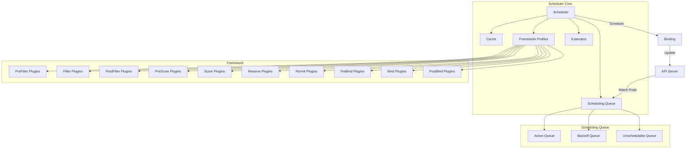
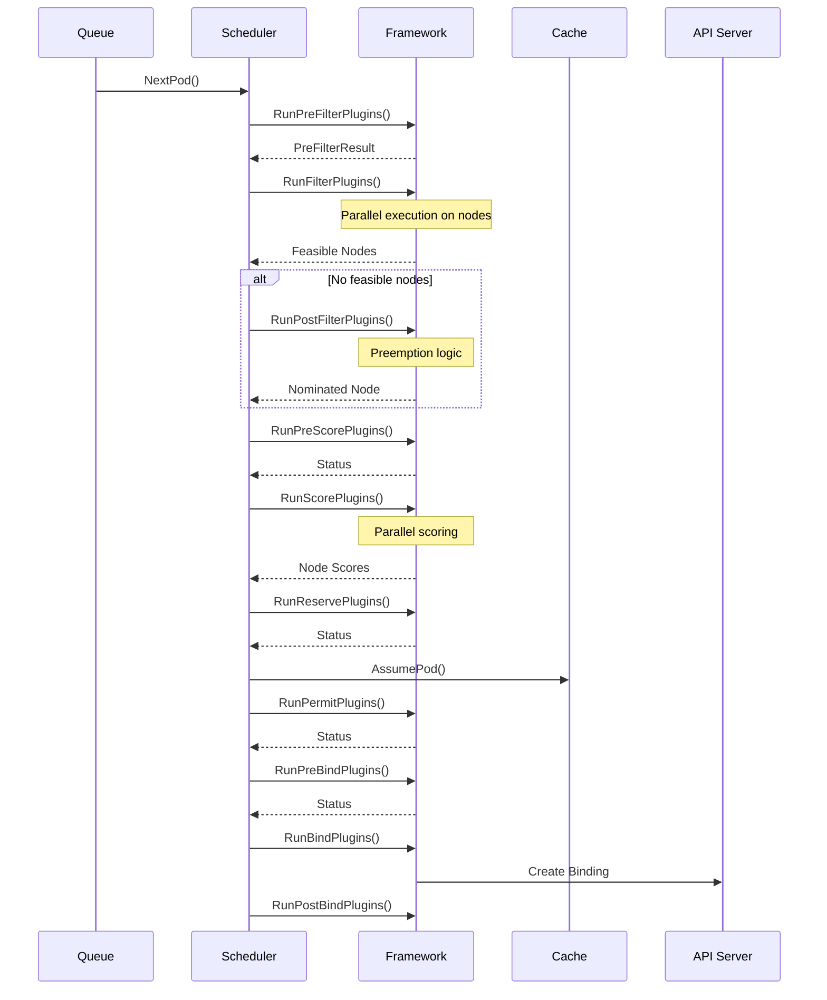
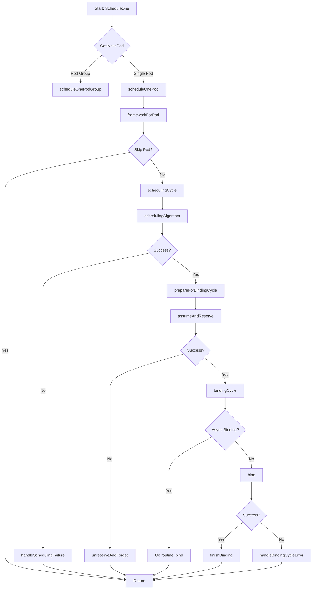
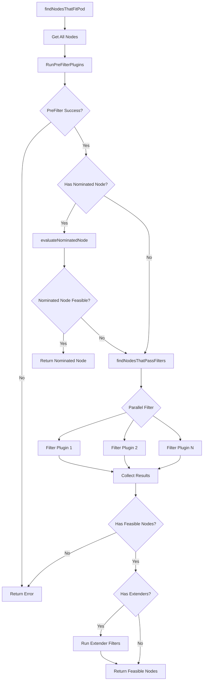
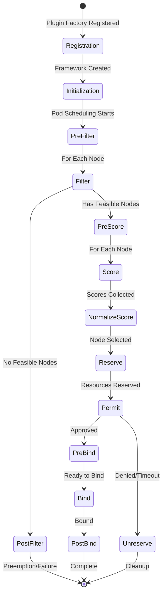
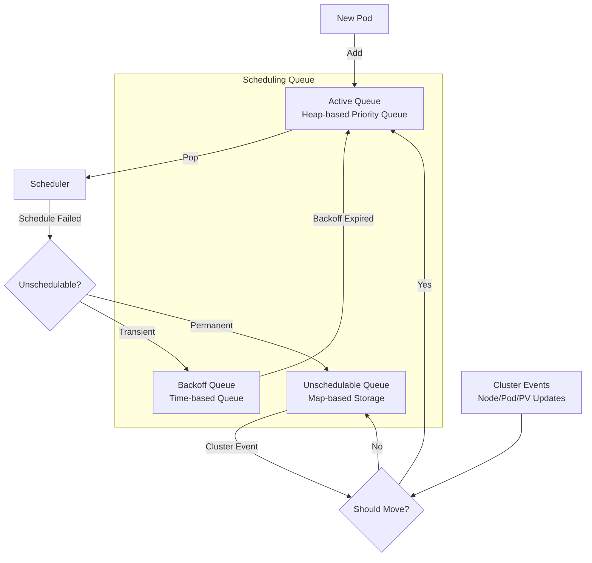

# Kubernetes Scheduler Internals: Algorithm & Framework Architecture

## Table of Contents
- [Overview](#overview)
- [Scheduler Architecture](#scheduler-architecture)
- [Scheduling Framework](#scheduling-framework)
- [Scheduling Cycle](#scheduling-cycle)
- [Plugin System](#plugin-system)
- [Scheduling Queue](#scheduling-queue)
- [Cache and Snapshot](#cache-and-snapshot)
- [Code References](#code-references)

## Overview

The Kubernetes scheduler is responsible for assigning pods to nodes in the cluster. It watches for newly created pods that have no node assigned and selects an optimal node for them to run on based on resource requirements, constraints, affinity/anti-affinity specifications, data locality, and other factors.

**Key Source Files:**
- `pkg/scheduler/scheduler.go` - Main scheduler struct and initialization
- `pkg/scheduler/schedule_one.go` - Core scheduling algorithm
- `pkg/scheduler/framework/interface.go` - Framework plugin interfaces
- `pkg/scheduler/backend/queue/scheduling_queue.go` - Scheduling queue implementation

## Scheduler Architecture



### Scheduler Struct

The main scheduler struct (`pkg/scheduler/scheduler.go:68-100`):

```go
type Scheduler struct {
    // Cache stores node and pod information
    Cache internalcache.Cache
    
    // Extenders for custom scheduling logic
    Extenders []fwk.Extender
    
    // NextPod retrieves the next pod to schedule
    NextPod func(logger klog.Logger) (*framework.QueuedPodInfo, error)
    
    // FailureHandler handles scheduling failures
    FailureHandler FailureHandlerFn
    
    // SchedulePod is the main scheduling function
    SchedulePod func(ctx context.Context, fwk framework.Framework, 
                     state fwk.CycleState, podInfo *framework.QueuedPodInfo) (ScheduleResult, error)
    
    // SchedulingQueue holds pods to be scheduled
    SchedulingQueue internalqueue.SchedulingQueue
    
    // APIDispatcher for async API calls (if feature enabled)
    APIDispatcher *apidispatcher.APIDispatcher
    
    // Profiles maps scheduler names to frameworks
    Profiles profile.Map
}
```

## Scheduling Framework

The scheduling framework provides a plugin architecture that allows extending scheduler behavior at various extension points.

### Extension Points



### Framework Interface

The framework interface (`pkg/scheduler/framework/interface.go`) defines the contract for scheduling plugins:

```go
type Framework interface {
    // PreFilter phase
    RunPreFilterPlugins(ctx context.Context, state fwk.CycleState, 
                       pod *v1.Pod) (*fwk.PreFilterResult, *fwk.Status, []string)
    
    // Filter phase - evaluates if pod can run on node
    RunFilterPlugins(ctx context.Context, state fwk.CycleState, 
                    pod *v1.Pod, nodeInfo fwk.NodeInfo) *fwk.Status
    
    // PostFilter phase - handles unschedulable pods (preemption)
    RunPostFilterPlugins(ctx context.Context, state fwk.CycleState, 
                        pod *v1.Pod, filteredNodeStatusMap fwk.NodeToStatusReader) 
                        (*fwk.PostFilterResult, *fwk.Status)
    
    // PreScore phase - preprocessing before scoring
    RunPreScorePlugins(ctx context.Context, state fwk.CycleState, 
                      pod *v1.Pod, nodes []fwk.NodeInfo) *fwk.Status
    
    // Score phase - ranks feasible nodes
    RunScorePlugins(ctx context.Context, state fwk.CycleState, 
                   pod *v1.Pod, nodes []fwk.NodeInfo) 
                   ([]fwk.NodePluginScores, *fwk.Status)
    
    // Reserve phase - reserves resources
    RunReservePlugins(ctx context.Context, state fwk.CycleState, 
                     pod *v1.Pod, nodeName string) *fwk.Status
    
    // Permit phase - approves or denies scheduling
    RunPermitPlugins(ctx context.Context, state fwk.CycleState, 
                    pod *v1.Pod, nodeName string) *fwk.Status
    
    // PreBind phase - preparation before binding
    RunPreBindPlugins(ctx context.Context, state fwk.CycleState, 
                     pod *v1.Pod, nodeName string) *fwk.Status
    
    // Bind phase - binds pod to node
    RunBindPlugins(ctx context.Context, state fwk.CycleState, 
                  pod *v1.Pod, nodeName string) *fwk.Status
    
    // PostBind phase - cleanup after binding
    RunPostBindPlugins(ctx context.Context, state fwk.CycleState, 
                      pod *v1.Pod, nodeName string)
}
```

## Scheduling Cycle

The main scheduling cycle is implemented in `pkg/scheduler/schedule_one.go:64-96`.

### High-Level Flow



### Scheduling Algorithm Details

The core scheduling algorithm (`pkg/scheduler/schedule_one.go:247-304`):

```go
func (sched *Scheduler) schedulingAlgorithm(
    ctx context.Context,
    schedFramework framework.Framework,
    state fwk.CycleState,
    pod *v1.Pod,
) (ScheduleResult, *fwk.Status) {
    
    // 1. Find nodes that fit the pod
    feasibleNodes, diagnosis, nodeHint, signature, err := 
        sched.findNodesThatFitPod(ctx, schedFramework, state, pod)
    
    if err != nil {
        return ScheduleResult{}, fwk.AsStatus(err)
    }
    
    // 2. If no nodes found, run PostFilter (preemption)
    if len(feasibleNodes) == 0 {
        result, status := schedFramework.RunPostFilterPlugins(
            ctx, state, pod, diagnosis.NodeToStatus)
        
        if status.IsSuccess() {
            // Preemption successful, return nominated node
            return ScheduleResult{
                SuggestedHost: result.NominatingInfo.NominatedNodeName,
                nominatingInfo: result.NominatingInfo,
            }, status
        }
        
        return ScheduleResult{}, status
    }
    
    // 3. If only one node, return it
    if len(feasibleNodes) == 1 {
        return ScheduleResult{
            SuggestedHost: feasibleNodes[0].Node().Name,
            EvaluatedNodes: 1 + diagnosis.NumFilteredNodes,
            FeasibleNodes: 1,
            signature: signature,
        }, nil
    }
    
    // 4. Score nodes and select best one
    priorityList, status := prioritizeNodes(
        ctx, schedFramework, state, pod, feasibleNodes, sched.Extenders)
    
    if !status.IsSuccess() {
        return ScheduleResult{}, status
    }
    
    // 5. Select host from scored nodes
    host, _, err := selectHost(priorityList, nodeHint)
    
    return ScheduleResult{
        SuggestedHost: host,
        EvaluatedNodes: len(feasibleNodes) + diagnosis.NumFilteredNodes,
        FeasibleNodes: len(feasibleNodes),
        signature: signature,
    }, fwk.AsStatus(err)
}
```

### Finding Feasible Nodes

The filtering process (`pkg/scheduler/schedule_one.go:626-716`):



**Key Optimization:** The scheduler doesn't always evaluate all nodes. It uses `numFeasibleNodesToFind()` to determine how many nodes to check:

```go
func (sched *Scheduler) numFeasibleNodesToFind(
    percentageOfNodesToScore *int32, 
    numAllNodes int32,
) int32 {
    // For small clusters, check all nodes
    if numAllNodes < minFeasibleNodesToFind {
        return numAllNodes
    }
    
    // Calculate based on percentage
    adaptivePercentage := sched.percentageOfNodesToScore
    if percentageOfNodesToScore != nil {
        adaptivePercentage = *percentageOfNodesToScore
    }
    
    numNodes := numAllNodes * adaptivePercentage / 100
    
    // Ensure minimum nodes are checked
    if numNodes < minFeasibleNodesToFind {
        return minFeasibleNodesToFind
    }
    
    return numNodes
}
```

### Scoring Nodes

The scoring process (`pkg/scheduler/schedule_one.go:934-1045`):

```go
func prioritizeNodes(
    ctx context.Context,
    schedFramework framework.Framework,
    state fwk.CycleState,
    pod *v1.Pod,
    nodes []fwk.NodeInfo,
    extenders []fwk.Extender,
) ([]fwk.NodePluginScores, error) {
    
    // 1. Run PreScore plugins
    status := schedFramework.RunPreScorePlugins(ctx, state, pod, nodes)
    if !status.IsSuccess() {
        return nil, status.AsError()
    }
    
    // 2. Run Score plugins (parallel execution)
    nodesScores, scoreStatus := schedFramework.RunScorePlugins(
        ctx, state, pod, nodes)
    if !scoreStatus.IsSuccess() {
        return nil, scoreStatus.AsError()
    }
    
    // 3. Run extender scoring if configured
    if len(extenders) != 0 {
        for _, extender := range extenders {
            if !extender.IsScorer() {
                continue
            }
            
            // Call extender
            prioritizedList, weight, err := extender.Prioritize(pod, nodes)
            if err != nil {
                continue
            }
            
            // Normalize and add extender scores
            for _, hostPriority := range *prioritizedList {
                score := hostPriority.Score * weight * 
                        (fwk.MaxNodeScore / extenderv1.MaxExtenderPriority)
                
                // Add to node's total score
                for i := range nodesScores {
                    if nodes[i].Node().Name == hostPriority.Host {
                        nodesScores[i].TotalScore += score
                        break
                    }
                }
            }
        }
    }
    
    return nodesScores, nil
}
```

## Plugin System

### Plugin Lifecycle



### Built-in Plugins

Key in-tree plugins and their purposes:

1. **NodeResourcesFit** (`pkg/scheduler/framework/plugins/noderesources/fit.go`)
   - Filters nodes based on resource requests
   - Checks CPU, memory, ephemeral storage, extended resources

2. **NodePorts** (`pkg/scheduler/framework/plugins/nodeports/node_ports.go`)
   - Ensures requested ports are available on the node

3. **PodTopologySpread** (`pkg/scheduler/framework/plugins/podtopologyspread/`)
   - Spreads pods across topology domains (zones, nodes, etc.)

4. **InterPodAffinity** (`pkg/scheduler/framework/plugins/interpodaffinity/`)
   - Handles pod affinity and anti-affinity rules

5. **NodeAffinity** (`pkg/scheduler/framework/plugins/nodeaffinity/`)
   - Filters nodes based on node selector and affinity

6. **VolumeBinding** (`pkg/scheduler/framework/plugins/volumebinding/`)
   - Handles PVC binding and volume topology

7. **TaintToleration** (`pkg/scheduler/framework/plugins/tainttoleration/`)
   - Filters nodes based on taints and tolerations

### Plugin Registration

Plugins are registered in `pkg/scheduler/framework/plugins/registry.go`:

```go
func NewInTreeRegistry() runtime.Registry {
    registry := runtime.Registry{
        "NodeResourcesFit": noderesources.NewFit,
        "NodePorts": nodeports.New,
        "PodTopologySpread": podtopologyspread.New,
        "InterPodAffinity": interpodaffinity.New,
        "NodeAffinity": nodeaffinity.New,
        "VolumeBinding": volumebinding.New,
        "TaintToleration": tainttoleration.New,
        // ... more plugins
    }
    return registry
}
```

## Scheduling Queue

The scheduling queue manages pods waiting to be scheduled using three internal queues.

### Queue Architecture



### Queue Implementation

The priority queue (`pkg/scheduler/backend/queue/scheduling_queue.go:167-216`):

```go
type PriorityQueue struct {
    *nominator
    
    // activeQ holds pods being actively scheduled
    activeQ *activeQueue
    
    // backoffQ holds pods that failed scheduling and are backing off
    backoffQ *backoffQueue
    
    // unschedulablePods holds pods that cannot be scheduled
    unschedulablePods *unschedulablePods
    
    // schedulingCycle represents current scheduling cycle number
    schedulingCycle int64
    
    // moveRequestCycle tracks when pods should be moved between queues
    moveRequestCycle int64
    
    // Metrics and monitoring
    metricsRecorder metrics.MetricAsyncRecorder
    
    // Plugin-specific queueing hints
    queueingHintMap QueueingHintMap
}
```

### Queueing Hints

Queueing hints optimize queue operations by determining which pods should be moved when cluster events occur:

```go
type QueueingHintFunction struct {
    PluginName     string
    QueueingHintFn fwk.QueueingHintFn
}

// QueueingHintFn determines if a pod should be moved to active queue
// based on a cluster event
type QueueingHintFn func(
    logger klog.Logger,
    pod *v1.Pod,
    oldObj, newObj interface{},
    event ClusterEvent,
) (QueueingHint, error)
```

## Cache and Snapshot

### Cache Architecture

```mermaid
graph TB
    subgraph "Scheduler Cache"
        A[Node Info Map<br/>map[nodeName]*NodeInfo]
        B[Assumed Pods<br/>set[podUID]]
        C[Pod States<br/>map[podUID]*podState]
    end
    
    D[API Server Events] -->|Add/Update/Delete| A
    D -->|Add/Update/Delete| C
    
    E[Scheduler] -->|AssumePod| B
    E -->|ForgetPod| B
    
    F[Snapshot] -->|UpdateSnapshot| A
    E -->|Read| F
    
    G[Garbage Collection] -->|Clean Expired| B
```

### NodeInfo Structure

The NodeInfo struct (`pkg/scheduler/framework/types.go:165-501`) aggregates all information about a node:

```go
type NodeInfo struct {
    // Node object
    node *v1.Node
    
    // Pods running on this node
    Pods []*PodInfo
    
    // Requested resources by all pods
    Requested *Resource
    
    // Non-zero requested resources
    NonZeroRequested *Resource
    
    // Allocatable resources
    Allocatable *Resource
    
    // Image states
    ImageStates map[string]*ImageStateSummary
    
    // PVC references
    PVCRefCounts map[string]int
    
    // Volume limits
    TransientInfo *TransientSchedulerInfo
    
    // Generation number for tracking updates
    Generation int64
}
```

### Snapshot Mechanism

The scheduler creates a snapshot at the beginning of each scheduling cycle:

```go
func (cache *cacheImpl) UpdateSnapshot(logger klog.Logger, nodeSnapshot *Snapshot) error {
    cache.mu.Lock()
    defer cache.mu.Unlock()
    
    // Update node list
    nodeSnapshot.nodeInfoList = make([]*framework.NodeInfo, 0, len(cache.nodes))
    for _, node := range cache.nodes {
        nodeSnapshot.nodeInfoList = append(nodeSnapshot.nodeInfoList, node.info.Clone())
    }
    
    // Update node map
    nodeSnapshot.nodeInfoMap = make(map[string]*framework.NodeInfo, len(cache.nodes))
    for name, node := range cache.nodes {
        nodeSnapshot.nodeInfoMap[name] = node.info.Clone()
    }
    
    // Update generation
    nodeSnapshot.generation = cache.generation
    
    return nil
}
```

## Code References

### Key Files and Their Purposes

| File                                               | Purpose                                             |
| -------------------------------------------------- | --------------------------------------------------- |
| `pkg/scheduler/scheduler.go`                       | Main scheduler struct, initialization, and run loop |
| `pkg/scheduler/schedule_one.go`                    | Core scheduling algorithm for single pods           |
| `pkg/scheduler/schedule_one_podgroup.go`           | Pod group scheduling algorithm                      |
| `pkg/scheduler/eventhandlers.go`                   | Event handlers for API server watches               |
| `pkg/scheduler/framework/interface.go`             | Framework plugin interfaces                         |
| `pkg/scheduler/framework/runtime/framework.go`     | Framework implementation                            |
| `pkg/scheduler/backend/queue/scheduling_queue.go`  | Scheduling queue implementation                     |
| `pkg/scheduler/backend/cache/cache.go`             | Scheduler cache implementation                      |
| `pkg/scheduler/framework/preemption/preemption.go` | Preemption logic                                    |
| `pkg/scheduler/profile/profile.go`                 | Scheduler profiles management                       |

### Important Functions

| Function                | Location                         | Purpose                          |
| ----------------------- | -------------------------------- | -------------------------------- |
| `ScheduleOne()`         | `schedule_one.go:64`             | Main scheduling loop entry point |
| `schedulePod()`         | `schedule_one.go:562`            | Schedules a single pod           |
| `findNodesThatFitPod()` | `schedule_one.go:626`            | Finds feasible nodes             |
| `prioritizeNodes()`     | `schedule_one.go:934`            | Scores nodes                     |
| `assume()`              | `schedule_one.go:1099`           | Assumes pod on node              |
| `bind()`                | `schedule_one.go:1129`           | Binds pod to node                |
| `RunFilterPlugins()`    | `framework/runtime/framework.go` | Executes filter plugins          |
| `RunScorePlugins()`     | `framework/runtime/framework.go` | Executes score plugins           |

### Performance Considerations

1. **Parallel Filtering**: Filter plugins run in parallel across nodes using worker pools
2. **Feasible Node Limit**: Not all nodes are evaluated (configurable percentage)
3. **Snapshot Isolation**: Each scheduling cycle uses a consistent snapshot
4. **Assumed Pods**: Pods are assumed in cache before binding completes
5. **Queue Optimization**: Queueing hints prevent unnecessary pod re-evaluations

### Extension Points for Custom Schedulers

1. **Custom Plugins**: Implement plugin interfaces and register them
2. **Scheduler Extenders**: HTTP-based external schedulers
3. **Multiple Profiles**: Different scheduling policies for different workloads
4. **Custom Metrics**: Integrate custom metrics for scoring

---

**Next**: See [INTERNALS_ADVANCED_FEATURES.md](./INTERNALS_ADVANCED_FEATURES.md) for details on preemption, pod groups, and advanced scheduling features.

