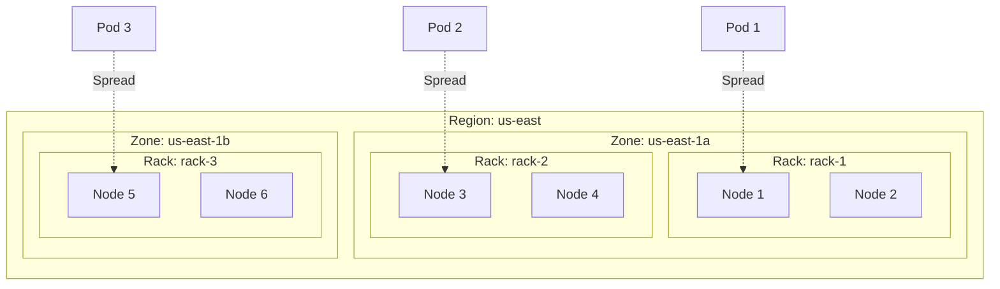

# Kubernetes Topology Constraints Internals: Advanced Scheduling

## Table of Contents
- [Overview](#overview)
- [Pod Topology Spread Constraints](#pod-topology-spread-constraints)
- [Node Affinity and Anti-Affinity](#node-affinity-and-anti-affinity)
- [Pod Affinity and Anti-Affinity](#pod-affinity-and-anti-affinity)
- [Topology-Aware Scheduling](#topology-aware-scheduling)
- [Volume Topology](#volume-topology)
- [Topology Keys and Domains](#topology-keys-and-domains)
- [Algorithm Deep Dive](#algorithm-deep-dive)
- [Code References](#code-references)

## Overview

Kubernetes topology constraints enable sophisticated pod placement decisions based on cluster topology, ensuring high availability, optimal resource distribution, and compliance with infrastructure requirements.

**Topology Constraint Types:**
1. **Pod Topology Spread** - Even distribution across topology domains
2. **Node Affinity** - Node selection based on labels
3. **Pod Affinity** - Co-location with other pods
4. **Pod Anti-Affinity** - Separation from other pods
5. **Volume Topology** - Storage-aware scheduling

**Key Concepts:**
- **Topology Domain** - A set of nodes sharing a topology key value (e.g., zone, rack, host)
- **Topology Key** - Label key defining topology boundaries (e.g., `topology.kubernetes.io/zone`)
- **Skew** - Difference in pod count between topology domains
- **Spread Constraint** - Rules for distributing pods across domains

## Pod Topology Spread Constraints

### Algorithm Overview

Pod Topology Spread Constraints (PTSC) ensure pods are evenly distributed across topology domains to improve availability and resource utilization.

**Core Algorithm:**
```
ALGORITHM: PodTopologySpread
INPUT:
  - pod: Pod to schedule
  - constraints: List of topology spread constraints
  - nodes: Available nodes in cluster
  - existingPods: Currently running pods

OUTPUT:
  - feasibleNodes: Nodes that satisfy all constraints
  - scores: Score for each feasible node

PROCEDURE:
  FOR EACH constraint IN constraints DO
    // Group nodes by topology domain
    domains ← GroupNodesByTopology(nodes, constraint.topologyKey)
    
    // Count matching pods in each domain
    podCounts ← CountMatchingPods(existingPods, constraint.labelSelector, domains)
    
    // Calculate current skew
    minCount ← MIN(podCounts.values())
    maxCount ← MAX(podCounts.values())
    currentSkew ← maxCount - minCount
    
    // Filter nodes based on constraint
    IF constraint.whenUnsatisfiable == "DoNotSchedule" THEN
      // Hard constraint: filter out nodes that would violate maxSkew
      FOR EACH node IN nodes DO
        domain ← GetTopologyDomain(node, constraint.topologyKey)
        newCount ← podCounts[domain] + 1
        newSkew ← MAX(newCount - minCount, maxCount - minCount)
        
        IF newSkew > constraint.maxSkew THEN
          REMOVE node FROM feasibleNodes
        END IF
      END FOR
      
    ELSE IF constraint.whenUnsatisfiable == "ScheduleAnyway" THEN
      // Soft constraint: score nodes based on skew
      FOR EACH node IN nodes DO
        domain ← GetTopologyDomain(node, constraint.topologyKey)
        newCount ← podCounts[domain] + 1
        newSkew ← MAX(newCount - minCount, maxCount - minCount)
        
        // Lower skew = higher score
        score ← CalculateSkewScore(newSkew, constraint.maxSkew)
        scores[node] += score
      END FOR
    END IF
  END FOR
  
  RETURN feasibleNodes, scores
END PROCEDURE
```

### Mathematical Model

**Skew Calculation:**
```
Let:
  D = {d₁, d₂, ..., dₙ} be the set of topology domains
  P(dᵢ) = number of matching pods in domain dᵢ
  
Current skew:
  skew_current = max(P(dᵢ)) - min(P(dᵢ))
  
After scheduling to domain dⱼ:
  P'(dⱼ) = P(dⱼ) + 1
  skew_new = max(P'(dⱼ), max(P(dᵢ))) - min(P(dᵢ))
  
Constraint satisfaction:
  feasible(dⱼ) ⟺ skew_new ≤ maxSkew
```

**Scoring Function:**
```
For soft constraints (ScheduleAnyway):

score(node) = {
  100,                           if skew_new ≤ maxSkew
  100 × (1 - (skew_new - maxSkew) / maxSkew),  otherwise
}

This creates a linear penalty for exceeding maxSkew:
  - At maxSkew: score = 100
  - At 2×maxSkew: score = 0
  - Beyond 2×maxSkew: score < 0 (heavily penalized)
```

### Topology Spread Constraint API

```go
type TopologySpreadConstraint struct {
    // MaxSkew describes the maximum degree of imbalance
    MaxSkew int32
    
    // TopologyKey is the key of node labels
    TopologyKey string
    
    // WhenUnsatisfiable indicates how to deal with a pod if it doesn't satisfy the spread constraint
    WhenUnsatisfiable UnsatisfiableConstraintAction
    
    // LabelSelector is used to identify pods to count
    LabelSelector *metav1.LabelSelector
    
    // MinDomains indicates minimum number of eligible domains
    MinDomains *int32
    
    // NodeAffinityPolicy indicates how to treat pod's nodeAffinity
    NodeAffinityPolicy *NodeInclusionPolicy
    
    // NodeTaintsPolicy indicates how to treat node taints
    NodeTaintsPolicy *NodeInclusionPolicy
    
    // MatchLabelKeys is a list of pod label keys to select pods
    MatchLabelKeys []string
}

type UnsatisfiableConstraintAction string

const (
    // DoNotSchedule instructs the scheduler not to schedule the pod
    DoNotSchedule UnsatisfiableConstraintAction = "DoNotSchedule"
    
    // ScheduleAnyway instructs the scheduler to schedule the pod anyway
    ScheduleAnyway UnsatisfiableConstraintAction = "ScheduleAnyway"
)
```

### Example Configurations

```yaml
# Example 1: Even distribution across zones
apiVersion: v1
kind: Pod
metadata:
  name: web-server
spec:
  topologySpreadConstraints:
  - maxSkew: 1
    topologyKey: topology.kubernetes.io/zone
    whenUnsatisfiable: DoNotSchedule
    labelSelector:
      matchLabels:
        app: web
  containers:
  - name: web
    image: nginx

# Example 2: Soft constraint with multiple topology levels
apiVersion: v1
kind: Pod
metadata:
  name: cache-server
spec:
  topologySpreadConstraints:
  # Zone-level spread (hard constraint)
  - maxSkew: 1
    topologyKey: topology.kubernetes.io/zone
    whenUnsatisfiable: DoNotSchedule
    labelSelector:
      matchLabels:
        app: cache
  # Node-level spread (soft constraint)
  - maxSkew: 2
    topologyKey: kubernetes.io/hostname
    whenUnsatisfiable: ScheduleAnyway
    labelSelector:
      matchLabels:
        app: cache
  containers:
  - name: cache
    image: redis

# Example 3: MinDomains for high availability
apiVersion: v1
kind: Pod
metadata:
  name: database
spec:
  topologySpreadConstraints:
  - maxSkew: 1
    minDomains: 3  # Require at least 3 zones
    topologyKey: topology.kubernetes.io/zone
    whenUnsatisfiable: DoNotSchedule
    labelSelector:
      matchLabels:
        app: database
  containers:
  - name: db
    image: postgres
```

### Implementation Details

```go
type PodTopologySpread struct {
    // Precomputed topology information
    topologyPairToPodCounts map[topologyPair]*int64
    topologyNormalizingWeight []float64
}

type topologyPair struct {
    key   string
    value string
}

func (pl *PodTopologySpread) PreFilter(ctx context.Context, state *framework.CycleState, pod *v1.Pod) *framework.Status {
    // Extract constraints from pod
    constraints, err := pl.buildConstraints(pod)
    if err != nil {
        return framework.NewStatus(framework.Error, err.Error())
    }
    
    if len(constraints) == 0 {
        return nil
    }
    
    // Get all pods in cluster
    allPods, err := pl.podLister.List(labels.Everything())
    if err != nil {
        return framework.NewStatus(framework.Error, err.Error())
    }
    
    // Build topology pair to pod counts map
    topologyPairToPodCounts := make(map[topologyPair]*int64)
    
    for _, constraint := range constraints {
        selector, err := metav1.LabelSelectorAsSelector(constraint.LabelSelector)
        if err != nil {
            continue
        }
        
        for _, existingPod := range allPods {
            // Skip if pod doesn't match selector
            if !selector.Matches(labels.Set(existingPod.Labels)) {
                continue
            }
            
            // Get node for pod
            node, err := pl.nodeLister.Get(existingPod.Spec.NodeName)
            if err != nil {
                continue
            }
            
            // Get topology value
            topologyValue, ok := node.Labels[constraint.TopologyKey]
            if !ok {
                continue
            }
            
            // Increment count
            pair := topologyPair{
                key:   constraint.TopologyKey,
                value: topologyValue,
            }
            
            if count, exists := topologyPairToPodCounts[pair]; exists {
                *count++
            } else {
                count := int64(1)
                topologyPairToPodCounts[pair] = &count
            }
        }
    }
    
    // Store in cycle state
    state.Write(preFilterStateKey, &preFilterState{
        Constraints:             constraints,
        TopologyPairToPodCounts: topologyPairToPodCounts,
    })
    
    return nil
}

func (pl *PodTopologySpread) Filter(ctx context.Context, state *framework.CycleState, pod *v1.Pod, nodeInfo *framework.NodeInfo) *framework.Status {
    s, err := getPreFilterState(state)
    if err != nil {
        return framework.NewStatus(framework.Error, err.Error())
    }
    
    node := nodeInfo.Node()
    
    for _, constraint := range s.Constraints {
        // Skip soft constraints in filter phase
        if constraint.WhenUnsatisfiable != v1.DoNotSchedule {
            continue
        }
        
        // Get topology value for this node
        topologyValue, ok := node.Labels[constraint.TopologyKey]
        if !ok {
            return framework.NewStatus(framework.UnschedulableAndUnresolvable,
                fmt.Sprintf("node doesn't have required label %s", constraint.TopologyKey))
        }
        
        // Calculate skew if pod is scheduled to this node
        pair := topologyPair{
            key:   constraint.TopologyKey,
            value: topologyValue,
        }
        
        currentCount := int64(0)
        if count, exists := s.TopologyPairToPodCounts[pair]; exists {
            currentCount = *count
        }
        
        // Calculate min count across all domains
        minCount := int64(math.MaxInt64)
        for p, count := range s.TopologyPairToPodCounts {
            if p.key == constraint.TopologyKey && *count < minCount {
                minCount = *count
            }
        }
        
        if minCount == math.MaxInt64 {
            minCount = 0
        }
        
        // Calculate new skew
        newCount := currentCount + 1
        newSkew := newCount - minCount
        
        // Check if skew exceeds maxSkew
        if newSkew > int64(constraint.MaxSkew) {
            return framework.NewStatus(framework.Unschedulable,
                fmt.Sprintf("pod would violate topology spread constraint: skew %d > maxSkew %d",
                    newSkew, constraint.MaxSkew))
        }
        
        // Check minDomains if specified
        if constraint.MinDomains != nil {
            domainCount := pl.countDomains(s.TopologyPairToPodCounts, constraint.TopologyKey)
            if domainCount < int(*constraint.MinDomains) {
                return framework.NewStatus(framework.Unschedulable,
                    fmt.Sprintf("insufficient domains: %d < minDomains %d",
                        domainCount, *constraint.MinDomains))
            }
        }
    }
    
    return nil
}

func (pl *PodTopologySpread) Score(ctx context.Context, state *framework.CycleState, pod *v1.Pod, nodeName string) (int64, *framework.Status) {
    s, err := getPreFilterState(state)
    if err != nil {
        return 0, framework.NewStatus(framework.Error, err.Error())
    }
    
    node, err := pl.nodeLister.Get(nodeName)
    if err != nil {
        return 0, framework.NewStatus(framework.Error, err.Error())
    }
    
    var score int64 = 0
    
    for _, constraint := range s.Constraints {
        // Only score soft constraints
        if constraint.WhenUnsatisfiable != v1.ScheduleAnyway {
            continue
        }
        
        topologyValue, ok := node.Labels[constraint.TopologyKey]
        if !ok {
            continue
        }
        
        pair := topologyPair{
            key:   constraint.TopologyKey,
            value: topologyValue,
        }
        
        currentCount := int64(0)
        if count, exists := s.TopologyPairToPodCounts[pair]; exists {
            currentCount = *count
        }
        
        // Calculate min count
        minCount := int64(math.MaxInt64)
        for p, count := range s.TopologyPairToPodCounts {
            if p.key == constraint.TopologyKey && *count < minCount {
                minCount = *count
            }
        }
        
        if minCount == math.MaxInt64 {
            minCount = 0
        }
        
        // Calculate score based on skew
        newCount := currentCount + 1
        newSkew := newCount - minCount
        
        if newSkew <= int64(constraint.MaxSkew) {
            // Within maxSkew: full score
            score += framework.MaxNodeScore
        } else {
            // Beyond maxSkew: linear penalty
            penalty := (newSkew - int64(constraint.MaxSkew)) * framework.MaxNodeScore / int64(constraint.MaxSkew)
            score += framework.MaxNodeScore - penalty
        }
    }
    
    return score, nil
}
```

## Node Affinity and Anti-Affinity

### Node Affinity Algorithm

```
ALGORITHM: NodeAffinity
INPUT:
  - pod: Pod with node affinity rules
  - node: Node to evaluate
  
OUTPUT:
  - matches: Boolean indicating if node matches affinity

PROCEDURE:
  // Check required node affinity (hard constraint)
  IF pod.spec.affinity.nodeAffinity.requiredDuringSchedulingIgnoredDuringExecution EXISTS THEN
    nodeSelectorTerms ← pod.spec.affinity.nodeAffinity.required...nodeSelectorTerms
    
    matchesAny ← false
    FOR EACH term IN nodeSelectorTerms DO
      IF EvaluateNodeSelectorTerm(term, node) THEN
        matchesAny ← true
        BREAK
      END IF
    END FOR
    
    IF NOT matchesAny THEN
      RETURN false  // Node doesn't match required affinity
    END IF
  END IF
  
  // Check preferred node affinity (soft constraint)
  IF pod.spec.affinity.nodeAffinity.preferredDuringSchedulingIgnoredDuringExecution EXISTS THEN
    preferences ← pod.spec.affinity.nodeAffinity.preferred...
    
    score ← 0
    FOR EACH preference IN preferences DO
      IF EvaluateNodeSelectorTerm(preference.preference, node) THEN
        score += preference.weight
      END IF
    END FOR
    
    RETURN true, score
  END IF
  
  RETURN true, 0
END PROCEDURE

FUNCTION EvaluateNodeSelectorTerm(term, node):
  // All match expressions must be satisfied
  FOR EACH matchExpression IN term.matchExpressions DO
    nodeValue ← node.labels[matchExpression.key]
    
    SWITCH matchExpression.operator DO
      CASE "In":
        IF nodeValue NOT IN matchExpression.values THEN
          RETURN false
        END IF
        
      CASE "NotIn":
        IF nodeValue IN matchExpression.values THEN
          RETURN false
        END IF
        
      CASE "Exists":
        IF matchExpression.key NOT IN node.labels THEN
          RETURN false
        END IF
        
      CASE "DoesNotExist":
        IF matchExpression.key IN node.labels THEN
          RETURN false
        END IF
        
      CASE "Gt":
        IF NOT (nodeValue > matchExpression.values[0]) THEN
          RETURN false
        END IF
        
      CASE "Lt":
        IF NOT (nodeValue < matchExpression.values[0]) THEN
          RETURN false
        END IF
    END SWITCH
  END FOR
  
  // All match fields must be satisfied
  FOR EACH matchField IN term.matchFields DO
    nodeValue ← GetNodeField(node, matchField.key)
    
    // Similar evaluation as matchExpressions
    IF NOT EvaluateFieldSelector(matchField, nodeValue) THEN
      RETURN false
    END IF
  END FOR
  
  RETURN true
END FUNCTION
```

### Node Affinity Examples

```yaml
# Example 1: Required node affinity (hard constraint)
apiVersion: v1
kind: Pod
metadata:
  name: with-node-affinity
spec:
  affinity:
    nodeAffinity:
      requiredDuringSchedulingIgnoredDuringExecution:
        nodeSelectorTerms:
        - matchExpressions:
          - key: topology.kubernetes.io/zone
            operator: In
            values:
            - us-east-1a
            - us-east-1b
          - key: node.kubernetes.io/instance-type
            operator: In
            values:
            - m5.large
            - m5.xlarge
  containers:
  - name: app
    image: myapp

# Example 2: Preferred node affinity (soft constraint)
apiVersion: v1
kind: Pod
metadata:
  name: with-preferred-affinity
spec:
  affinity:
    nodeAffinity:
      preferredDuringSchedulingIgnoredDuringExecution:
      - weight: 100
        preference:
          matchExpressions:
          - key: disk-type
            operator: In
            values:
            - ssd
      - weight: 50
        preference:
          matchExpressions:
          - key: network-speed
            operator: In
            values:
            - 10gbps
  containers:
  - name: app
    image: myapp

# Example 3: Combined required and preferred
apiVersion: v1
kind: Pod
metadata:
  name: with-combined-affinity
spec:
  affinity:
    nodeAffinity:
      # Must be in specific zones
      requiredDuringSchedulingIgnoredDuringExecution:
        nodeSelectorTerms:
        - matchExpressions:
          - key: topology.kubernetes.io/zone
            operator: In
            values:
            - us-east-1a
            - us-east-1b
      # Prefer SSD nodes
      preferredDuringSchedulingIgnoredDuringExecution:
      - weight: 100
        preference:
          matchExpressions:
          - key: disk-type
            operator: In
            values:
            - ssd
  containers:
  - name: app
    image: myapp
```

## Pod Affinity and Anti-Affinity

### Pod Affinity Algorithm

```
ALGORITHM: PodAffinity
INPUT:
  - pod: Pod with affinity rules
  - node: Node to evaluate
  - existingPods: Pods already scheduled

OUTPUT:
  - feasible: Boolean indicating if node is feasible
  - score: Affinity score for the node

PROCEDURE:
  // Check required pod affinity (hard constraint)
  IF pod.spec.affinity.podAffinity.requiredDuringSchedulingIgnoredDuringExecution EXISTS THEN
    terms ← pod.spec.affinity.podAffinity.required...
    
    FOR EACH term IN terms DO
      // Find pods matching the label selector
      matchingPods ← FilterPods(existingPods, term.labelSelector)
      
      // Check if any matching pod is in the same topology domain
      foundMatch ← false
      FOR EACH matchingPod IN matchingPods DO
        matchingNode ← GetNode(matchingPod)
        
        IF SameTopologyDomain(node, matchingNode, term.topologyKey) THEN
          foundMatch ← true
          BREAK
        END IF
      END FOR
      
      IF NOT foundMatch THEN
        RETURN false, 0  // Required affinity not satisfied
      END IF
    END FOR
  END IF
  
  // Check required pod anti-affinity (hard constraint)
  IF pod.spec.affinity.podAntiAffinity.requiredDuringSchedulingIgnoredDuringExecution EXISTS THEN
    terms ← pod.spec.affinity.podAntiAffinity.required...
    
    FOR EACH term IN terms DO
      matchingPods ← FilterPods(existingPods, term.labelSelector)
      
      // Check if any matching pod is in the same topology domain
      FOR EACH matchingPod IN matchingPods DO
        matchingNode ← GetNode(matchingPod)
        
        IF SameTopologyDomain(node, matchingNode, term.topologyKey) THEN
          RETURN false, 0  // Anti-affinity violated
        END IF
      END FOR
    END FOR
  END IF
  
  // Calculate score from preferred affinity/anti-affinity
  score ← 0
  
  // Preferred pod affinity (soft constraint)
  IF pod.spec.affinity.podAffinity.preferredDuringSchedulingIgnoredDuringExecution EXISTS THEN
    terms ← pod.spec.affinity.podAffinity.preferred...
    
    FOR EACH term IN terms DO
      matchingPods ← FilterPods(existingPods, term.podAffinityTerm.labelSelector)
      
      matchCount ← 0
      FOR EACH matchingPod IN matchingPods DO
        matchingNode ← GetNode(matchingPod)
        
        IF SameTopologyDomain(node, matchingNode, term.podAffinityTerm.topologyKey) THEN
          matchCount++
        END IF
      END FOR
      
      // Score increases with number of matching pods
      score += term.weight × matchCount
    END FOR
  END IF
  
  // Preferred pod anti-affinity (soft constraint)
  IF pod.spec.affinity.podAntiAffinity.preferredDuringSchedulingIgnoredDuringExecution EXISTS THEN
    terms ← pod.spec.affinity.podAntiAffinity.preferred...
    
    FOR EACH term IN terms DO
      matchingPods ← FilterPods(existingPods, term.podAffinityTerm.labelSelector)
      
      matchCount ← 0
      FOR EACH matchingPod IN matchingPods DO
        matchingNode ← GetNode(matchingPod)
        
        IF SameTopologyDomain(node, matchingNode, term.podAffinityTerm.topologyKey) THEN
          matchCount++
        END IF
      END FOR
      
      // Score decreases with number of matching pods
      score -= term.weight × matchCount
    END FOR
  END IF
  
  RETURN true, score
END PROCEDURE

FUNCTION SameTopologyDomain(node1, node2, topologyKey):
  value1 ← node1.labels[topologyKey]
  value2 ← node2.labels[topologyKey]
  
  RETURN value1 == value2 AND value1 != ""
END FUNCTION
```

### Pod Affinity Examples

```yaml
# Example 1: Pod affinity - co-locate with cache
apiVersion: v1
kind: Pod
metadata:
  name: web-server
spec:
  affinity:
    podAffinity:
      requiredDuringSchedulingIgnoredDuringExecution:
      - labelSelector:
          matchExpressions:
          - key: app
            operator: In
            values:
            - cache
        topologyKey: kubernetes.io/hostname
  containers:
  - name: web
    image: nginx

# Example 2: Pod anti-affinity - spread across nodes
apiVersion: v1
kind: Pod
metadata:
  name: web-server
  labels:
    app: web
spec:
  affinity:
    podAntiAffinity:
      requiredDuringSchedulingIgnoredDuringExecution:
      - labelSelector:
          matchExpressions:
          - key: app
            operator: In
            values:
            - web
        topologyKey: kubernetes.io/hostname
  containers:
  - name: web
    image: nginx

# Example 3: Combined affinity and anti-affinity
apiVersion: v1
kind: Pod
metadata:
  name: app-server
  labels:
    app: backend
    tier: api
spec:
  affinity:
    # Co-locate with database in same zone
    podAffinity:
      preferredDuringSchedulingIgnoredDuringExecution:
      - weight: 100
        podAffinityTerm:
          labelSelector:
            matchExpressions:
            - key: app
              operator: In
              values:
              - database
          topologyKey: topology.kubernetes.io/zone
    # Avoid other backend pods on same node
    podAntiAffinity:
      requiredDuringSchedulingIgnoredDuringExecution:
      - labelSelector:
          matchExpressions:
          - key: app
            operator: In
            values:
            - backend
        topologyKey: kubernetes.io/hostname
  containers:
  - name: api
    image: myapi
```

## Topology-Aware Scheduling

### Multi-Level Topology



### Topology Keys

```go
const (
    // Standard topology keys
    LabelTopologyRegion = "topology.kubernetes.io/region"
    LabelTopologyZone   = "topology.kubernetes.io/zone"
    LabelHostname       = "kubernetes.io/hostname"
    
    // Custom topology keys
    LabelRack           = "topology.kubernetes.io/rack"
    LabelDatacenter     = "topology.kubernetes.io/datacenter"
    LabelChassis        = "topology.kubernetes.io/chassis"
)
```

## Volume Topology

### Volume Topology Awareness

```
ALGORITHM: VolumeTopologyScheduling
INPUT:
  - pod: Pod with volume claims
  - node: Node to evaluate
  - pvcs: PersistentVolumeClaims for pod
  - pvs: Available PersistentVolumes

OUTPUT:
  - feasible: Boolean indicating if node can access volumes

PROCEDURE:
  FOR EACH pvc IN pvcs DO
    // Get bound PV or find suitable PV
    pv ← GetBoundPV(pvc) OR FindSuitablePV(pvc, pvs)
    
    IF pv == NULL THEN
      RETURN false  // No suitable volume
    END IF
    
    // Check volume node affinity
    IF pv.spec.nodeAffinity EXISTS THEN
      required ← pv.spec.nodeAffinity.required
      
      matchesAny ← false
      FOR EACH term IN required.nodeSelectorTerms DO
        IF EvaluateNodeSelectorTerm(term, node) THEN
          matchesAny ← true
          BREAK
        END IF
      END FOR
      
      IF NOT matchesAny THEN
        RETURN false  // Node cannot access volume
      END IF
    END IF
    
    // Check CSI topology
    IF pv.spec.csi EXISTS AND pv.spec.csi.volumeAttributes["topology"] EXISTS THEN
      volumeTopology ← ParseTopology(pv.spec.csi.volumeAttributes["topology"])
      nodeTopology ← GetNodeTopology(node)
      
      IF NOT TopologyMatches(volumeTopology, nodeTopology) THEN
        RETURN false  // Topology mismatch
      END IF
    END IF
  END FOR
  
  RETURN true
END PROCEDURE
```

### Volume Topology Example

```yaml
# PersistentVolume with topology constraints
apiVersion: v1
kind: PersistentVolume
metadata:
  name: pv-zone-a
spec:
  capacity:
    storage: 10Gi
  accessModes:
    - ReadWriteOnce
  csi:
    driver: ebs.csi.aws.com
    volumeHandle: vol-12345
  nodeAffinity:
    required:
      nodeSelectorTerms:
      - matchExpressions:
        - key: topology.kubernetes.io/zone
          operator: In
          values:
          - us-east-1a

# StorageClass with topology awareness
apiVersion: storage.k8s.io/v1
kind: StorageClass
metadata:
  name: fast-ssd
provisioner: ebs.csi.aws.com
parameters:
  type: gp3
volumeBindingMode: WaitForFirstConsumer  # Topology-aware provisioning
allowedTopologies:
- matchLabelExpressions:
  - key: topology.kubernetes.io/zone
    values:
    - us-east-1a
    - us-east-1b
```

## Algorithm Deep Dive

### Combined Constraint Evaluation

```
ALGORITHM: EvaluateAllConstraints
INPUT:
  - pod: Pod to schedule
  - node: Node to evaluate
  - state: Scheduling cycle state

OUTPUT:
  - feasible: Boolean
  - score: Combined score

PROCEDURE:
  // Phase 1: Hard constraints (Filter)
  
  // 1. Node affinity
  IF NOT EvaluateNodeAffinity(pod, node) THEN
    RETURN false, 0
  END IF
  
  // 2. Pod affinity/anti-affinity
  IF NOT EvaluatePodAffinity(pod, node, state) THEN
    RETURN false, 0
  END IF
  
  // 3. Topology spread (hard constraints)
  IF NOT EvaluateTopologySpread(pod, node, state, "DoNotSchedule") THEN
    RETURN false, 0
  END IF
  
  // 4. Volume topology
  IF NOT EvaluateVolumeTopology(pod, node, state) THEN
    RETURN false, 0
  END IF
  
  // Phase 2: Soft constraints (Score)
  
  score ← 0
  
  // 1. Preferred node affinity
  score += ScoreNodeAffinity(pod, node) × WEIGHT_NODE_AFFINITY
  
  // 2. Preferred pod affinity/anti-affinity
  score += ScorePodAffinity(pod, node, state) × WEIGHT_POD_AFFINITY
  
  // 3. Topology spread (soft constraints)
  score += ScoreTopologySpread(pod, node, state) × WEIGHT_TOPOLOGY_SPREAD
  
  // 4. Balance score (even distribution)
  score += ScoreBalance(node, state) × WEIGHT_BALANCE
  
  RETURN true, score
END PROCEDURE
```

### Complexity Analysis

**Time Complexity:**
- Node Affinity: O(T × E) where T = terms, E = expressions
- Pod Affinity: O(P × T × E) where P = existing pods
- Topology Spread: O(D × P) where D = domains, P = pods
- Combined: O(N × (T×E + P×T×E + D×P)) for N nodes

**Space Complexity:**
- Topology map: O(D × P) for domain-to-pod mapping
- Affinity cache: O(P²) for pod-to-pod relationships
- Node labels: O(N × L) where L = labels per node

**Optimization Strategies:**
1. **Precomputation**: Build topology maps in PreFilter
2. **Caching**: Cache pod-to-node mappings
3. **Indexing**: Index pods by labels for fast lookup
4. **Pruning**: Early termination on hard constraint violations

## Code References

### Key Files

| Component       | Location                                             | Purpose                            |
| --------------- | ---------------------------------------------------- | ---------------------------------- |
| Topology Spread | `pkg/scheduler/framework/plugins/podtopologyspread/` | Pod topology spread implementation |
| Node Affinity   | `pkg/scheduler/framework/plugins/nodeaffinity/`      | Node affinity plugin               |
| Pod Affinity    | `pkg/scheduler/framework/plugins/interpodaffinity/`  | Pod affinity/anti-affinity         |
| Volume Topology | `pkg/scheduler/framework/plugins/volumebinding/`     | Volume topology awareness          |

### Best Practices

1. **Use Topology Spread**: Prefer topology spread over pod anti-affinity for even distribution
2. **Combine Constraints**: Use multiple constraint types for sophisticated placement
3. **Soft vs Hard**: Use soft constraints when possible to avoid scheduling failures
4. **Topology Keys**: Choose appropriate topology keys for your infrastructure
5. **MinDomains**: Set minDomains for high availability requirements
6. **Volume Binding**: Use WaitForFirstConsumer for topology-aware volume provisioning

### Troubleshooting

```bash
# Check node labels
kubectl get nodes --show-labels
kubectl describe node <node-name>

# Check pod topology spread
kubectl get pod <pod-name> -o yaml | grep -A 20 topologySpreadConstraints

# Check why pod is not scheduling
kubectl describe pod <pod-name>
kubectl get events --field-selector involvedObject.name=<pod-name>

# Check volume topology
kubectl get pv <pv-name> -o yaml | grep -A 10 nodeAffinity
kubectl get storageclass <sc-name> -o yaml

# Debug scheduling decisions
kubectl logs -n kube-system kube-scheduler-xxx --tail=100 | grep <pod-name>
```

---

**Summary**: Kubernetes topology constraints provide powerful mechanisms for controlling pod placement across cluster topology, ensuring high availability, optimal resource distribution, and compliance with infrastructure requirements through sophisticated scheduling algorithms.

