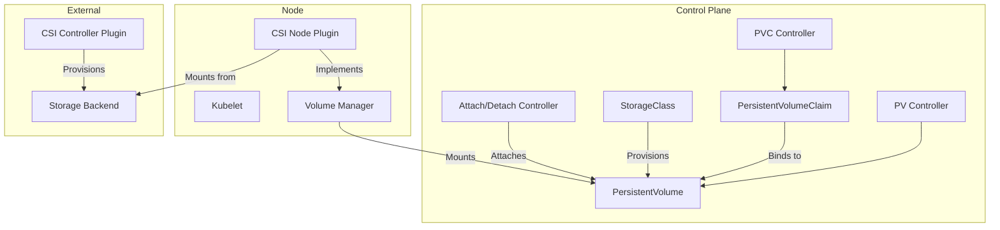
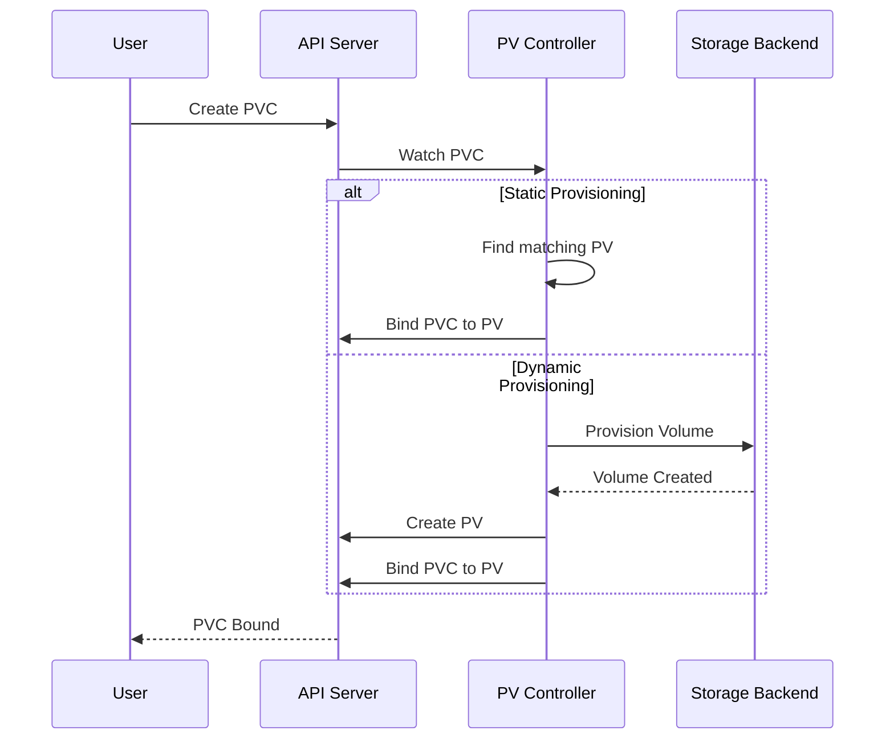
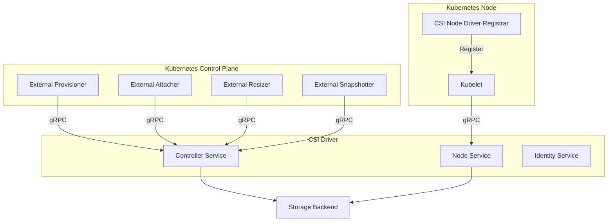
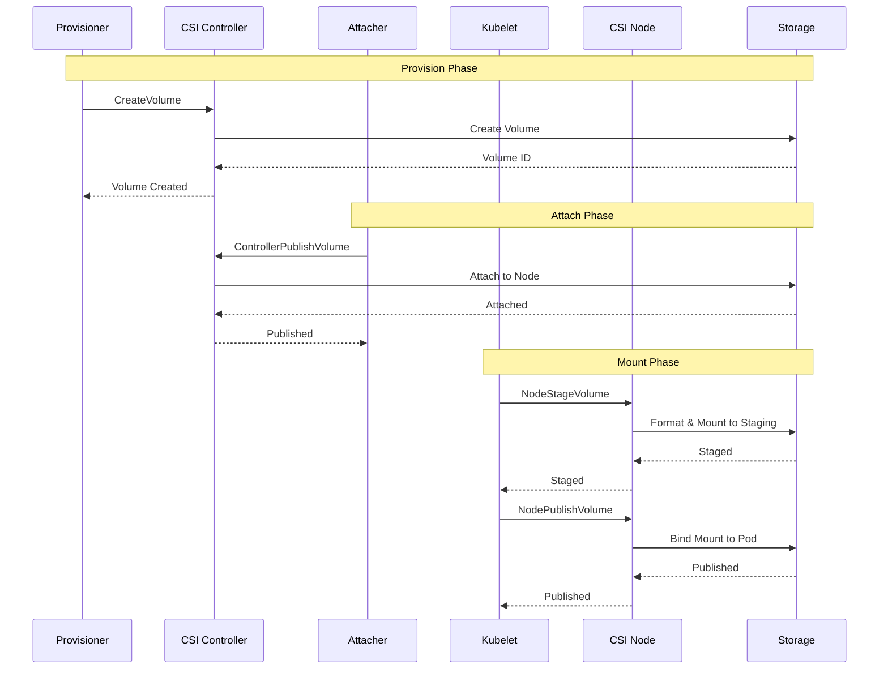

# Kubernetes Storage Internals: CSI & Persistent Volumes

## Table of Contents
- [Kubernetes Storage Internals: CSI \& Persistent Volumes](#kubernetes-storage-internals-csi--persistent-volumes)
  - [Table of Contents](#table-of-contents)
  - [Overview](#overview)
  - [Storage Architecture](#storage-architecture)
    - [Volume Plugin Architecture](#volume-plugin-architecture)
  - [Persistent Volume Lifecycle](#persistent-volume-lifecycle)
    - [PV/PVC Binding Flow](#pvpvc-binding-flow)
    - [PersistentVolume Controller](#persistentvolume-controller)
  - [Container Storage Interface (CSI)](#container-storage-interface-csi)
    - [CSI Architecture](#csi-architecture)
    - [CSI Driver Interface](#csi-driver-interface)
    - [CSI Volume Lifecycle](#csi-volume-lifecycle)
    - [CSI Driver Implementation](#csi-driver-implementation)
  - [Dynamic Provisioning](#dynamic-provisioning)
    - [StorageClass](#storageclass)
    - [Provisioner Implementation](#provisioner-implementation)
  - [Volume Snapshots](#volume-snapshots)
    - [Snapshot API](#snapshot-api)
  - [Volume Expansion](#volume-expansion)
    - [Expansion Controller](#expansion-controller)
  - [Topology and Scheduling](#topology-and-scheduling)
    - [Topology-Aware Scheduling](#topology-aware-scheduling)
  - [Code References](#code-references)
    - [Key Files](#key-files)
    - [Performance Considerations](#performance-considerations)
    - [Troubleshooting](#troubleshooting)

## Overview

Kubernetes storage provides persistent data storage for containerized applications through a plugin-based architecture.

**Core Components:**
- **PersistentVolume (PV)** - Cluster-wide storage resource
- **PersistentVolumeClaim (PVC)** - User request for storage
- **StorageClass** - Dynamic provisioning template
- **CSI Driver** - External storage provider plugin
- **Volume Manager** - Kubelet component managing volumes

**Key Source Files:**
- `pkg/volume/` - Volume plugin framework
- `pkg/controller/volume/` - Volume controllers
- `staging/src/k8s.io/csi-translation-lib/` - CSI translation
- `pkg/kubelet/volumemanager/` - Kubelet volume manager

## Storage Architecture



### Volume Plugin Architecture

```go
// VolumePlugin is the interface for volume plugins
type VolumePlugin interface {
    // Init initializes the plugin
    Init(host VolumeHost) error
    
    // GetPluginName returns the plugin name
    GetPluginName() string
    
    // GetVolumeName returns a unique volume name
    GetVolumeName(spec *Spec) (string, error)
    
    // CanSupport tests whether the plugin supports a given volume spec
    CanSupport(spec *Spec) bool
    
    // RequiresRemount returns true if the plugin requires remount
    RequiresRemount(spec *Spec) bool
    
    // NewMounter creates a new Mounter
    NewMounter(spec *Spec, podRef *v1.Pod, opts VolumeOptions) (Mounter, error)
    
    // NewUnmounter creates a new Unmounter
    NewUnmounter(name string, podUID types.UID) (Unmounter, error)
    
    // ConstructVolumeSpec constructs a volume spec
    ConstructVolumeSpec(volumeName, mountPath string) (*Spec, error)
}

// AttachableVolumePlugin is a volume plugin that can attach/detach
type AttachableVolumePlugin interface {
    VolumePlugin
    
    // NewAttacher creates a new Attacher
    NewAttacher() (Attacher, error)
    
    // NewDetacher creates a new Detacher
    NewDetacher() (Detacher, error)
    
    // GetDeviceMountRefs returns device mount references
    GetDeviceMountRefs(deviceMountPath string) ([]string, error)
}

// ProvisionableVolumePlugin is a volume plugin that can provision volumes
type ProvisionableVolumePlugin interface {
    VolumePlugin
    
    // NewProvisioner creates a new Provisioner
    NewProvisioner(options VolumeOptions) (Provisioner, error)
    
    // NewDeleter creates a new Deleter
    NewDeleter(spec *Spec) (Deleter, error)
}
```

## Persistent Volume Lifecycle

### PV/PVC Binding Flow



### PersistentVolume Controller

```go
type PersistentVolumeController struct {
    volumeLister       corelisters.PersistentVolumeLister
    volumeClaimLister  corelisters.PersistentVolumeClaimLister
    classLister        storagelisters.StorageClassLister
    
    kubeClient         clientset.Interface
    
    // Queues for volumes and claims
    volumeQueue        workqueue.RateLimitingInterface
    claimQueue         workqueue.RateLimitingInterface
    
    // Volume plugin manager
    volumePluginMgr    volume.VolumePluginMgr
}

func (ctrl *PersistentVolumeController) syncClaim(ctx context.Context, claim *v1.PersistentVolumeClaim) error {
    // Get claim from cache
    newClaim, err := ctrl.claimLister.PersistentVolumeClaims(claim.Namespace).Get(claim.Name)
    if err != nil {
        return err
    }
    
    // Check if already bound
    if newClaim.Spec.VolumeName != "" {
        // Claim is bound, verify binding
        return ctrl.syncBoundClaim(ctx, newClaim)
    }
    
    // Find matching volume
    volume, err := ctrl.findMatchingVolume(newClaim)
    if err != nil {
        return err
    }
    
    if volume != nil {
        // Static provisioning - bind to existing volume
        return ctrl.bindVolumeToClaim(ctx, volume, newClaim)
    }
    
    // Dynamic provisioning - provision new volume
    if newClaim.Spec.StorageClassName != nil {
        return ctrl.provisionVolume(ctx, newClaim)
    }
    
    return nil
}

func (ctrl *PersistentVolumeController) findMatchingVolume(claim *v1.PersistentVolumeClaim) (*v1.PersistentVolume, error) {
    // Get all available volumes
    volumes, err := ctrl.volumeLister.List(labels.Everything())
    if err != nil {
        return nil, err
    }
    
    var bestMatch *v1.PersistentVolume
    var bestMatchSize *resource.Quantity
    
    for _, volume := range volumes {
        // Skip if already bound
        if volume.Spec.ClaimRef != nil {
            continue
        }
        
        // Check if volume matches claim requirements
        if !ctrl.volumeMatchesClaim(volume, claim) {
            continue
        }
        
        // Find smallest matching volume
        volumeSize := volume.Spec.Capacity[v1.ResourceStorage]
        if bestMatch == nil || volumeSize.Cmp(*bestMatchSize) < 0 {
            bestMatch = volume
            bestMatchSize = &volumeSize
        }
    }
    
    return bestMatch, nil
}

func (ctrl *PersistentVolumeController) volumeMatchesClaim(volume *v1.PersistentVolume, claim *v1.PersistentVolumeClaim) bool {
    // Check storage class
    if claim.Spec.StorageClassName != nil {
        if volume.Spec.StorageClassName != *claim.Spec.StorageClassName {
            return false
        }
    }
    
    // Check access modes
    if !ctrl.accessModesMatch(volume.Spec.AccessModes, claim.Spec.AccessModes) {
        return false
    }
    
    // Check capacity
    requestedSize := claim.Spec.Resources.Requests[v1.ResourceStorage]
    volumeSize := volume.Spec.Capacity[v1.ResourceStorage]
    if volumeSize.Cmp(requestedSize) < 0 {
        return false
    }
    
    // Check selector
    if claim.Spec.Selector != nil {
        selector, err := metav1.LabelSelectorAsSelector(claim.Spec.Selector)
        if err != nil {
            return false
        }
        if !selector.Matches(labels.Set(volume.Labels)) {
            return false
        }
    }
    
    return true
}

func (ctrl *PersistentVolumeController) bindVolumeToClaim(ctx context.Context, volume *v1.PersistentVolume, claim *v1.PersistentVolumeClaim) error {
    // Update volume with claim reference
    volumeClone := volume.DeepCopy()
    volumeClone.Spec.ClaimRef = &v1.ObjectReference{
        Kind:            "PersistentVolumeClaim",
        APIVersion:      "v1",
        Name:            claim.Name,
        Namespace:       claim.Namespace,
        UID:             claim.UID,
        ResourceVersion: claim.ResourceVersion,
    }
    
    _, err := ctrl.kubeClient.CoreV1().PersistentVolumes().Update(ctx, volumeClone, metav1.UpdateOptions{})
    if err != nil {
        return err
    }
    
    // Update claim with volume name
    claimClone := claim.DeepCopy()
    claimClone.Spec.VolumeName = volume.Name
    claimClone.Status.Phase = v1.ClaimBound
    
    _, err = ctrl.kubeClient.CoreV1().PersistentVolumeClaims(claim.Namespace).Update(ctx, claimClone, metav1.UpdateOptions{})
    return err
}
```

## Container Storage Interface (CSI)

CSI is the standard interface for exposing storage systems to Kubernetes.

### CSI Architecture



### CSI Driver Interface

```go
// Identity Service - provides driver information
service Identity {
    rpc GetPluginInfo(GetPluginInfoRequest) returns (GetPluginInfoResponse) {}
    rpc GetPluginCapabilities(GetPluginCapabilitiesRequest) returns (GetPluginCapabilitiesResponse) {}
    rpc Probe(ProbeRequest) returns (ProbeResponse) {}
}

// Controller Service - volume lifecycle management
service Controller {
    rpc CreateVolume(CreateVolumeRequest) returns (CreateVolumeResponse) {}
    rpc DeleteVolume(DeleteVolumeRequest) returns (DeleteVolumeResponse) {}
    rpc ControllerPublishVolume(ControllerPublishVolumeRequest) returns (ControllerPublishVolumeResponse) {}
    rpc ControllerUnpublishVolume(ControllerUnpublishVolumeRequest) returns (ControllerUnpublishVolumeResponse) {}
    rpc ValidateVolumeCapabilities(ValidateVolumeCapabilitiesRequest) returns (ValidateVolumeCapabilitiesResponse) {}
    rpc ListVolumes(ListVolumesRequest) returns (ListVolumesResponse) {}
    rpc GetCapacity(GetCapacityRequest) returns (GetCapacityResponse) {}
    rpc ControllerGetCapabilities(ControllerGetCapabilitiesRequest) returns (ControllerGetCapabilitiesResponse) {}
    rpc CreateSnapshot(CreateSnapshotRequest) returns (CreateSnapshotResponse) {}
    rpc DeleteSnapshot(DeleteSnapshotRequest) returns (DeleteSnapshotResponse) {}
    rpc ListSnapshots(ListSnapshotsRequest) returns (ListSnapshotsResponse) {}
    rpc ControllerExpandVolume(ControllerExpandVolumeRequest) returns (ControllerExpandVolumeResponse) {}
}

// Node Service - volume mounting on nodes
service Node {
    rpc NodeStageVolume(NodeStageVolumeRequest) returns (NodeStageVolumeResponse) {}
    rpc NodeUnstageVolume(NodeUnstageVolumeRequest) returns (NodeUnstageVolumeResponse) {}
    rpc NodePublishVolume(NodePublishVolumeRequest) returns (NodePublishVolumeResponse) {}
    rpc NodeUnpublishVolume(NodeUnpublishVolumeRequest) returns (NodeUnpublishVolumeResponse) {}
    rpc NodeGetVolumeStats(NodeGetVolumeStatsRequest) returns (NodeGetVolumeStatsResponse) {}
    rpc NodeExpandVolume(NodeExpandVolumeRequest) returns (NodeExpandVolumeResponse) {}
    rpc NodeGetCapabilities(NodeGetCapabilitiesRequest) returns (NodeGetCapabilitiesResponse) {}
    rpc NodeGetInfo(NodeGetInfoRequest) returns (NodeGetInfoResponse) {}
}
```

### CSI Volume Lifecycle



### CSI Driver Implementation

```go
// CSI Driver implementation example
type Driver struct {
    name    string
    nodeID  string
    version string
    
    // gRPC servers
    ids *identityServer
    cs  *controllerServer
    ns  *nodeServer
}

// Identity Service
type identityServer struct {
    driver *Driver
}

func (ids *identityServer) GetPluginInfo(ctx context.Context, req *csi.GetPluginInfoRequest) (*csi.GetPluginInfoResponse, error) {
    return &csi.GetPluginInfoResponse{
        Name:          ids.driver.name,
        VendorVersion: ids.driver.version,
    }, nil
}

func (ids *identityServer) GetPluginCapabilities(ctx context.Context, req *csi.GetPluginCapabilitiesRequest) (*csi.GetPluginCapabilitiesResponse, error) {
    return &csi.GetPluginCapabilitiesResponse{
        Capabilities: []*csi.PluginCapability{
            {
                Type: &csi.PluginCapability_Service_{
                    Service: &csi.PluginCapability_Service{
                        Type: csi.PluginCapability_Service_CONTROLLER_SERVICE,
                    },
                },
            },
            {
                Type: &csi.PluginCapability_Service_{
                    Service: &csi.PluginCapability_Service{
                        Type: csi.PluginCapability_Service_VOLUME_ACCESSIBILITY_CONSTRAINTS,
                    },
                },
            },
        },
    }, nil
}

// Controller Service
type controllerServer struct {
    driver  *Driver
    backend StorageBackend
}

func (cs *controllerServer) CreateVolume(ctx context.Context, req *csi.CreateVolumeRequest) (*csi.CreateVolumeResponse, error) {
    // Validate request
    if req.Name == "" {
        return nil, status.Error(codes.InvalidArgument, "volume name is required")
    }
    
    // Get capacity
    capacity := req.CapacityRange.GetRequiredBytes()
    if capacity == 0 {
        capacity = defaultVolumeSize
    }
    
    // Get parameters
    params := req.Parameters
    
    // Create volume in backend
    volumeID, err := cs.backend.CreateVolume(ctx, req.Name, capacity, params)
    if err != nil {
        return nil, status.Errorf(codes.Internal, "failed to create volume: %v", err)
    }
    
    // Get topology
    topology := cs.getTopology(req.AccessibilityRequirements)
    
    return &csi.CreateVolumeResponse{
        Volume: &csi.Volume{
            VolumeId:      volumeID,
            CapacityBytes: capacity,
            VolumeContext: params,
            AccessibleTopology: topology,
        },
    }, nil
}

func (cs *controllerServer) DeleteVolume(ctx context.Context, req *csi.DeleteVolumeRequest) (*csi.DeleteVolumeResponse, error) {
    if req.VolumeId == "" {
        return nil, status.Error(codes.InvalidArgument, "volume ID is required")
    }
    
    // Delete volume from backend
    err := cs.backend.DeleteVolume(ctx, req.VolumeId)
    if err != nil {
        return nil, status.Errorf(codes.Internal, "failed to delete volume: %v", err)
    }
    
    return &csi.DeleteVolumeResponse{}, nil
}

func (cs *controllerServer) ControllerPublishVolume(ctx context.Context, req *csi.ControllerPublishVolumeRequest) (*csi.ControllerPublishVolumeResponse, error) {
    // Attach volume to node
    devicePath, err := cs.backend.AttachVolume(ctx, req.VolumeId, req.NodeId)
    if err != nil {
        return nil, status.Errorf(codes.Internal, "failed to attach volume: %v", err)
    }
    
    return &csi.ControllerPublishVolumeResponse{
        PublishContext: map[string]string{
            "devicePath": devicePath,
        },
    }, nil
}

// Node Service
type nodeServer struct {
    driver *Driver
}

func (ns *nodeServer) NodeStageVolume(ctx context.Context, req *csi.NodeStageVolumeRequest) (*csi.NodeStageVolumeResponse, error) {
    // Get device path from publish context
    devicePath := req.PublishContext["devicePath"]
    
    // Get staging target path
    stagingPath := req.StagingTargetPath
    
    // Format device if needed
    fsType := req.VolumeCapability.GetMount().FsType
    if fsType == "" {
        fsType = "ext4"
    }
    
    formatted, err := ns.isFormatted(devicePath)
    if err != nil {
        return nil, status.Errorf(codes.Internal, "failed to check format: %v", err)
    }
    
    if !formatted {
        if err := ns.formatDevice(devicePath, fsType); err != nil {
            return nil, status.Errorf(codes.Internal, "failed to format device: %v", err)
        }
    }
    
    // Mount device to staging path
    if err := ns.mount(devicePath, stagingPath, fsType); err != nil {
        return nil, status.Errorf(codes.Internal, "failed to mount: %v", err)
    }
    
    return &csi.NodeStageVolumeResponse{}, nil
}

func (ns *nodeServer) NodePublishVolume(ctx context.Context, req *csi.NodePublishVolumeRequest) (*csi.NodePublishVolumeResponse, error) {
    // Bind mount from staging path to target path
    stagingPath := req.StagingTargetPath
    targetPath := req.TargetPath
    
    // Create target directory
    if err := os.MkdirAll(targetPath, 0750); err != nil {
        return nil, status.Errorf(codes.Internal, "failed to create target dir: %v", err)
    }
    
    // Bind mount
    options := []string{"bind"}
    if req.Readonly {
        options = append(options, "ro")
    }
    
    if err := ns.mount(stagingPath, targetPath, "", options...); err != nil {
        return nil, status.Errorf(codes.Internal, "failed to bind mount: %v", err)
    }
    
    return &csi.NodePublishVolumeResponse{}, nil
}
```

## Dynamic Provisioning

Dynamic provisioning automatically creates PVs when PVCs are created.

### StorageClass

```go
type StorageClass struct {
    metav1.TypeMeta
    metav1.ObjectMeta
    
    // Provisioner indicates the type of the provisioner
    Provisioner string
    
    // Parameters holds parameters for the provisioner
    Parameters map[string]string
    
    // ReclaimPolicy controls what happens to a PV when released
    ReclaimPolicy *PersistentVolumeReclaimPolicy
    
    // MountOptions controls the mount options for dynamically provisioned PVs
    MountOptions []string
    
    // AllowVolumeExpansion shows whether the storage class allow volume expand
    AllowVolumeExpansion *bool
    
    // VolumeBindingMode indicates how PVs should be bound
    VolumeBindingMode *VolumeBindingMode
    
    // AllowedTopologies restrict the node topologies where volumes can be provisioned
    AllowedTopologies []TopologySelectorTerm
}

// Example StorageClass
apiVersion: storage.k8s.io/v1
kind: StorageClass
metadata:
  name: fast-ssd
provisioner: csi.example.com
parameters:
  type: ssd
  iops: "10000"
  encrypted: "true"
reclaimPolicy: Delete
allowVolumeExpansion: true
volumeBindingMode: WaitForFirstConsumer
allowedTopologies:
- matchLabelExpressions:
  - key: topology.kubernetes.io/zone
    values:
    - us-east-1a
    - us-east-1b
```

### Provisioner Implementation

```go
type Provisioner interface {
    // Provision creates a volume
    Provision(context.Context, ProvisionOptions) (*v1.PersistentVolume, error)
    
    // Delete removes a volume
    Delete(context.Context, *v1.PersistentVolume) error
}

type csiProvisioner struct {
    client    clientset.Interface
    csiClient csiclient.Interface
    driverName string
}

func (p *csiProvisioner) Provision(ctx context.Context, options ProvisionOptions) (*v1.PersistentVolume, error) {
    // Get storage class
    class := options.StorageClass
    
    // Build CSI create volume request
    req := &csi.CreateVolumeRequest{
        Name: options.PVName,
        CapacityRange: &csi.CapacityRange{
            RequiredBytes: options.PVC.Spec.Resources.Requests.Storage().Value(),
        },
        VolumeCapabilities: getVolumeCapabilities(options.PVC),
        Parameters:         class.Parameters,
    }
    
    // Add topology requirements
    if class.VolumeBindingMode != nil && *class.VolumeBindingMode == storagev1.VolumeBindingWaitForFirstConsumer {
        req.AccessibilityRequirements = getAccessibilityRequirements(options.SelectedNode)
    }
    
    // Call CSI driver
    resp, err := p.csiClient.CreateVolume(ctx, req)
    if err != nil {
        return nil, err
    }
    
    // Build PV
    pv := &v1.PersistentVolume{
        ObjectMeta: metav1.ObjectMeta{
            Name: options.PVName,
        },
        Spec: v1.PersistentVolumeSpec{
            Capacity: v1.ResourceList{
                v1.ResourceStorage: *resource.NewQuantity(resp.Volume.CapacityBytes, resource.BinarySI),
            },
            PersistentVolumeSource: v1.PersistentVolumeSource{
                CSI: &v1.CSIPersistentVolumeSource{
                    Driver:       p.driverName,
                    VolumeHandle: resp.Volume.VolumeId,
                    FSType:       class.Parameters["fsType"],
                    VolumeAttributes: resp.Volume.VolumeContext,
                },
            },
            AccessModes:                   options.PVC.Spec.AccessModes,
            PersistentVolumeReclaimPolicy: *class.ReclaimPolicy,
            StorageClassName:              class.Name,
            MountOptions:                  class.MountOptions,
            NodeAffinity:                  getNodeAffinity(resp.Volume.AccessibleTopology),
        },
    }
    
    return pv, nil
}
```

## Volume Snapshots

Volume snapshots allow creating point-in-time copies of volumes.

### Snapshot API

```go
type VolumeSnapshot struct {
    metav1.TypeMeta
    metav1.ObjectMeta
    
    Spec VolumeSnapshotSpec
    Status *VolumeSnapshotStatus
}

type VolumeSnapshotSpec struct {
    // Source specifies where the snapshot will be created from
    Source VolumeSnapshotSource
    
    // VolumeSnapshotClassName is the name of the VolumeSnapshotClass
    VolumeSnapshotClassName *string
}

type VolumeSnapshotSource struct {
    // PersistentVolumeClaimName specifies the name of the PVC
    PersistentVolumeClaimName *string
    
    // VolumeSnapshotContentName specifies a pre-existing snapshot
    VolumeSnapshotContentName *string
}

// Snapshot controller
type snapshotController struct {
    clientset       clientset.Interface
    snapshotLister  snapshotlisters.VolumeSnapshotLister
    contentLister   snapshotlisters.VolumeSnapshotContentLister
    classLister     snapshotlisters.VolumeSnapshotClassLister
}

func (ctrl *snapshotController) syncSnapshot(key string) error {
    namespace, name, err := cache.SplitMetaNamespaceKey(key)
    if err != nil {
        return err
    }
    
    snapshot, err := ctrl.snapshotLister.VolumeSnapshots(namespace).Get(name)
    if err != nil {
        return err
    }
    
    // Check if content already exists
    if snapshot.Status != nil && snapshot.Status.BoundVolumeSnapshotContentName != nil {
        return ctrl.syncBoundSnapshot(snapshot)
    }
    
    // Create snapshot content
    return ctrl.createSnapshotContent(snapshot)
}

func (ctrl *snapshotController) createSnapshotContent(snapshot *snapshotv1.VolumeSnapshot) error {
    // Get snapshot class
    class, err := ctrl.classLister.Get(*snapshot.Spec.VolumeSnapshotClassName)
    if err != nil {
        return err
    }
    
    // Get source PVC
    pvc, err := ctrl.clientset.CoreV1().PersistentVolumeClaims(snapshot.Namespace).Get(
        context.TODO(),
        *snapshot.Spec.Source.PersistentVolumeClaimName,
        metav1.GetOptions{},
    )
    if err != nil {
        return err
    }
    
    // Create snapshot content
    content := &snapshotv1.VolumeSnapshotContent{
        ObjectMeta: metav1.ObjectMeta{
            Name: fmt.Sprintf("snapcontent-%s", snapshot.UID),
        },
        Spec: snapshotv1.VolumeSnapshotContentSpec{
            VolumeSnapshotRef: v1.ObjectReference{
                Name:      snapshot.Name,
                Namespace: snapshot.Namespace,
                UID:       snapshot.UID,
            },
            Source: snapshotv1.VolumeSnapshotContentSource{
                PersistentVolumeClaimName: &pvc.Name,
            },
            Driver:                   class.Driver,
            DeletionPolicy:           class.DeletionPolicy,
            VolumeSnapshotClassName:  &class.Name,
        },
    }
    
    _, err = ctrl.clientset.SnapshotV1().VolumeSnapshotContents().Create(
        context.TODO(),
        content,
        metav1.CreateOptions{},
    )
    
    return err
}
```

## Volume Expansion

Volume expansion allows increasing the size of existing volumes.

### Expansion Controller

```go
type expandController struct {
    kubeClient      clientset.Interface
    pvcLister       corelisters.PersistentVolumeClaimLister
    pvLister        corelisters.PersistentVolumeLister
    volumePluginMgr volume.VolumePluginMgr
}

func (ctrl *expandController) syncPVC(key string) error {
    namespace, name, err := cache.SplitMetaNamespaceKey(key)
    if err != nil {
        return err
    }
    
    pvc, err := ctrl.pvcLister.PersistentVolumeClaims(namespace).Get(name)
    if err != nil {
        return err
    }
    
    // Check if expansion is needed
    if !ctrl.needsExpansion(pvc) {
        return nil
    }
    
    // Get PV
    pv, err := ctrl.pvLister.Get(pvc.Spec.VolumeName)
    if err != nil {
        return err
    }
    
    // Check if storage class allows expansion
    if !ctrl.allowsExpansion(pv) {
        return fmt.Errorf("storage class does not allow expansion")
    }
    
    // Expand volume
    return ctrl.expandVolume(pvc, pv)
}

func (ctrl *expandController) needsExpansion(pvc *v1.PersistentVolumeClaim) bool {
    // Compare requested size with current size
    requestedSize := pvc.Spec.Resources.Requests[v1.ResourceStorage]
    currentSize := pvc.Status.Capacity[v1.ResourceStorage]
    
    return requestedSize.Cmp(currentSize) > 0
}

func (ctrl *expandController) expandVolume(pvc *v1.PersistentVolumeClaim, pv *v1.PersistentVolume) error {
    // Get volume plugin
    plugin, err := ctrl.volumePluginMgr.FindExpandablePluginBySpec(volume.NewSpecFromPersistentVolume(pv, false))
    if err != nil {
        return err
    }
    
    // Expand volume
    expander, err := plugin.NewExpander(volume.NewSpecFromPersistentVolume(pv, false))
    if err != nil {
        return err
    }
    
    newSize := pvc.Spec.Resources.Requests[v1.ResourceStorage]
    expandedSize, err := expander.ExpandVolumeDevice(newSize)
    if err != nil {
        return err
    }
    
    // Update PV capacity
    pvClone := pv.DeepCopy()
    pvClone.Spec.Capacity[v1.ResourceStorage] = expandedSize
    
    _, err = ctrl.kubeClient.CoreV1().PersistentVolumes().Update(
        context.TODO(),
        pvClone,
        metav1.UpdateOptions{},
    )
    
    return err
}
```

## Topology and Scheduling

Volume topology ensures pods are scheduled on nodes that can access their volumes.

### Topology-Aware Scheduling

```go
// Volume topology in PV
type PersistentVolume struct {
    Spec PersistentVolumeSpec
}

type PersistentVolumeSpec struct {
    // NodeAffinity defines constraints that limit what nodes this volume can be accessed from
    NodeAffinity *VolumeNodeAffinity
}

type VolumeNodeAffinity struct {
    // Required specifies hard node constraints
    Required *NodeSelector
}

// Example PV with topology
apiVersion: v1
kind: PersistentVolume
metadata:
  name: pv-with-topology
spec:
  capacity:
    storage: 10Gi
  accessModes:
    - ReadWriteOnce
  csi:
    driver: csi.example.com
    volumeHandle: vol-12345
  nodeAffinity:
    required:
      nodeSelectorTerms:
      - matchExpressions:
        - key: topology.kubernetes.io/zone
          operator: In
          values:
          - us-east-1a

// Scheduler checks volume topology
func (pl *VolumeBinding) Filter(ctx context.Context, state *framework.CycleState, pod *v1.Pod, nodeInfo *framework.NodeInfo) *framework.Status {
    // Get pod volumes
    podVolumes := pl.getPodVolumes(pod)
    
    for _, volume := range podVolumes {
        // Check if volume can be accessed from this node
        if !pl.volumeAccessibleFromNode(volume, nodeInfo.Node()) {
            return framework.NewStatus(framework.UnschedulableAndUnresolvable, 
                fmt.Sprintf("volume %s not accessible from node %s", volume.Name, nodeInfo.Node().Name))
        }
    }
    
    return nil
}
```

## Code References

### Key Files

| Component       | Location                                  | Purpose                    |
| --------------- | ----------------------------------------- | -------------------------- |
| Volume Plugins  | `pkg/volume/`                             | Volume plugin framework    |
| PV Controller   | `pkg/controller/volume/persistentvolume/` | PV/PVC binding             |
| Attach/Detach   | `pkg/controller/volume/attachdetach/`     | Volume attachment          |
| Volume Manager  | `pkg/kubelet/volumemanager/`              | Kubelet volume management  |
| CSI Translation | `staging/src/k8s.io/csi-translation-lib/` | In-tree to CSI translation |
| Expansion       | `pkg/controller/volume/expand/`           | Volume expansion           |

### Performance Considerations

1. **Volume Binding Mode**: Use `WaitForFirstConsumer` for topology-aware provisioning
2. **Volume Limits**: Nodes have limits on attached volumes
3. **Mount Propagation**: Affects container volume visibility
4. **Subpath**: Can cause issues with volume updates
5. **Reclaim Policy**: Choose appropriate policy for data retention

### Troubleshooting

```bash
# Check PV/PVC status
kubectl get pv,pvc
kubectl describe pv my-pv
kubectl describe pvc my-pvc

# Check storage classes
kubectl get storageclass
kubectl describe storageclass fast-ssd

# Check CSI drivers
kubectl get csidrivers
kubectl get csinodes

# Check volume attachments
kubectl get volumeattachments

# Check snapshots
kubectl get volumesnapshots
kubectl get volumesnapshotcontents

# Debug volume issues
kubectl logs -n kube-system <csi-controller-pod>
kubectl logs -n kube-system <csi-node-pod>

# Check kubelet logs for mount issues
journalctl -u kubelet | grep -i volume
```

---

**Next**: See [INTERNALS_AUTOSCALING.md](../controller/INTERNALS_AUTOSCALING.md) for deep dive into HPA, VPA, and Cluster Autoscaler.

